# Architecture map

The single top-level reference for how `squad-admin-panel` is actually built: every subsystem, the contracts between them, the flows that cross them, and the tensions they carry.

> **Pinned state.** This map was generated against commit **`28258d7`**, which is `origin/master` (production). `origin/dev` was **137 commits ahead** at generation time — see [Appendix B](#appendix-b--what-is-on-dev-but-not-in-this-map) for what that adds. Re-verify against `dev` before relying on this for new work.

## What this document is for

The repo already documents itself well in places — `docs/architecture/data-flow.md` in particular is richer than anything here on the install/delete/restore sequences. What was missing was the **top level**: no whole-system map, no dependency graph, no route catalogue, no schema ERD, no side-by-side of the messaging substrates. This document fills exactly those gaps and links out rather than restating:

| If you want | Read |
|---|---|
| Privilege zones and the constraints they impose | [`architecture/README.md`](README.md) |
| Install / stop / delete / restore sequence detail | [`architecture/data-flow.md`](data-flow.md) |
| Per-component depth | [`docs/components/*`](../components/) |
| Why a choice was made | [`architecture/decisions.md`](decisions.md), [`ai_docs/adr/`](../../ai_docs/adr/) |
| How to run and test locally | [`docs/development/`](../development/) |
| Operator runbooks | [`docs/operations/`](../operations/) |

Several of those documents have drifted from the code. Every contradiction found while writing this map is catalogued in [Appendix A](#appendix-a--documentation-debt) with the contradicting file, so they can be fixed rather than silently propagated.

## How this map was produced, and how far to trust it

Every claim traces to a file path, and the headline counts were verified directly against the tree rather than carried over from prose. Where two sources disagreed, the code decided. Claims are stated flatly when verified and marked explicitly when they are absences (`not present`, `no rotator exists`) — absences are load-bearing in this system and are reported as findings, not omissions.

The areas analysed most deeply: the API plugin pipeline and request lifecycle, the bridge RPC boundary, the worker fleet, the data model and its retention behaviour, the messaging substrates, and authorization. The areas **sampled rather than exhausted**: the 99 route modules (catalogued by bounded context and convention, not endpoint-by-endpoint), the 277 web components (top reusable set only), and the 79 migrations (grouped into eras rather than read individually).

## Contents

1. [Overview](#1-overview) — what the system is, the principles, privilege zones, repo tree, "where do I change X"
2. [System topology](#2-system-topology) — runtime diagram, zone crossings, the 27 compose services
3. [The API service (`apps/api`)](#3-the-api-service-appsapi) — bootstrap, plugin order, request lifecycle, the lib layer
4. [API surface catalogue](#4-api-surface-catalogue) — 99 route modules by bounded context
5. [The web dashboard (`apps/web`)](#5-the-web-dashboard-appsweb) — App Router, data layer, components, i18n
6. [The worker fleet (`apps/workers`)](#6-the-worker-fleet-appsworkers) — the 19 workers, streams model, both ingestion pipelines
7. [The privileged host bridge (`apps/bridge`)](#7-the-privileged-host-bridge-appsbridge) — the security boundary and all 30 RPCs
8. [Data architecture (`packages/db`)](#8-data-architecture-packagesdb) — 83 tables, ERD, migrations, retention
9. [Communication and messaging](#9-communication-and-messaging) — eight substrates, the live bus, the Redis keyspace
10. [Identity, authorization, audit and security](#10-identity-authorization-audit-and-security)
11. [Observability, resilience and operational state](#11-observability-resilience-and-operational-state)
12. [End-to-end flows](#12-end-to-end-flows) — login, install, RCON, log ingest, ban lifecycle
13. [Shared packages and dependency rules](#13-shared-packages-and-dependency-rules)
14. [Testing, build and delivery](#14-testing-build-and-delivery)
15. [Extension guide, decisions and known tensions](#15-extension-guide-decisions-and-known-tensions)
- [Appendix A — Documentation debt](#appendix-a--documentation-debt)
- [Appendix B — What is on `dev` but not in this map](#appendix-b--what-is-on-dev-but-not-in-this-map)

## The system in one paragraph

A self-hosted control plane for Squad dedicated game servers on **one Linux host**. A Go daemon running as root on the host (`panel-host-bridge`) is the only component with privilege; it exposes a closed allowlist of 30 RPC methods over a Unix socket and is the sole holder of `/run/docker.sock`. Everything else — a Fastify API, a Next.js dashboard, 17 worker services, Postgres and Redis — runs unprivileged in one Docker Compose project and asks the bridge whenever it needs the host. Each game server is its own Docker container launched by the bridge. Squad's own `.cfg` files remain the source of truth for live server config; the panel writes to them through fenced managed segments and lets the game re-read four of them without a restart. Player, match, chat and combat data is ingested from game-server logs and RCON into a partitioned Postgres schema, aggregated by timer workers into read models, and pushed to browsers over a single authenticated WebSocket fanned out through Redis pub/sub.

---

## 1. Overview

### What this system is

`squad-admin-panel` is a **self-hosted control plane for Squad dedicated game servers running on one Linux box**. It installs the game depot, launches and supervises one Docker container per game server, edits the servers' `.cfg` files, drives them over RCON, ingests their stdout logs into Postgres, and puts a Russian-language Next.js dashboard in front of all of it with a Steam-OpenID-authenticated, permission-gated admin UI covering bans, clans, player dossiers, VIP/economy, map rotation, scheduled tasks, and moderation reports.

The scope boundary is stated in the repo itself and is load-bearing everywhere: *"Single host, single compose stack. Multi-host orchestration is explicitly out of scope"* (`docs/architecture/README.md:47`). Every architectural decision downstream — a Unix-socket privilege bridge instead of an HTTP agent, in-process caches, timer workers without leader election — follows from that one commitment.

This map is pinned to commit **`28258d7`** (`= origin/master`). `origin/dev` is 137 commits ahead; anything you read here should be re-checked against `dev` before you rely on it for new work.

### Guiding principles actually visible in the code

**One privileged choke point.** Everything requiring root — `docker run`, `ufw` rules, writes under `/var/lib/squad-panel/` — goes through a single Go daemon over a Unix socket, and the method set is a closed allowlist of exactly **30 RPCs** (`packages/shared-config/src/bridge-methods.ts`, matched by 30 `case` arms in `apps/bridge/internal/handlers/handlers.go:128-188`). No container mounts `/run/docker.sock`; only the bridge holds it. Arguments are allowlisted too, not just method names — mount sources are checked against `PanelConfigsRoot`/`PanelSavedRoot`, images against a two-entry map (`apps/bridge/internal/validate/docker.go:12-40`).

**Authorization is a framework gate, not handler discipline — for the routes that opt in.** A single global **`onRequest`** hook in `apps/api/src/plugins/auth.ts:21` resolves the session or API token, then enforces the route's declared permissions:

```ts
// apps/api/src/plugins/auth.ts:114-125
const required = req.routeOptions?.config?.permissions;
if (!required || required.length === 0) return;
if (!req.user) {
  reply.code(401).send({ error: 'unauthenticated' });
  return;
}
for (const perm of required) {
  if (!req.user.permissions.permissions.has(perm)) {
    reply.code(403).send({ error: 'forbidden', required });
    return;
  }
}
```

There is no `preHandler` hook anywhere in `apps/api/src`. The honest caveat: this declarative path is used 128 times across 39 route files, while **60 route files hand-roll their checks** — 37 of them each defining a private, copy-pasted `panelGuard` (one of which, `apps/api/src/routes/server-seed-notifications.ts:25`, has a divergent return type). No present vulnerability was found, but the imperative half is invisible to OpenAPI and depends on authors remembering.

**Contract-first at the HTTP input boundary, nowhere else.** Zod plus `fastify-type-provider-zod` govern request bodies throughout `apps/api/src/routes`. That discipline stops at three boundaries: not one of the 99 route files declares a `response:` schema; `packages/bridge-client` resolves RPC results with an unchecked cast (`client.ts:362`); and `apps/web/src/lib/api.ts:16` ends in `return (await res.json()) as T` — `zod` is not even a dependency of `apps/web`.

**Redis Streams with consumer groups are the async spine**, and they are the part of the system that genuinely scales horizontally (`apps/workers/automation/src/dispatch.ts:171`, `apps/workers/discord/src/consume.ts:57`). The timer plane does not: `apps/workers/scheduler/src/index.ts:133` is a bare `setInterval` with no leader election anywhere in `apps/workers`.

**Append-only, hash-chained audit.** A DB trigger rejects `UPDATE`/`DELETE` on `audit_log`, and `audit-coverage.test.ts` fails CI if a mutating route omits its `config: { audit: { action, resource } }`.

**A strict 3-level workspace DAG with no cycles** — `shared-config`/`shared-types`/`diag` → `db`/`bridge-client` → apps — enforced by nothing but package boundaries. There is no `noRestrictedImports` in `biome.json` and no ESLint config in the repo.

### The three privilege zones

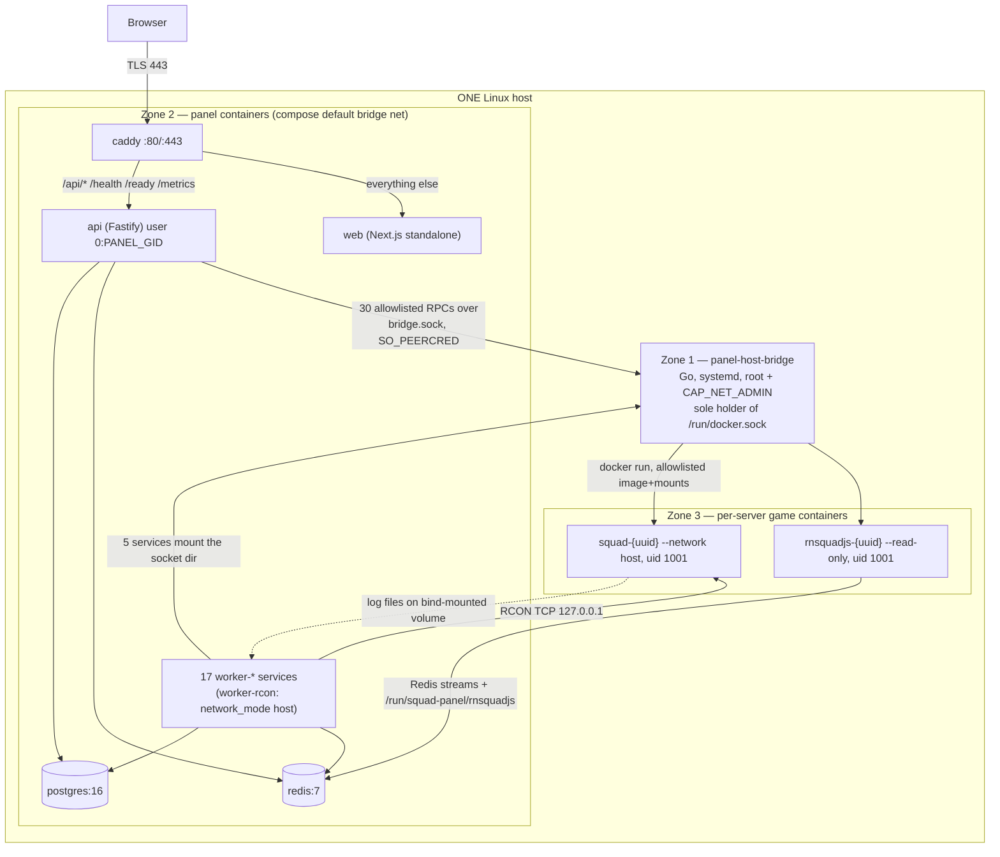

| Boundary | Transport | What crosses | Enforcement |
|---|---|---|---|
| Browser → Zone 2 | HTTPS via Caddy; path split `@api path /api/* /health /ready /metrics` → `api:3000`, everything else → `web:3000` (`docker/Caddyfile:16-27`) | JSON + `__Host-sid` cookie; one WebSocket at `/api/v1/ws/live` | `onRequest` auth hook; global rate limiter keyed on **(ip, playerId)** — `req.user` *is* populated when the key generator runs |
| Zone 2 → Zone 1 | Unix socket `/run/panel-host-bridge/bridge.sock`, `0660 root:panel`, `PassCredentials=yes` | Exactly 30 JSON-RPC methods, allowlisted args | `SO_PEERCRED` on the **primary GID** — hence `user: "0:${PANEL_GID:-987}"`, never `group_add` (`docker-compose.yml:130-134`). Five services mount it: `api`, `worker-log-ingest`, `worker-config-sync`, `worker-metrics-sampler`, `worker-scheduler` |
| Zone 1 → Zone 3 | `docker run` over `/run/docker.sock` | Image allowlisted to `squad-server:latest` / `squad-panel/depot-init:latest`; mounts allowlisted under `/var/lib/squad-panel/{configs,saved}`; the sidecar image is reachable *only* via the dedicated `container_run_rnsquadjs` RPC | `apps/bridge/internal/validate/docker.go`; systemd sandbox (`ProtectSystem=strict`, `SystemCallFilter=@system-service`) |
| Zone 3 → Zone 2 | Never through the bridge. Log files on the bind-mounted `Saved/` tree read by `worker-log-ingest`; RCON TCP on loopback from `worker-rcon` (`network_mode: host`); the rnsquadjs sidecar writes to Redis and `/run/squad-panel/rnsquadjs` | Game events, chat, roster, RCON responses | Sidecar runs `--read-only --user 1001:1001` with an env allowlist |

Note the asymmetry: the privileged path is one-directional and narrow, while the *data* path back from the game servers is deliberately unprivileged — files and sockets the panel already owns.

### Annotated top-level tree

| Path | What it is |
|---|---|
| `apps/api` | Fastify 5 + `fastify-type-provider-zod`. **99** route files in `src/routes/`, **17** plugins in `src/plugins/` (`auth.ts`, `audit.ts`, `bridge.ts`, `live-bus.ts`, `redis.ts`, `database.ts`, …). Entry `src/index.ts`; wiring `src/server.ts` (**123** `app.register` calls). There is no `services/` directory — routes *are* the service layer |
| `apps/web` | Next.js 15 App Router, `output: 'standalone'`, rewrites `/api/*` → `API_URL` (`next.config.mjs:6-11`). **71** `page.tsx` routes, 16 settings groups under `(dashboard)/settings/`. Hand-rolled i18n (`src/i18n/config.ts:10`, `['en','ru']`); UI copy is Russian |
| `apps/workers` | **19** single-purpose Node processes (+ `_test-shared`, a `package.json`-less workspace member), each `@squad/worker-<name>`. **17** run as compose services. Only `backup` is a genuine stub (`src/index.ts:8`: `'worker-backup idle — deferred to later phase'`) |
| `apps/bridge` | The only non-TS code. Go 1.25 privileged host daemon, systemd-managed, **not containerized** |
| `packages/db` | Drizzle schema — **83 `pgTable` declarations across 70 schema modules** — plus **79** migrations (latest `0093_vip_tier_price.sql`) and 10 extra `.sql` in `packages/db/sql`. Also holds the read-side calculation domain (`leaderboard/aggregate.ts`, `dossier/aggregate.ts`, `economy/accrual.ts`) |
| `packages/shared-config` | Permission registry (**51** panel keys + **21** squad keys), `BRIDGE_METHODS`, `normalizePlayerName`, role colors. Browser-safe subpath exports keep `node:stream` out of the client bundle |
| `packages/shared-types` | Zod schemas + `eventEnvelope`; the only package both `apps/web` and `apps/api` import |
| `packages/bridge-client`, `packages/diag` | TS RPC client for the bridge; structural-injection diagnostics sink (the cleanest dependency boundary in the repo, `packages/diag/src/index.ts:1`) |
| `docker/` | `api|web|worker|squad-server|restic|depot-init|rnsquadjs` Dockerfiles + two Caddyfiles. `worker.Dockerfile` is parameterised by `ARG WORKER` |
| `scripts/` (22) | `bootstrap.sh` (7-stage installer), `new-test-db.sh`, `pre-push-checklist.sh`, `verify-done.sh`, `git-guard.sh`, `install-host-bridge.sh`, `deploy-tk104.sh` |
| `docs/` (238 `.md`) | `architecture/` (incl. `decisions.md` with **9** dated records), `components/`, `development/`, `operations/`. Substantially stale in places — see the documentation chapter |
| `ai_docs/` | Agent working corpus; `ai_docs/adr/` holds **2** further ADRs (11 total) |

### Sizing

| Area | LOC | Files | Notes |
|---|---:|---:|---|
| `apps/api` | 90,335 | 380 | 99 routes, 17 plugins, 45 files in `lib/` |
| `apps/web` | 73,888 | 473 | 71 page routes |
| `apps/workers` | 38,090 | 267 | 19 packages |
| `apps/bridge` | 7,749 | 28 | Go; `handlers.go` alone is 1,624 lines |
| `packages/db` | 12,339 | 129 | 83 tables, 79 migrations |
| `packages/shared-config` | 4,015 | 44 | |
| `packages/shared-types` | 3,558 | 23 | |
| `packages/bridge-client` | 2,451 | 10 | |
| `packages/diag` | 170 | 4 | |

Counts are `.ts`/`.tsx`/`.go`, excluding `node_modules`, `dist`, `.next`.

### Where do I change X

| Task | Files to touch |
|---|---|
| Add an API route | `apps/api/src/routes/<resource>.ts`; register in **both** `apps/api/src/server.ts` **and** `apps/api/test/integration/harness.ts` or it 404s under integration test (the harness is already 2 routes stale). Add `config: { audit: { action, resource } }` to every mutating route |
| Add a permission | `packages/shared-config/src/permissions.ts` (`PERMISSIONS`; category must exist in `PERMISSION_CATEGORIES`). Use `config.permissions`, never inline RBAC |
| Add a migration | Edit `packages/db/src/schema/<table>.ts`, export from `schema/index.ts`, **build `@squad/db`** (drizzle-kit reads `dist/schema/index.js`), `pnpm db:generate`, hand-merge into `packages/db/drizzle/00NN_*.sql` preserving hand-written triggers/partitions |
| Add a bridge RPC | Three files in lockstep: `packages/shared-config/src/bridge-methods.ts`, `packages/bridge-client/src/client.ts`, `apps/bridge/internal/handlers/handlers.go`; plus success + forbidden cases in `apps/api/test/e2e/bridge-rpc.e2e.test.ts`. Nothing mechanically diffs the TS and Go lists |
| Add a stream event type | `packages/shared-types/src/events.ts` (`EVENT_TYPES`, payload schema, `eventEnvelope`) + producer and idempotent-consumer tests |
| Add a live/WS event | `apps/api/src/plugins/live-bus.ts` (23 variants) **and** `apps/web/src/lib/live-bus.ts` — two independent unions, already drifted, with no parity test |
| Add a worker | New `apps/workers/<name>` package `@squad/worker-<name>`; a compose service using `docker/worker.Dockerfile` with `args: { WORKER: <name> }` (pattern at `docker-compose.yml:347-359`) |
| Add a settings group | `apps/web/src/app/(dashboard)/settings/<group>/` + `apps/api/src/routes/settings-<group>.ts` |
| Run one test against an isolated DB | `eval "$(bash scripts/new-test-db.sh <slug>)"` then `pnpm --filter @squad/api exec vitest run test/<file>.test.ts` — avoid `turbo run test`, which builds every package first (`turbo.json:30-33`) |

### What this system deliberately does not do

**No multi-host orchestration.** The API reaches the host over a Unix socket (`apps/api/src/plugins/bridge.ts:9`); there is no network transport for the bridge at all. Running the API on a different machine from the game servers is not a config change, it is a redesign. Adding a second API replica also silently degrades WebSocket chat replay (per-process ring buffers, `apps/api/src/routes/live.ts:11`) and permission revocation (in-process `Map`, `apps/api/src/lib/rbac.ts:32`).

**No Prometheus or Grafana.** The 2026-04-25 observability decision chose two capped Redis Streams instead — `panel:logs` (`MAXLEN ~ 100000`) and `host:metrics` (`MAXLEN ~ 5760`, packed 8-int tuples) — and rejected an external metrics stack explicitly. A `/metrics` endpoint exists and is proxied by Caddy with no ACL, but nothing scrapes it in-repo.

**No email or web-push delivery.** `packages/db/src/schema/seed-subscriptions.ts:31` constrains `channel IN ('email','webpush')` and the API writes those rows (`apps/api/src/routes/server-seed-notifications.ts`), but no mailer, no VAPID keys, and no delivery worker exist. Notification preferences are schema and UI only.

**No resource limits, no network segmentation, no Docker secrets.** No compose file declares `networks:`, `deploy.resources`, `mem_limit`, or `replicas`; every service shares the implicit default bridge network. The only `ulimit` in the system is the `nofile=65536` the bridge sets on game containers.

---

## 2. System topology

### 2.1 The shape of the deployment

The panel is a **single-host system**. One Docker Compose project holds 27 services; exactly one component — the Go `panel-host-bridge` — runs on the host outside Docker, as a systemd unit (`docs/operations/deployment.md:3`). There is **no `networks:` block in any compose file**, so every service shares the implicit `<project>_default` bridge network. `worker-rcon` is the sole exception: `network_mode: host` (`docker-compose.yml:181`), which is the entire reason Postgres and Redis publish to host loopback at all.

Only three ports leave the host boundary: `caddy` on `80:80` and `443:443`, and `postgres` / `redis` bound to `127.0.0.1:5432` / `127.0.0.1:6379` (`docker-compose.yml:12-14, 441, 458`). Neither `api` nor `web` publishes anything — both listen on container-internal `:3000` and are reachable only through Caddy's path split.

```mermaid
graph TB
  U["Browser"] -->|"HTTPS 443 / 80"| CADDY
  subgraph HOST["Linux host (tk104 in production)"]
    subgraph NET["compose default bridge network"]
      CADDY["<b>caddy</b> :80 :443<br/>path-routed reverse proxy"]
      WEB["<b>web</b> :3000<br/>Next.js 15 App Router"]
      API["<b>api</b> :3000<br/>Fastify 5"]
      MIG["<b>migrator</b> (one-shot)"]
      PG[("<b>postgres</b>:16<br/>127.0.0.1:5432")]
      RD[("<b>redis</b>:7<br/>127.0.0.1:6379")]
      WB["<b>5 bridge-attached workers</b><br/>log-ingest · config-sync<br/>metrics-sampler · scheduler<br/>(+api) user 0:PANEL_GID"]
      WP["<b>12 plain workers</b><br/>audit-archiver · event-partition<br/>presence-daily · role-expirer<br/>seed-reward · leaderboard-aggregator<br/>diag-flush · clan-guard · automation<br/>ban-sync · clan-priority-expirer · discord"]
      BK["<b>backup</b> (profile: backup)<br/>restic + pg_dump + redis --rdb"]
    end
    RCON["<b>worker-rcon</b><br/>network_mode: host"]
    BRIDGE{{"<b>panel-host-bridge</b><br/>systemd, root, 30 RPC methods<br/>/run/panel-host-bridge/bridge.sock"}}
    SQ["squad-&lt;uuid&gt;<br/>--network host, uid 1001"]
    RN["rnsquadjs-&lt;uuid&gt;<br/>--network host --read-only, uid 1001"]
    DEP["squad-depot-init-&lt;ts&gt; --rm<br/>steamcmd app_update 403240"]
    DOCK[("/run/docker.sock")]
    DATA[("DATA_DIR: postgres redis caddy-*<br/>backup-* depot servers/{"configs,saved"}<br/>/var/lib/squad-panel → servers")]
  end
  CADDY -->|"/api/* /health /ready /metrics"| API
  CADDY -->|"everything else"| WEB
  WEB -->|"API_URL=http://api:3000"| API
  API --> PG & RD
  MIG --> PG
  WB --> PG & RD
  WP --> PG & RD
  RCON -->|"127.0.0.1:5432 / :6379"| PG
  RCON --> RD
  RCON -->|"Valve RCON TCP<br/>127.0.0.1:rcon_port"| SQ
  API -->|"unix: bridge.sock"| BRIDGE
  WB -->|"unix: bridge.sock"| BRIDGE
  API -.->|"HTTP over unix<br/>/run/squad-panel/rnsquadjs/&lt;id&gt;/sock/rcon.sock"| RN
  BRIDGE --> DOCK
  DOCK --> SQ & RN & DEP
  BK --> PG & RD
  PG --> DATA
  RD --> DATA
  SQ --> DATA
  DEP --> DATA
```

Two details in that graph are easy to miss and load-bearing. First, **`caddy` depends on `api: service_healthy` but not on `web`** (`docker-compose.yml:31-33`) — in the main compose file the edge router can come up while the frontend is still starting. Second, the API reaches game servers over **two unrelated RCON paths**: `apps/api/src/lib/rcon.ts:20-25` opens an HTTP-over-unix-socket connection to the rnsquadjs sidecar at `/run/squad-panel/rnsquadjs/<serverId>/sock/rcon.sock`, while `worker-rcon` speaks raw Valve RCON TCP from the host netns (`apps/workers/rcon/src/client.ts`). Both export a type literally named `RconClient`; they share no code.

### 2.2 Three privilege zones

Privilege is stratified by *how you cross*, not by network segmentation — there is none inside the compose network.

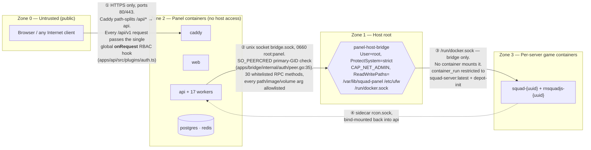

Crossing ② is the design's centre of gravity. The socket is `SocketMode=0660 SocketUser=root SocketGroup=panel PassCredentials=yes` (`apps/bridge/deploy/panel-host-bridge.socket`), and `ResolvePeer` reads `SO_PEERCRED` and compares the **primary GID** against the `panel` group. That is why every bridge-attached compose service carries the same four-line comment and `user: "0:${PANEL_GID:-987}"` rather than `group_add`:

```yaml
    # Bridge SO_PEERCRED checks the primary GID, not supplementary groups —
    # this MUST be `user: "0:<panel-gid>"`, never `group_add: [<panel-gid>]`,
    # otherwise every RPC fails with `rejected untrusted peer`.
    user: "0:${PANEL_GID:-987}"
```
(`docker-compose.yml:130-134`, repeated verbatim at `:82-86`, `:158-162`, `:317-321`, `:368-372`)

Five services hold that credential: `api`, `worker-log-ingest`, `worker-config-sync`, `worker-metrics-sampler`, `worker-scheduler`. Containers bind-mount the socket **directory**, not the file — the recorded reason is that mounting the file froze consumers on a stale inode across bridge restarts.

Crossing ③ is defended by allowlists in Go rather than by Docker permissions: mount sources must sit under `PanelConfigsRoot=/var/lib/squad-panel/configs` or `PanelSavedRoot=/var/lib/squad-panel/saved`, the volume must be `squad-depot`, and `allowedImages` contains only `squad-server:latest` and `squad-panel/depot-init:latest` (`apps/bridge/internal/validate/docker.go:12-40`). The rnsquadjs image is *deliberately excluded* so it can only be launched via `container_run_rnsquadjs`, which hardcodes `--read-only --user 1001:1001` and an isolated socket subdir.

The honest weak point is `worker-rcon`. On the host network namespace it bypasses zone 2's implicit isolation entirely: it reaches Postgres, Redis, and every Squad RCON listener on `127.0.0.1`, and it holds `APP_ENCRYPTION_KEY` to decrypt RCON credentials. It is not in the `panel` group, so it cannot call the bridge — but it needs no bridge to reach anything on loopback.

### 2.3 Compose service inventory (27)

| Group | Service | Role | Key dependency |
|---|---|---|---|
| Edge | `caddy` | TLS termination, path split `/api/* /health /ready /metrics` → api, rest → web | `api: service_healthy` |
| App | `api` | Fastify 5; 99 route files, 17 plugins, 123 `app.register` calls | pg + redis healthy, `migrator: completed`, bridge socket |
| App | `web` | Next.js 15, 71 `page.tsx` routes; SSR calls `http://api:3000` | `api: service_healthy` |
| App | `migrator` | One-shot `node dist/migrate.js`, 79 drizzle migrations | `postgres: service_healthy`, `restart: 'no'` |
| Data | `postgres` | 83 `pgTable`s across 70 schema modules | — (`pg_isready`) |
| Data | `redis` | Sessions, rate limit, 6 messaging substrates, live bus | — (`--appendonly yes --save 60 1000`) |
| Worker | `worker-log-ingest` | Squad stdout → `events:server:*` / `events:global`, alert engine | pg + redis + migrator + **bridge** |
| Worker | `worker-config-sync` | `admins_cfg_sync_outbox` consumer → writes `Admins.cfg` | pg + redis + migrator + **bridge** |
| Worker | `worker-scheduler` | Scheduled tasks (cron5) → server actions | pg + redis + migrator + **bridge** |
| Worker | `worker-metrics-sampler` | `host_metrics` RPC → `host:metrics` / `container:metrics:*` | **redis only** + bridge (no `DATABASE_URL`) |
| Worker | `worker-rcon` | RCON supervisor + `rcon:commands:<id>` RPC consumer | `network_mode: host`, pg + redis + migrator |
| Worker | `worker-diag-flush` | `diag:queue` → `diagnostic_events`; journald forwarder | redis + pg; mounts `/var/log/journal:ro` |
| Worker | `worker-event-partition` | Day partitions for `diagnostic_events`, drops >24 h | pg + migrator (**`REDIS_URL` set, no redis dep**) |
| Worker | `worker-audit-archiver` | Audit-log archival | pg + migrator (**`REDIS_URL` set, no redis dep**) |
| Worker | `worker-presence-daily` | Daily presence rollups | pg + migrator (**`REDIS_URL` set, no redis dep**) |
| Worker | `worker-leaderboard-aggregator` | Leaderboard aggregation | pg + migrator (**`REDIS_URL` set, no redis dep**) |
| Worker | `worker-role-expirer` | Expires timed roles, expiry reminders | pg + redis + migrator |
| Worker | `worker-seed-reward` | Seeding-reward accrual | pg + redis + migrator |
| Worker | `worker-clan-guard` | Clan-rule enforcement (`CLAN_GUARD_INTERVAL_MS` 120 s) | pg + redis + migrator |
| Worker | `worker-clan-priority-expirer` | Expires clan priority slots | pg + redis + migrator |
| Worker | `worker-automation` | `automation-dispatch:v1` group over event streams | pg + redis + migrator (no bridge) |
| Worker | `worker-discord` | `discord-notify:v1` group → Discord webhooks | pg + redis + migrator |
| Worker | `worker-ban-sync` | External ban-list ingest → `events:*` | pg + redis + migrator |
| Images | `squad-server-image` | Builds/tags `squad-server:latest` for the bridge | `profiles: ['images']`, `command: ['/bin/true']` |
| Images | `depot-init-image` | Builds/tags `squad-panel/depot-init:latest` | `profiles: ['images']` |
| Images | `rnsquadjs-image` | Builds/tags `squad-panel/rnsquadjs:latest` | `profiles: ['images']`, context = repo root |
| Profiles | `backup` | restic snapshots of `pg_dump -Fc` + Redis RDB | `profiles: ['backup']`, pg + redis healthy |

**Compose does not cover the whole worker fleet.** `apps/workers/` holds 19 packages (plus the package.json-less `_test-shared`); only **17** have compose services. `apps/workers/stats` is implemented but never deployed, and `apps/workers/backup` is a genuine stub — the `backup` compose service is a restic image (`docker/restic.Dockerfile`), not that package. Nothing in the tree makes this discrepancy visible; the API's heartbeat watchdog compounds it by watching a hardcoded list of six workers (`apps/api/src/plugins/heartbeat-watch.ts:4-11`).

**Nothing else is a compose service, by design.** Per-game-server `squad-<uuid>` containers, their `rnsquadjs-<uuid>` sidecars, and transient `squad-depot-init-<ts>` jobs are launched by the bridge via `docker run` (`apps/bridge/internal/runner/docker.go:92-116`), all on `--network host`, labelled `panel.server_id` / `panel.kind` so `SystemPrune` can spare them (`--filter label!=panel.preserve=true`, never prunes volumes).

Absent across the whole topology: any `deploy.resources`, `mem_limit`, `cpus`, or `ulimits` in any compose file — the only ulimit in the system is `nofile=65536` set by the bridge on squad-server containers; any Docker secrets; any healthcheck on `web` or on any worker; and any `MEDIA_STORAGE_DIR` volume, so uploaded media (read at `apps/api/src/config.ts:25`, documented in `.env.example:57`) lands on the api container's ephemeral layer.

---

## 3. The API service (`apps/api`)

`apps/api` is the panel's only HTTP surface: an ESM TypeScript package (`"type": "module"`, `apps/api/package.json:5`) built with `tsc` and run as `node --enable-source-maps dist/index.js`. It is a single Fastify instance with 17 first-party plugins, 99 route modules, and a 45-file `lib/` directory (4 644 LOC) that carries all domain logic. There is no service container, no repository layer, and no route autoloading — everything is wired by hand in one 299-line `server.ts`.

### 3.1 Runtime, entrypoint, and shutdown

`apps/api/src/index.ts` is 22 lines and does four things: load config, build the server, install signal handlers, listen.

```ts
// apps/api/src/index.ts
async function main() {
  const config = loadConfig();
  const app = await buildServer(config);
  const shutdown = async (signal: NodeJS.Signals) => {
    app.log.info({ signal }, 'shutdown requested');
    await app.close();
    process.exit(0);
  };
  process.once('SIGINT', shutdown);
  process.once('SIGTERM', shutdown);
  await app.listen({ host: config.API_HOST, port: config.API_PORT });
}
```

Shutdown is entirely `app.close()`-driven. There is no `@fastify/graceful-shutdown`, no `closeGracePeriod`, no `forceCloseConnections`, and no readiness flip that would let a load balancer drain the instance before sockets die. Actual cleanup lives in eleven `onClose` hooks spread across plugins: Redis `quit()` (`plugins/redis.ts:59`), bridge `close()` (`plugins/bridge.ts:71`), live-bus unsubscribe + quit (`plugins/live-bus.ts:373`), and timer teardown in `db-health.ts:53`, `heartbeat-watch.ts:75`, `bridge-heartbeat.ts:82`, `orphan-sweep.ts:59`, `status-reconciler.ts`. `plugins/database.ts:8-11` registers a deliberately empty `onClose` with a comment noting postgres.js exposes no `close()` through Drizzle — a documented no-op rather than a real teardown. Background timers are `unref()`'d in `db-health.ts:52` and `heartbeat-watch.ts:74` but **not** in `bridge-heartbeat.ts:69`, `orphan-sweep.ts:52-56`, or `status-reconciler.ts`, so those three hold the event loop open.

### 3.2 Configuration: one Zod schema, three escapees

`apps/api/src/config.ts` is a single `z.object` parsed from `process.env`; `AppConfig = z.infer<typeof envSchema>` is the only config type in the API. On failure it prints each `issue.path` + message and calls `process.exit(1)` (`config.ts:32-38`) — it never throws, so `loadConfig()` cannot be used defensively from a test.

Required with no default: `DATABASE_URL`, `REDIS_URL`, `APP_ENCRYPTION_KEY` (`.min(32)`), `SESSION_SECRET` (`.min(32)`), `PANEL_PUBLIC_URL`. Notable defaults: `BRIDGE_SOCKET='/run/panel-host-bridge/bridge.sock'`, `SESSION_TTL_SECONDS=86400`, `SESSION_TOUCH_THROTTLE_SECONDS=60`, `COOKIE_SECURE=true`, `MEDIA_STORAGE_DIR='./media'`. Integration secrets (`STEAM_API_KEY`, `DISCORD_CLIENT_ID/SECRET`, `GLITCHTIP_DSN`, `VIP_LIFECYCLE_WEBHOOK_SECRET`) are optional, so the API boots with those features silently inert.

Three variables bypass the schema entirely and are read straight from `process.env`:

| Variable | Read at | Consequence |
|---|---|---|
| `HOST_ORPHAN_SWEEP_INTERVAL_MS` | `plugins/orphan-sweep.ts:5` | `Number(undefined-ish)` → `NaN` silently disables/misconfigures the sweep timer |
| `HOST_DOCKER_PRUNE_INTERVAL_MS` | `plugins/orphan-sweep.ts:6-8` | same |
| `APP_VERSION` | `plugins/health.ts:9` | `/health` reports `'dev'` when unset |

Note also that `APP_ENCRYPTION_KEY`'s `.min(32)` checks *string* length; the real 32-decoded-byte assertion is in `lib/crypto.ts:26`.

### 3.3 Fastify 5 and the Zod type provider

Fastify **5.8.5** (`^5.2.0`, `package.json:41`) with `fastify-plugin` 5.1.0, `fastify-type-provider-zod` 4.0.2, Zod 3.25.76. The instance is constructed against a pre-built pino logger, trusts proxies, and mints its own request id:

```ts
// apps/api/src/server.ts:141-152
const app = Fastify({
  loggerInstance: logger,
  trustProxy: true,
  disableRequestLogging: false,
  genReqId: (req) =>
    (req.headers['x-request-id'] as string | undefined) ??
    `req-${Math.random().toString(36).slice(2)}`,
});
app.setValidatorCompiler(validatorCompiler);
app.setSerializerCompiler(serializerCompiler);
```

Validation is Zod end-to-end; serialization is not. **Zero routes declare `schema.response`** across all 99 route files, so `setSerializerCompiler` is inert and Fastify falls back to `JSON.stringify`. Response shaping is done by hand-written `serialize(row)` mappers that convert camelCase Drizzle rows to the snake_case wire format. There is no output-filtering safety net — if a handler returns a column, it ships.

### 3.4 Plugin registration order

Registration order *is* hook order, and `server.ts` depends on it heavily. Every `register` is `await`ed, which is what makes cross-plugin decorator reads safe.

| # | Registration | Source | Ordering dependency |
|---|---|---|---|
| 1 | `decorate` `encryptionKey`, `config`, `rcon` | `server.ts:154-156` | Synchronous, before all plugins — `auth.ts:18` reads `app.config` at *registration* time |
| 2 | `@fastify/helmet` `{global:true}` | `server.ts:158` | first `onRequest` pair; headers must be set before anything can reply |
| 3 | `@fastify/cookie` (secret = `SESSION_SECRET`) | `server.ts:159` | must precede `auth` — `auth.ts:22` reads `req.cookies` |
| 4 | `@fastify/rate-limit` (1200/min) | `server.ts:160-164` | attaches per-route limiters via `onRoute`; see §3.7 |
| 5 | `@fastify/swagger` + `swagger-ui` (`/api/docs`) | `server.ts:165-175` | installs an `onRoute` collector — must precede every route plugin or schemas vanish from the spec |
| 6 | `@fastify/websocket`, `@fastify/multipart` | `server.ts:176-177` | must precede `live.ts` (`websocket: true`) and `media.ts` |
| 7 | `requestContextPlugin` | `server.ts:179` | **first first-party `onRequest`** — opens the AsyncLocalStorage scope every later hook and log line writes into |
| 8 | `databasePlugin({config})` | `server.ts:180` | provides `app.db` for auth/health/audit/reconciler |
| 9 | `redisPlugin({config})` | `server.ts:181` | provides `app.redis` |
| 10 | `lateSink.setInner(redisSinkStream({redis: app.redis}))` | `server.ts:182` | works *only* because #9 was awaited |
| 11 | `diagPlugin` (from `src/lib/diag.ts`) | `server.ts:183` | `createDiag({redis: app.redis})` — hard dependency on #9 |
| 12 | `errorDiagPlugin` | `server.ts:184` | the sole `setErrorHandler`; uses `app.diag` |
| 13 | `dbHealthPlugin` | `server.ts:185` | non-optional `app.db` + `app.diag` |
| 14 | `heartbeatWatchPlugin` | `server.ts:186` | `app.redis.pttl` + `app.diag` |
| 15 | `liveBusPlugin` | `server.ts:187` | `app.redis.duplicate()`; must precede #17 |
| 16 | `bridgePlugin({config})` | `server.ts:188` | `app.diag.emit` in event handlers |
| 17 | `bridgeHeartbeatPlugin` | `server.ts:189` | uses `app.bridge` (#16) and `app.liveBus` (#15) |
| 18 | `metricsPlugin` | `server.ts:190` | **first `onResponse`** → runs before audit's |
| 19 | `healthPlugin` | `server.ts:191` | handlers reference `app.statusReconciler` (#21) — safe only because the read happens inside a handler |
| 20 | `authPlugin` | `server.ts:192` | **third `onRequest`**; populates `req.user`/`req.session` and enforces `config.permissions` |
| 21 | `auditPlugin` | `server.ts:193` | **second `onResponse`**; reads `req.user` set by #20 |
| 22 | `installProgressPlugin`, `statusReconcilerPlugin`, `orphanSweepPlugin` | `server.ts:194-196` | use `app.db` / `app.bridge` / `app.liveBus` |
| 23 | 99 route plugins | `server.ts:198-296` | all decorators and global hooks must already exist |

Only `plugins/redis.ts` defends against ordering explicitly: its `error`/`reconnecting`/`ready` listeners use `app.diag?.emit(...)` (`redis.ts:20,32,47`) because Redis registers before diag and an early connection error would otherwise crash on an undefined decorator. `db-health.ts:14` and `bridge.ts:12` use the non-optional `app.diag.emit` because they register after it.

There is no `prefix` option anywhere — every route hardcodes its full path (`'/api/v1/servers/:id/start'`, `routes/servers.ts:378`). The unversioned exceptions are `/health` and `/ready` (`plugins/health.ts:6,12`), `/metrics` (`plugins/metrics.ts:54`) and `/api/docs`; all three infra endpoints opt out with `config: { audit: false }` and `schema: { hide: true }`. Adding a route file therefore requires two hand edits in `server.ts` (import + register) — and a third in the integration harness, which keeps a parallel list.

### 3.5 `fp()` non-encapsulation vs plain route plugins

Every one of the 17 plugin modules — the 16 real plugins in `apps/api/src/plugins/` plus `src/lib/diag.ts` — is wrapped in `fp(...)`. `fastify-plugin` strips the encapsulation context, so **nothing in the plugin layer is encapsulated**: decorators and hooks are hoisted onto the root instance and are visible to all 99 route plugins. Three pass an explicit name (`error-diag.ts:53`, `db-health.ts:58`, `heartbeat-watch.ts:79`); the rest are anonymous. Three take typed options through the fp generic — `fp<{ config: AppConfig }>` in `database.ts:5`, `redis.ts:5`, `bridge.ts:7`.

Route modules are the exact inverse: plain `FastifyPluginAsync`, never fp-wrapped, so each gets its own encapsulation context. That is why a route can safely call `app.withTypeProvider<ZodTypeProvider>()` and define local schemas without leaking anything upward. It also means route-local hooks, if any were ever added, would stay local — none are.

### 3.6 What a route author can reach for

Ambient types are declared across five files rather than one; `plugins/types.ts` is the "main" one, but four modules carry their own `declare module 'fastify'` blocks.

| Decorator | Type | Declared in | Added by |
|---|---|---|---|
| `app.db` | `DatabaseClient` (Drizzle) | `plugins/types.ts:16` | `plugins/database.ts:7` |
| `app.redis` | `Redis` (ioredis) | `types.ts:17` | `redis.ts:58` |
| `app.bridge` / `app.makeBridgeClient` | `BridgeClient` / factory | `types.ts:18,22` | `bridge.ts:62-63` |
| `app.encryptionKey` | `Buffer` | `types.ts:19` | `server.ts:154` |
| `app.config` | `AppConfig` | `types.ts:20` | `server.ts:155` |
| `app.rcon` | `RconClient` | `types.ts:21` | `server.ts:156` |
| `app.diag` / `req.diag` | `Diag` | `lib/diag.ts:4-11` | `lib/diag.ts:15-16` |
| `app.metrics` | `MetricsContext` | `plugins/metrics.ts:64-68` | `metrics.ts:44` |
| `app.liveBus` | `LiveBus` | `plugins/live-bus.ts:281-285` | `live-bus.ts:371` |
| `app.installProgress` | `InstallProgressBus` | `plugins/install-progress.ts:17-21` | `install-progress.ts:47` |
| `app.bridgeHeartbeat` | `BridgeHeartbeatHandle` | `plugins/bridge-heartbeat.ts:8-12` | `bridge-heartbeat.ts:80` |
| `app.heartbeatWatchTick` | `() => Promise<void>` | `plugins/heartbeat-watch.ts:16-20` | `heartbeat-watch.ts:69` |
| `app.statusReconciler` | `{stats, reconcileOnce, tickNow}` | `plugins/status-reconciler.ts` | same |
| `req.session` | `{id, playerId}?` | `types.ts:25` | `auth.ts:37` |
| `req.user` | `{playerId, steamId64, canonicalName, avatarUrl, permissions}?` | `types.ts:26-32` | `auth.ts:38,97` |
| `req.apiTokenId` | `string?` | `types.ts:33` | `auth.ts:107` |
| `req.requestId` | `string` | `types.ts:34` | `request-context.ts:9` |

The per-route contract lives in an augmented `FastifyContextConfig`:

```ts
// apps/api/src/plugins/types.ts:10-14
interface FastifyContextConfig {
  permissions?: readonly PermissionKey[];
  audit?: { action: string; resource: string } | false;
  requireSetupComplete?: boolean;
}
```

`permissions` appears 128 times across `src/routes`, `audit: {…}` 53 times and `audit: false` 261 times. **`requireSetupComplete` is declared and never read anywhere in the repo** — dead API surface that looks like a working guard.

### 3.7 The request lifecycle

Only four hook types exist in `apps/api/src`: `onRequest` (3), `onResponse` (2), `onReady` (2), `onClose` (11). There is **no `preHandler`, `preValidation`, `preParsing`, `preSerialization`, or `onSend` hook anywhere** — authorization is done in the `onRequest` chain, which is a deliberate deviation from the usual Fastify idiom. There is also no `setNotFoundHandler` (stock 404), no `setSchemaErrorFormatter`, and no custom content-type parser.

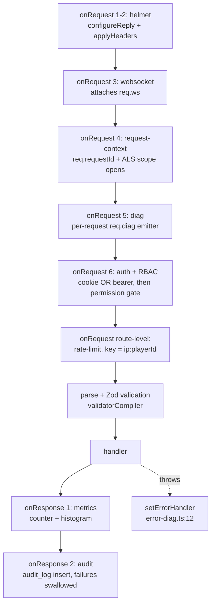

**request-context** (`request-context.ts:6`) validates an inbound `x-request-id` against `/^[\w-]+$/` (sliced to 128 chars) or mints a `uuidv7`, sets `req.requestId`, echoes the header, and wraps `done()` in `als.run(...)`. The ALS store is consumed by pino's `mixin` (`lib/logger.ts:41`) so every log line carries `requestId` without the handler doing anything.

**auth + RBAC** (`auth.ts:21`) is one hook doing both jobs. Cookie-first: `__Host-sid` → `resolveSession` (Redis + DB) → player row → `loadUserPermissions` → `req.user`/`req.session`, plus a throttled sliding-window session touch and cookie re-set. Only if there is **no cookie at all** does it try `Authorization: Bearer` (`auth.ts:69`), hashing the token with SHA-256 and intersecting the token's scopes with the role's permissions (`intersectScopes`, `auth.ts:96`). A present-but-invalid cookie therefore suppresses bearer auth entirely. The gate itself is inline:

```ts
// apps/api/src/plugins/auth.ts:114-125
const required = req.routeOptions?.config?.permissions;
if (!required || required.length === 0) return;
if (!req.user) { reply.code(401).send({ error: 'unauthenticated' }); return; }
for (const perm of required) {
  if (!req.user.permissions.permissions.has(perm)) {
    reply.code(403).send({ error: 'forbidden', required });
    return;
  }
}
```

Semantics are AND across the array, and **no declared `permissions` means fully public** — omission fails open. `hasPermission()` exists in `lib/rbac.ts:226` but the plugin re-implements the loop rather than calling it. Permissions come from a process-local `Map` with a 30 s TTL (`lib/rbac.ts:32-33`), so a role change propagates to other API replicas only after expiry; the exported `invalidatePermissionCache*` helpers clear only the local process.

**Rate limiting** deserves a note because the registration order looks wrong and isn't. `@fastify/rate-limit` adds no instance hook; it uses `onRoute` to push a limiter onto each route's own `onRequest` array. Route-level `onRequest` hooks run *after* all instance-level ones, so by the time `keyGenerator: (req) => \`${req.ip}:${req.user?.playerId ?? ''}\`` (`server.ts:163`) executes, `authPlugin` has already populated `req.user`. The key really is `(ip, playerId)` for authenticated traffic.

**metrics** (`metrics.ts:46`) increments `http_requests_total` and observes `http_request_duration_seconds` labelled `{route, method, status}`, using `req.routeOptions?.url` — the templated path, so no label-cardinality explosion. **audit** (`audit.ts:5`) writes an `auditLog` row when `config.audit` is an object, guessing `targetId` from `params.id ?? params.serverId ?? params.playerId` (`audit.ts:35-42`), recording status and `reply.elapsedTime`. Two consequences follow from it being `onResponse`: an audit failure can never fail the request (it is logged and dropped), and the audit row lands *after* the client already has its answer. It also cannot capture before/after snapshots — that is why 83 handlers additionally call `writeAuditEntry(...)` directly. Note `audit.ts:7-8` treats `undefined` and explicit `false` identically, so the 261 `audit: false` declarations are documentation, not behaviour.

**Errors** go through one `setErrorHandler` (`error-diag.ts:12`) that emits an `http.5xx` diag event with a 2 000-char-truncated stack for status ≥ 500 and then calls `reply.send(err)`. It observes; it does not map. Status decisions live entirely in handlers, and Zod validation failures surface as Fastify's stock `FST_ERR_VALIDATION` 400 body — a different shape from the hand-written `{ error: 'slug_already_exists' }` style used inside handlers. The same module attaches a process-wide `unhandledRejection` listener behind a module-level boolean so repeated `buildServer()` calls in tests don't leak listeners (`error-diag.ts:37-51`).

The net contract for a route author:

| Concern | Free | Must be written |
|---|---|---|
| Request id, ALS-scoped logging, `x-request-id` echo | ✔ | — |
| Security headers, cookie parsing, rate limit, multipart, WS upgrade, OpenAPI entry | ✔ | — |
| Identity: `req.user`, `req.session`, `req.apiTokenId`, session touch, token scopes | ✔ | — |
| Authorization | ✔ *if* `config.permissions` declared | declaring it — **omission silently makes the route public** |
| Audit trail | ✔ *if* `config.audit: {action, resource}` | before/after snapshots → manual `writeAuditEntry` |
| HTTP metrics, 5xx diag event | ✔ | — |
| Input validation | compiler wired | the Zod schemas + `withTypeProvider<ZodTypeProvider>()` |
| Output shape | nothing | hand-written `serialize()` + explicit status codes |
| Transactions | nothing | explicit `app.db.transaction` boundaries |
| Wiring | — | register in **both** `server.ts` and `test/integration/harness.ts` |

There is one avoidable trap in the correlation story: `genReqId` produces `req.id` while `request-context.ts` independently produces `req.requestId`. The response header and pino lines carry `requestId`; the audit hook (`audit.ts:20`) and the 5xx diag emitter (`error-diag.ts:23`) record `req.id`. With no inbound header the two differ, so a log line and the diag event for the same request will not join. `RequestContext.userId`/`sessionId` (`logger.ts:6-11`) are seeded `undefined` and never written after auth resolves, so no log line ever carries a user id.

### 3.8 The canonical route module

`routes/mark-types.ts` is the archetype: local Zod schemas, a `serialize` mapper, a plain `FastifyPluginAsync`, `withTypeProvider` once at the top, declarative `config`, handler-owned transaction, hand-rolled conflict mapping.

```ts
// apps/api/src/routes/mark-types.ts:65-95 (abridged)
const markTypesRoutes: FastifyPluginAsync = async (app) => {
  const fast = app.withTypeProvider<ZodTypeProvider>();

  fast.post(
    '/api/v1/mark-types',
    { schema: { body: createBody }, config: { permissions: ['role:edit'], audit: false } },
    async (req, reply) => {
      const actorId = req.user?.playerId;
      if (!actorId) { reply.code(401); return { error: 'unauthenticated' }; }

      const slugTaken = await app.db.select({ id: markTypes.id })
        .from(markTypes).where(eq(markTypes.slug, req.body.slug)).limit(1);
      if (slugTaken.length > 0) { reply.code(409); return { error: 'slug_already_exists' }; }

      const row = await app.db.transaction(async (tx) => { /* insert + audit */ });
      reply.code(201);
      return serialize(row);
    },
  );
};
export default markTypesRoutes;
```

Two things are worth internalising from this shape. First, `permissions` and `audit` are *data on the route*, consumed by global hooks — the handler never calls an auth or audit function for the common path. Second, the 401 check inside the handler is redundant with the RBAC gate whenever `permissions` is non-empty, but it is what typechecks `req.user?.playerId` down to a `string`; you will see that guard everywhere.

### 3.9 The `lib/` service layer

`apps/api/src` has exactly three subdirectories — `lib/`, `routes/`, `plugins/`. There is no `services/`, `domain/`, `usecases/`, or repository layer. `lib/` is 45 files / 4 644 LOC of **loose function modules**, not a service abstraction: zero service classes, zero DI container. Only two classes exist and both are data structures (`ChatRingBuffer`, `CombatRingBuffer`).

Three recurring shapes:

1. **Pure functions**, no I/O — `compare-online.ts`, `alt-score.ts`, `blame.ts`, `banlist-publish.ts`, `audit-chain.ts`, `rotation-segment.ts`, `ip-cidr.ts`, `crypto.ts`. `banlist-publish.ts:1-6` states the intent: kept free of DB and Fastify concerns so they can be unit-tested directly.
2. **`(db, …args)` free functions** — `writeAuditEntry(db, entry)`, `loadUserPermissions(db, playerId)`, `ensureMarkTypes(db)`, `createSession(db, redis, params)`.
3. **Context-object functions** — a hand-rolled DI struct as the first argument, narrowed with `Pick<>` to exactly the methods called:

```ts
// apps/api/src/lib/server-delete.ts:32-49
export interface DeleteContext {
  db: DatabaseClient;
  bridge: Pick<BridgeClient,
    'fileRead' | 'containerStop' | 'containerRm' | 'directoryDelete' | 'ufwRule'>;
  log: Pick<FastifyBaseLogger, 'warn' | 'info' | 'error' | 'debug'>;
  actorPlayerId: string | null;
  actorIp: string | null;
  actorLabel: string;
  redis?: Pick<Redis, 'xgroup' | 'unlink' | 'del'>;
}
```

**Dependency direction** is `routes/` + `plugins/` → `lib/` → `@squad/db` / `ioredis` / `@squad/bridge-client` / `@squad/shared-config`. No lib module imports from `routes/`. The only upward edges are two type-only imports of `LiveEvent` from `plugins/live-bus.js` (`chat-ring-buffer.ts:1`, `combat-ring-buffer.ts:1`). Internal cross-imports between lib modules number **seven**, with no cycles — the layer is essentially flat, and `audit.ts` / `crypto.ts` are the leaf utilities. Eight modules leak Fastify types into the domain layer; four of them (`auto-prune.ts`, `ban-alt-warning.ts`, `license-cfg.ts`, `log-export.ts`) take a full `FastifyInstance` and are effectively route handlers filed under `lib/`.

**Transactions are a route concern.** `app.db` is a bare Drizzle client (`plugins/database.ts:6`); there is no per-request transaction, no `withTransaction` helper, and no unit of work. There are 31 `.transaction(...)` call sites across 16 route files versus exactly two in `lib/` (`first-owner.ts:20`, `server-delete.ts:112`). The one deliberate accommodation is `admins-cfg-sync.ts`, which accepts the caller's transaction handle:

```ts
// apps/api/src/lib/admins-cfg-sync.ts:9-15
// A db handle that can either be the top-level client or a transaction
// passed into a `db.transaction(async tx => ...)` callback. Drizzle's
// transaction value isn't structurally compatible with DatabaseClient
export type AdminsCfgSyncDb = Pick<DatabaseClient, 'select' | 'insert' | 'update'>;
```

That module implements a genuine **transactional outbox**: it inserts `admins_cfg_sync_outbox` rows inside the caller's transaction, then attempts a best-effort Redis `XADD` pipeline and stamps `relayedAt` only on entries that published. `tryImmediateDispatch` swallows every failure so a Redis outage cannot roll back the domain mutation; the config-sync worker's relay redelivers at-least-once.

**Error modelling has no taxonomy** — no `AppError`, no shared error type, five coexisting styles:

| Style | Where | Consequence |
|---|---|---|
| Typed error classes | only `media-storage.ts:20,28`, matched with `instanceof` in `routes/media.ts:159,163` | used nowhere else |
| Bare `throw new Error(string)` | 17 sites, mostly `steam-openid.ts` (6), `rcon.ts` (3), `rnsquadjs.ts` (3) | no status code → 500 |
| Discriminated result unions | `WorkerRconCommandOutcome`, `AuditChainResult`, `ClaimResult`, `NotifyReporterOutcome` | the healthiest pattern; caller must branch |
| Error accumulation | `DeleteResult.errors[]` (`server-delete.ts:28`), `CleanupResult.errors[]` (`cleanup-orphans.ts:22`) | teardown never aborts on partial failure |
| Deliberate swallowing | `auto-prune.ts:10-12`, `recomputeReporterStats` (`reporter-stats.ts:105`) | the latter's "callers should wrap in try/catch" is an unenforced comment |

Because `setErrorHandler` does not map errors to statuses, every status-code decision lives in a route handler, and every uncaught lib throw becomes an opaque 500.

Two testability hazards are worth flagging: `rbac.ts:32-33` holds module-level mutable cache state (hence the three exported `invalidatePermissionCache*` escape hatches), and `loadUserPermissions` bypasses the Drizzle query builder entirely with `db.execute<RoleContextRow>(sql\`SELECT …\`)` (`rbac.ts:98`), coupling it to raw column names that no migration check covers. `server-delete.ts` is the layer's worst abstraction mixing — 267 lines spanning a DB transaction, container ops, filesystem deletion, ufw rules and Redis stream teardown, with a "never-installed" fast path driven by regex-matching bridge error strings (`NOT_FOUND_RE = /not_found|no such container/i`, line 52). String-matching a remote daemon's error text is the most fragile contract in the API.

### 3.10 Two loose ends

`@fastify/cors` is declared at `apps/api/package.json:22` and is **never imported or registered** anywhere in `apps/api/src` or `apps/api/test`. It is a dead dependency, and the absence is real: the API performs no cross-origin handling at all. That is currently benign because `apps/web` proxies same-origin, but the dependency reads like CORS is configured when it is not.

`apps/api/src/lib/reporter-stats.test.ts` is the only test file under `apps/api/src/` — the other 105 API test files live in `apps/api/test/`, including tests for sibling lib modules (`test/compare-online.test.ts`, `test/banlist-publish.unit.test.ts`). It is a pure unit test of `computeReporterVerdict` importing `'./reporter-stats.js'` and would work unchanged at `apps/api/test/reporter-stats.test.ts`. It still runs (`vitest.config.ts` excludes only `node_modules`, `dist`, `test/e2e`) and coverage compensates for it via `exclude: ['src/**/*.test.ts', …]` — a workaround that exists solely because of the one misplaced file. In the same vein, `lib/diag.ts` is an `fp(...)` Fastify plugin filed under `lib/` while all 16 other plugins live in `plugins/`, and it carries its own `declare module 'fastify'` augmentation there.

---

## 4. API surface catalogue

`apps/api/src/routes` holds **99 route modules**. There is no nesting, no `prefix` option and no router-level grouping: every module is a bare `FastifyPluginAsync` that declares its own absolute `/api/v1/...` paths inline, and `apps/api/src/server.ts` registers them flat (123 `app.register` calls in total, covering 17 plugins plus the route modules). The file name is therefore the only organising principle the code gives you — the bounded contexts below are an editorial overlay on a genuinely flat surface, but they map cleanly onto the route-file naming and onto the permission vocabulary (51 panel permission keys, 21 squad permission keys).

Three things are true of essentially every module and are not repeated in the tables: validation is Zod through `fastify-type-provider-zod` (`setValidatorCompiler`/`setSerializerCompiler` at `apps/api/src/server.ts:151-152`, each plugin opting in with `app.withTypeProvider<ZodTypeProvider>()`); authorization is either a declarative `config.permissions: [...]` array enforced by the **global `onRequest` hook** at `apps/api/src/plugins/auth.ts:114-125`, or a hand-rolled guard closure inside the file; and auditing is either a declarative `config.audit` consumed by an `onResponse` hook (`apps/api/src/plugins/audit.ts:5-6`) or an explicit `writeAuditEntry` call.

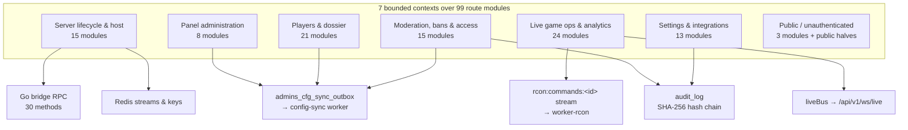

### 4.1 Server lifecycle & host

The most side-effect-heavy context, and the only one that talks to the Go bridge. Fifteen modules: `servers`, `server-settings`, `server-install`, `server-configs`, `server-archive`, `server-force-stop`, `server-update`, `server-logs`, `server-log-files`, `server-metrics`, `server-rnsquadjs`, `host`, `host-actions`, `host-backup`, `depot`.

| Module | Representative endpoints | Permission | Notable side effects |
|---|---|---|---|
| `servers.ts` | `GET/POST /servers`, `GET/DELETE /servers/:id`, `POST …/start\|stop\|restart\|reconcile` | `server:view` / `install` / `start` / `stop` / `restart` / `delete` | Reads `rcon:status:*`, `a2s:status:*`, `seeding:state:*`; bridge `containerRun/Start/Stop/Inspect/Stats`; `liveBus server.status`; audit. `stop` sets `stop:requested:<id>` and **blocks the handler 15 s** between `AdminBroadcast` and `AdminEndMatch` (`servers.ts:625`) |
| `server-install.ts` | `POST /servers/:id/install`, `GET …/install/progress`, `GET …/install/ws` | `server:install` / `server:view` | Detached IIFE, no job queue → progress dies with the process; in-memory 500-line ring buffer (`plugins/install-progress.ts:23-45`), so **not shared across replicas**; `writeAuditEntry` fired manually because the `onResponse` hook has long since run |
| `server-configs.ts` | `PUT …/configs/:name`, `…/history\|diff\|blame`, `…/drift/{accept,revert}` | `config:edit` / `view` / `rollback` | `writeVersion` → bridge `fileAtomicWrite` + `config_versions` insert + conditional `AdminReloadServerConfig`; blame cached in Redis `config-blame:<tipId>` EX 24h |
| `server-settings.ts` | `PUT /servers/:id/settings`, `PATCH /servers/:id` | `server:edit_settings` | Port-conflict 409s; bridge `ufwRule` remove+add per changed port; encrypts `license_key` and `syncLicenseCfg` writes the real key to disk while inserting a **masked** history row |
| `server-archive.ts` / `server-force-stop.ts` / `server-rnsquadjs.ts` | `GET /servers/archive`, `POST /servers/archive/:id/restore`, `POST …/force-stop`, `POST …/rnsquadjs` | `server:view` / `install` / `force_stop` / **`server:stop`** | Restore mints a *new* uuid and RCON password; the sidecar cutover borrows `server:stop`, an unrelated lifecycle permission (`server-rnsquadjs.ts:27`) |
| `host.ts` / `host-actions.ts` / `host-backup.ts` | `GET /host/info\|metrics\|orphans\|bridge-status`, `POST /host/restart\|cleanup-orphans\|docker-prune\|backups[/:id/restore]` | `host:view` / `host:metrics` / `host:manage`; **`bridge-status` has none** | Bridge RPCs on dedicated clients for prune/backup; restore requires `body.confirm === params.id`; `POST /host/restart` treats a dropped socket as success |
| `depot.ts` / `server-update.ts` | `POST /depot/update`, `GET /depot/progress/ws`, `POST /servers/:id/update` | `server:install` / `server:update` | One shared Redis lock `SET depot:updating NX EX 3600` — but `depot.ts:96` returns **200 `already_in_progress`** where `server-update.ts:36` returns **409** |

Bridge access follows three patterns chosen by lifetime: the shared `app.bridge` for request-scoped RPCs; a dedicated `app.makeBridgeClient()` closed in a `finally` for anything streaming (`containerLogsFollow`, `fileReadStream`, `depotUpdate`, prune, all three backup calls) because closing the socket is what tears down the bridge-side `docker logs -f`; and `Pick<BridgeClient, …>` narrowing in the libs so `softDeleteServer` and `cleanupOrphans` can be unit-tested against small fakes.

Two live wires worth memorising: `POST /servers/:id/update` XADDs to `server:update:<id>`, a stream with **no reader anywhere in the repo** (`server-update.ts:48`) — that path has no observable progress; and `GET /api/v1/host/bridge-status` omits `permissions` entirely (`host.ts:44-46`), so bridge version and hostname are unauthenticated while every sibling host route is gated.

### 4.2 Players & dossier

Twenty-one modules, overwhelmingly read-only, and the context where query style varies most. Almost every route here sets `config: { audit: false }` and writes audit rows imperatively.

| Module | Representative endpoints | Permission | Notable side effects |
|---|---|---|---|
| `players.ts` | `GET /players`, `/players/search`, `/players/:id`, `GET/PUT/DELETE /players/:id/role` | `player:view`, `user:manage_roles`; IP array separately gated by `player:view_ips` → `ips_visible` | Role write: tx + `publishAdminsCfgSyncForAllServers` + `invalidatePermissionCache` + `revokeAllForPlayer`; 409 `cannot_remove_last_owner` |
| `player-dossier.ts` | `GET /players/:id/dossier` | inline `combatView` | Seven independent drizzle queries stitched in JS; Redis cache 60 s with `x-cache: hit\|miss` |
| `player-alt-candidates.ts` / `player-links.ts` / `player-ban-alt-warning.ts` | `GET …/alt-candidates`, `POST/GET …/links`, `PATCH /player-links/:id`, `GET …/ban-alt-warning` | `player:view_ips` | Scoring in `lib/alt-score.ts` against the `alt_detection_settings` singleton; ban-alt-warning reuses it by **`app.inject`-ing to itself** (`lib/ban-alt-warning.ts:76`) |
| `player-presence.ts` / `player-coplay.ts` / `player-compare-online.ts` / `player-geo-anomalies.ts` | `GET …/presence[/daily]`, `…/primetime`, `…/coplay`, `…/compare-online`, `GET /geo-anomalies` | inline `panelAccess` | `/geo-anomalies` loops up to 500 players issuing one query each — N+1 by construction (`player-geo-anomalies.ts:153`) |
| `player-notes.ts` / `notes-feed.ts` / `marks.ts` / `mark-types.ts` / `suspects.ts` | notes CRUD + `/notes/export`, mark set/clear, `GET /suspects` | inline `panelAccess`; catalogue writes `role:edit` | `liveBus` `note.created` / `mark.changed` / `mark_type.changed`; `marks.ts` calls `ensureMarkTypes` **at plugin-registration time**, seeding eight rows on every API boot |
| `clans.ts` | `GET/POST/PATCH/DELETE /clans[/:id]`, roster + priority + transfer-leadership | `canManageClans` **or** clan `leader`/`deputy` | Priority toggle takes `SELECT … FOR UPDATE` on `clans`; disband/expire/member-remove fan out an admins-cfg sync |

### 4.3 Moderation, bans & access

Fifteen modules. The defining structural fact is that **there is exactly one local ban record** — a `moderation_actions` row with `action_type='ban'`, duration living in `context.ban_length` as a Squad `AdminBan` string — and that **unban is not implemented**: `reverted_at`/`reverted_by` are read in five places and written by nothing in `apps/api/src` (`lib/banlist-publish.ts:99` says so in a comment). Expiry is derived at read time, and a malformed or missing `ban_length` both mean permanent.

| Module | Representative endpoints | Permission | Notable side effects |
|---|---|---|---|
| `reports.ts` / `report-actions.ts` / `report-analytics.ts` | `GET/POST/PATCH /reports[/:id]`, `POST /reports/:id/actions`, `POST /reports/bulk-resolve`, `GET /analytics/reports` | `panelAccess`; handling needs `can_handle_reports` | RCON via worker **before** ledger write, so a 502 leaves no row; `events` row + XADD `events:server:<id>`; ALT-7 alert; 1..N audit rows sharing `context.bulk_group` |
| `external-bans.ts` / `ban-sources.ts` | `GET /external-bans`, `POST …/local-ban`, `GET/POST/PUT/DELETE /ban-sources[/:id]`, `POST …/sync` | `panelAccess`, `can_manage_ban_sources`, squad perm `ban` | Encrypts `auth_header`; `INCR EXTERNAL_BAN_CACHE_VERSION_KEY`; XADD `bansync:manual`; 422 `kick_requires_trusted_source` |
| `whitelist.ts` / `whitelist-applications.ts` / `vip-tiers.ts` / `integrations-vip.ts` | `GET/PUT /whitelist/settings`, `POST /whitelist/members`, `POST /whitelist/import`, review queue, `POST /integrations/vip/lifecycle` | `whitelist:view\|edit`; `can_edit_roles` (**including the tier GET**); VIP webhook uses HMAC `x-vip-signature` | Whitelist "membership" is just `players.role_id = panel_meta.whitelist_role_id`; every grant enqueues **outbox** rows + `invalidatePermissionCache` + `revokeAllForPlayer` |
| `admins-cfg.ts` | `GET /admins-cfg/drift[/all]`, `POST /admins-cfg/sync` | `admin_group:view` / `edit` | Drift is read purely from Redis `admins-cfg:status:<id>` (TTL 86400 s, expired ⇒ `state:'unknown'`); the force-sync **XADDs directly and bypasses the outbox**, so a Redis blip loses it |
| `banned-names.ts` / `public-banlist.ts` / `settings-banlist-publication.ts` | nick-rule CRUD; `GET /public/banlist?format=squad_cfg\|json` | reads **authenticated only**; writes squad perm `ban`; banlist inline `banlist:read` | ETag/`If-None-Match` 304; 30/min; 404 when the `banlist_publication_settings` singleton is disabled |
| `issues.ts` | internal tracker CRUD + comments | authenticated; PATCH = author or `can_manage_issues` | `liveBus issue.*`; `ensureSystemIssueLabels` seeded at registration |

The durability layer for anything that changes who is an admin is the **outbox**, and it is worth reading once:

```ts
const inserted = await db.insert(adminsCfgSyncOutbox)
  .values(activeServers.map((s) => ({ serverId: s.id, payload: event })))
  .returning({ id: ..., serverId: ... });
const relayedIds = await tryImmediateDispatch(redis, inserted, event);
if (relayedIds.length > 0) await db.update(adminsCfgSyncOutbox).set({ relayedAt: new Date() })...
```
`apps/api/src/lib/admins-cfg-sync.ts:63-73`

Rows are inserted **inside the caller's transaction**, then opportunistically relayed to `events:admins-cfg-sync:<serverId>`; `relayAdminsCfgSyncOutbox` (`FOR UPDATE SKIP LOCKED`) sweeps the rest. It is called once per request and inserts one row *per active server*, not per affected member.

### 4.4 Live game ops & analytics

The largest context (24 modules) and the one with the tightest runtime coupling. No route here opens an RCON socket: every one calls `sendRconCommandViaWorker` (`apps/api/src/lib/rcon-worker-command.ts:38`), which XADDs to `rcon:commands:<serverId>` and then **polls a Redis result key** rather than awaiting a stream reply.

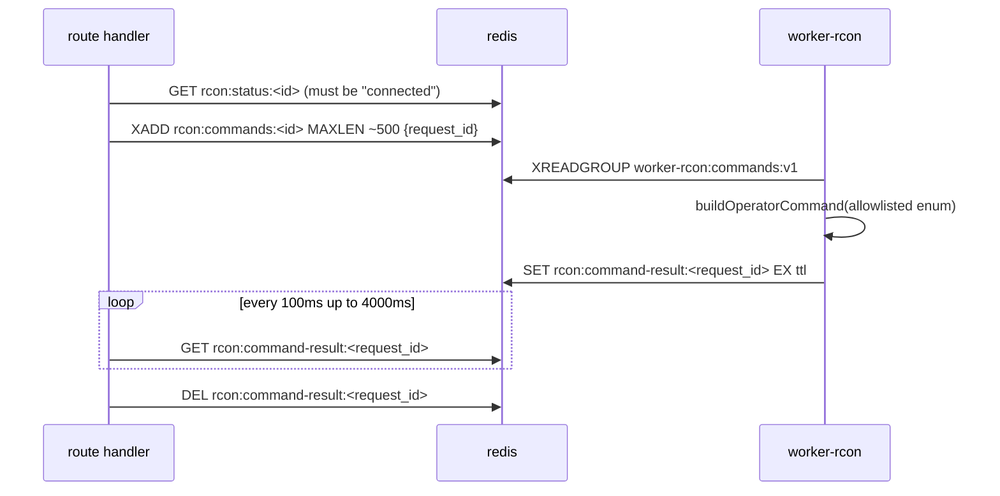

The command vocabulary is closed to eight verbs (`packages/shared-types/src/rcon-commands.ts:7-16`); the API never sends raw command text.

| Module | Representative endpoints | Permission | Notable side effects |
|---|---|---|---|
| `live.ts` | `GET /api/v1/ws/live` | `config.permissions: ['server:view']` + per-event filtering | Subscribes `liveBus` (23 event types); replays process-local chat/combat ring buffers (capacity 100); 10 s ping, 30 s pong timeout → close 4000 |
| `matches.ts` / `events.ts` / `combat-events.ts` / `chat.ts` / `votes.ts` | list / `/count` / `/export` / `/:id` quartets | `panelAccess`; combat blocks need `combatView` | Streamed CSV (`combat-events` batches 1 000, cap 100 000; `events` cap 50 000; `matches` cap 10 000) |
| `server-map.ts` / `server-map-vote.ts` / `server-rotation.ts` / `server-rotation-calendar.ts` | `POST …/map/next\|change\|end-match`, candidate pool, `GET/PUT …/rotation`, calendar CRUD | read `panelAccess`; writes squad perm `changemap` | RCON via worker; `liveBus server.map.changed`; `/next` optimistically patches `rcon:status:<id>.next_layer` EX 300; rotation writes go through `writeVersion` so they land in config history |
| `server-seeding.ts` / `server-seed-schedule.ts` / `server-seed-notifications.ts` | `GET …/seeding`, schedule CRUD, `POST …/seed-call` | read `panelAccess`; seeding settings squad perm **`manageserver`**; seed-call `chat` **or** `manageserver` | Redis `SET NX EX 7200` cooldown → 429 + `Retry-After`; `events` row + XADD; `notifySeedSubscribers` |
| `server-messaging.ts` / `server-scheduled-tasks.ts` / `server-chat-commands.ts` / `server-roster.ts` | broadcast/squad/player messages, task CRUD, roster | squad perm `chat`; task guard varies **per task type** | Messaging inserts `chat_messages` with `source:'panel'`; broadcast tasks fan out to ≤50 servers, one row and one audit entry each |
| `leaderboards.ts` / `leaderboards-bonuses.ts` / `analytics.ts` / `vote-analytics.ts` | rankings, dashboards, JSON/CSV | `panelAccess` | Redis cache TTL 60 s; separate `leaderboard:search-rl:` limiter at 60/min |
| `economy.ts` / `vehicle-catalog.ts` | ledger reads, `POST …/bonus-adjustments`, `POST …/bonus-purchases` | `canManageEconomy`; purchase needs **both** `canManageEconomy` and `canAssignRoles` | `SELECT … FOR UPDATE` on `players`; purchase mutates role + `publishAdminsCfgSyncForAllServers` + `invalidatePermissionCache` in one tx |

The per-task-type guard in `server-scheduled-tasks.ts:125-150` is the clearest example of how ad-hoc authorization gets in this context:

```ts
if (taskType === 'restart') {
  if (!req.user.permissions.permissions.has('server:restart')) { … }
  return null;
}
const squadPermission = taskType === 'broadcast' ? 'chat' : 'changemap';
if (!req.user.permissions.squadPermissions.has(squadPermission)) { … }
if (taskType === 'broadcast' && !req.user.permissions.permissions.has('role:edit')) { … }
```

### 4.5 Settings & integrations

Thirteen modules. There is **no generic key/value settings table**: each group gets a typed table with exactly one row, and defaults are never seeded — the row is absent until first write and each route's `serialize(row | null)` supplies hardcoded fallbacks, duplicating them between the API and any worker reading the same table.

| Module | Representative endpoints | Permission | Notable side effects |
|---|---|---|---|
| `settings-alt-detection.ts` / `settings-coplay.ts` | weights, thresholds, `POST/DELETE …/ignored-ips` | `config.permissions: ['player:view_ips']` (coplay's PUT too, despite involving no IPs) | Singleton upsert + imperative audit with before/after |
| `settings-economy.ts` / `settings-clan-guard.ts` / `settings-chat-flags.ts` | economy coefficients, kill-switch, chat-flag rule CRUD + reindex | **split guard** in economy (`canManageEconomy` vs `canEditRoles` per field group); `canManageClans`; `canEditRoles` | Reindex re-scans N days of chat and rewrites flags |
| `integrations-discord.ts` | integration singleton, webhook CRUD + `/test`, template CRUD/reset/preview | `integration:manage` | Encrypts bot token and webhook URL at rest; URLs validated against a strict `discord.com/api/webhooks/...` host allowlist (`lib/discord.ts:2-3`); `/test` hand-rolls a 5 s `fetch` instead of reusing the worker sender |
| `integrations-geoip.ts` | MaxMind account/license/enable | `integration:manage` | `db_present` is permanently `false` — `packages/db/src/geoip/` has no caller in `apps/` |
| `alert-rules.ts` / `automation-rules.ts` | rule CRUD, `POST /automation-rules/:id/dry-run` | `panelAccess` read, `role:edit` write, `config.audit` hook | Two *separate* engines: alert rules are a free-form `config: z.record(z.unknown())`, automation rules a typed condition/action pair shared with the worker. Dry-run **inserts an `automation_runs` row** even on no-match |
| `media.ts` | `POST /media`, `/media/link`, `GET /media/:id[/stream]`, `DELETE` | `panelAccess`; delete = owner else `canManageMedia` | Local filesystem, no object store; 2 GiB cap, magic-byte validation, SHA-256 dedup **after** the write (two rows may share one `storage_path`) |
| `audit.ts` / `logs.ts` | `GET /audit`, `GET /audit/verify-chain`, `GET /logs[/export]` | `audit:view`, `host:view`, `host:metrics` | `verify-chain` does an **unbounded `SELECT … ORDER BY id ASC`** over `audit_log` |

The audit chain itself is enforced in Postgres, not in the API: `writeAuditEntry` inserts `rowHash: Buffer.from([])` and a `BEFORE INSERT` trigger takes `pg_advisory_xact_lock` and computes `sha256(prev || action_type|target_type|target_id|context|created_at)`. That payload **omits actor, IP, before/after snapshots, status code and duration** — migration `0008_steam_only_auth.sql:97` calls it "by design", but it means who-did-what and what-changed can be rewritten without breaking verification.

### 4.6 Panel administration

Eight modules: `roles`, `role-members`, `role-assignments`, `users`, `permissions`, `setup`, `auth`, `me-tokens`. This is the only context that consistently uses declarative `config.permissions` for every non-self-service route.

| Module | Representative endpoints | Permission | Notable side effects |
|---|---|---|---|
| `roles.ts` | `GET/POST/PUT/DELETE /roles[/:id]` | `role:view\|create\|edit\|delete` | tx: roles + `role_squad_permissions` (delete-then-insert) + outbox; `invalidatePermissionCacheForRole`; 409 `role_referenced_by_vip_tier` / `role_in_use`; Owner immutability keyed on the **name string** |
| `role-members.ts` | members list/add/remove, `POST …/members/import\|bulk-delete\|move`, `GET …/members/export` | `user:view` / `user:manage_roles` | Import runs **N sequential `UPDATE players` inside one transaction** (up to 5000) where bulk paths use one set-based UPDATE; bulk revocations call `revokeAllForPlayer` **without** the liveBus argument, so they emit no `session.revoked` |
| `role-assignments.ts` / `users.ts` / `permissions.ts` | VIP roster, role-holders, `GET /permissions` | `user:view` / `role:view` | Near-duplicate read surfaces over the same `players ⋈ roles` join; `users.ts:63-64` hardcodes `assigned_at`/`assigned_by` to `null` |
| `auth.ts` / `me-tokens.ts` | `POST /auth/logout`, `GET /me`, `GET /me/names`, `GET/DELETE /me/sessions[/:id]`, `/me/tokens` | inline 401 on `!req.user` | `revokeSession` + liveBus `session.revoked`; `clearCookie` |
| `setup.ts` | `GET /setup/status` (**public**), `POST /setup/complete` | inline three-stage guard: 410 → 401 → 403 `isOwner` | Sets `panel_meta.setup_completed` |

No route in this context takes a row lock; validation reads (Owner count, role lookup) happen outside the transaction, so the last-owner and Owner-immutability invariants are TOCTOU-racy under concurrency and are backed by no DB constraint.

### 4.7 The public, unauthenticated surface

Seven paths are reachable without a session, plus two implicit ones. What protects them is entirely per-route `config.rateLimit` plus schema-level PII exclusion — there is no separate public router, no separate origin, and no shared middleware.

| Path | Module | Protection |
|---|---|---|
| `GET /api/v1/public/stats`, `/public/stats.csv` | `public-stats.ts:87,103` | **Global limiter only** — no `config.rateLimit`. Payload is PII-free by construction (no player or server identifiers) |
| `GET /api/v1/public/clans`, `/public/clans/:id` | `public-clans.ts:55,78` | `rateLimit { max: 60, '1 minute' }` |
| `GET /api/v1/public/banlist` | `public-banlist.ts:104` | 30/min + `banlist:read` scope + the `banlist_publication_settings` master switch (404 when off) + ETag/304. Never emits IPs or admin notes |
| `GET /api/v1/public/whitelist/settings` | `whitelist-applications.ts:183` | 60/min |
| `POST /api/v1/public/whitelist/applications` | `whitelist-applications.ts:197` | **5/hour**, plus a partial unique index on `status='pending'` → 409 |
| `GET/…/api/v1/auth/steam/*` | `auth-steam.ts:22,48` | 30/min and 10/min |
| `GET /api/v1/setup/status` | `setup.ts` | None — no `permissions` key, so the auth hook returns early |
| `GET /api/v1/host/bridge-status` | `host.ts:44-46` | None — an unintended hole, leaking bridge version and hostname |
| `/health`, `/metrics` | `plugins/health.ts:6`, `plugins/metrics.ts:54` | Plugin-level, `schema: { hide: true }` |

The global limiter is `max: 1200` per minute keyed on `` `${req.ip}:${req.user?.playerId ?? ''}` `` (`apps/api/src/server.ts:160-164`). Because the RBAC hook that populates `req.user` runs in the same `onRequest` phase, authenticated traffic really is keyed per (ip, playerId) — two sessions behind one NAT get independent budgets, and unauthenticated traffic collapses to pure per-IP.

### 4.8 Cross-cutting conventions — and where they break

**The Zod + `config.permissions` + audit triple.** The intended shape is one `fast.get('/api/v1/…', { config: { permissions: [...], audit: {...} }, schema: { … } }, handler)`. In practice only about a third of modules use it. The rest declare `config: { audit: false }` and hand-roll a `panelGuard`/`readGuard`/`combatGuard`/`manageGuard`/`editGuard` closure, each re-implementing the 401/403 branch, and call `writeAuditEntry` inline so they can attach real before/after snapshots — which the declarative hook cannot do (it derives `targetId` positionally from `params.id ?? params.serverId ?? params.playerId`, `plugins/audit.ts:35-41`). `settings-coplay.ts` uses both mechanisms in one file. Note also that `auditCfg === undefined` is a silent no-op, so `audit: false` is decoration, not a distinct state; omitting the key achieves the same thing.

Zod is universal but not uniform: schemas are file-local and duplicated (`z.object({ id: z.string().uuid() })` appears in nearly every module), only three request bodies are shared through `packages/shared-types`, and path-traversal defence is regex-in-schema (`LOG_NAME_REGEX`, `/^[A-Za-z0-9_-]+\.cfg$/`). Three routes escape the compiler entirely: `depot.ts:71-75` hand-parses its body, `host-backup.ts:67` uses raw Fastify generics with no schema, and the four `websocket: true` routes validate `id` with an ad-hoc `/^[0-9a-f-]{36}$/` because `schema.params` is not applied to them.

**Pagination and filtering.** Four schemes coexist, and which one you get depends on the module's age, not on the data:

| Scheme | Where | Shape |
|---|---|---|
| Keyset cursor `"<epochMillis>_<uuid>"` | `player-notes.ts:54`, `notes-feed.ts:100`, `suspects.ts:114` | `limit + 1` over-fetch, `next_cursor`; three byte-identical `encodeCursor`/`parseCursor` copies |
| Base64url JSON cursor `{v, id}` | `clans.ts:145` | One-off |
| `limit`/`offset` | `player-alt-candidates.ts` (applied **post-sort in JS**), `clans.ts` roster (real SQL `OFFSET`, returns `total`) | — |
| Hard cap, no paging | `/players` (200), `/players/search` (25), presence sessions (2000), IP history (500), CSV exports (10 000–100 000) | `total: rows.length` — the *page* size, not the match count, in `/players`, `/players/search`, `/players/:id/marks` and `GET /audit` |

Sorting is always an allow-list enum mapped to a column or SQL fragment, with `id` appended as a tiebreaker so keyset paging is total. Filtering splits two ways: nickname search normally goes through `normalizePlayerName` from `@squad/shared-config` and matches `*_normalized LIKE '%…%'` plus an `EXISTS` against `player_name_history`, but `notes-feed.ts:113` instead uses `ilike` on raw names with a local `escapeLike`. Booleans arrive as `z.enum(['true','false'])` strings rather than `z.coerce.boolean()` across `marks.ts`, `suspects.ts` and `notes-feed.ts`.

**Error mapping.** There is no central domain-error→HTTP mapper. Each handler sets `reply.code(...)` and returns `{ error: '<snake_case_code>' }`, with a per-route vocabulary (`port_conflict`, `slug_in_use`, `panel_managed_file`, `no_drift`, `rcon_unavailable`, `rcon_failed`, `cannot_remove_last_owner`, `kick_requires_trusted_source`, …). Bridge failures in particular map inconsistently — `502` in `server-log-files.ts:55`, `host-actions.ts:22`, `host-backup.ts:30` and `servers.ts:821`; `404 file_not_found` in the config reads; silently swallowed to `null`/`false` in `servers.ts:278-282` and `depot.ts:39-43`. The only global handler, `plugins/error-diag.ts:12-35`, is observability-only: it emits an `http.5xx` diag event and re-sends the untouched error.

**The parallel registration hazard.** `AGENTS.md` states the rule bluntly: a new route must be registered in **both** `apps/api/src/server.ts` and `apps/api/test/integration/harness.ts`, because the harness keeps its own parallel list and a route missing from it 404s in integration tests. The rule is followed almost everywhere — but not everywhere. Diffing the two registration lists at commit `28258d7`:

```
$ comm -23 <(grep -oE "app\.register\((\w+)" apps/api/src/server.ts | sed 's/app.register(//' | LC_ALL=C sort -u) \
           <(grep -oE "app\.register\((\w+)" apps/api/test/integration/harness.ts | sed 's/app.register(//' | LC_ALL=C sort -u)
…
serverRnsquadjsRoutes      # apps/api/src/routes/server-rnsquadjs.ts   (server.ts:215)
steamRoutes                # apps/api/src/routes/auth-steam.ts        (server.ts:292)
```

Everything else in the server-only column is a plugin (`bridgePlugin`, `rateLimit`, `helmet`, `swagger`, `metricsPlugin`, …) that the harness deliberately substitutes or omits; `auditPluginFactory` is the harness's own configurable variant. So **two route modules have no integration-test reachability at all**: the rnsquadjs sidecar cutover — the one endpoint that swaps a server's entire log/RCON pipeline between shadow and production — and the Steam OpenID login and callback handlers, which are the panel's only authentication entry point and carry their own 30/min and 10/min limiters. Any change to either is covered by unit tests only; an integration test written against them will 404 rather than fail meaningfully, which is the exact failure mode the dual-list rule exists to prevent.

---

## 5. The web dashboard (`apps/web`)

`apps/web` is a Next **15.5.15** / React **19.2.5** App Router application (resolved versions from `pnpm-lock.yaml:179,185`; `apps/web/package.json` pins `next@^15.1.0`). There is no `pages/` directory, no Route Handlers (`find src/app -name route.ts` is empty), and no Server Actions (`grep -r "use server" src` returns nothing). The browser talks to the Fastify API exclusively through same-origin relative URLs, which a Next rewrite proxies:

```js
// apps/web/next.config.mjs:1-13
const apiUrl = process.env.API_URL ?? 'http://api:3000';
export default {
  reactStrictMode: true,
  async rewrites() {
    return [
      { source: '/api/:path*', destination: `${apiUrl}/api/:path*` },
      { source: '/health', destination: `${apiUrl}/health` },
      { source: '/ready',  destination: `${apiUrl}/ready` },
    ];
  },
  output: 'standalone',
};
```

The rewrite *is* the BFF layer — there is no server-side API façade of its own. Same-origin also does the security work: the `__Host-sid` cookie rides along on every `fetch` and on the WebSocket upgrade without any CORS or token plumbing. Note that `output: 'standalone'` is dead configuration: `docker/web.Dockerfile:21-27` copies the whole `/app` tree and runs `next start`, and line 19 swallows build failures with `|| echo "web not yet built (Phase 0 static stub)"`, so a broken web build still produces a green image.

### 5.1 Route groups, layouts, middleware

There are **71 `page.tsx` routes** and exactly **three `layout.tsx` files**.

| Group | Layout | Pages | Character |
|---|---|---|---|
| `(dashboard)` | `src/app/(dashboard)/layout.tsx` | 63 | The authenticated panel. Calls `requireSession()`, renders the top bar, contextual server switcher, command palette and four global listener components. |
| `(public)` | `src/app/(public)/layout.tsx` | 4 | Anonymous pages — `/stats`, `/public/clans`, `/public/clans/[id]`, `/public/whitelist`. Its header comment (lines 1-6) documents that it deliberately omits `requireSession()` and the setup probe. |
| *(ungrouped)* | root `src/app/layout.tsx` only | 4 | `/` (cookie check → redirect), `/login`, `/setup`, `/no-access` — pre-auth pages that must render without the shell. |

App Router conventions in use are narrow: `layout.tsx`, `page.tsx`, `generateMetadata`, `dynamic = 'force-dynamic'`, `notFound()`, `redirect()`, async `params`/`searchParams`. **Absent everywhere in `src/app`:** `loading.tsx`, `error.tsx`, `global-error.tsx`, `not-found.tsx`, `template.tsx`, parallel and intercepting routes, `generateStaticParams`. `(public)/public/clans/[id]/page.tsx:33` calls `notFound()` into Next's unstyled default, and a throw in any Server Component falls through to the default error screen with no boundary. Suspense fallbacks are hand-rolled inside client pages instead.

Caching is effectively switched off wholesale. `apiFetch` hardcodes `cache: 'no-store'`, client fetches pass it explicitly, six files declare `dynamic = 'force-dynamic'`, and there is no `revalidate`, `revalidatePath`, `revalidateTag`, `unstable_cache`, or `fetchCache` anywhere. Other Server Components become dynamic implicitly by reading `cookies()`.

The shell composes the whole authenticated experience in ~25 lines:

```tsx
// apps/web/src/app/(dashboard)/layout.tsx:15-38
const me = await requireSession();
try {
  const status = await apiFetch<SetupStatus>('/api/v1/setup/status');
  if (!status.setup_completed) redirect('/setup');
} catch { /* if the endpoint fails, let the user through */ }
return (<div className="min-h-screen">
    <ConnectionBanner /><ForcedLogout /><SeedNotificationToast /><RoleExpiryToast />
    <TopNav permissions={me.permissions} displayName={me.canonical_name}
            groups={NAV_GROUPS} economyEnabled={me.economy_enabled ?? false} />
    <ServerBar />
    <CommandPalette permissions={me.permissions} economyEnabled={me.economy_enabled ?? false} />
    <main className="mx-auto w-full max-w-[1600px] space-y-6 px-5 py-5">{children}</main>
  </div>);
```

That `setup/status` call is the one server-side request that does **not** forward the session cookie (compare `logs/page.tsx:18-20`), and its failure is swallowed by design.

`src/middleware.ts` is 37 lines and explicitly refuses the auth-gate role, citing **CVE-2025-29927** in its header comment. It does a cookie-presence redirect to `/login?next=<path>` for five path prefixes (`/dashboard`, `/servers`, `/players`, `/audit`, `/settings`) and nothing else — no locale work, no headers. That matcher misses roughly twenty dashboard routes (`/clans`, `/matches`, `/reports`, `/issues`, `/chat`, `/votes`, `/users`, `/moderation/*`, …); harmless, because `requireSession()` in the layout is the real gate, but stale relative to the route tree. **No CSP or security headers are set anywhere** — not in `next.config.mjs`, not in middleware.

### 5.2 The server/client boundary

The boundary is drawn at the page level and almost nowhere deeper: **60 of 71 pages carry `'use client'`**. The eleven Server Components are `/`, the three legacy `roles/*` redirects, `logs`, `suspects`, `vips`, `moderation/teamkills`, and the three `(public)` server pages. The recurring shape is a thin server `page.tsx` rendering a colocated `*Browser.tsx` client component — nine of them (`EventsBrowser`, `ReportsBrowser`, `MatchesBrowser`, `IssuesBrowser`, `VotesBrowser`, …) share the naming convention and no code.

Consequently `apps/web/src/components` is effectively a client bundle: 34 of its 35 non-test components are `'use client'`; the sole server component is `RoleColorDot.tsx`. Server-side sharing happens through `lib/dal.ts` instead of through components. Client page sizes are extreme for that boundary: `dashboard/page.tsx` is **1341 lines** with 17 `useState` calls and 26 sub-components inline, `servers/[id]/configs/page.tsx` 1068, `ReportsBrowser.tsx` 1000, `servers/[id]/page.tsx` 833, `players/[id]/page.tsx` 792 — all shipped to the browser.

### 5.3 The data layer: there is no server-state library

This is the most consequential architectural fact about the client. `apps/web` has seven runtime dependencies — `@monaco-editor/react`, `@squad/shared-config`, `@squad/shared-types`, `next`, `react`, `react-dom`, `recharts`. **TanStack Query, SWR, RTK Query, zustand, Redux, Jotai, react-hook-form, and zod are all absent.** There are therefore no query keys, no `invalidateQueries`, no stale-time, no deduplication, and no automatic retry. Every piece of server state lives in `useState`, driven by `useEffect` + `useCallback`.

The entire HTTP client is 33 lines:

```ts
// apps/web/src/lib/api.ts
export async function apiFetch<T>(path: string, opts: RequestOptions = {}): Promise<T> {
  const headers = new Headers(opts.headers ?? {});
  if (opts.cookie) headers.set('cookie', opts.cookie);
  headers.set('accept', 'application/json');
  if (opts.body && !headers.has('content-type')) headers.set('content-type', 'application/json');
  const url = typeof window === 'undefined' ? `${API_URL}${path}` : path;   // :22
  const res = await fetch(url, { ...opts, headers, cache: 'no-store' });
  if (!res.ok) throw new Error(`API ${path} ${res.status}: ${(await res.text()).slice(0, 200)}`);
  return (await res.json()) as T;
}
```

Line 22 is the isomorphic trick: server-side it targets docker-internal `API_URL`, browser-side it emits a relative path for the rewrite. In practice the client branch is vestigial — `apiFetch` is imported by only **8 non-test files**, while `grep -rn "fetch(" src/ | grep -v test` finds **375 call sites**, of which **372** inline `fetch('/api/v1/…', { credentials: 'include', cache: 'no-store' })`. The reason is structural: `apiFetch` has no way to express `credentials: 'include'`, only a server-side `cookie` option. Error handling is likewise not shared — a single untyped `Error` whose message is a string, so any caller needing the API's error `code` re-parses the body itself (`settings/groups/page.tsx:98`).

Cache invalidation is manual. The canonical mutation (`settings/groups/page.tsx:76-112`) sets a per-row saving flag, `PUT`s, splices the server's echoed row into local state on success, and on failure writes a Russian error string and `await refresh()`es to roll back. `applyLocalUpdate` (line 70) gives genuine optimistic UI for debounced fields (`SAVE_DEBOUNCE_MS = 500`) but is hand-rolled per page. `router.refresh()` appears exactly **once in the whole app**, in `LocaleSwitch.tsx:40`. The other refresh mechanism is polling — each page defines its own `POLL_MS` and `setInterval` (`servers/page.tsx:54`, `dashboard/page.tsx:243`, `monitoring/page.tsx:49`, …), and `components/LiveIndicator.tsx` renders a freshness dot from `lastUpdate` age (`liveTone`: <10 s emerald, <60 s amber, else red) as the substitute for a query library's `isStale`.

#### Live transport

Realtime is a WebSocket, not SSE: a module-level singleton (`lib/live-bus.ts`, 568 lines, `getLiveBus()` at :554) holding one socket to `` `${proto}://${window.location.host}/api/v1/ws/live` `` (:406) — same-origin, proxied by the rewrite, authenticated by the cookie the browser attaches to the upgrade. The server endpoint is `apps/api/src/routes/live.ts:20`, itself gated `config: { permissions: ['server:view'], audit: false }`.

| Concern | Implementation |
|---|---|
| Reconnect | Fixed step table `BACKOFF_STEPS_MS = [1_000, 2_000, 4_000, 8_000, 16_000, 30_000]` (`live-bus.ts:309`), index clamped to the last step, `attempts` reset on `onopen`. **No jitter** — every tab reconnects in lockstep after an API restart. |
| Heartbeat | Server pings every 10 s; client replies `{type:'pong'}` (`live-bus.ts:436-443`); server closes with code 4000 after `PONG_TIMEOUT_MS = 30_000`. |
| Lifecycle | `retain()`/`release()` ref-count over `eventSubs + stateSubs + bridgeSubs`; the socket closes `IDLE_CLOSE_DELAY_MS = 5_000` after the last unsubscribe (`live-bus.ts:486`). |
| SSR | `getLiveBus()` returns a no-op stub when `typeof window === 'undefined'` (`:555-565`). |
| Escape hatch | `forceReconnect()` zeroes `attempts` and reopens immediately. |

A second, unused backoff implementation exists: `lib/ws-backoff.ts`'s tested `nextBackoffMs(attempts)` is consumed only by the server-detail log stream (`servers/[id]/page.tsx:214,280`), never by the bus.

React binding is `lib/use-live-bus.ts`: `useLiveSubscription(type, handler)` narrows the union with `Extract<LiveEvent, {type: T}>`, and `useLiveBusState()` / `useBridgeState()` use `useSyncExternalStore` with correct server snapshots. **36 files** subscribe.

**Live events do not invalidate caches — because there are none.** They mutate component state directly. `IssuesBrowser.tsx:133-134` re-filters its local array through `issueMatchesFilters`; `ReportsBrowser.tsx:173` merges the reduced `ReportLiveView` frame *on top of* the already-loaded list row, a subtlety documented at `live-bus.ts:181-186` because the WS shape omits `reporter_trusted` and `target_report_count_90d`. `TopNav`'s pending-reports badge refreshes on `report.created`/`report.updated` instead of polling, and `ServerBar` re-reads the servers list on `server.status`/`server.deleted`/`rcon.status`; `ForcedLogout` listens for `session.revoked` and hard-navigates to `/login`.

The union is hand-written in the web app and shares nothing with the API. The API's `apps/api/src/plugins/live-bus.ts` defines **23** event types; the web `LiveEvent` union defines **24** — and they have drifted in both directions:

```
API only:  externalban.matched
Web only:  match.started, match.ended
```

Since zod is not a web dependency, inbound frames are never validated: `live-bus.ts:444` is a bare `const event = frame as LiveEvent` after checking only that `frame.type` is a string. The two vocabularies are also genuinely distinct from `packages/shared-types/src/events.ts`, which describes zod-validated *persisted domain* events (`player.connected`, `moderation.ban`) rather than WS push frames.

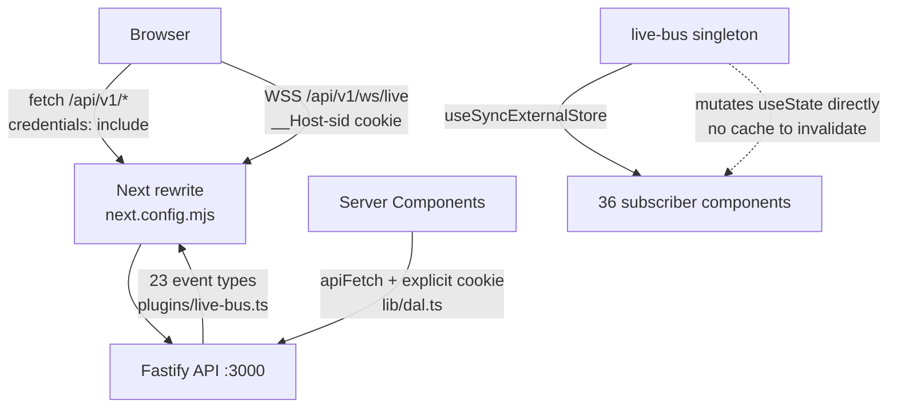

Notably, `components/connection-banner.tsx` — which still lives next to the bus and retains it — **no longer reflects WebSocket state**. Its comment explains the reversal: it now polls `/api/v1/me` every 30 s and requires `FAIL_THRESHOLD = 2` consecutive failures, because "HTTP polling … is the actual panel data path". That is an explicit in-code admission that the WS is supplementary.

### 5.4 Auth, session and permission gating

Session is a cookie named `__Host-sid`, declared identically in `apps/web/src/lib/dal.ts:7` and `apps/api/src/plugins/auth.ts:15`. Login is a plain anchor to `/api/v1/auth/steam/login` — no client-side credential handling at all. The authoritative browser-side gate is the DAL:

```ts
// apps/web/src/lib/dal.ts
export const getSession = cache(async (): Promise<Me | null> => {
  const jar = await cookies();
  const token = jar.get(SESSION_COOKIE)?.value;
  if (!token) return null;
  try { return await apiFetch<Me>('/api/v1/me', { cookie: `${SESSION_COOKIE}=${token}` }); }
  catch { return null; }
});
export async function requireSession(): Promise<Me> {
  const me = await getSession();
  if (!me) redirect('/login');
  return me;
}
```

`react.cache` dedupes the `/me` round-trip per request. `Me` carries two distinct permission vocabularies — panel `permissions: string[]` and in-game `squad_permissions: string[]` — plus the single feature flag `economy_enabled`.

UI gating **mirrors** server RBAC and never replaces it: the API's global `onRequest` hook in `apps/api/src/plugins/auth.ts` is the only enforcement point. Three distribution mechanisms coexist, none abstracted:

1. **Prop drilling from the layout** — `permissions` and `economyEnabled` into `TopNav` and `CommandPalette`, which filter `NAV_GROUPS` declaratively: `(!item.permission || permissions.includes(item.permission)) && (!item.requiresEconomy || economyEnabled)` (`TopNav.tsx:16-18`, duplicated verbatim in `commandPalette.ts:39`).
2. **Server-side hard gates** — only three pages redirect: `logs` on `host:view`, `suspects` on `player:view`, `vips` on `user:view`, all to `/dashboard`. Two more gate on `squad_permissions` (`servers/[id]/rotation/page.tsx:71`, `map-vote/page.tsx:118`, both `changemap`).
3. **Client `can*` booleans** — the dominant idiom, re-derived per page (`const canEdit = me?.permissions.includes('role:edit') ?? false`) and drilled into children as `canEdit`/`canManage`/`canChat`.

There is **no `<PermissionGate>` component, no permissions context, and no `hasPermission()` helper**. Panel permission strings are free-text literals with no compile-time link to the API's 51 panel permission keys, so a server-side rename silently breaks UI gating; `squad_permissions` are better off, typed via `SquadPermissionKey` from `@squad/shared-config/squad-permissions`. `RoleExpiryToast.tsx:31-33` documents the intended model explicitly: the server already scopes `role_expiring` fan-out to sockets holding `can_assign_roles` (`apps/api/src/routes/live.ts:29`), and the client filter is "defense-in-depth".

### 5.5 Component architecture

There is **no `ui/` primitives directory, no `features/` directory, and no design-system dependency**. `find apps/web/src/components -type d` returns only the folder itself — 35 non-test components in one flat bin, no barrel `index.ts`, every import a deep path. Of 277 `.tsx` files under `src`, ~227 are colocated inside `app/`. Cross-cutting logic is shared through `lib/*.ts` pure functions rather than component composition: `lib/nav.ts` feeds both the top bar and the palette; `lib/marks.ts` feeds `PlayerMarks` and `PlayerMarkBadge`. Each `lib` module has a paired `*.test.ts` — testing discipline is inverted relative to the god components, whose helpers are untestable in place.

| Component | Consumers | Responsibility |
|---|---|---|
| `components/LiveIndicator.tsx` | 34 | Freshness pill + pure `liveTone(ageMs)`; the de-facto design primitive of the app |
| `components/RoleColorDot.tsx` | 14 | Role swatch over `@squad/shared-config/role-colors`; the only server component in `components/` |
| `components/LogConsole.tsx` | 6 | Streaming tail/follow console shared across server pages |
| `components/BannedNameRuleModal.tsx` | 6 | Largest shared component (12.4 KB): modal + form + regex tester |
| `components/TopNav.tsx` | 2 | Permission/flag-filtered top bar over `NAV_GROUPS`, live pending-reports badge, user menu |
| `components/CommandPalette.tsx` | 2 | Ctrl-K palette; flattened `NAV_GROUPS` + debounced player/server search |
| `components/ForceStopDialog.tsx` | 2 | The canonical confirm dialog every other modal copies |
| `components/MetricHistoryChart.tsx` / `MetricHistoryModal.tsx` | 1 / 2 | Recharts `AreaChart`, code-split behind `dynamic()` |
| `components/MetricsChart.tsx` | 2 | Hand-computed SVG sparkline — the *other* chart stack |
| `components/connection-banner.tsx` | 2 | Global connectivity banner (`role="alert"`); kebab-case outlier |
| `components/ForcedLogout.tsx` / `SeedNotificationToast.tsx` / `RoleExpiryToast.tsx` | 1 each | Layout-level live-bus listeners; the app's entire "toast" system |
| `components/BroadcastComposer.tsx` / `DirectMessageModal.tsx` / `SquadMessageModal.tsx` | 1–2 | In-game messaging trio, gated on `squad_permissions` |
| `components/RoleEditor.tsx` | 1 | Only shared component that self-fetches its own catalog (`/api/v1/permissions`, line 64) |

**Tables:** there is no `DataTable` abstraction. `grep -rl "<table"` matches **54 `.tsx` files**, each rewriting the markup, and the duplication is visibly drifting — `players/page.tsx:232` uses `thead className="bg-neutral-950 … text-neutral-500"` while `users/page.tsx:133` uses `bg-neutral-900 … text-neutral-400`. Several pages define file-local `Th`/`Td` helpers independently and never promote them.

**Forms:** raw `<form onSubmit>` plus `useState`, across all 26 form-bearing files. Validation is server-authoritative; the client mirrors the contract *by comment* — the literal string `// Mirrors the zod body schema on POST /api/v1/servers/:serverId/broadcast` appears in `BroadcastComposer.tsx:6`, `DirectMessageModal.tsx:6` and `SquadMessageModal.tsx:6`, even though `@squad/shared-types` is already a dependency and could carry the schema.

**Dialogs:** every modal implements Radix's `open` / `onOpenChange` prop contract without Radix. The shell from `ForceStopDialog.tsx` — `useId()`, an Escape `keydown` listener, `if (!open) return null`, `fixed inset-0 z-50 … bg-black/60`, `role="dialog" aria-modal` — is copy-pasted near-byte-identically into `DepotUpdateModal`, `DiskBreakdownModal`, `MetricHistoryModal`, `BannedNameRuleModal`, `DirectMessageModal`, `SquadMessageModal` and others (~12). The accessibility cost is real and unmitigated: **no focus trap, no focus restore, no scroll lock, and `createPortal` is never used** (zero hits) — modals render inline and rely on `z-50`.

**Charts:** two competing stacks. `recharts@3.8.1` powers `MetricHistoryChart`, `DossierSkillChart`, and `ReportsAnalytics`; `MetricsChart.tsx` and `PresenceChart.tsx` hand-compute SVG paths from module-level viewport math (`const W = 600; const H = 160;`). No documented rule selects between them. Only 4 `next/dynamic` imports exist in the app and 2 are charts — these are also the only default-exported components, as `dynamic()` requires.

**Monaco** appears in exactly one place, `servers/[id]/configs/page.tsx` (1068 LOC), loaded SSR-off:

```ts
const MonacoEditor = dynamic(() => import('@monaco-editor/react'), { ssr: false });
const MonacoDiff = dynamic(() => import('@monaco-editor/react').then((m) => ({ default: m.DiffEditor })));
```

It holds `editorRef`/`monacoRef`/`decorationsRef` (lines 114-117) and uses `createDecorationsCollection` + `monaco.Range` (line 538) to paint the `.squad-managed-segment` classes over the panel-owned `//SQUAD-PANEL` block of `Admins.cfg`, enforcing it read-only in the editor. It also forces `model.setEOL(monaco.editor.EndOfLineSequence.CRLF)` (line 529) — a Squad server file-format requirement.

**Icons:** no icon library. Icons are Unicode emoji resolved through `lib/marks.ts:61` (`markIconEmoji(icon) → ICON_EMOJI[icon] ?? '🚩'`, always `aria-hidden`), colored `<span>` dots as status glyphs, and a handful of inline `<svg>`.

### 5.6 i18n — a thin localized shell over a Russian app

The i18n layer is ~150 lines of local code; there is no `next-intl`, `react-i18next`, or `formatjs`.

| File | Role |
|---|---|
| `src/i18n/config.ts` | `LOCALES = ['en','ru']`, `DEFAULT_LOCALE = 'ru'`, `LOCALE_COOKIE`, `resolveLocale()` |
| `src/i18n/dictionaries/ru.ts` | Russian dictionary — source of truth; exports `TranslationKey = keyof typeof ru` |
| `src/i18n/dictionaries/en.ts` | `Record<TranslationKey, string>` — a missing key is a compile error |
| `src/i18n/translate.ts` | `getDictionary`, `interpolate`, `createTranslator` |
| `src/i18n/server.ts` | server-only `getLocale()` / `getTranslator()` (reads `cookies()`) |
| `src/i18n/LocaleProvider.tsx` | the app's **only** React context; `useLocale()` / `useTranslator()` |
| `src/i18n/errors.ts` | maps API error `code` → `errors.<code>` |

Dictionaries are flat dot-namespaced strings — **73 keys** each, across `app.*`, `nav.*` (45), `login.*`, `noAccess.*`, `connection.*`, `localeSwitch.*`, `errors.*`. No nesting, no plural rules, no ICU, no date/number formatting. Interpolation is one regex over `{token}`, and a missing key returns the key itself rather than throwing (`translate.ts:45`). Completeness is enforced twice — at compile time by the `Record<TranslationKey, string>` type, and at test time by `src/i18n/i18n.test.ts:37-42` asserting `enKeys === ruKeys`.

Selection is a plain `locale` cookie (deliberately not `__Host-`prefixed so it survives plain-HTTP dev), written client-side by `LocaleSwitch.tsx:14-16` and followed by the app's single `router.refresh()`. There is **no locale route segment, no `Accept-Language` negotiation, and no middleware involvement**; the root layout resolves once server-side and pushes the value into `LocaleProvider`, which falls back to `DEFAULT_LOCALE` outside the provider instead of throwing.

The honest scope: only **9 non-test files** import a translator, while **148 of 166 non-test `.tsx` files contain hard-coded Cyrillic literals**. i18n covers the shell — nav, auth pages, connection banner, API error codes — and nothing else. `lib/nav.ts` encodes the transitional state in its type: every item carries a legacy Russian `label` *and* an optional `labelKey`, with `nav.test.ts:19-33` asserting `ru[labelKey] === label`. Because `CommandPalette` searches and displays the raw `label`, the palette is unlocalized while the top bar is not. `/setup` bypasses the i18n layer entirely and is 100% hardcoded Russian, unlike `/login` and `/no-access`. `RoleEditor.tsx:67` throws `'Не удалось загрузить список permissions'` — a Russian string with an English word embedded, a fair summary of the migration's state.

### 5.7 Styling and theming

Tailwind **v4.1.5** through the PostCSS plugin only. **There is no `tailwind.config.*` anywhere in `apps/web`**, and `src/styles/globals.css` — the app's only CSS file — is 25 lines with no `@theme`, `@config`, `@plugin`, or `@custom-variant`:

```css
/* apps/web/src/styles/globals.css:1-15 */
@import "tailwindcss";
:root { color-scheme: dark light; }
body { @apply bg-neutral-950 text-neutral-100 font-sans antialiased; }
@layer base { a { @apply text-sky-400 hover:text-sky-300 underline-offset-4; } }
```

So: stock Tailwind defaults, no design tokens, no CSS custom properties, no `next/font` (0 hits) and no `@font-face`. **The theming system is that there isn't one — the app is permanently dark.** `dark:` variant usage across `src` is zero, there is no `next-themes`, no `ThemeProvider`, no `prefers-color-scheme` query; darkness is hard-coded on `body` and repeated in `(public)/layout.tsx:9`. The `color-scheme: dark light` line only affects native form controls and scrollbars. The de-facto palette is a usage convention: `neutral` 3708 occurrences, `red` 670, `sky` 506, `emerald` 292, `amber` 267, long tail after.

Variants are hand-written `Record<Tone, string>` maps — the closest thing to `cva` in the repo, reinvented three times independently:

```ts
// apps/web/src/components/LiveIndicator.tsx:13
const DOT_CLASS: Record<LiveTone, string> = {
  emerald: 'bg-green-500', amber: 'bg-amber-500',
  red: 'bg-red-600', neutral: 'bg-neutral-600',
};
```

with siblings in `RoleColorDot.tsx:7` (`CLASS_MAP`) and `PlayerMarks.tsx:16` (`bannerToneClasses` / `dotToneClasses`). The one genuine cross-package token set lives outside the web app — `packages/shared-config/src/role-colors.ts` — and because Tailwind v4 cannot generate classes from dynamic strings, `RoleColorDot.tsx:7-24` hand-maintains a duplicate mapping of the 16 palette names to static `bg-<color>-500` classes (falling back to inline `style={{ backgroundColor }}` for hex roles), with **no test asserting the two lists stay in sync**. The only bespoke CSS in the app is the two Monaco decoration classes at `globals.css:20-24`, and Biome excludes `apps/web/src/styles` from linting (`biome.json:21`), making `globals.css` the single unlinted source file.

---

## 6. The worker fleet (`apps/workers`)

### 6.1 A platform by convention, not by framework

`apps/workers/` holds **19 worker packages** plus one non-package helper directory, `_test-shared`. There is **no shared worker base class, runtime, or bootstrap library**. Every worker's `src/index.ts` re-implements the same startup shape by hand. Only three genuinely shared runtime pieces exist, and all three live in `packages/`:

| Helper | Location | Adoption |
|---|---|---|
| `startHeartbeat()` | `packages/shared-config/src/heartbeat.ts:54` | all 19 |
| `createDiag()` | `packages/diag/src/index.ts:17` | ~8 workers |
| `redisSinkStream()` (pino multistream → `panel:logs`) | `packages/shared-config/src/log-stream-sink.ts` | 4 (`log-ingest`, `config-sync`, `rcon`, `metrics-sampler`) |

Everything else — env parsing, `postgres()`/`drizzle()` construction, ioredis options, signal handlers, tick intervals, AES-GCM credential decryption, `sendRconCommand` — is copy-pasted per worker. The duplication is *deliberate and commented*: `apps/workers/discord/src/consume.ts:36` says "Duplicated from `apps/workers/automation/src/dispatch.ts` to keep this worker self-contained (no cross-worker package dependency)." Read that as the platform's actual design axiom: workers are independent deployables that share types, not code.

`apps/workers/scheduler/src/index.ts:55-131` is the most complete instance of the de-facto bootstrap:

```ts
const sql = postgres(requiredEnv('DATABASE_URL'), { max: 4, prepare: false });
const db = drizzle(sql, { schema }) as DatabaseClient;
const redis = new Redis(requiredEnv('REDIS_URL'), {
  maxRetriesPerRequest: null,
  enableReadyCheck: true,
  retryStrategy: (times: number) => Math.min(2000, 200 * 2 ** Math.min(times, 6)),
});
const diag: Diag = createDiag({ redis, log });
const bridge = new BridgeClient({ socketPath: process.env.PANEL_BRIDGE_SOCKET ?? '/run/panel-host-bridge/bridge.sock' });
await bridge.connect();
const stopHeartbeat = startHeartbeat({ redis, name: 'scheduler', statusFn: () => ... });
```

The order is: pino logger → `requiredEnv` (fatal `process.exit(1)` on a missing var) → postgres/drizzle → ioredis with exponential `retryStrategy` → `createDiag` → optional `BridgeClient.connect()` → `startHeartbeat` → `diag.emit({kind:'*.started'})` → `SIGINT`/`SIGTERM` handlers → first tick → `setInterval`. Scheduler registers signals *before* the first tick with a comment explaining why (`scheduler/src/index.ts:110-113`); most others register after. Entrypoint guarding is likewise inconsistent — `scheduler`, `stats`, `diag-flush`, `event-partition`, `leaderboard-aggregator` use `isMainEntrypoint()` so tests can import the module, while `log-ingest`, `backup`, `audit-archiver` call `main()` unconditionally at module scope (`log-ingest/src/index.ts:337`).

**Health is Redis-only. No worker opens an HTTP port** — grepping `createServer|listen|fastify(` across `apps/workers/*/src` returns nothing. The contract is `worker:heartbeat:<name>`, written every `HEARTBEAT_INTERVAL_MS = 5_000` with `HEARTBEAT_TTL_SECONDS = 30` (`packages/shared-config/src/heartbeat.ts:14-16`), payload `{name, ts, pid, hostname, started_at, status}` where `status` comes from an optional `statusFn` (log-ingest reports `tails=<n>`). The API scans the prefix in `apps/api/src/plugins/health.ts:40`. Two gaps follow: `apps/api/src/plugins/heartbeat-watch.ts:4` alerts on only **6 hard-coded `KNOWN_WORKERS`** (`rcon`, `log-ingest`, `audit-archiver`, `event-partition`, `diag-flush`, `metrics-sampler`), so the other 13 can die without a `worker.heartbeat_lost` diag; and `docker-compose.yml` declares **no `healthcheck:` for any worker service** — only `restart: unless-stopped`.

Shutdown is uniform in shape: stop timers → emit `*.stopped` diag → `stopHeartbeat()` → `bridge.close()` → `sql.end({ timeout: 5 })` → `redis.quit().catch(() => undefined)` → `process.exit(0)`. Stream-loop workers poll a `shouldStop()` boolean per iteration rather than aborting the in-flight `BLOCK` read; `diag-flush` additionally awaits its in-flight batch promise.

Config is bare `process.env` — no zod schema, no shared loader, `requiredEnv()` redefined per worker. Two names exist for one socket: `PANEL_BRIDGE_SOCKET` (scheduler, config-sync) vs `BRIDGE_SOCKET` (log-ingest, metrics-sampler). Failure contracts diverge too: `ban-sync`/`clan-guard`/`automation` swallow and continue; `role-expirer`/`clan-priority-expirer` emit a diag then rethrow; `discord`, `audit-archiver`, `backup`, `event-partition` degrade to heartbeat-only idle on missing env instead of exiting.

All workers share one parameterised image, `docker/worker.Dockerfile`, selected by `ARG WORKER`. Bridge-consuming services must run `user: "0:${PANEL_GID}"` — compose repeats a warning that `group_add` breaks the bridge's `SO_PEERCRED` check (`docker-compose.yml:139-143`). `worker-rcon` uniquely runs `network_mode: host` and therefore reaches Postgres/Redis over `127.0.0.1`. **Metrics: no Prometheus, no OpenTelemetry anywhere in the fleet.**

`apps/workers/_test-shared/contract.ts` exports one factory, `workerContract(opts)`, asserting the two platform invariants against a spawned `dist/index.js`: the heartbeat key appears with `0 < ttl <= 30` within 30 s, and `SIGTERM` yields `exit(0)` within 8 s. It isolates on `TEST_REDIS_DB` (default 14) to fix a documented CI flake. **Adoption is 4 of 17** — only `clan-priority-expirer`, `role-expirer`, `log-ingest`, `seed-reward` import it; the other 13 carry hand-copied versions with the old 5 s window and a hardcoded `redis://127.0.0.1:6379/14`, i.e. the exact flake the shared harness was written to eliminate. `leaderboard-aggregator` and `presence-daily` have no contract test at all.

### 6.2 The messaging substrate: Redis Streams and nothing else

**BullMQ is not present in the repo** — no dependency, no import. Pub/sub belongs to the API's live bus, not the workers (the one exception is `worker-rcon` publishing `rcon:status:changed`, `supervisor.ts:186`). All worker messaging is Redis Streams with consumer groups.

| Stream | Producer | Consumer group | Consumer |
|---|---|---|---|
| `events:server:<id>` / `events:global` (`STREAM_NAME`, `packages/shared-types/src/events.ts:285`) | log-ingest, rcon, ban-sync, scheduler | `automation-dispatch:v1` | automation |
| same | same | `discord-notify:v1` | discord |
| `rcon:commands:<serverId>` | API, scheduler, clan-guard, log-ingest | `worker-rcon:commands:v1` | rcon |
| `events:admins-cfg-sync:<serverId>` | API outbox, clan-priority-expirer, role-expirer, seed-reward | `config-sync` | config-sync |
| `diag:queue` (`DIAG_STREAM_KEY`, `packages/diag/src/types.ts:14`) | every diag-emitting worker | `diag-flush` | diag-flush |
| `bansync:manual` | API | `ban-sync` | ban-sync |
| `panel:logs`, `host:metrics`, `container:metrics:<id>` | 4 workers / metrics-sampler | — (read by API) | — |

Group creation is uniformly `XGROUP CREATE … MKSTREAM` with `BUSYGROUP` swallowed. **Start ID is inconsistent**: `'$'` (skip backlog) in discord/automation/config-sync/diag-flush/ban-sync, but `'0'` (replay backlog) in `apps/workers/rcon/src/commands.ts:101`. Stream *discovery* also diverges: automation does `SCAN MATCH events:server:*` per iteration — deliberately DB-free so the worker needs no Postgres for discovery (`dispatch.ts:176-192`) — while config-sync derives the set from a `servers` query refreshed every 30 s and carries a special `NOGROUP` recovery path, because a multiplexed `XREADGROUP` fails wholesale when one server's stream was destroyed (`config-sync/src/index.ts:151-170`).

#### Dual-layer idempotency, and the XACK ordering split

Deduplication is two-layer: a **producer-side** best-effort claim and a **consumer-side** authoritative one, both on `DEDUP_KEY(group, eventId)` = `dedup:<group>:<event_id>` with `DEDUP_TTL_SECONDS = 86_400` (`events.ts:291-292`). log-ingest's `publish.ts:12` sets it `NX` and returns early if it loses the race. Consumers then re-claim under their own group — but in **opposite orders**, over the same streams:

- **automation** claims *before* work (`SET NX` → dispatch): at-most-once. A crash mid-dispatch loses the event (`dispatch.ts:214-224`).
- **discord** delivers *first*, then claims, then `XACK`s: deliberate at-least-once, documented at `consume.ts:88-101`.
- **log-ingest event persistence** uses a third mechanism entirely — a *database* claim, `INSERT … ON CONFLICT DO NOTHING` into `processed_events` in the same transaction as the `events` insert (`event-store.ts:16-27`).

Pending-entry recovery is `XAUTOCLAIM` from `0-0` with a min-idle threshold, present in `discord` (30 s, boot sweep plus per-iteration), `rcon` (60 s idle, every 30 s) and `config-sync`. **`automation` has no reclaim path at all**, and its consumer name is `automation-dispatch-${process.pid}` (`dispatch.ts:260`) — entries pending when a process dies are never revisited. `diag-flush` likewise has no reclaim.

**There is no dead-letter handling in any worker.** `STREAM_NAME.eventsDlq()` (`events:dlq`) is defined at `events.ts:288` and exercised only by `apps/api/test/event-dlq-autoclaim.test.ts`, whose own header says it "exercises the redis primitives the workers rely on." No worker counts deliveries or publishes to the DLQ. Malformed entries are ACKed and dropped with a warn (`discord/src/consume.ts:113-116`; same in diag-flush). The retry stack terminates at "log and leave pending" or "ack and drop."

#### The scheduler: a tick loop with no lock

`worker-scheduler` is a **polling tick loop, not a cron daemon** — no `node-cron`/`croner` dependency. Every `SCHEDULER_INTERVAL_MS` (default 30 000) it runs five ticks under `Promise.all`: seed schedule, rotation schedule, rotation profiles, cron `scheduled_tasks`, map votes. Periodic jobs are **rows, not code**: `scheduled_tasks.recurrence` holds a 5-field UTC cron string parsed by `expandCron5Occurrences`, and missed occurrences collapse to the latest one:

```ts
const cursor = entry.lastExecutedAt ?? entry.createdAt;
const from = hasPriorOccurrence ? new Date(cursor.getTime() + 60_000) : cursor;
if (from.getTime() > now.getTime()) return null;
const occurrences = expandCron5Occurrences(entry.recurrence, from, now);
return occurrences.length > 0 ? (occurrences.at(-1) ?? null) : null;
```
(`scheduler/src/scheduled-task-tick.ts:105-118`)

**Double execution across replicas is not prevented.** There is no advisory lock and no `SELECT … FOR UPDATE` in `apps/workers/scheduler/src/`; the only guard is a non-atomic read-then-write cursor, `setLastExecutedAt` being a plain `UPDATE … WHERE id = ?` (`deps.ts:150-158`). The single `SET … NX` in the package is a per-server *seed-call cooldown* (`seed:call:cooldown:<serverId>`, `deps.ts:290-297`), not a tick lock. Two scheduler replicas would both see a task due and both fire. The architecture is implicitly single-replica for every interval worker, enforced only by convention: `docker-compose.yml` declares no `deploy.replicas` anywhere. Scheduler never speaks RCON directly — it `XADD`s onto `rcon:commands:<serverId>` and applies weekly rotation profiles through the Go bridge.

### 6.3 The complete roster

**19 packages, 17 compose services.** `stats` and `backup` are built, tested and contract-tested but never deployed.

| Worker | Trigger | Reads | Writes | Compose |
|---|---|---|---|---|
| `log-ingest` | bridge log stream + 15 s reconcile | docker logs via bridge, `servers`, `server_settings`, ban/alt caches | `events`, `processed_events`, `matches`, `match_players`, `chat_messages`, `combat_events`, `game_votes`, `player_reports`, `players`, `moderation_actions`, `alert_events`, dossier aggregates; streams `events:*`, `rcon:commands:*` | ✅ |
| `rcon` | stream `rcon:commands:<id>` + 30 s poll | `servers`, `server_credentials`, `layers` | `players`, `player_name_history`, `player_kit_time`, `events` (seeding only), `audit_log`; Redis `rcon:status/roster/squads/*`, `a2s:status:*`, `seeding:state:*` | ✅ (host net) |
| `config-sync` | stream `events:admins-cfg-sync:<id>` + 5 timers | `roles`, `admins`, `admins_cfg_sync_outbox`, Admins.cfg via bridge | Admins.cfg (atomic bridge write), `audit_log`, `admins-cfg:status:<id>` | ✅ |
| `scheduler` | interval 30 s (`SCHEDULER_INTERVAL_MS`) | `seed_schedule`, `rotation_schedule`, `rotation_profiles`, `scheduled_tasks`, map votes | those tables + `scheduled_task_runs`, `chat_messages`, `events`, `audit_log`; stream `rcon:commands:<id>` | ✅ |
| `automation` | stream `events:*` (group `automation-dispatch:v1`), BLOCK 1 s, 50/batch | `automation_rules` (15 s cache), `players` | `automation_runs`, `audit_log`; stream `rcon:commands:<id>` | ✅ |
| `discord` | stream `events:*` (group `discord-notify:v1`) + reclaim | `discord_webhooks`, `discord_message_templates`, `servers` | outbound HTTPS webhook POSTs only | ✅ |
| `ban-sync` | interval 60 s **and** stream `bansync:manual` — the only dual-trigger worker | `external_ban_sources`, remote HTTP ban lists | `external_bans`, source status, `events`, `alert_events` | ✅ |
| `clan-guard` | interval 120 s | `clan_guard_settings`, `clans`, `clan_members`, `player_sessions`, `roles` | `moderation_actions`, `audit_log`; stream `rcon:commands:<id>` | ✅ |
| `clan-priority-expirer` | interval 60 s | `clans`, `clan_members`, `servers` | `clans.priority_expiry_processed`, `audit_log`; admins-cfg stream | ✅ |
| `role-expirer` | interval 60 s + reminder interval 24 h | `players`, `roles`, `sessions`, `economy_settings` | `players`, `sessions` (+ Redis `session:<id>`), `expiry_notifications`, `alert_events`, `audit_log`; live-bus, admins-cfg stream | ✅ |
| `seed-reward` | interval 24 h | `player_daily_presence.seed_seconds`, `economy_settings`, `roles` | `players.role_id`, `audit_log`, `sessions`; admins-cfg stream | ✅ |
| `presence-daily` | interval 1 h (+ `COPLAY_FULL_REBUILD=1`) | `player_sessions`, `events` (seeding), `economy_settings` | `player_daily_presence`, `player_coplay`, `players.total_time_played_seconds`, `bonus_transactions`, `players.bonus_balance` | ✅ |
| `leaderboard-aggregator` | interval 15 min | `player_daily_presence`, `match_players ⋈ matches`, `economy_settings` | `player_stat_periods`, `player_bonus_accruals`; `DEL leaderboard:*` | ✅ |
| `event-partition` | interval 1 h (hard-coded) | `pg_inherits`/`pg_class` | partition DDL on `events` + `diagnostic_events` | ✅ |
| `diag-flush` | stream `diag:queue` + journald poll | `diag:queue`, journald | `diagnostic_events` (batched raw SQL) | ✅ |
| `metrics-sampler` | interval 15 s (containers every 2nd tick) | bridge `hostMetrics`/`containerStats`, `rcon:status:*` | Redis streams `host:metrics`, `container:metrics:<id>` — **no DB** | ✅ |
| `audit-archiver` | interval 1 h (hard-coded) | — | **P0 stub** — emits `audit_archiver.run_ok` only | ✅ |
| `stats` | interval 24 h (hard-coded), 48 h window | `combat_events`, dossier tables | **nothing** — report-only drift diag | ❌ |
| `backup` | none | — | **stub** — heartbeat `idle (P2)` only | ❌ |

Only `backup` is a genuine no-op package. `audit-archiver` is a stub loop; `config-sync`, `automation`, `discord`, `scheduler`, `stats` are all fully implemented.

### 6.4 The two ingestion workers

Both share a shape: boot pino with a Redis log sink, open one `DatabaseClient` and one ioredis, then `reconcile()` every **15 s** against `servers × server_settings` keeping `status IN ('running','starting')`, handing the desired set to a supervisor/manager that diffs it (`rcon/src/index.ts:136`, `log-ingest/src/index.ts:282`).

#### worker-rcon: the wire protocol and the poll loop

`apps/workers/rcon/src/protocol.ts` is 67 lines: `encodePacket` plus a `RconPacketStream` re-framer over little-endian `size|id|type|body\0\0`.

```ts
const size = this.buf.readInt32LE(0);
if (size < 10) throw new Error(`invalid RCON packet size: ${size}`);
if (this.buf.byteLength - 4 < size) break;
const bodyEnd = 4 + size - 2; // last two bytes are null terminators
```

Two Squad/Source quirks are handled and documented at `protocol.ts:12-18`. First, the **two-packet AUTH**: the server replies with an empty `SERVERDATA_RESPONSE_VALUE` *and then* a `SERVERDATA_AUTH_RESPONSE`, so auth is handled outside the normal dispatcher via a temporary `packetHandler` hook, with `id === -1` meaning rejection. Second, multi-packet responses have no length header, so `execNow` uses the **empty-probe trick** — write the real `EXECCOMMAND` with `id`, then a second empty packet with `probeId`, accumulate every `RESPONSE_VALUE` matching `pending.id`, and resolve when the probe id echoes back (`client.ts:94-107,166-187`). There is no compression or fragment-size heuristic; this is the only multi-packet strategy.

One `RconClient` per server over `net.createConnection`: 5 s connect timeout, 10 s per-command timeout, 90 s keepalive firing `ShowServerInfo`, and an `execQueue` promise chain so exactly one command is on the wire at a time. `RconSupervisor.reconcile()` (`supervisor.ts`, 818 lines) keeps a `Map<serverId, PerServerSupervisor>`, each running `connectLoop()` with backoff `1 s → ×2 → 60 s`. A deliberate UX detail: during backoff the status is written `'connecting'`, not `'disconnected'`, "so the panel UI shows the amber dot continuously" (`supervisor.ts:547-553`). Credentials come from `server_credentials.rcon_password_encrypted`, an AES-256-GCM blob decrypted in-worker by a locally re-implemented `decrypt()` (`index.ts:36-43`).

The 30 s poll runs `ListPlayers`, `ListSquads`, `ShowServerInfo`, `ShowNextMap` sequentially, the latter two `.catch(() => '')`. Three consecutive poll failures tear the client down. **The interval callback is `async` with no re-entrancy guard** — four sequential `exec()`s at up to 10 s each can exceed the 30 s interval and stack timer callbacks. A2S runs alongside as raw `dgram` A2S_INFO with the modern challenge flow (re-send on a `0x41` reply), 2 s timeout, wrapped in a bare `catch {}` so it can never disturb RCON polling; only three consecutive failures write `{visible:false, reason:'timeout'}`.

The seeding state machine (`seeding.ts`, pure, no I/O) applies hysteresis: `live → seeding` when `playerCount < liveAt - hysteresis` **or** the layer is a seed layer; `seeding → live` only when `playerCount >= liveAt` **and** not a seed layer (defaults 60/5). Prior state is restored from Redis on `start()` so a restart mid-seed doesn't re-emit `started`. Notably, worker-rcon's stream events are **not** persisted to `events` — except seeding transitions, which insert directly and are commented as an intentional deviation (`supervisor.ts:301-308`).

The API round-trip is worth internalising: `apps/api/src/lib/rcon-worker-command.ts` checks `rcon:status:<id>.state === 'connected'`, XADDs to `rcon:commands:<serverId>` (MAXLEN ~500), then **polls `rcon:command-result:<request_id>` every 100 ms up to 4 s** — no blocking primitive. The consumer uses `XREADGROUP BLOCK 500 COUNT 10` plus reclaim; results are `SET … EX 120` and a pre-existing result key short-circuits the entry. **Every entry is XACKed regardless of outcome** — failures surface as `{ok:false,error}` and are never retried. `buildOperatorCommand` is the allowlist boundary: 8 command names, every argument through `assertSafeSingleLineText` (no CR/LF/NUL, length caps 300/64/128).

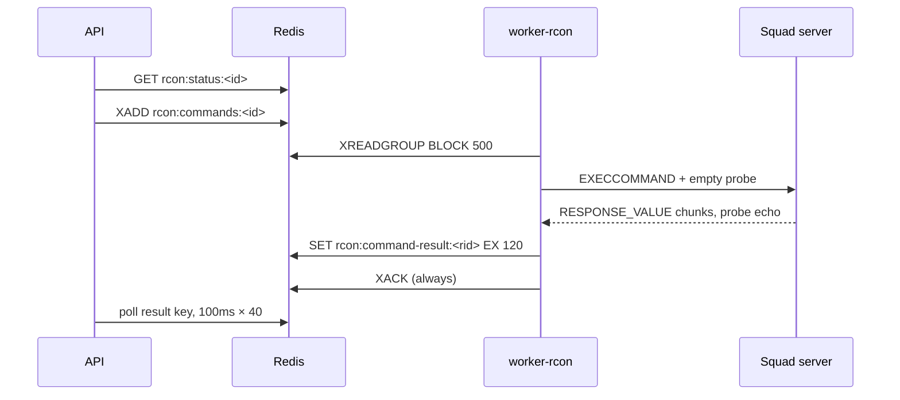

#### worker-log-ingest: acquisition, parsing, the missing checkpoint

**The source is docker logs via the Go bridge, not file tailing.** `tail.ts` calls `bridge.containerLogsFollow({name: 'squad-<serverId>', tail: 100})` over `/run/panel-host-bridge/bridge.sock`; the Go side shells out to `docker logs --follow --timestamps --tail <n>` (`apps/bridge/internal/runner/docker.go:597`). Only `frame.stream === 'stdout'` is consumed; a running buffer splits on `\n` and keeps the partial tail. Bytes/lines per minute are logged at debug every 60 s — the only backpressure *observability*. **There is no backpressure mechanism**: no pause, no queue bound, no drop policy.

One `LogIngestor` per server drives a fixed per-line pipeline: `isBenignNoise()` → `detectSquadFatal()` → `parseLine()` → chat → vote → combat → report → `handleMessage()`. Events carry a **deterministic UUIDv5** over a stable-stringified `{server_id, type, ts, payload}` (`ingest.ts:355-376`) — that is the dedup primitive on which everything downstream rests.

| Parser file | Handles |
|---|---|
| `patterns.ts` | `PREFIX` line grammar; `BEACON_BIND` → `server.ready`; `PLAYER_REMOTE_ADDR` (IP); `PLAYER_JOIN_SUCCEEDED`; `PLAYER_EOS_CONNECTION` → `player.connected`; `PLAYER_DISCONNECT`; `MATCH_STATE_CHANGED`; `RCON_ADMIN_COMMAND`; `SERVER_EXIT_CODE` → `server.stopped`/`server.crashed`; 4 benign-noise regexes; `detectSquadFatal` |
| `chat.ts` | `ChatMessage: <ids> <Name> : ChatAll\|ChatTeam\|ChatSquad\|ChatAdmin : <text>` |
| `report.ts` | `!report <target> <body>` over the chat grammar |
| `combat.ts` | `DAMAGE`, `WOUND`, `DEATH`, `REVIVE`, `VEHICLE_DAMAGE`, `VEHICLE_DESTROY`, `POSSESS`/`UNPOSSESS` (maintains `occupiedVehicleByPlayer` so a kill can be attributed to the attacker's vehicle) |
| `match.ts` | `NEW_GAME` (`Bringing World … up for play`, skipping `transition` maps), `ROUND_TICKETS` |
| `vote.ts` | `VOTE_START` / `VOTE_BALLOT` / `VOTE_END` |

Two pure, per-server stateful assemblers turn line sequences into commands: `MatchAssembler` (`open`/`close`/`close_server_down` with `end_reason` `server_crashed`|`server_restarted`) and `VoteAssembler` (accumulates ballots keyed eos→steam→lowercased name, emits exactly one terminal `record`, downgrading an interrupted vote to `cancelled`). `player.connected` is the hardest case: three lines must be stitched — `AddClientConnection` (IP) → `Join succeeded` (name) → the EOS line (ids) — and both hops must land inside `joinCorrelationWindowMs = 2500`, or the event is dropped.

Per emitted envelope, `index.ts:194-200` runs `persistEventEnvelope` and `publish` **fire-and-forget in parallel**. Higher-level handlers are chained per concern to preserve ordering: `matchChain`, `voteChain`, `combatChain` are serial promise chains; chat/report/identity handlers are unordered. Live-bus frames emitted: `chat.message`, `combat.event`, `combat.vehicle`, `vote.ended`, `report.created`, `banname.matched`, `externalban.matched`, `alert.triggered`.

**Checkpointing is not present.** There is no offset, cursor, or last-seen-timestamp store anywhere in the worker. On restart or a dropped stream the tail restarts with `tail: 100`, and correctness on replay rests entirely on the deterministic event ids plus `onConflictDoNothing` upserts. Rows written outside that path — `chat_messages` has no conflict target — can be duplicated on replay. Two further sharp edges: `combat/store.ts` writes `events.kind` values (`combat_death`, `combat_damage`) that are **not** in `EVENT_TYPES`, bypassing the declared taxonomy; and `player_sessions`, the table `match-roster/store.ts` reads from, is **never written by either worker** — `openPlayerSession`/`closePlayerSession` in `packages/db/src/presence/sessions.ts` have no non-test caller. Since presence-daily, co-play and the leaderboard all derive from `player_sessions`, that is a load-bearing gap.

### 6.5 Analytics and the read-model strategy

All five analytics workers are plain `setInterval` processes whose `index.ts` is env wiring only; the SQL lives in `packages/db/src/{leaderboard,presence,coplay,economy,dossier}`. That split is what makes the aggregations unit-testable without a worker, and it is consistent across all five.

The house pattern is **write-time materialisation into ordinary aggregate tables — explicitly not materialised views** (`packages/db/src/schema/player-bonus-accruals.ts:5-9`). Three distinct update modes coexist:

1. **Delete-then-insert in one transaction** — `recomputeLeaderboardPeriod` rebuilds a fixed 7-descriptor set each tick (today, yesterday, this/last ISO week, this/last month, `alltime` pinned to `1970-01-01`). Each result is emitted twice, once per `server_id` and once as a cross-server rollup with `server_id = NULL`, which is why `player_stat_periods_identity` is declared `.nullsNotDistinct()`. Because `alltime`'s day range is `null`, both filters collapse to empty SQL and the whole of `player_daily_presence`/`matches` is rescanned **every 15 minutes**.
2. **Windowed delete-then-insert** — `presence-daily` recomputes over a 2-day `yesterday..today` window in three stages: explode `player_sessions` into per-UTC-day segments, self-join for co-play (`sa.player_id < sb.player_id`), then `runEconomyAccrual`. Stage 3 reconstructs seeding windows from `events` and **overwrites `player_daily_presence.seed_seconds` that stage 1 just wrote** from `player_sessions.mode = 'seed'` — two definitions of the same column, 20 lines apart.
3. **Fully incremental in-transaction upsert** — the dossier tables only. `worker-log-ingest` calls `applyCombatEventToDossier(tx, …)` on the same transaction that inserts the `combat_events` row, gated on `if (!wasInserted) return;` because the upsert is `kills = kills + 1` with no event-id dedup of its own.

`worker-stats` is the reconcile guard over mode 3 and **writes nothing by design** — rebuilding would erase multi-year dossier history once `combat_events` partitions age out (`stats/src/index.ts:12-17`), so its drift checks are deliberately lower-bound (`s.kills < e.kills`) rather than equality. It has no compose service, so the guard is not deployed.

Caching sits *in front of* the materialised tables: `/api/v1/leaderboards` uses a 60 s Redis TTL and the aggregator actively `SCAN`s and `DEL`s `leaderboard:*` after each recompute. Two exceptions compute **on read**: `/api/v1/analytics/dashboard` and `/api/v1/public/stats` aggregate live over `matches`/`player_sessions`/`player_daily_presence` with a `generate_series` peak-by-hour sampler and no cache at all, and the DOSSIER-4 combat trend aggregates live over `match_players ⋈ matches` behind a 60 s cache.

Three consistency notes that matter operationally: the 15-minute leaderboard tick reads a `seed_seconds` column the 1-hour presence tick rewrites, so a tick landing between presence stages materialises a stale figure; combat reaches the leaderboard via `match_players` but reaches the dossier via `combat_events`, so `player_stat_periods.kills` and `player_weapon_stats.kills` are two independent read models from two independent sources with no guarantee of agreement; and `bonus_points` on the leaderboard is `k × seconds` with **no `/3600`**, while the ledger writes `round(k × seconds / 3600)` — the two economy numbers are ~3600× apart. `'season'` is a legal `period_type` in the schema and both enums, but `periodStartFor` throws for it and no worker ever writes one, so the season leaderboard is permanently empty.

### 6.6 Automation, integration, maintenance

The automation trigger/condition/action model is **entirely declarative and lives in `@squad/shared-types`**, deliberately shared between the worker and the API's dry-run route — `apps/workers/automation/src/rules/engine.ts` and `actions.ts` are pure re-export shims. Conditions are a closed enum (`chat_keyword`, `player_count`, `time_of_day`, `player_flag`); actions likewise (`rcon_command`, `kick`, `warn`, `notify_admin`). `evaluate()` filters by `enabled` and scope (`serverId === null` = global), parses the `condition` jsonb, then the `action` jsonb — **a rule with a corrupt action is silently dropped rather than matched**. Dry-run is a single branch in `runMatch()`:

```ts
if (opts.dryRun) {
  status = 'matched';
  actionResult = { skipped: true, dryRun: true, intent };
} else if (match.actionType === 'notify_admin') { … }
```

Every outcome writes one `automation_runs` row and one `audit_log` row under `actorSystemLabel: 'automation-worker'`. Two architectural quirks: **`chat_keyword` is never evaluated by the automation worker** — chat does not reach the event stream, so it is evaluated inline in `apps/workers/log-ingest/src/automation/chat.ts:91-118` under a different actor label and with no rule cache; and `time_of_day` rules would otherwise fire on *every* envelope, so `runtime.ts:89-96` guards them with `SET automation:tod:<ruleId> NX EX 3600`. The plugin machinery — `PluginRegistry`, manifests, `events:read`/`events:payload` permissions, 5 s `Promise.race` handler isolation — is fully built, but `BUILTIN_PLUGINS` in `loader.ts:11` is an **empty array**.

`worker-discord` is outbound-only: no bot, no gateway, just webhook POSTs. `mapping.ts:14-25` is a *partial* `EventType → DiscordEventType` map (`admin_login`, `drift_detected`, `marked_player_joined` intentionally unmapped). Rate limiting is per-webhook: a 429 waits `Retry-After` → JSON `retry_after` → 1000 ms and does **not** count against `MAX_SEND_ATTEMPTS = 5`, but is capped separately at `MAX_RATE_LIMIT_RETRIES = 5`; other failures use `500 · 2^(attempt-1)`. Webhook URLs are AES-GCM blobs decrypted per send, and the pino logger is wrapped in `createDiscordRedactingStream` so URLs never reach stdout.

`ban-sync` polls due-time-based and sequentially, so a slow source cannot starve others; `fetchBanList` enforces a 30 s `AbortController` timeout and a 20 MB cap checked twice (eagerly on `content-length`, defensively mid-stream). Four adapters dispatch on `format`: `squad_bans_cfg`, `battlemetrics_json`, `json_generic`, `csv`. Merge is a pure diff whose in-memory key mirrors the DB unique index exactly (`steam|eos|issuedAt`); rows absent from a feed get `revoked_at = now()` in one batched update and **`applyMergePlan` never issues a DELETE** — meaning a re-appearing ban un-revokes itself. On success, `INCR` on the cache-version key invalidates log-ingest's in-memory copy.

`clan-guard` enforces protected clan tags in two phases — `AdminWarn` plus a `moderation_actions` row, then a kick only after `gracePeriodSeconds` — with the warn lookup scoped `>= playerSessions.connectedAt` so the grace clock restarts each session, and a hard carve-out: a player whose role has `panelAccess` is **never kicked**, only re-warned. `role-expirer` clears up to 500 expired roles per tick, deletes the player's `sessions` rows plus `session:<id>` Redis keys and publishes `session.revoked` on the live bus so open tabs log out in ≤5 s; its VIP reminder tick fires the smallest crossed window from `economy_settings.vip_expiry_windows_days` and dedups via `ON CONFLICT DO NOTHING RETURNING` on `expiry_notifications`, so a renewal re-arms mechanically because `expires_at` is part of the key. `clan-priority-expirer` deliberately does **not** touch `clan_members.has_priority`, only `clans.priority_expiry_processed`, so extending a window restores priorities with no re-toggling.

`config-sync` is the only consumer of the admins-cfg outbox; on a bridge `state: 'unreachable'` it deliberately **leaves the message unacked** (`index.ts:212-223`) with per-server backoff 5 s → 5 min. `event-partition` is a hand-written `pg_partman` replacement: monthly partitions on `events` (current + next, dropping beyond `EVENTS_RETENTION_MONTHS = 24`) and day partitions on `diagnostic_events` (−1…+2 days, 24 h retention), with the stale check relying on **lexicographic** name comparison that works only because names are zero-padded, and bounds computed in UTC on the documented assumption that production Postgres runs `TimeZone = 'UTC'`. `diag-flush` builds one multi-row parameterised INSERT with `ON CONFLICT (id, ts) DO NOTHING` and then a single `XACK` for all ids — insert-before-ack, so a crash mid-batch replays idempotently.

Two claims in the docs do not survive contact with the code: **the "cold archive of rows older than 90 days" does not exist** — `audit-archiver/src/index.ts:41-46` states verbatim that it defers the restic hash-chain export to Phase 1, and no archive table or retention query exists in `packages/db/src`. And the real backup is not the worker but a Compose service behind `profiles: ['backup']` running `pg_dump -Fc` + `redis-cli --rdb` on `0 3 * * *` with `--keep-daily 7 --keep-weekly 4 --keep-monthly 6`, guarded by a text-assertion regression test in `apps/workers/backup/test/compose-backup.test.ts`.

### 6.7 The RNSquadJS sidecar: a second pipeline running in parallel

Alongside the fleet, the API launches **one RNSquadJS sidecar container per server** (`rnsquadjs-<uuid>`), built from `docker/rnsquadjs.Dockerfile` with the in-repo `panelBridge` plugin compiled *into* upstream at build time — upstream cloned and pinned by SHA, `upstream.patch` applied to add two lines to upstream's static plugin registry. The plugin is a real pnpm workspace member (package name `panel-bridge`) with its own CI job and **zero `@squad/*` imports** — its only dependencies are `ioredis` and `uuid`. Note that `docs/architecture/README.md:51` claims "We do not vendor or fork RNSquadJS"; that statement is stale. The accurate description is a build-time vendored, SHA-pinned dependency.

Mode is one env var, `PANEL_BRIDGE_MODE`, defaulting to **shadow**:

| | shadow | production |
|---|---|---|
| Event stream | `events:server:<id>:shadow` | `events:server:<id>` (the real stream) |
| Status key | `rnsquadjs:status:<id>:shadow` | `rnsquadjs:status:<id>` |
| Types published | all 17 mapped | only 4 (`PRODUCTION_TYPES`) |
| Unix-socket RCON server | not started | `/run/panelBridge/rcon.sock` |

```ts
// docker/rnsquadjs/plugins/panelBridge/src/index.ts:41-46,64
const PRODUCTION_TYPES = new Set([
  'player.connected','player.disconnected','match.started','match.ended',
]);
if (mode === 'production' && !PRODUCTION_TYPES.has(envelope.type)) return;
```

That narrowing is legacy parity only: `eventMap.ts` maps 17 upstream events, but the other 13 strings are absent from `EVENT_TYPES`, so the panel's strict `z.enum` would reject them. Nothing validates the sidecar's output before `XADD` — `eventMap.ts:3-12` re-declares `EventEnvelope` with `type: string` and a non-nullable, non-UUID `server_id`, so the `PRODUCTION_TYPES` set in a *different file* is the only guard. Adding a mapper cannot break production; adding a type to `PRODUCTION_TYPES` silently can.

Crucially, even in production **the sidecar owns only the log-derived event pipeline**. `worker-rcon` is explicitly retained — A2S, tickrate, lag-spike detection, and the `rcon:status:<id>` key the API reads. The sidecar writes a deliberately different status key so it can never clobber the worker's, which also means sidecar status is currently consumed by nothing. Heartbeats go to `worker:heartbeat:rnsquadjs:<id>` (10 s / 30 s TTL), matching the fleet convention.

Desired state is the Redis set `rnsquadjs:cutover-servers`. **No server is in it by default**; the only writer is `POST /api/v1/servers/:id/rnsquadjs {mode:'production'}` (permission `server:stop`, audit `server.rnsquadjs.cutover`). log-ingest's 15 s reconcile calls `dropCutoverServers`, which `SMISMEMBER`s the set and tails only the legacy bucket.

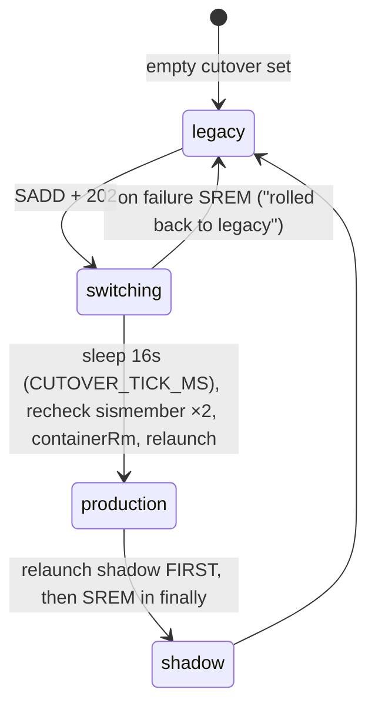

The 16 s constant is one 15 s log-ingest reconcile plus 1 s of margin. It creates a **deliberate half-cutover window**: between the SADD and the relaunch the server has *no* publisher — log-ingest has already dropped the tailer and the production sidecar is not up. The design explicitly prefers a gap over overlapping publishers, which is also why rollback inverts the order. There is no per-server transition lock (a known gap recorded in the decisions log). Launch is only possible through the dedicated bridge RPC `container_run_rnsquadjs`, which hard-codes mounts (logs `:ro`, socket `:rw`, `config.json` `:ro`), `--read-only`, `--user 1001:1001`, `--network host`, `--pull never`, and a five-key env allowlist that blocks `NODE_OPTIONS`/`LD_PRELOAD` injection from a compromised API.

The documented cutover precondition is ≥99 % parity over a 24 h soak, computed by `shadowDiff.compareStreams(prod, shadow)` — matching on `type + JSON.stringify(payload)` with a ±5 s skew tolerance. **It has no production caller**: only the unit test and the operator-run `scripts/rnsquadjs-shadow-diff.mjs`. That script's `SIDE_TYPES` includes `player.name_changed`, which no `eventMap.ts` mapper emits while log-ingest's `index.ts:226` consumes it — so real name-change traffic would put it in `missingTypes` and fail the parity gate permanently.

### 6.8 Confirmed defect: `--timestamps` versus the anchored parser

This is a real, currently-unmitigated correctness risk affecting **every server not explicitly promoted to cutover** — which, given the empty default cutover set, is all of them.

The bridge asks Docker to prefix every line (`apps/bridge/internal/runner/docker.go:597`):

```go
args := []string{"logs", "--follow", "--timestamps"}
```

Docker therefore emits `2026-04-23T11:30:20.485123456Z [2026.04.23-11.30.20:485][ 0]LogGameMode: …`. The RPC handler `containerLogsFollow` JSON-encodes the raw chunk verbatim, doing no rewriting. On the consumer side, `apps/workers/log-ingest/src/tail.ts:38-47` does newline framing and nothing else — `buffer += text`, split on `\n`, `onLine(part)`, wired straight into `ingestor.ingest(line)` at `index.ts:191-193`. A repo-wide grep for timestamp stripping across `apps/workers/log-ingest/src`, `apps/api/src/routes/server-logs.ts` and `apps/api/src/lib/log-export.ts` returns **nothing**.

The parser is anchored at the opening bracket (`apps/workers/log-ingest/src/parser/patterns.ts:21`):

```ts
const PREFIX =
  /^\[(\d{4})\.(\d{2})\.(\d{2})-(\d{2})\.(\d{2})\.(\d{2}):(\d{3})\]\[\s*(\d+)\](Log[A-Za-z0-9_]+): (?:(Display|Verbose|Warning|Error): )?(.*)$/;
```

And so is the diagnostic that was meant to catch exactly this class of failure (`ingest.ts:120-130`):

```ts
const parsed = parseLine(line);
if (!parsed) {
  if (!fatal && this.onParseError && line.startsWith('[')) {
    this.onParseError({ lineSample: line.slice(0, 200), regex: 'PREFIX', … });
  }
  return [];
}
```

An RFC3339-prefixed line fails `PREFIX` **and** fails `startsWith('[')`. It therefore produces zero events *and* zero `onParseError` diagnostics: the one guard that would have surfaced the bug encodes the same unverified anchor assumption it was written to police, converting a loud failure into a silent one. Only the unanchored `SQUAD_ASSERTION_FAILED` pattern still matches, so fatal-crash detection partially survives while all normal ingest dies.

No test covers the real wire format. Every fixture in `apps/workers/log-ingest/test/` is a bare game line (`patterns.test.ts:9`), and `tail.test.ts:56-59` asserts only `'line one'/'line two'/'line three'`. **The unit boundary between bridge and parser is exactly where the bug lives, and it is the one boundary with no end-to-end test.** The consequence is further masked because `server-logs.ts` and `log-export.ts` consume the same stream and also never strip the prefix — the log viewer shows the Docker timestamp, which is cosmetically tolerable and therefore reads as intentional.

| Path | Source | Affected |
|---|---|---|
| `log-ingest` tail (default / legacy) | `docker logs --timestamps` | **Yes — ingests nothing** |
| `panelBridge` sidecar (cutover only) | `SquadGame.log` on disk, mounted `:ro` | No |

The sidecar is immune because `docker/rnsquadjs/entrypoint.sh:5` reads the log **file** directly and never touches `docker logs`. That immunity is the reason the defect can persist unnoticed on a cutover server while silently zeroing ingest on every legacy one. Resolution is one of two one-line changes — drop `--timestamps` at `docker.go:597`, or strip the leading RFC3339Nano token in `tail.ts` before `onLine` — and in either case the `startsWith('[')` gate at `ingest.ts:122` should be widened so an unparseable line is always observable.

---

## 7. The privileged host bridge (`apps/bridge`)

`apps/bridge` is a single-binary Go 1.25 daemon (`panel-host-bridge`) that is the *only* component in the system permitted to touch the host: Docker, `ufw`, `/var/lib/squad-panel`, `/proc`, systemd. Everything else — API, workers — runs in unprivileged containers and asks the bridge. Its dependency surface is deliberately minimal: `apps/bridge/go.mod` requires exactly `github.com/coreos/go-systemd/v22` and `golang.org/x/sys`. No RPC framework, no Docker SDK, no logging library. This is the repo's hardest security boundary, and it is worth reading the code rather than the docs — several docs describe it incorrectly (below).

### 7.1 Process model: socket activation is the access-control boundary

`deploy/panel-host-bridge.service` runs `Type=notify`, `User=root`, `Requires=panel-host-bridge.socket`. The listener is *not* created by the daemon in production — `pickListener()` takes it from `activation.Listeners()` (`cmd/panel-host-bridge/main.go:107`) and only falls back to `PANEL_BRIDGE_SOCK` / `/run/panel-host-bridge/bridge.sock` + `os.Chmod(sock, 0o660)` for local development (`main.go:115-127`).

The real permission model lives in `deploy/panel-host-bridge.socket`:

```ini
ListenStream=/run/panel-host-bridge/bridge.sock
SocketMode=0660
SocketUser=root
SocketGroup=panel
PassCredentials=yes
Accept=no
RemoveOnStop=yes
```

`0660 root:panel` means: filesystem membership in the `panel` group is the primary gate; the daemon's own peer check is the second. `deploy/panel-host-bridge.tmpfiles.conf:8` pre-creates `/run/panel-host-bridge` as `0750 root:panel`, and the comment records why the *directory* rather than the socket file is bind-mounted into consumers: mounting the file froze consumer containers on a stale inode across bridge restarts.

The unit's sandbox is aggressive — `UMask=0077`, `NoNewPrivileges`, `ProtectSystem=strict`, `PrivateDevices`, `MemoryDenyWriteExecute`, `CapabilityBoundingSet=CAP_NET_ADMIN`, `SystemCallFilter=@system-service` minus `~@debug @mount @swap @reboot @obsolete @cpu-emulation @raw-io`, and an explicit `ReadWritePaths=` allowlist. `ProcSubset=all` is pinned with a comment noting that `ProcSubset=pid` silently zeroes `host_info`/`host_metrics`. **Caveat worth internalising:** the checked-in unit is not what runs. `scripts/install-host-bridge.sh:172-195` generates a drop-in that supplies `PANEL_DEPOT_HOST_PATH` and `PANEL_BACKUP_DUMP_ROOT`, sets `ProtectHome=no`, and adds `CAP_DAC_READ_SEARCH`/`CAP_DAC_OVERRIDE`. The deployed sandbox is materially weaker than the repo suggests. `PANEL_COMPOSE_DIR` is documented (`docs/operations/deployment.md:252`) but never written by the installer. Liveness is `WatchdogSec=30s` against a 10 s `SdNotify` loop (`main.go:130-139`).

### 7.2 Wire protocol

`internal/rpc/frame.go`: 4-byte big-endian length prefix, then a JSON payload, `MaxFrame = 16 << 20` (16 MiB), enforced on both read and write. It is **not** JSON-RPC — no `jsonrpc` field, no batching, no notifications, and **no protocol version field or negotiation**. The only version signal is the build-stamped string returned by `ping` (`internal/handlers/handlers.go:221`).

```go
type Request     struct { ID string; Method string; Params json.RawMessage }
type Response    struct { ID string; OK bool; Result json.RawMessage; Error *ErrorObject }
type StreamFrame struct { ID string; Stream string; Data json.RawMessage } // stdout|stderr|event
```

Streaming methods interleave `StreamFrame`s on the same socket ahead of the terminal `Response`; correlation is by `ID` alone. Five error codes exist (`internal/rpc/types.go:40`): `forbidden`, `invalid_args`, `runtime_error`, `timeout`, `internal` — and `timeout` is **never produced** by the bridge.

### 7.3 Peer authentication — `ResolvePeer`, and why `group_add` fails

`ResolvePeer` (`internal/auth/peer.go:35`) reads `unix.Ucred` via `getsockopt(SO_PEERCRED)` and then applies two membership tests against `user.LookupGroup("panel")`:

1. **Primary-GID compare** (`peer.go:70`) — `strconv.FormatUint(uint64(creds.Gid),10) == target.Gid`.
2. **Supplementary fallback** (`peer.go:80-94`) — `u.GroupIds()`, where `u` came from `user.LookupId(creds.Uid)` at `peer.go:54`.

The second test is not what it looks like. `unix.Ucred` carries only `Pid`, `Uid`, `Gid`; **the kernel never transmits the peer's supplementary group set over `SO_PEERCRED`**. So `GroupIds()` does not read the caller's credentials at all — it queries *the bridge host's own* `/etc/passwd` + `/etc/group` for whatever username `creds.Uid` maps to.

That is exactly why `group_add` does not work for compose services. A container declaring `group_add: [987]` still presents `uid=0, gid=0` on the socket. The primary compare fails (`0 != 987`); the fallback resolves UID 0 against the *host's* passwd to `root` and enumerates *host root's* groups, which do not contain `panel`. The container's real supplementary set is invisible. Result: `ErrUntrustedPeer` (`peer.go:96-102`), logged as `rejected untrusted peer … uid:0, user:root`. Hence the five copies of `user: "0:${PANEL_GID:-987}"` in `docker-compose.yml` (`:86`, `:134`, `:162`, `:321`, `:372`), four of them carrying the comment "this MUST be `user: \"0:<panel-gid>\"`, never `group_add: [<panel-gid>]`". **The compose comment is correct; the docs' explanation is not.** `docs/components/bridge/configuration.md:38`, `docs/operations/troubleshooting.md:39` and `docs/architecture/decisions.md:223` attribute the failure to supplementary groups being "not visible across the user-namespace boundary" — the true reason is narrower and namespace-independent. A container running as a *host-known* non-root UID that is in `panel` would in fact pass via the fallback, which the docs' phrasing denies. The fallback's real purpose is the host-CLI operator case: `sudo usermod -aG panel $USER`.

Two further defects, both verified:

- **Nil-pointer panic on three branches.** `ResolvePeer` returns a nil `*Peer` on `SyscallConn` (`peer.go:38`), `Control` (`peer.go:47`), and `getsockopt` (`peer.go:50`) failure, but `main.go:158-161` dereferences `peer.UID`/`peer.User`/`peer.PID` on the error path. The two *expected* failures — group-lookup failure (`peer.go:61`) and `ErrUntrustedPeer` — both return a populated `*Peer`, which is why this has never fired in the routine reject path. `serveConn` does run in its own goroutine (`main.go:96-99`), but it has no `recover()`; the only recover in the bridge is in the dispatcher, downstream of this code. An unrecovered panic in that goroutine takes down the whole daemon.
- **The function is untested.** `internal/auth/peer_test.go` contains only `TestErrUntrustedPeerSentinel`, `TestPeerGroupDefault`, `TestPeerStructZeroValue`. Neither membership path nor any nil branch is exercised over a real socket pair. The most security-relevant function in `apps/bridge` has no behavioural test.

Finally: `Handle` applies **no per-method authorization**. Any peer that clears `ResolvePeer` can invoke all 30 methods, including `container_run`, `ufw_rule`, `file_write`, `backup_restore` and `host_agent_restart`. All business-level authorization lives in `apps/api`'s RBAC gate; the bridge is a binary trust decision.

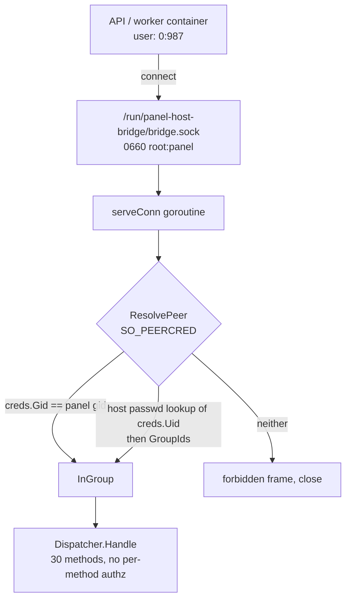

### 7.4 The 30 RPC methods

Two hand-maintained definitions: `BRIDGE_METHODS` (`packages/shared-config/src/bridge-methods.ts:1-31`) and the flat `switch req.Method` in `apps/bridge/internal/handlers/handlers.go:128-189`. Both currently hold exactly 30 entries, in *different orders*. ★ marks the 6 streaming methods (`BRIDGE_STREAMING_METHODS`, `bridge-methods.ts:36-43`).

| Capability | Methods | Privileged action / gate |
|---|---|---|
| **Host info** (4) | `ping`, `host_info`, `host_metrics`, `process_info` | `/etc/os-release`, `/proc/{cpuinfo,stat,meminfo,net/dev}`, `statfs`, `docker --version`. No validation; `process_info` checks only `pid > 0`, so **any host PID is readable** |
| **Files** (5) | `file_read`, `file_read_tail`, `file_read_stream`★, `file_write`, `file_atomic_write` | `validateReadablePath` / `validateWritablePath` (`handlers.go:818-842`); `fsx` re-validates; 10 MiB cap; tail clamped to 1 MiB, stream chunk to 8 MiB |
| **Directories** (2) | `directory_delete`, `list_panel_dirs` | `validateDeletableDir` (`handlers.go:471`) accepts *exactly* `<configs\|saved>/{uuid}`; `list_panel_dirs` takes no path |
| **Logs** (2) | `squad_log_list`, `squad_log_retention_sweep` | list filters `SquadGame*.log`; sweep takes **no path param by design** — only `archive_server_ids[]`, each `validate.ServerUUID`, with `DisallowUnknownFields` |
| **Containers** (9) | `list_squad_containers`, `container_run`, `container_run_rnsquadjs`, `container_start`, `container_stop`, `container_rm`, `container_inspect`, `container_stats`, `container_logs_follow`★ | `validate.ContainerName` (three regexes); `container_run` gates image, mounts, depot volume; `ps` output re-validated against `serverContainerRegex` |
| **Depot / Docker** (2) | `depot_update`★, `docker_prune`★ | ensures `squad-depot` volume + generated job name; prune is `docker system prune -a -f --filter label!=panel.preserve=true`, volumes deliberately spared |
| **UFW** (1) | `ufw_rule` | `UFWAction`∈{add,remove}, `UFWProto`∈{tcp,udp}, port 1024–65535; **`comment` unvalidated** |
| **Backup** (3) | `backup_snapshots`, `backup_run`★, `backup_restore`★ | `composeDir()` must be set and absolute; restore is destructive and gated by `validate.ResticSnapshotID` |
| **Agent / disk** (2) | `panel_disk_usage`, `host_agent_restart` | `du -sb` + `statfs` + `docker system df -v` behind a 5-min cache; restart execs `systemctl restart panel-host-bridge.service` with **no validation and no authorization** |

Unknown methods return `invalid_args: unknown method: …` (`handlers.go:190`).

**Contract sync is convention, not machinery.** `packages/shared-config/test/bridge-methods.test.ts:24` asserts `BRIDGE_METHODS` against a second hardcoded TypeScript array — the same 30 strings retyped. It never reads Go. `grep -rn "BRIDGE_METHODS" --include=*.go` returns nothing; nothing parses `handlers.go`. Adding a `case` in Go without touching TS (or vice versa) leaves both builds green. The test is a review tripwire, not a cross-language contract. Add `FakeBridge` (`apps/api/test/integration/harness.ts:134-137`) and you have four hand-maintained mirrors of one list.

### 7.5 The validation layer

`internal/validate` is where the security actually lives — not in quoting. `internal/runner/runner.go` builds every command with `exec.CommandContext(ctx, cmd, args...)`, one `argv` element per argument, so **no shell parses docker or ufw arguments** and metacharacters are inert. Only two paths reach an interpreter: `BackupSnapshots` passes a constant `-c "restic snapshots --json"` to `/bin/sh` inside the container (`runner/docker.go:750`, no interpolation), and `BackupRestore` execs `bash` on a script path derived from `composeDir()` (`docker.go:808`) — which is precisely why `ResticSnapshotID` exists, with a comment saying so (`validate/docker.go:82-88`).

The image allowlist is the sharpest piece of design here:

```go
// RNSquadJSImage is deliberately absent: the sidecar image is launchable
// ONLY via container_run_rnsquadjs, which hardcodes the image and applies
// sidecar-specific hardening (read-only rootfs, uid 1001, isolated socket
// subdir). Allowing it here would let a compromised API container launch
// the sidecar image with squad-server mounts and bypass that hardening.
allowedImages = map[string]struct{}{ ServerImage: {}, DepotInitImage: {} }
```

(`validate/docker.go:30-39`, with a negative test at `docker_test.go:156`.) That is why `container_run_rnsquadjs` is a separate RPC rather than a parameter: it hardcodes the image, enforces `rnsquadjsContainerRegex`, and applies the `allowedSidecarEnv` allowlist — exactly `SERVER_ID`, `LOG_FILE`, `PANEL_BRIDGE_MODE`, `PANEL_BRIDGE_SOCKET`, `REDIS_URL` (`runner/docker.go:153-159`) with control-character and `=`-in-key rejection.

Its directory setup is the most carefully hardened code in the repo — fd-anchored and TOCTOU-proof (`runner/docker.go:258-282`), `Mkdirat` + `Openat(O_NOFOLLOW|O_DIRECTORY)` + `Fchmod`/`Fchown`, with ELOOP/ENOTDIR mapped to `validate.ErrForbidden`.

**And that makes the `fsx` gap conspicuous.** `validate.Path` (`validate/paths.go:21`) is purely lexical: absolute, `filepath.Clean`, no NUL byte, prefix-match against `readableRoots` (`/var/lib/squad-panel` plus `DepotHostPath()`) or `writableRoots` (panel root only — depot stays read-only so game binaries cannot be mutated). Traversal via `..` is defeated by `Clean` before the prefix test, and `PanelConfigFilePath` further narrows writes to a 19-entry `allowedCfgFiles` map plus a `.cfg` name regex. But there is **no symlink defence anywhere in `internal/fsx`** — no `O_NOFOLLOW`, no `EvalSymlinks`, no `Lstat`, and no symlink case in `fsx_test.go`. Anyone able to plant a symlink inside a server's `ServerConfig/` directory can steer a root-privileged `file_write` outside the root. Two packages away, `ensureSidecarDir` defends exactly this.

Two smaller notes on `container_run`: ports are formatted with `%d` from typed ints, so they are injection-inert despite being unvalidated; `extra_args` are appended to `squadArgs` *after* `spec.Image` (`runner/docker.go:118`), so they land in the container's command line, not among Docker flags — they cannot inject `-v` or `--privileged`.

### 7.6 Concurrency and timeouts

One goroutine per connection (`main.go:96-99`, tracked by a `WaitGroup`) and one goroutine per request within a connection (`main.go:236-240`), with a `writeMu` keeping frames aligned and a shutdown watcher that closes the conn on `ctx.Done()` so the blocking `ReadFrame` unblocks — the comment explains this exists because the API holds the connection open across restarts and the unit otherwise sat in `deactivating` for the full `TimeoutStopSec`. Shared state is mutex-guarded (`MetricsCache.mu`, `panelDiskCacheMu`).

There is **no per-request timeout, no deadline, no concurrency cap, and no rate limiting anywhere in the daemon.** A `grep` for `WithTimeout|SetDeadline|Limiter|semaphore` across non-test Go yields one hit: the 2 s guard around `docker --version` (`internal/metrics/host.go:432`). A caller can open unbounded `container_logs_follow` streams; the only backpressure is client-side.

Error classification is done by `isForbidden(err) = strings.Contains(err.Error(), "forbidden")` (`handlers.go:1287`) rather than `errors.Is(err, validate.ErrForbidden)` — fragile, since any error whose text happens to contain "forbidden" (a Docker HTTP 403, say) gets reclassified. `Handle` wraps everything in `defer recover()`, converting panics into `internal` responses plus a `bridge.panic` diag event.

Logging is two-track: `slog` JSON to stderr plus `handlers.DiagLog`, which emits flat JSON lines tagged `DIAG_EVENT=1` for a journald forwarder — deliberately avoiding Redis in the privileged process ("keeps the attack surface minimal", `handlers.go:41`). Only five diag kinds exist: `bridge.signal.sigterm`, `bridge.client.connected`, `bridge.client.disconnected`, `bridge.panic`, `bridge.host_agent_restart`. **There is no per-method audit record** — a `ufw_rule`, `directory_delete`, `container_run` or `backup_restore` leaves no trace on the bridge side. The audit trail exists only in the API's database, which means an attacker who reaches the socket directly is invisible.

### 7.7 The TypeScript client

`packages/bridge-client` (858 lines across `client.ts` 492, `types.ts` 323, `frame.ts` 40, `index.ts` 3) is the only other implementation of the protocol. It dials with raw `node:net` (`client.ts:121`, `createConnection({ path })`), frames identically, and duplicates the 16 MiB cap as `BRIDGE_MAX_FRAME_BYTES` (`shared-config/src/bridge-methods.ts:46`). `decodeFrames` (`frame.ts:25-40`) is a pure `{frames, remainder}` function; the client keeps a `Buffer` and re-feeds the remainder, so split frames reassemble.

There is **no connection pool and no reconnect backoff** — a single optional `socket` plus a `connecting` promise coalescing parallel dials. `callImpl` reconnects lazily (`if (!this.socket) await this.connect()`, `client.ts:352`); socket death just clears the field and the next call re-dials. `close()` sets `closed = true` permanently, which is why long-lived streams use throwaway clients from `app.makeBridgeClient()`.

Correlation is a UUIDv7 `id` into `pending: Map<string, PendingCall>`; one socket is fully multiplexed, and stream frames are distinguished structurally (`if ('stream' in obj)`, `client.ts:445`) rather than by a type tag. Unknown ids are dropped silently. Timeouts are per-call `setTimeout` guarded by `Number.isFinite`, forming a de-facto latency budget: 15 s default, 10 s for inspect/stats, 30 s for start/rm/disk-usage, 60 s for `container_run`/`directory_delete`/`backup_snapshots`, 120 s for `container_stop`, 600 s for `docker_prune`/`file_read_stream`, 3 600 s for `depot_update`/`backup_run`/`backup_restore`, and `Infinity` for `container_logs_follow` — which registers no timer at all, so a wedged bridge leaks the pending entry indefinitely.

Retries are an explicit idempotency gate:

```ts
const maxAttempts = opts.retryOnTransport && !opts.onStream ? 2 : 1;
```

(`client.ts:306`.) Only `code === 'transport'` retries, at most once, after destroying the dead socket. Note the asymmetry: `fileAtomicWrite` retries, plain `fileWrite` does not — atomicity is what makes retry safe. `host_agent_restart` is explicitly asserted not to retry.

`BridgeErrorCode` is `forbidden | invalid_args | runtime_error | timeout | internal | transport`; the first five mirror `rpc/types.go:41-45`, and `transport` is synthesized client-side for connect/write/close/decode failures. **`BridgeError` is exported and richly typed, and `grep -rn "BridgeError"` across `apps/` and other packages returns zero hits** — no consumer branches on `.code`; callers use bare `try/catch` and generic HTTP 502s (`apps/api/src/routes/host-actions.ts:93-96`). Likewise, `zod` is declared as a production dependency of `packages/bridge-client` and never imported: responses are unchecked casts (`resolve: (v) => resolve(v as Result)`). Method-name drift therefore surfaces loudly as `invalid_args`, but *field* drift is silently `undefined` at the call site — handled only by convention, e.g. the comment on `ContainerInspectResult.oom_killed?` ("Older bridge builds omit the field entirely; consumers must default to `false`", `types.ts:204-210`).

Coverage is strong where it exists: 1 572 test lines against 858 source lines, driven by a **real `node:net` server on a temp UNIX socket** rather than mocks, with 100% line/function/branch thresholds. `apps/api/test/e2e/bridge-rpc.e2e.test.ts` is the only test that talks to the real daemon, and it is quarantined under `test/e2e/` because it needs the socket. On the Go side, 167 `Test*` functions with no fuzz targets, standard-library `testing` only, built around a `runner.Fake` that captures and asserts exact argv — but `package.json` no-ops the script off Linux, so on macOS **the entire bridge suite silently skips**.

### 7.8 Degraded mode in the API

`apps/api/src/plugins/bridge.ts` decorates one shared `app.bridge` plus a `app.makeBridgeClient()` factory, forwarding all four client events into the diagnostics bus including an RTT SLO (`RTT_OUTLIER_THRESHOLD_MS = 50` → `bridge.rtt.outlier`).

`apps/api/src/plugins/bridge-heartbeat.ts` pings every `HEARTBEAT_INTERVAL_MS = 5_000` behind an `inFlight` guard and publishes **edge-triggered** `bridge.connection` live-bus events (`{state:'up'|'down', down_for_s}`) only on transitions. Because the client reconnects lazily, this heartbeat *is* the reconnect driver after a bridge restart.

**There is no circuit breaker** — no breaker, no half-open state, no backoff in either the client or `apps/api/src`. The nearest analogue is per-server failure counting in the status reconciler: `bridgeFailures: Map<string, number>` with log damping at `next === 5 || next === 30 || next % 60 === 0` and an explicit no-write policy — on bridge failure the DB status is left untouched rather than marked down (`plugins/status-reconciler.ts:171-186`), surfaced as `bridge_failures_by_server` in reconciler stats. Degraded mode otherwise means readiness only: `/ready` probes the bridge alongside Postgres and Redis and returns 503 `{status:'degraded', checks}` (`plugins/health.ts:26-33`); `/health` never touches the bridge. Dedicated throwaway clients are used wherever a stream must tear down independently — log download (`routes/server-log-files.ts:72`), live logs (`server-logs.ts:65`), depot update (`routes/depot.ts:102`), prune (`host-actions.ts:81`, `lib/auto-prune.ts:27`) — each with `finally { await client.close().catch(() => undefined); }`.

One client-side bug that is not covered by any test: `this.buffer` is cleared only on the frame-decode-error path (`client.ts:399`), not on `sock.on('close')` or `close()`. A socket that dies mid-frame leaves partial bytes that get prepended to the *next* connection's stream, producing a spurious decode error on reconnect — precisely the path the heartbeat exercises.

---

## 8. Data architecture (`packages/db`)

`@squad/db` is the single source of schema truth for the whole monorepo. Nothing else in the repo declares a table, and every service — API, all 19 workers, the migrator container — imports its Drizzle types from here. The package is Drizzle ORM 0.45 over the `postgres` (postgres.js) 3.4 driver, `type: module`, dual-exported (`.` and `./schema`) with a `development` condition pointing at raw `src/*.ts` so apps run un-built in dev.

The measured shape of the package:

| Metric | Value | How to reproduce |
|---|---|---|
| `.ts` files in `packages/db/src/schema/` | 71 | `ls packages/db/src/schema/*.ts \| wc -l` |
| Schema modules (all but the barrel) | 70 | every file except `index.ts` |
| `pgTable(` call sites = physical tables | **83** | `grep -rho 'pgTable(' packages/db/src/schema/*.ts \| wc -l` |
| Applied migrations in `packages/db/drizzle/` | **79** | `.sql` count == 79 `idx` entries in `meta/_journal.json` |
| Un-applied DDL copies in `packages/db/sql/` | 10 | test/orchestrator fixtures, see §8.9 |

Twelve modules declare more than one table (`discord.ts` declares three: `discord_integration`, `discord_webhooks`, `discord_message_templates`), which is why 70 modules yield 83 tables — the grouping rule is one module per bounded context, not one per table. `packages/db/src/schema/index.ts` is a pure barrel: 70 `export *` lines, zero declarations, no orphans.

A warning for anyone counting by hand: `grep 'pgTable'` without the paren returns **153**, because it also counts the import specifier in each of the 70 modules. That artifact has already propagated into at least one internal note. 83 is the table count.

### 8.1 The domain model by bounded context

| Context | Tables | Purpose |
|---|---|---|
| **Identity / RBAC** (7) | `players`, `roles`, `role_permissions`, `role_squad_permissions`, `sessions`, `player_api_tokens`, `panel_meta` | `players` is the identity anchor (`id uuid`, `steam_id64 bigint`, `canonical_name` + normalized form, `eos_id`, `battle_eye_guid`, `steam_eos_conflict`, `last_known_ip inet`, `role_id`, `role_expires_at`, `bonus_balance`). `roles` carries 13 boolean capability columns (`panel_access`, `can_view_ips`, `can_manage_economy`, …); the two `role_*_permissions` tables are composite-PK key/value grants. `panel_meta` is the bootstrap singleton (`first_owner_claimed`, `roles_seeded`, `setup_completed`). |
| **Servers / config** (14) | `servers`, `server_settings`, `server_credentials`, `config_versions`, `layers`, `vehicle_catalog`, `rotation_schedule`, `rotation_profiles`, `seed_schedule`, `seed_subscriptions`, `scheduled_tasks`, `scheduled_task_runs`, `map_vote_candidates`, `map_vote_picks` | `server_settings` and `server_credentials` are true 1:1 — their PK *is* `server_id`. Settings hold ports, cgroup limits (`cpu_weight`, `memory_max_mb`, `io_weight`), seeding thresholds and map-vote config; credentials hold `rcon_password_encrypted bytea`, `license_key_encrypted bytea`, `key_version`. `config_versions` is an immutable, self-referencing (`parent_version_id`) file history with a `sha256 bytea`. |
| **Player auxiliary** (8) | `player_name_history`, `player_ip_history`, `player_notes`, `player_marks`, `mark_types`, `player_links`, `alt_ignored_ips`, `alt_detection_settings` | `player_ip_history` is geo-enriched (`country_code`, `latitude`, `observation_count`). `mark_types` is bilingual (`label_en`/`label_ru`, `severity`). `player_links` is the alt/twink graph. |
| **Sessions / presence** (4) | `player_sessions`, `player_daily_presence`, `player_coplay`, `coplay_settings` | `player_sessions.mode` ∈ online/boost/queue/seed with a `closed_reason`. `player_daily_presence` is PK `(player_id, day, server_id)` with per-mode second counters. `player_coplay` is undirected pair × server × day overlap. |
| **Matches / events / combat** (12) | `matches`, `match_players`, `combat_events`, `events`, `processed_events`, `game_votes`, `game_vote_ballots`, `player_weapon_stats`, `player_vehicle_stats`, `player_vehicle_kills`, `player_kit_time`, `player_stat_periods` | `events` is the generic event log, `processed_events` its consumer-idempotency ledger. `combat_events` is the high-volume kill/damage stream. The `player_*_stats` tables are incrementally-maintained dossier aggregates (§8.4). |
| **Chat** (3) | `chat_messages`, `chat_flag_rules`, `chat_command_invocations` | `chat_messages.scope` ∈ all/team/squad/admin/broadcast/direct, plus `is_flagged` / `matched_rule_id`. |
| **Moderation / bans** (9) | `moderation_actions`, `banned_name_rules`, `external_ban_sources`, `external_bans`, `banlist_publication_settings`, `player_reports`, `report_evidence`, `reporter_stats`, `whitelist_applications` | `moderation_actions` is the ledger of record; its author is a player *or* a system label, and it points at `players` three times (`player_id`, `author_player_id`, `reverted_by`). |
| **Clans** (3) | `clans`, `clan_members`, `clan_guard_settings` | `clan_members` has a composite PK but *also* `clan_members_player_unique_idx` on `player_id` alone — a player belongs to at most one clan. |
| **Economy / leaderboards** (6) | `economy_settings`, `bonus_transactions`, `player_bonus_accruals`, `vip_tiers`, `vip_lifecycle_events`, `expiry_notifications` | `economy_settings` holds the `k_online`/`k_boost`/`k_seed` multipliers and a `privilege_costs jsonb`. `bonus_transactions` is an append-only ledger. |
| **Integrations** (10) | `discord_integration`, `discord_webhooks`, `discord_message_templates`, `message_templates`, `media_files`, `alert_rules`, `alert_events`, `automation_rules`, `automation_runs`, `geoip_settings` | `automation_rules` is the "if condition → then action" engine; `automation_runs` its execution log with a `matched jsonb`. |
| **Audit / diagnostics / issues** (6) | `audit_log`, `diagnostic_events`, `issues`, `issue_comments`, `issue_labels`, `issue_label_links` | `audit_log` is hash-chained (`prev_hash`/`row_hash bytea`, §8.6). `issues` carries the only generated column in the schema. |
| **Outbox** (1) | `admins_cfg_sync_outbox` | Transactional outbox for admin-config pushes: `server_id`, `payload jsonb`, `relayed_at`, `stream_id`, with a partial index over pending rows. |

Six of these are **settings singletons** sharing one idiom — `id smallint PK default 1` plus `CHECK (id = 1)`: `panel_meta`, `coplay_settings`, `banlist_publication_settings`, `economy_settings`, `alt_detection_settings`, `clan_guard_settings`.

### 8.2 Relationship structure

Three hubs dominate. `players.id` is by far the most-referenced column: nearly every table carries either a *subject* FK (`player_id`, almost always `onDelete: 'cascade'`) or an *actor* FK (`created_by`, `author_player_id`, `updated_by_player_id`, almost always `onDelete: 'set null'`). That split is the schema's most consistent rule — subject rows die with the player, provenance rows survive as anonymous. `servers.id` anchors config, scheduling, matches, sessions, chat and the outbox. `matches.id` is comparatively thin: only `match_players` and `map_vote_picks` reference it.

```mermaid
erDiagram
    players ||--o{ player_sessions : "player_id (cascade)"
    players ||--o{ match_players : "player_id (cascade)"
    players ||--o{ chat_messages : "player_id (cascade)"
    players ||--o{ moderation_actions : "subject/author/reverted_by"
    players ||--o{ player_notes : "player_id"
    players ||--o{ bonus_transactions : "player_id"
    players ||--o{ player_daily_presence : "player_id"
    players ||--o{ player_stat_periods : "player_id"
    players ||--o{ sessions : "player_id"
    players ||--o{ player_api_tokens : "player_id"
    players ||--o{ clan_members : "player_id (unique)"
    players ||--o{ player_reports : "reporter/target/handler"
    players }o--o| roles : "role_id (set null)"
    roles ||--o{ role_permissions : "role_id (cascade)"
    roles ||--o{ role_squad_permissions : "role_id (cascade)"
    servers ||--|| server_settings : "server_id IS the PK"
    servers ||--|| server_credentials : "server_id IS the PK"
    servers ||--o{ matches : "server_id (cascade)"
    servers ||--o{ player_sessions : "server_id (cascade)"
    servers ||--o{ chat_messages : "server_id (cascade)"
    servers ||--o{ combat_events : "server_id (cascade)"
    servers ||--o{ config_versions : "server_id (cascade)"
    servers ||--o{ admins_cfg_sync_outbox : "server_id"
    servers }o--o| config_versions : "deletion_backup_marker_id"
    matches ||--o{ match_players : "match_id (cascade)"
    combat_events }o--o| players : "attacker/victim"
    clans ||--o{ clan_members : "clan_id (cascade)"
    player_reports ||--o{ report_evidence : "report_id"
    audit_log }o--o| players : "actor_player_id"
    audit_log }o--o| player_api_tokens : "actor_token_id"
```

The one FK **cycle** is `servers.deletion_backup_marker_id → config_versions.id` against `config_versions.server_id → servers.id`. It is the only place in the schema needing Drizzle's lazy column annotation (`packages/db/src/schema/servers.ts:33-36`):

```ts
deletionBackupMarkerId: uuid('deletion_backup_marker_id').references(
  (): AnyPgColumn => configVersions.id,
  { onDelete: 'set null' },
),
```

Two tables model undirected player pairs with a canonical-order check — `player_links` (`sql\`${table.playerAId} < ${table.playerBId}\``, `player-links.ts:56-59`) and `player_coplay` (`player-coplay.ts:49`).

### 8.3 Drizzle idioms and conventions

**`pgEnum` appears nowhere.** Every enumeration is `text` plus a `check()` constraint, paired with an exported `as const` tuple and a derived union type; `player-sessions.ts:16-20` (`CLOSED_REASONS`, `SESSION_MODES`) is the canonical form. Some columns additionally narrow with `.$type<…>()` (`rotation-schedule.ts:30`, `scheduled-tasks.ts:74`, `chat-commands.ts:40`), but inconsistently — `matches.winner` and `chat_messages.scope` have checks and no `$type`. The cost is that widening an enum is an `ALTER … DROP CONSTRAINT / ADD CONSTRAINT` migration (`0092_vip_expiry_reminders.sql` does exactly that to `alert_rules_type_chk`).

**`relations()` also appears nowhere.** `client.ts` still passes `{ schema }` to `drizzle()`, so `db.query.*` works and is used ~105 times across the repo — but *zero* call sites use `with:`, which is precisely the subset that functions without declared relations. All joins in `apps/api/src` are explicit `innerJoin`/`leftJoin`.

**Composite PKs serve two distinct roles.** Genuine junction keys (`match_players`, `role_permissions`, `clan_members`, `issue_label_links`, `seed_subscriptions`, `player_daily_presence`), and *partition-compatible* keys: `player_sessions`, `chat_messages`, `combat_events`, `events`, `diagnostic_events` and `bonus_transactions` all fold their time column into the PK because the physical tables are RANGE-partitioned. Drizzle has no partitioning DSL, so the TS schema silently under-describes the physical model — the partitioning exists only in hand-written SQL.

**Partial and expression indexes carry real semantics**: `uniqueIndex(...).where(sql\`deleted_at IS NULL\`)` gives soft-delete-aware uniqueness and enables slug reuse (`servers.ts:41-43`, `clans.ts:44-46`); `external_bans_dedup_key` indexes over `coalesce()` expressions; `player_stat_periods` uses `UNIQUE NULLS NOT DISTINCT (player_id, server_id, period_type, period_start)` because `server_id IS NULL` means "all-servers rollup"; and `bonus_transactions_accrual_idempotency_idx` is a partition-key-aware unique index that makes accrual idempotent. Four BRIN indexes with `pages_per_range = 32` cover the monthly time-series tables; three GIN indexes cover trigram search (`chat_messages.message`, `player_notes.body`) and full text.

Exactly one **generated column** exists, via a `customType` shim because Drizzle has no native tsvector (`packages/db/src/schema/issues.ts:15-38`):

```ts
const tsvector = customType<{ data: string }>({ dataType() { return 'tsvector'; } });
searchVector: tsvector('search_vector').generatedAlwaysAs(
  (): SQL =>
    sql`to_tsvector('simple', coalesce(${issues.title}, '') || ' ' || coalesce(${issues.body}, ''))`,
),
```

`jsonb` spans 15 modules / 25 columns, split between opaque payloads (`events.payload`, `audit_log.before_snapshot`, `automation_runs.matched`) and typed config (`.$type<PrivilegeCostCatalog>()` at `economy-settings.ts:32`, `.$type<LayerTeams>()` at `layers.ts:56`).

Naming and typing are otherwise disciplined: `snake_case` in SQL / `camelCase` in TS, always spelled explicitly; timestamps uniformly `timestamp(…, { withTimezone: true, mode: 'date' })` with no naked `timestamp` anywhere; day-granular columns `date(…, { mode: 'string' })`. Every module ends with the same pair — `export type XRow = typeof x.$inferSelect; export type NewX = typeof x.$inferInsert;` — the one convention followed without exception. There are **no branded ID types**; every id is a plain `string`.

Where the conventions break is worth knowing before you write a join:

1. **`steam_id64` is typed three ways.** `players.steamId64` is `bigint({ mode: 'bigint' })` (`players.ts:21`), `whitelist_applications.steamId64` is `bigint`, but `external_bans.steamId64` is **`text`** (`external-ban-sources.ts:74`). Joining imported ban lists to players requires a cast.
2. **`combat_events.match_id` is `bigint` with no FK while `matches.id` is `uuid`** (`combat-events.ts:34` vs `matches.ts:18`). Those types can never join; the match link is effectively dead.
3. **`players.steamId64` is nullable yet has a plain, non-partial unique index** (`players.ts:45`) — unlike the sibling `eos_id` index two lines below, which is explicitly partial. It works (Postgres permits multiple NULLs) but the asymmetry looks unintentional.
4. **The `bytea` `customType` shim is copy-pasted verbatim in seven files** (`audit-log.ts:18`, `external-ban-sources.ts:16`, `config-versions.ts:15`, `discord.ts:13`, `server-credentials.ts:4`, `geoip-settings.ts:3`, plus the `cidr` variant in `alt-detection.ts:16`) instead of living in a shared module.
5. **Schema files carry seed data.** `layers.ts` is 277 lines, mostly a `LAYERS_SEED` array with a `LAYERS_SEED_DEPOT_VERSION = 'v7.5'`; `vehicle-catalog.ts` embeds a bilingual catalogue. Schema and reference data are not separated.
6. **Two unenforced links**: `expiry_notifications.role_id` is a bare `uuid` with no `.references(roles.id)` (`expiry-notifications.ts:43`), and `diagnostic_events.actor_player_id` is FK-less (`diagnostic-events.ts:23`) — the latter probably deliberate given partitioning, but undocumented.

Finally, PK generation is inconsistent across three styles: `.default(sql\`gen_random_uuid()\`)` (players, matches, moderation_actions), `.defaultRandom()` (rotation_schedule, scheduled_tasks, map_vote), and no default at all — caller-supplied UUIDs (roles, servers, clans, issues, player_marks, media_files). `combat_events` uses `generatedAlwaysAsIdentity()` where sibling event tables use `bigserial`.

### 8.4 Query modules — set-based SQL, not repositories

Alongside the schema, `packages/db/src/` ships six analytical modules plus three standalone helpers (`admins-cfg-outbox.ts`, `alt-ban.ts`, `seed-notifications.ts`), all re-exported from the package index. These are **not** Drizzle repositories. With one exception they take a raw `postgres.Sql` handle and run set-based tagged-template SQL, bypassing the query builder entirely — there are zero `db.execute` calls and zero `.from()` chains in `coplay/`, `economy/`, `leaderboard/` and `presence/`.

| Module | Files | Pure function ↔ recompute pair |
|---|---|---|
| `coplay/` | `aggregate.ts` | `coplayOverlapByDay()` ↔ `recomputeCoplayWindow()` |
| `presence/` | `daily.ts`, `primetime.ts`, `sessions.ts` | `splitSessionSecondsByUtcDay()` ↔ `recomputeDailyPresence()` |
| `leaderboard/` | `aggregate.ts` | `periodStartFor()` / `rollupServers()` ↔ SQL rollups |
| `economy/` | `accrual.ts`, `accruals-aggregate.ts` | `computeSeedingWindows()` ↔ `accrueDailyBonuses()` |
| `dossier/` | `aggregate.ts` | incremental `applyCombatEventToDossier()` ↔ drift-correcting `reconcileDossierAggregates()` |
| `geoip/` | `anomalies.ts`, `index.ts`, `mmdb.ts`, `observe.ts`, `refresh.ts`, `resolver.ts` | the outlier — see below |

The house shape is a **pure function** (unit-testable with no database) paired with one **idempotent recompute** that deletes a day-range and re-inserts it inside a transaction. `coplay/aggregate.ts` is the model: `coplayOverlapByDay()` is documented as the "pure counterpart of the set-based SQL in `recomputeCoplayWindow`" (`coplay/aggregate.ts:26-27`), and the recompute is a single `sql.begin(tx => { DELETE … ; INSERT … SELECT })` (lines 71-79). Consequence: re-running any aggregation window is always safe, and the aggregate tables are *plain tables rebuilt by workers*, not materialized views — the repo contains no `CREATE VIEW` or `MATERIALIZED VIEW` at all. `packages/db/sql/player-bonus-accruals.sql:1-6` states the pattern explicitly.

`dossier/aggregate.ts` is the most interesting piece of design in the package, because it must run inside *either* a postgres-js transaction or a Drizzle transaction. It normalizes both to one tagged-template runner (`dossier/aggregate.ts:52-59`):

```ts
function toSqlRunner(exec: DossierExecutor): SqlRunner {
  if (typeof exec === 'function') {
    const run = exec as (strings: TemplateStringsArray, ...values: unknown[]) => Promise<unknown>;
    return (strings, ...values) => run(strings, ...values);
  }
  const drizzle = exec as DossierDrizzleExecutor;
  return (strings, ...values) => drizzle.execute(drizzleSql(strings, ...values));
}
```

That dual path exists so the log-ingest writer can fold a combat event into `player_weapon_stats` / `player_vehicle_stats` / `player_vehicle_kills` in the *same transaction* as the `combat_events` insert. The stated rationale is retention (`dossier/aggregate.ts:6-22`): aggregates live in their own tables so that dropping a 24-month-old `combat_events` partition never touches them. The corollary, also documented there, is sharp — `reconcileDossierAggregates` in `repair` mode "rebuilds from retained events only", so running repair *after* a source partition is dropped destroys the older history the aggregates were meant to preserve. Repair is a data-loss operation, which is why it is opt-in.

`geoip/` breaks the pattern in two ways: it is the only module taking a `DatabaseClient` rather than a raw `Sql` (`geoip/observe.ts:16`), and the only one containing non-SQL concerns (MaxMind MMDB download and lookup in `mmdb.ts`/`refresh.ts`, pure anomaly detection in `anomalies.ts`). `alt-ban.ts` likewise uses `DatabaseClient` with real builder operators.

### 8.5 Connections and pools

There is a single factory, and three consumers that use it differently:

```ts
// packages/db/src/client.ts:7-15
export function createDatabaseClient(url: string) {
  const sql = postgres(url, { max: 16, idle_timeout: 30, connect_timeout: 10, prepare: false });
  return drizzle(sql, { schema });
}
```

| Consumer | Entry point | Pool |
|---|---|---|
| API (Fastify) | `apps/api/src/plugins/database.ts:6` | `max: 16`, `prepare: false` |
| Every worker | e.g. `apps/workers/rcon/src/index.ts:46` | identical — same factory, **no per-worker tuning exists** |
| Migrator | `packages/db/src/migrate.ts:11` | `postgres(url, { max: 1 })`, `drizzle(sql)` **without** `{ schema }` |
| API integration harness | `apps/api/test/integration/harness.ts:411` | hand-built `postgres(url, { max: 2, onnotice: () => undefined })` — deliberately bypasses the factory |

`prepare: false` disables postgres.js named prepared statements, which is what makes the stack pgbouncer-transaction-mode safe. The scaling consequence of the uniform `max: 16` is worth stating plainly: **pool sizing scales with container count, not with workload**. With 17 worker services plus the API in `docker-compose.yml`, the theoretical connection ceiling is ~288 against a default Postgres `max_connections` of 100. The API's `onClose` hook is also an explicit no-op with a comment noting Drizzle exposes no `close()`, so pools are reclaimed only at process exit (`apps/api/src/plugins/database.ts:8-11`) — a deviation from the tests, which do call `sql.end()`.

### 8.6 Migrations and the drizzle-kit divorce

`packages/db/drizzle.config.ts` throws if `DATABASE_URL` is unset and points `schema` at **`./dist/schema/index.js`**, not the TS source — so `pnpm generate` requires a prior `tsc` build. The migrator itself is 15 lines: exit 1 if `DATABASE_URL` is missing, `migrate(db, { migrationsFolder: './drizzle' })`, end the pool, print `migrations applied`. Idempotency comes from Drizzle's own `drizzle.__drizzle_migrations` bookkeeping table (no `migrationsTable`/`migrationsSchema` override anywhere), reinforced by hand-written `IF NOT EXISTS` guards. In Docker it runs once as a `restart: 'no'` service and every other service gates on `depends_on: migrator: { condition: service_completed_successfully }`.

Three facts about the migration set matter more than the count:

- **Snapshots are effectively absent.** `packages/db/drizzle/meta/` contains only `_journal.json` and `0008_snapshot.json`. Drizzle-kit normally writes one snapshot per generated migration; snapshots for `idx` 9–78 do not exist, so `drizzle-kit generate` cannot diff against journal state past migration 0008. Only 23 of the 79 files contain the `--> statement-breakpoint` marker; the other 56 are hand-authored. `packages/db/drizzle/0022_wave5_batch2.sql:1-3` says why in-file: *"Hand-authored additive migration (drizzle generate unreliable vs drifted snapshot)."* This is the single largest deviation from stock Drizzle workflow in the repo, and it is deliberate — hand-written SQL is what enables partitioning, BRIN/GIN indexes, `NULLS NOT DISTINCT`, triggers and `DO $$` blocks.
- **Filename order is not apply order.** The last file is `0093_vip_tier_price.sql` but there are only 79 files: 15 prefixes are simply absent (`0051`, `0056`–`0057`, `0059`–`0064`, `0069`–`0070`, `0072`, `0074`–`0076`). Worse, 30 of the 79 journal entries have an `idx` that disagrees with the filename prefix (`idx: 49 → 0050_clan_guard_settings`, `idx: 53 → 0049_clan_priority_expiry`). Apply order is the journal's array order. This is the fingerprint of the repo's parallel-wave branching model: concurrent branches each claimed a prefix, and the serial integrator appended them in merge order without renumbering.
- **Two migrations are deliberate no-ops** reserving a journal slot: `0001_seed_system_roles.sql` (`SELECT 1;` — roles are created per-org by the setup wizard) and `0018_diagnostic_events_utc_invariant.sql` ("Documentation-only migration. No DDL."), which records that partition bounds must be UTC-derived. There is essentially no SQL seed data anywhere; runtime seeding lives in TypeScript.

The history reads as a clear arc: `0000_init` builds a generic multi-tenant panel (organizations, email/password, TOTP); `0008_steam_only_auth` destructively drops `users`/`sessions`/`audit_log`/`config_versions`/`user_identities`/`organization_members` and re-anchors identity on `players.steam_id64` ("Pre-launch panel — no prod data to preserve"); `0010` removes multi-tenancy by dropping `servers.org_id`; `0020_uuid_player_id` re-anchors a second time, moving the `players` PK to a UUID and rewriting every child FK. Everything after `0021` is game-domain growth on a single-tenant, single-host Postgres.

### 8.7 Hand-written SQL machinery

**The append-only, hash-chained audit trigger** (`0000_init.sql:289-334`, re-created verbatim after the auth pivot at `0008_steam_only_auth.sql:99-144`):

```sql
CREATE OR REPLACE FUNCTION audit_log_append() RETURNS trigger LANGUAGE plpgsql AS $$
DECLARE prev bytea;
BEGIN
  PERFORM pg_advisory_xact_lock(hashtextextended('audit_log', 0));
  SELECT row_hash INTO prev FROM audit_log ORDER BY id DESC LIMIT 1;
  NEW.prev_hash := prev;
  NEW.row_hash := digest(
    COALESCE(prev, ''::bytea) ||
    convert_to(NEW.action_type || '|' || COALESCE(NEW.target_type, '')
      || '|' || COALESCE(NEW.target_id, '') || '|' || NEW.context::text
      || '|' || NEW.created_at::text, 'UTF8'), 'sha256');
  RETURN NEW;
END; $$;

CREATE TRIGGER trg_audit_log_ins BEFORE INSERT ON audit_log
  FOR EACH ROW EXECUTE FUNCTION audit_log_append();

CREATE OR REPLACE FUNCTION audit_log_deny() RETURNS trigger LANGUAGE plpgsql AS $$
BEGIN RAISE EXCEPTION 'audit_log is append-only'; END; $$;

CREATE TRIGGER trg_audit_log_no_upd BEFORE UPDATE ON audit_log
  FOR EACH ROW EXECUTE FUNCTION audit_log_deny();
CREATE TRIGGER trg_audit_log_no_del BEFORE DELETE ON audit_log
  FOR EACH ROW EXECUTE FUNCTION audit_log_deny();
```

The advisory xact lock serializes the chain under concurrency; the hashed payload deliberately omits actor fields, and `0008:96-98` notes that the verifier `scripts/verify-audit-chain.ts` must assert the same canonical form. The design consequence is absolute: rows cannot be deleted or amended without first dropping the trigger.

Other triggers follow the same philosophy — `config_versions_reject_mutation()` (`0003_config_versions.sql:26-40`, with `0004` relaxing DELETE for FK cascade) makes config snapshots immutable, and `0022_wave5_batch2.sql:207-300` adds four clan invariant triggers, two of them `CREATE CONSTRAINT TRIGGER` (`clan_members_priority_limit` DEFERRABLE INITIALLY IMMEDIATE, `clan_members_single_leader` DEFERRABLE INITIALLY DEFERRED).

Only two extensions are installed: `pgcrypto` (`0000_init.sql:5`, for `digest()`/`gen_random_uuid()`) and `pg_trgm` (`0025`, `0029`). **No PostGIS, no pg_cron, and — critically — no pg_partman.** There is also **no row-level security** anywhere: no `ENABLE ROW LEVEL SECURITY`, no `CREATE POLICY`. Authorization is entirely application-side RBAC via the `can_*` boolean columns on `roles`.

### 8.8 Partitioning, and the rotation gap

Six tables are natively RANGE-partitioned. Every bootstrap block computes its bounds from `now()` **at migration-apply time** (`cur_month date := date_trunc('month', now())::date`), so partition coverage is *deployment-relative*, not a fixed calendar constant.

| Table | Key | Grain | Bootstrap range | DEFAULT partition | Rotator | Retention |
|---|---|---|---|---|---|---|
| `events` | `occurred_at` | month | `0..5` (`0000_init.sql:237`) | no | `ensureMonthlyPartitions` | 24 months, dropped |
| `diagnostic_events` | `ts` | day | `-1..23` (`0017:30`) | no | `ensureDiagPartitions` | ~24–48 h, dropped |
| `player_sessions` | `connected_at` | month | `-1..3` (`0024:41`) | **no** | **none** | none |
| `chat_messages` | `sent_at` | month | `-1..3` (`0025:57`) | **no** | **none** | none |
| `bonus_transactions` | `created_at` | month | `-1..3` (`0026:29`) | **no** | **none** | none |
| `combat_events` | `occurred_at` | month | `-1..3` (`0029:33`) | **yes** (`0029:28`) | **none** | none |

`apps/workers/event-partition/src/index.ts` is the only code in the repo that issues `PARTITION OF` DDL outside a migration, and its hourly tick (`60 * 60 * 1000`, line 178) runs exactly two hard-coded routines:

```ts
const results = await Promise.allSettled([
  ensureMonthlyPartitions(sql),   // events only
  ensureDiagPartitions(sql),      // diagnostic_events only
]);
```

There is no table-list parameter, so extending it means editing the worker. Both drops select stale partitions by **lexicographic `relname` comparison** rather than bound inspection:

```sql
SELECT p.relname AS partname
FROM pg_inherits JOIN pg_class p ON p.oid = inhrelid
JOIN pg_class pp ON pp.oid = inhparent
WHERE pp.relname = 'events' AND p.relname < ${cutoffName}
```

That is safe only because both naming schemes are zero-padded (`events_YYYY_MM`, `diagnostic_events_YYYYMMDD`); a non-padded or non-dated sibling — a `*_default` partition, for instance — would sort after every dated name and never be dropped. The `diagnostic_events` cutoff is computed as *yesterday's* partition name (`Date.now() - 86_400_000`, line 36), so the real window is one to two days, not the "24h" the migration header claims.

The remaining four partitioned tables have **no rotator at all**, and the same omission produces two opposite failure modes. `combat_events` has a `DEFAULT` catch-all, so once the bootstrap window is exhausted every row piles into a single unpartitioned heap — silent unbounded growth, with BRIN pruning progressively unable to skip anything. `player_sessions`, `chat_messages` and `bonus_transactions` have no DEFAULT, so their inserts will begin raising `no partition of relation … found for row` on the 1st of the 5th month after the migration ran. That is a *dated outage*, not a gradual degradation, and `bonus_transactions` failing also blocks all economy writes.

The intended fix is documented but unimplemented. `packages/db/sql/` holds ten idempotent DDL files that duplicate migration content so integration tests and the orchestrator can materialize tables directly; five test files consume them, and `migrate.ts` does not. Each carries a **commented-out** `partman.create_parent(...)` block with a stated retention (24 months for sessions/bonus, 12 for chat/combat) and a note that pg_partman "takes over rotation in production" (`packages/db/sql/player-sessions.sql:68-86`, `chat-messages.sql:70`, `combat-events.sql:81`, `bonus-transactions.sql:83`). The extension is absent repo-wide; nothing enables it. These files are also a real duplication hazard — `packages/db/sql/combat-events.sql` and `drizzle/0029` must be kept in sync by hand, with no test asserting they match.

### 8.9 Consolidated retention across Postgres, Redis and the filesystem

| Data | Store | Retention | Enforced by | Behavior at the boundary |
|---|---|---|---|---|
| `events` | PG, monthly parts | `EVENTS_RETENTION_MONTHS = 24` (`event-partition/src/index.ts:53`) | event-partition worker | `DROP TABLE` of whole partition |
| `diagnostic_events` | PG, daily parts | cutoff = yesterday's partition name (`:36`) | event-partition worker | `DROP TABLE`; real window 24–48 h |
| `combat_events` | PG, monthly parts | **none** | — | rows fall into `combat_events_default`; unbounded silent growth |
| `chat_messages` | PG, monthly parts | **none** | — | **hard insert error** after bootstrap window |
| `player_sessions` | PG, monthly parts | **none** | — | **hard insert error** |
| `bonus_transactions` | PG, monthly parts | **none** | — | **hard insert error** (financial ledger — worst case) |
| `audit_log` | PG | **never pruned, by design** | `audit_log_deny` triggers | deletion is *impossible*, not merely unimplemented |
| `config_versions` | PG | never pruned | same append-only triggers (`0003:28-39`) | unbounded |
| `processed_events` | PG | never pruned (`0000_init.sql:280`) | — | unbounded |
| `sessions` | PG | `pruneExpired()` exists but has **no caller** | — | dead code; expired rows accumulate |
| `moderation_actions`, `external_bans`, `player_ip_history` | PG | never pruned | — | `player_ip_history` is bounded by distinct IPs per player (UPSERT on `(playerId, ip)`, `geoip/observe.ts:22-42`) — the one natural brake |
| `media_files` rows + blobs | PG + disk | soft delete only (`routes/media.ts:361`) | — | blob is **never unlinked**; dedup lookup filters `isNull(deletedAt)`, so soft-deleting the last active row orphans the file *and* makes the next identical upload write a second copy. No reaper exists. |
| `diag:queue` | Redis stream | `MAXLEN ~ 100_000` (`shared-config/src/diag.ts:20`) | every emitter | silent, approximate eviction |
| `panel:logs` | Redis stream | `MAXLEN ~ 100_000` (`log-stream.ts:84`) | log sink | silent eviction |
| `host:metrics` | Redis stream | `MAXLEN ~ 5760` (`metrics-pack.ts:13`) | metrics-sampler | silent eviction |
| `container:metrics:<id>` | Redis stream | `MAXLEN ~ '2880'` — hardcoded literal (`sampler.ts:63`) | metrics-sampler | silent eviction |
| RCON / cfg-sync streams | Redis | `MAXLEN ~ 500` (e.g. `scheduler/src/deps.ts:60`) | producers | silent eviction |
| `crashes:<serverId>` | Redis zset | exact 24 h `ZREMRANGEBYSCORE` (`plugins/status-reconciler.ts:241`) | API plugin | exact, score-based trim |
| event dedup keys | Redis | `DEDUP_TTL_SECONDS = 86_400` (`shared-types/src/events.ts:292`) | ban-sync, discord | key expiry |
| Squad game logs | bridge filesystem | `squadLogRetentionDays = 10` (`handlers.go:582`) | bridge sweep, driven hourly by log-ingest | file unlink; optional archive-before-delete per `archive_server_ids` |
| restic snapshots | backup volume | `--keep-daily 7 --keep-weekly 4 --keep-monthly 6 --prune` (`docker-compose.yml:527`) | restic service | snapshot forget + prune |

Redis is the only tier with universally enforced caps, and every one of them drops data *silently* — `MAXLEN ~` is approximate, and nothing emits a warning on trim. `diag:queue` is the sharpest edge: during a Postgres outage the diag-flush consumer stops draining while producers keep `XADD`-ing, so the evidence of the outage is the first thing evicted.

Postgres is the inverse: only two of six partitioned tables have a lifecycle, and the intended safety net is a stub. `apps/workers/audit-archiver/src/index.ts:20-29` awaits `Promise.resolve()` and emits `audit_archiver.run_ok` with the message `'archiver cycle ok (P0 stub)'` — a *healthy* heartbeat published while nothing is archived, which makes the unbounded `audit_log` a monitoring false-negative rather than a visible alarm. Ranked by when they bite: (1) `player_sessions`, `chat_messages`, `bonus_transactions` insert failures at a deployment-relative date roughly four to five months after their migrations ran; (2) `audit_log` and `config_versions` growing forever behind a green heartbeat; (3) media blob orphaning with dedup divergence; (4) `combat_events_default` degrading query plans without ever erroring.

---

## 9. Communication and messaging

Nothing in this system talks to anything else over a single mechanism. There are **eight distinct messaging substrates**, six of them on Redis, with mutually incompatible guarantees and no shared envelope type. A senior engineer's first mistake here is assuming that "publishing an event" means one thing — it means at least four things depending on which module you are in.

### 9.1 All substrates side by side

| # | Substrate | Key / channel (defining file) | Producer(s) | Consumer(s) | Durability | Ordering | Dedup | Reclaim / DLQ | Redis down | Postgres down |
|---|---|---|---|---|---|---|---|---|---|---|
| 1 | Redis Stream + consumer groups | `events:server:<id>`, `events:global` — `STREAM_NAME`, `packages/shared-types/src/events.ts:285` | `apps/workers/log-ingest/src/publish.ts:11`; `apps/workers/ban-sync/src/events.ts:81`; API `publishModerationEvent` (`routes/report-actions.ts:111-170`) | automation `automation-dispatch:v1` (`apps/workers/automation/src/dispatch.ts:14`); discord `discord-notify:v1` (`apps/workers/discord/src/consume.ts:13`) | `MAXLEN ~ 10000`, trimmed | total per stream; **no cross-server order** | producer `SET NX dedup:log-ingest:v1:<id>` + consumer `DEDUP_KEY(group,eventId)` TTL 86400 (`events.ts:291`) | discord `XAUTOCLAIM` (`consume.ts:151`); **automation has none** | events lost, no buffering | `events` row insert fails; stream entry may still exist |
| 2 | PG transactional outbox → Redis Stream | `admins_cfg_sync_outbox` → `events:admins-cfg-sync:<id>`, group `config-sync` (`apps/api/src/lib/admins-cfg-sync.ts:6-7`) | in-txn insert; relay `relayAdminsCfgSyncOutbox` (`packages/db/src/admins-cfg-outbox.ts:52`) every 1 s (`config-sync/src/index.ts:48`) | worker-config-sync (`apps/workers/config-sync/src/index.ts:138`) | **durable in PG**; `MAXLEN ~ 500` on the stream | `ORDER BY created_at`, `FOR UPDATE SKIP LOCKED` | none in transport; worker collapses duplicates by `Admins.cfg` hash | `XAUTOCLAIM` (`config-sync/src/index.ts:251`) | rows stay `relayed_at IS NULL`, replayed later — **the only substrate that survives this** | nothing enqueued at all |
| 3 | Redis pub/sub (live bus) | `live-bus`, `rcon:status:changed` (`apps/api/src/plugins/live-bus.ts:287-288`) | `app.liveBus.publish` + raw `redis.publish` from 7 workers and `packages/db` | API `EventEmitter` → WebSocket clients | **none** — fire-and-forget, zero retention | per-publisher only | `_origin` instance-id echo suppression (`live-bus.ts:301,314`) | none | publish failure logged `warn`, event silently dropped | unaffected (bus carries no writes) |
| 4 | Redis Stream as request/response RPC | `rcon:commands:<id>` → `rcon:command-result:<reqId>` (`packages/shared-types/src/rcon-commands.ts:3,5`) | `sendRconCommandViaWorker` (`apps/api/src/lib/rcon-worker-command.ts:53`) + 6 workers | worker-rcon, group `worker-rcon:commands:v1` (`apps/workers/rcon/src/commands.ts:122`) | `MAXLEN ~ 500`; result string `EX 120` | FIFO per server | `request_id` (uuidv7) is correlation only; `resultExists()` short-circuits reclaims (`commands.ts:206`) | `XAUTOCLAIM` every 30 s, idle > 60 s (`commands.ts:146`) — **a reclaim re-executes the game command** | `{attempted:false, reason:'worker_unavailable'}`; caller returns `timeout` after 4 s of 100 ms polling | unaffected; audit/DB write happens after |
| 5 | Redis Stream, single group | `diag:queue` (`packages/shared-config/src/diag.ts:13`) | `createDiag().emit()` from api, workers, bridge (`packages/diag/src/index.ts:24`) | worker-diag-flush, group `diag-flush` → `diagnostic_events` | `MAXLEN ~ 100000` | FIFO | none | ack-after-insert only; **no XAUTOCLAIM** | diagnostics dropped | entries stay pending, then trimmed away |
| 6 | Redis Streams, no groups (ring buffers) | `panel:logs` (`shared-config/src/log-stream.ts:83`), `host:metrics` (`metrics-pack.ts:12`), `container:metrics:<id>` | `log-stream-sink.ts:95`; metrics-sampler | **pull-only** `XRANGE`/`XREVRANGE` from `routes/logs.ts:77`, `routes/host.ts:78`, `routes/server-metrics.ts:39` | ring buffer, 100 000 / 5 760 entries | FIFO | n/a | n/a — nothing acks, nothing owns a cursor | data gap; endpoints return empty | unaffected |
| 7 | Bridge unix-socket RPC | `/run/panel-host-bridge/bridge.sock` (`packages/shared-config/src/bridge-methods.ts:45`) | API + workers via `packages/bridge-client` | Go daemon `apps/bridge` | none — synchronous, in-memory pending map (`client.ts:349-372`) | per-connection request/response, multiplexed by id | none (id is correlation) | per-call `timeoutMs`, socket dropped on error and reconnected on next call (`client.ts:352,394`) | unaffected — not a Redis path | unaffected |
| 8 | Direct RCON TCP | Valve Source RCON over `node:net` (`apps/workers/rcon/src/protocol.ts`; API fallback `apps/api/src/lib/rcon-send.ts`) | worker-rcon supervisor; API `rconSendOnce`; unix-socket HTTP client `apps/api/src/lib/rcon.ts` | the Squad game server | none | strictly serialized via `execQueue` (`client.ts:80-85`) | none | 10 s per-command timeout; keepalive `ShowServerInfo` every 90 s | unaffected | unaffected |

Two structural facts fall out of this table. First, **substrate 2 is the only one that is crash-safe end to end** — everything else loses in-flight work when Redis restarts, because the stream backlog *is* the queue. Second, the same stream can carry opposite delivery guarantees: automation claims its dedup key *before* dispatching (`dispatch.ts:213`) making it **at-most-once**, while discord `GET`s, delivers, then `SET`s (`consume.ts:119-129`) making it **at-least-once**. Same events, two consumers, incompatible semantics, and no comment anywhere saying so.

Three declared mechanisms are dead. `events:dlq` and `DLQ_DELIVER_THRESHOLD = 5` (`events.ts:288,302`) are defined and never read — **there is no dead-letter queue in this system**. `CONSUMER_GROUP` (`playersProjector`, `auditArchiver`, `stats`) is referenced only by a re-export in `apps/workers/rcon/src/supervisor.ts:818`; every live group name is hardcoded in its own worker. And `publishAdminsCfgSyncForServer` (`admins-cfg-sync.ts:105`) does a bare `XADD` with no outbox row, so the force-sync path silently forfeits substrate 2's durability.

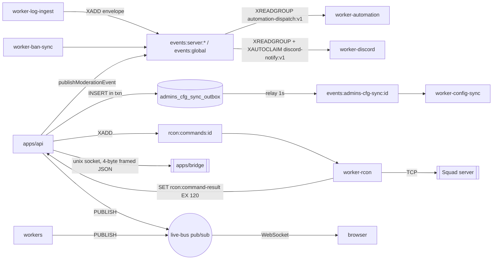

### 9.2 The live-update bus in depth

#### Transport: WebSocket, not SSE

The browser transport is a **single multiplexed WebSocket**, verified: `apps/api/src/routes/live.ts:19-25` declares `app.get('/api/v1/ws/live', { websocket: true, config: { permissions: ['server:view'], audit: false } }, …)`, registered through `@fastify/websocket` at `apps/api/src/server.ts:176` with **no options**, so the default `maxPayload` applies. A repo-wide grep for `text/event-stream` and `EventSource` returns nothing — there is no SSE anywhere, and any source describing this bus as SSE is wrong. Three other WebSocket routes exist (`server-logs.ts:22`, `server-install.ts:504`, `depot.ts:244`) but are unrelated streaming endpoints, so "one WebSocket per client" is true of the bus, not of the app. The client side is a module-level singleton (`apps/web/src/lib/live-bus.ts:312`), shared by all 32 `useLiveSubscription` call sites, with the URL derived from `window.location` rather than an env var (`live-bus.ts:405-406`).

#### Two fixed channels and `_origin` echo suppression

```ts
// apps/api/src/plugins/live-bus.ts:287-288, 300-316
const LIVE_BUS_CHANNEL = 'live-bus';
const RCON_STATUS_CHANNEL = 'rcon:status:changed';
const instanceId = randomUUID();
subscriber.on('message', (channel, raw) => {
  if (channel === LIVE_BUS_CHANNEL) {
    const { _origin, ...evt } = JSON.parse(raw) as LiveEvent & { _origin?: string };
    if (_origin === instanceId) return;         // skip our own echo
    emitter.emit('event', evt as LiveEvent);
```

There is no channel-naming scheme: both names are global constants with no per-server or per-tenant suffix, so every API replica receives every event. `publish()` emits locally first, synchronously, then `void`-publishes the event stamped with `_origin: instanceId`; the duplicated subscriber connection drops its own echo. Redis failures are logged and swallowed. `rcon:status:changed` is a worker→API edge channel: the plugin re-wraps the supervisor's raw `{server_id, state, player_count?}` payload (`apps/workers/rcon/src/supervisor.ts:186`) into a `rcon.status` LiveEvent with a **freshly stamped `ts`** (`live-bus.ts:325-337`). If `app.redis.duplicate` is absent the plugin degrades to single-process mode with a warning (`live-bus.ts:350-352`) — which is what the vitest harness relies on.

Two deviations from the plugin pattern matter operationally. Every worker and `packages/db` bypasses `app.liveBus` and hand-writes `redis.publish('live-bus', …)`, with the literal re-declared as a local `LIVE_BUS_CHANNEL` const in **seven** files; those events carry no `_origin` at all, which is harmless only because workers are not subscribers. Worse, `apps/api/src/lib/reporter-stats.ts:95` does a raw `redis.publish` *inside the API process*, skipping the local `EventEmitter` — subscribers on that same replica see the event only after a Redis round-trip.

#### The 23 event types

The envelope is a bare `{ type, ts, data }` discriminated union declared **twice by hand with no shared package**: `apps/api/src/plugins/live-bus.ts:5-222` (23 variants) and `apps/web/src/lib/live-bus.ts:1-140`. It is *not* the Zod `eventEnvelope` from `packages/shared-types/src/events.ts:52-70` — that is the durable stream/table envelope with `event_id`, `version`, `actor`, `correlation_id`. Nothing validates a live frame at runtime on either end: the API `JSON.parse`s Redis text and casts, and the client only checks `typeof frame.type === 'string'` (`apps/web/src/lib/live-bus.ts:435`).

| Domain | Types | Publishers |
|---|---|---|
| Server lifecycle (5) | `server.status`, `server.deleted`, `server.restored`, `server.map.changed`, `server.seeding` | `plugins/status-reconciler.ts:215,244,265,437,480`; `routes/servers.ts:439,549,780,926`; `server-archive.ts:286`; `server-map.ts:185,239,283`; `apps/workers/rcon/src/supervisor.ts:280` |
| Infrastructure (4) | `rcon.status`, `rcon.roster`, `bridge.connection`, `worker.heartbeat` | supervisor `:186,212`; `plugins/bridge-heartbeat.ts`; **`worker.heartbeat` is declared and never published** |
| Player dossier / moderation (4) | `note.created`, `mark.changed`, `mark_type.changed`, `externalban.matched` | `player-notes.ts:207`; `marks.ts:120`; `mark-types.ts:141,206,263`; `apps/workers/log-ingest/src/external-ban/store.ts:266` |
| Issues (3) | `issue.created`, `issue.updated`, `issue.comment.created` | `routes/issues.ts:233,413,474` |
| Reports (2) | `report.created`, `report.updated` | `reports.ts:407,520`; `report-actions.ts:696`; **plus a second, flat `report.created` shape** from `log-ingest/src/report/store.ts:245` |
| In-game telemetry (3) | `chat.message`, `combat.event`, `vote.ended` | `log-ingest/src/chat/store.ts:137`, `combat/store.ts:334`, `vote/store.ts:194` |
| Auth (1) | `session.revoked` | `routes/auth.ts:21,101`; `role-expirer/src/tick.ts:233`; `seed-reward/src/tick.ts:294` |
| Alerts (1) | `alert.triggered` (`data: Record<string, unknown>`) | 6 producers, incl. `ban-sync/src/alerts.ts:55`, `packages/db/src/alt-ban.ts:99`, `packages/db/src/seed-notifications.ts:65` |

The two unions have already drifted. `match.started` / `match.ended` exist **only** in the web union (`apps/web/src/lib/live-bus.ts:90-99`) and are never published. `combat.vehicle` (`combat/store.ts:459`) and `banname.matched` (`banname/store.ts:283`) are published but appear in **neither** union and have no web subscriber. `ban-sync` re-broadcasts whole `EventEnvelope`s onto the bus (`events.ts:94-97`), so arbitrary `bansync.*` types can appear on a channel whose type is nominally closed.

#### Authorization on subscribe

There is **no subscription protocol at all**. The client sends nothing but `{"type":"pong"}` — no `subscribe` frame, no query param, no per-server channel. Every socket receives every event from every server, and filtering is a hard-coded server-side deny-list in the handler:

```ts
// apps/api/src/routes/live.ts:65-87
const unsubscribe = app.liveBus.subscribe((event) => {
  if (event.type === 'session.revoked' && event.data.player_id !== connectionPlayerId) return;
  if (event.type === 'alert.triggered' && event.data.event_kind === 'role_expiring' && !canAssignRoles) return;
  if (event.type === 'combat.event' && !canViewCombat) return;
  safeSend(event);
});
```

"Can a client subscribe to a server it lacks permission for?" is not an expressible question here: RBAC is **global, not per-server** — `PermissionContext` (`apps/api/src/lib/rbac.ts:12-29`) has no `serverId` field anywhere. The single gate is `server:view` at upgrade time, enforced by the global `onRequest` hook in `apps/api/src/plugins/auth.ts:114-125` reading `req.routeOptions.config.permissions`; both `__Host-sid` cookie sessions and scope-intersected Bearer API tokens authenticate the upgrade. So **any user with `server:view` sees all chat, all rosters, all map changes, all reports, issues, marks and seeding state for every server**, plus every `alert.triggered` payload whose `event_kind` is not one of the three special-cased. `combat.event` is the only permission-gated payload, and its sibling `combat.vehicle` from the same store is not gated — an oversight, not a design.

#### Heartbeat, reconnect, replay, backpressure

Heartbeat is application-level JSON, not WS ping frames: the server sends `{type:'ping', ts}` every `PING_INTERVAL_MS = 10_000` and closes with code `4000` / `"pong timeout"` if no pong arrives within `PONG_TIMEOUT_MS = 30_000` (`live.ts:5-6,51-63,94-101`). The client answers inline and never forwards `ping` to subscribers. Reconnect is entirely client-side: a fixed ladder `[1, 2, 4, 8, 16, 30]` seconds (`apps/web/src/lib/live-bus.ts:309`) reset on `onopen`, with ref-counted `retain()`/`release()`, a 5 s idle close and a `forceReconnect()` escape hatch. (`apps/web/src/lib/ws-backoff.ts` exports a *different*, exponential `nextBackoffMs()` that nothing uses.)

**Replay is lossy for 21 of the 23 types.** The route keeps per-server in-memory rings of 100 for chat and combat only (`live.ts:7-17`), flushed on connect via `tail()` — i.e. *every* server's buffer, not scoped to what the client is viewing (`live.ts:89-92`). Those buffers are per-replica and per-process and die on restart, so reconnecting to a different replica still misses events. Everything else starts from the next event; the UI compensates with REST refetches — `useLiveSubscription` carries no query cache, it just re-`fetch`es (`apps/web/src/lib/use-live-bus.ts:4`) — plus a `/api/v1/me` probe every 30 s in `connection-banner.tsx:21-23`. Backpressure is **absent**: `safeSend` is a bare `socket.send(JSON.stringify(payload))` in a try/catch with no queue, no `bufferedAmount` check and no drop policy (`live.ts:42-49`); the listener cap is raised to 1024 (`live-bus.ts:292`).

A consequence worth internalising: **a kick or a broadcast produces no live-bus event at all.** `server-messaging.ts` and `report-actions.ts` do RCON-then-DB and stop; the roster only refreshes when the supervisor's next 30 s poll publishes `rcon.roster`. `server-map.ts:185` shows the intended pattern — publish immediately after the RCON call — and two of the three action families do not follow it.

### 9.3 Redis keyspace inventory

Redis is the second primary datastore, not a cache. There is no central key registry; the only shared builders are `STREAM_NAME`/`DEDUP_KEY` (`packages/shared-types/src/events.ts:285-291`), the RCON prefixes (`rcon-commands.ts:3,5`), `HEARTBEAT_PREFIX` (`shared-config/src/heartbeat.ts:15`), `DIAG_STREAM_KEY`, `PANEL_LOGS_STREAM`, `HOST_METRICS_STREAM` and `RNSQUADJS_CUTOVER_SET`. Everything else is a scattered literal — `RCON_STREAM_MAXLEN = 500` is re-declared in five modules, `ADMINS_CFG_SYNC_STREAM_PREFIX` twice, `DIAG_STREAM_KEY` twice.

| Key | Type | Producer | Consumer | TTL / MAXLEN | Authoritative? | What breaks if lost |
|---|---|---|---|---|---|---|
| `rcon:status:<id>` | string(JSON) | `rcon/src/supervisor.ts:174` | `routes/servers.ts:112,256`; `server-map.ts:47`; metrics-sampler; `config-sync/src/rcon-reload.ts:44` | `EX 300` | no (cache) | Server list shows no RCON state; `admins.cfg` reload skipped (gated on `state==='connected'`) |
| `rcon:roster:<id>` | string(JSON) | `supervisor.ts:199` | `routes/server-roster.ts:20`; `server-messaging.ts:152`; `report-actions.ts:268`; `lib/report-notify.ts:56` | `EX 90` | **yes** | Roster endpoint empty; in-game warn/kick targeting and report name-resolution lose their player list |
| `rcon:squads:<id>` | string(JSON) | `supervisor.ts:229` | **no reader in `apps/api/src`** | `EX 90` | yes (write-only) | Nothing observable |
| `a2s:status:<id>` | string(JSON) | `supervisor.ts:728` | `routes/servers.ts:130,273` | `EX 90` | no | Public map/player-count column blanks |
| `seeding:state:<id>` | string(JSON) | `supervisor.ts:268` | `routes/server-seeding.ts:67`; `scheduler/src/deps.ts:107`; re-read on restart (`supervisor.ts:151`) | `EX 3600` | **yes** — `packages/db/src/schema/seed-schedule.ts:22` explicitly defers to Redis | Seeding progress lost; supervisor restarts its state machine fresh, seed-call scheduling misfires |
| `rcon:commands:<id>` | stream | `lib/rcon-worker-command.ts:54` + 6 workers | `rcon/src/commands.ts` | `MAXLEN ~ 500` | **yes** (in flight) | Queued kick/ban/broadcast commands dropped |
| `rcon:command-result:<reqId>` | string | `rcon/src/commands.ts:94` | `lib/rcon-worker-command.ts:71` (deletes on read) | `EX 120` | **yes** (in flight) | Synchronous RCON calls time out with no result |
| `events:server:<id>` / `events:global` / `events:dlq` | stream | `log-ingest/src/publish.ts:16`; ban-sync; API | `events.ts:294` groups | `MAXLEN ~ 10000` | **yes** (in flight) | Unconsumed domain events lost permanently; `events:dlq` has no reader |
| `events:admins-cfg-sync:<id>` | stream | outbox relay | worker-config-sync | `MAXLEN ~ 500` | no — PG outbox backs it | Nothing; rows re-relay |
| `dedup:<group>:<eventId>` | string | producers + consumers | same | `EX 86400` | dedup | Duplicate Discord notifications / duplicate ban applications on replay |
| `panel:logs` | stream | `shared-config/src/log-stream-sink.ts:95` | `routes/logs.ts:61,77`; `lib/log-export.ts:40` | `MAXLEN ~ 100000` | **yes** | Log viewer and export empty |
| `host:metrics` / `container:metrics:<id>` | stream | metrics-sampler | `routes/host.ts:78`; `routes/server-metrics.ts:39` | `MAXLEN 5760` / `~2880` | **yes** | ~48 h of host metric history gone |
| `diag:queue` | stream | `packages/diag/src/index.ts:25` | diag-flush → `diagnostic_events` | `MAXLEN ~ 100000` | in flight | Unflushed diagnostics lost; group is created at `'$'` (`diag-flush/src/index.ts:153`) so pre-existing entries are never flushed |
| `bansync:manual` | stream | `routes/ban-sources.ts:366` | `ban-sync/src/index.ts:22` | none set | **yes** (in flight) | Manual ban-source sync jobs dropped |
| `session:<tokenId>` | string(JSON) | `lib/sessions.ts:177` | auth read-through | `EX 600` | no — Postgres `sessions` | Nothing; DB fallback |
| `session-touch:` / `api-token-touch:` | string NX | `sessions.ts:164`; `plugins/auth.ts:130` | self | `EX 60` | throttle | Extra `sessions` UPDATE writes |
| `steam-nonce:<n>` / `steam-response-nonce:<n>` | string NX | `routes/auth-steam.ts:25,86` | self | `EX 300` / `EX 3600` | **yes** (replay guard) | OpenID replay protection weakens; in-flight logins fail |
| `depot:updating` | string NX lock | `routes/depot.ts:94`, del at `:228` | depot, server-update, rotation-calendar, scheduler | `EX 3600` | **yes** (lock) | Concurrent depot updates can start; update-blocked guards go silent |
| `depot:build_id`, `depot:last_update` | string | `routes/depot.ts:203,209` | `depot.ts:52` | **none** | **yes** | Depot version and last-update result unrecoverable |
| `stop:requested:<id>` | string | `routes/servers.ts:528` | `plugins/status-reconciler.ts:235,282` | `EX 300` | **yes** | An intentional stop is misclassified as a crash |
| `crashes:<id>` | zset | `status-reconciler.ts:240` | `routes/servers.ts:312` | **none** (score-trimmed to 24 h) | **yes** | 24 h of crash history and crash-loop detection gone |
| `rnsquadjs:cutover-servers` | set | `routes/server-rnsquadjs.ts:46,98` | `lib/rnsquadjs.ts:173`; `server-install.ts:306` | **none** | **yes** | Every cut-over server silently reverts to `shadow` sidecar mode on the next reconcile — the most dangerous flush casualty |
| `admins-cfg:status:<id>`, `config-drift:status:<id>` | string(JSON) | `config-sync/src/syncer.ts:78` | `routes/admins-cfg.ts:8`; deleted by `lib/server-delete.ts:15` | `EX 86400` | **yes** | Admin-config sync health unknown |
| `external-bans:version` | counter | `routes/ban-sources.ts:293`; `ban-sync/src/sync-source.ts:218` | `log-ingest/src/external-ban/cache.ts:103` | **none** | **yes** (invalidation token) | Stale external-ban cache in log-ingest |
| `worker:heartbeat:<name>` | string | `shared-config/src/heartbeat.ts:71` | `plugins/heartbeat-watch.ts:34` | `EX 30` | liveness | False "heartbeat lost" alerts |
| `automation:tod:<ruleId>` | string NX | `automation/src/rules/runtime.ts:94` | self | `EX <window>` | **yes** (idempotency) | Time-of-day automation rules re-fire |
| `leaderboard:*`, `dossier:*`, `player-combat:*`, `config-blame:<tipId>`, `steam-profile:*` | string(JSON) | route handlers | same routes | `EX 60`–`EX 86400` | no | Latency only |

Six keys have **no expiry at all** — `crashes:<id>`, `depot:build_id`, `depot:last_update`, `rnsquadjs:cutover-servers`, `external-bans:version` and the `bansync:manual` stream — and every one of them is authoritative. A `FLUSHDB` self-heals every `rcon:*`, `a2s:*`, `seeding:state:*`, heartbeat and cache key, and clears locks at the cost of one duplicated action apiece (a second `depot:updating` holder, one extra seed call). It does **not** heal: cut-over mode reverting to `shadow`, crash history, depot version, the 24 h `dedup:*` idempotency window (after which Postgres `onConflictDoNothing` on `(event_id, occurred_at)` is the only remaining guard, `ban-sync/src/events.ts:78`), consumer-group offsets (`XGROUP CREATE … '$'` re-creates at the tail, dropping the un-acked backlog), and any unflushed `panel:logs` / `diag:queue` entries.

Two timing smells are worth flagging before you tune anything. `HEARTBEAT_LOST_THRESHOLD_MS`, `HEARTBEAT_TICK_MS` and the key TTL are all 30 s (`plugins/heartbeat-watch.ts:13-14`, `heartbeat.ts:15`), so a dead worker takes up to ~60 s to alarm; and `KNOWN_WORKERS` (`heartbeat-watch.ts:4-11`) lists only six of the nineteen worker packages — `scheduler`, `automation`, `discord`, `ban-sync`, `config-sync` and `clan-priority-expirer` publish heartbeats that nothing watches. Separately, the RCON RPC's client-side wait (4 000 ms, `rcon-worker-command.ts:72`) is shorter than the worker's own per-command timeout (10 000 ms, `apps/workers/rcon/src/client.ts:100`), so a slow game server reliably returns `timeout` to HTTP while the worker completes the command and writes a result key nobody reads.

---

## 10. Identity, authorization, audit and security

There is no `users` table. A panel user **is** a row in `players` (`packages/db/src/schema/players.ts`) carrying a nullable `role_id` FK (`onDelete: 'set null'`, line 28) plus `role_expires_at` and `role_comment`. One player holds exactly one role; there is no player↔role join table and **no per-server scoping anywhere** — `role_permissions` and `role_squad_permissions` are keyed on `(role_id, permission_key)` only. Permissions are global to the panel.

### 10.1 Steam OpenID login and the first-owner claim

`apps/api/src/routes/auth-steam.ts` holds the only two unauthenticated identity routes, separately rate-limited at 30/min and 10/min. `GET /api/v1/auth/steam/login` mints a 16-byte `base64url` nonce, parks it in Redis at `steam-nonce:<nonce>` for 300 s, sets it as `__Host-steam-nonce`, and 302s to an OpenID 2.0 `checkid_setup` with `identifier_select` built by `buildLoginRedirectUrl` (`apps/api/src/lib/steam-openid.ts:9`).

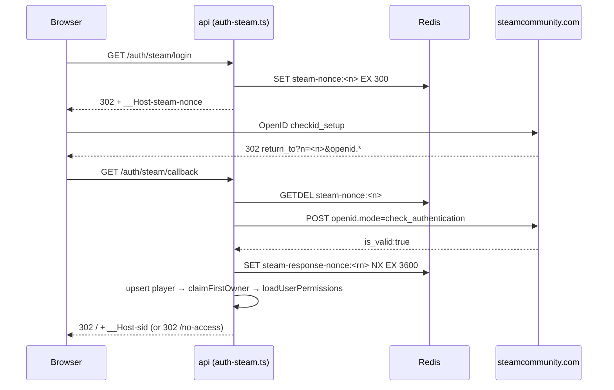

The callback runs five ordered rejections before it will look at a player: cookie-nonce ≠ query-nonce → `400 nonce_mismatch`; Redis nonce GET+DEL miss → `400 nonce_expired`; `openid.return_to` failing a prefix check against `PANEL_PUBLIC_URL` → `400 return_to_mismatch`; `verifyWithSteam` not returning `is_valid:true`, or a `claimed_id` failing the strict `^https://steamcommunity.com/openid/id/\d{17}$` parse (`steam-openid.ts:24-31`); and finally replay defence, `SET steam-response-nonce:<openid.response_nonce> NX EX 3600` → `400 replay_detected`. Profile enrichment (`lib/steam-profile.ts`, Redis-cached 1 h) is non-fatal and falls back to `Player <last4>`. The post-login redirect target is the hardcoded `/`, so there is no open-redirect parameter to abuse.

Two outcomes then remain. `claimFirstOwner` (`apps/api/src/lib/first-owner.ts:14`) opens a transaction, takes `pg_advisory_xact_lock(hashtext('panel_first_owner'))` to serialize concurrent first logins, short-circuits on `panel_meta.first_owner_claimed`, resolves the system `Owner` role by name, and — only if no player already holds it — assigns `players.role_id` and flips the flag. It returns `'claimed' | 'already_claimed' | 'no_owner_role'`; the caller 500s with `owner_role_missing` when roles were never seeded. On success it best-effort writes a sentinel through the Go bridge (`fileAtomicWrite` to `/var/lib/squad-panel/.first-owner-claimed`) and swallows failure — the DB is the source of truth. `POST /api/v1/setup/complete` is Owner-only and 410s once done, while `GET /api/v1/setup/status` is deliberately public. After the claim, `loadUserPermissions` runs: if `panelAccess` is false the user is 302'd to `/no-access?...&reason=no_role|role_no_access` and **no session is created at all**.

### 10.2 Session model

Sessions are dual-stored: Postgres is the record, Redis is a 600 s read cache at `session:<tokenId>`.

```ts
// apps/api/src/lib/sessions.ts:33
export function mintSessionToken(): { token: string; tokenId: string } {
  const raw = randomBytes(24).toString('base64url');
  const token = `s_${uuidv7()}_${raw}`;
  const tokenId = createHash('sha256').update(token).digest('base64url');
  return { token, tokenId };
}
```

The DB primary key **is** the SHA-256 of the token (`sessions.id text primary key`, `packages/db/src/schema/sessions.ts:7`), so plaintext is never persisted on either side.

| Aspect | Implementation |
|---|---|
| Cookie | `__Host-sid` (`plugins/auth.ts:15`): `httpOnly`, `secure`, `sameSite:'lax'`, `path:'/'`, no `domain` |
| TTL | `maxAge = SESSION_TTL_SECONDS`, default **86400** (`config.ts:13`) — docs say 6 h, `.env.example` says 21600 |
| Sliding renewal | `touchSession` takes `SET session-touch:<id> NX EX SESSION_TOUCH_THROTTLE_SECONDS` (default 60); on lock acquisition it pushes `expires_at` forward and re-sets the cookie (`plugins/auth.ts:45-66`) |
| Rotation | **None.** The token value never changes — not at login, not on privilege change |
| Signing | `@fastify/cookie` is registered with `secret: config.SESSION_SECRET` (`server.ts:159`) but the session cookie is set without `signed: true`. `SESSION_SECRET` guards nothing in the session path; integrity is purely the 24 random bytes, and rotating it does **not** invalidate sessions |
| Revocation | `revokeSession` (DB delete + Redis del) and `revokeAllForPlayer`, which publishes one `session.revoked` live-bus event per killed session for forced logout. Called from logout, `DELETE /api/v1/me/sessions[/:id]`, and every role mutation in `routes/role-members.ts` (lines 201, 253, 385, 497, 585) when the new role lacks `panel_access` |
| Expired-row GC | `pruneExpired` (`sessions.ts:149`) is exported with **no caller in the repo**; stale rows only vanish opportunistically when `resolveSession` finds a cached entry expired |

### 10.3 API tokens

Minted in `apps/api/src/lib/api-tokens.ts` as `sqp_<uuidv7>_<24 random bytes base64url>`; only `sha256(plaintext).base64url` is persisted in `player_api_tokens.token_hash`. `looksLikeApiToken` is a cheap shape check so a non-token bearer never touches the DB.

| Aspect | Implementation |
|---|---|
| Issue | `POST /api/v1/me/tokens`, plaintext returned **once** in the 201 body (`routes/me-tokens.ts:106`) |
| Scopes | `text[]`, validated by `validateScopesSubset` against the caller's own live permissions → `422 {unknown, not_granted}` |
| Limit | 25 active per player → `409 too_many_active_tokens` |
| Revoke | Soft — `revoked_at`; `DELETE /api/v1/me/tokens/:id`, idempotent (`already_revoked: true`) |
| Expiry | **Absent** — no `expires_at` column; tokens live until revoked |
| Last-used | `last_used_at`, throttled by Redis `api-token-touch:<id>` `NX EX 60` (`plugins/auth.ts:129`) |

Effective authority is `intersectScopes(token.scopes, loadUserPermissions(...))` — scopes can only *narrow* the live role, so demoting a role instantly weakens every token it issued. Two quirks are load-bearing: the bearer branch is the `else` of the cookie branch (`plugins/auth.ts:69`), so a request carrying both a cookie and an `Authorization` header silently ignores the bearer; and `req.session` is left undefined for bearer callers, which is the actual mechanism preventing token holders from minting further tokens or listing sessions. The `api_token:create` / `api_token:revoke` permission keys exist in the registry but **no route enforces them** — `routes/me-tokens.ts` gates only on `req.user && req.session`.

### 10.4 The RBAC model

Two disjoint vocabularies. `packages/shared-config/src/permissions.ts` defines **51 panel permission keys** across 16 categories, with optional `dangerous`/`unimplemented` flags; `PermissionKey` is a literal union derived from that array. `squad-permissions.ts` defines **21 squad permission keys** (`kick`, `ban`, `immune`, `reserve`, …) — these are Squad's own `Admins.cfg` group permissions replicated out to game servers and are **never** used to authorize a panel route.

`roles` (`packages/db/src/schema/roles.ts`) carries 13 boolean columns: `is_system_role` plus the 12 access flags `panel_access`, `can_view_ips`, `can_assign_roles`, `can_edit_roles`, `can_manage_issues`, `can_manage_ban_sources`, `can_manage_integrations`, `can_manage_clans`, `can_manage_economy`, `can_manage_media`, `can_handle_reports`, `combat_view`.

`loadUserPermissions` (`apps/api/src/lib/rbac.ts:91`) issues one SQL query joining the role row and `array_agg`-ing squad permissions, then layers additive `role_permissions` rows. The decisive part is `derivePanelPermissions`:

```ts
// apps/api/src/lib/rbac.ts:51
if (isOwner) return new Set(ALL_PANEL_PERMS);
if (!panelAccess) return new Set();
const out = new Set<PermissionKey>();
for (const key of ALL_PANEL_PERMS) {
  if (PANEL_PERMS_GATED_BY_ASSIGN.has(key) && !canAssignRoles) continue;
  if (PANEL_PERMS_GATED_BY_EDIT.has(key) && !canEditRoles) continue;
  if (PANEL_PERMS_GATED_BY_INTEGRATIONS.has(key) && !canManageIntegrations) continue;
  if (PANEL_PERMS_GATED_BY_VIEW_IPS.has(key) && !canViewIps) continue;
  out.add(key);
}
```

Read that carefully: **`panel_access = true` implicitly grants all 51 keys** minus exactly six gated ones — `user:manage_roles` (needs `can_assign_roles`), `role:create|edit|delete` (needs `can_edit_roles`), `integration:manage`, and `player:view_ips`. `role_permissions` rows are then additive only (`rbac.ts:183`) and can never subtract. The "role is a bag of permission-key strings" model described in `docs/architecture/rbac.md:3` is therefore **not** the enforced model; the real model is coarse boolean flags with a fine-grained key vocabulary layered on top for the API surface. Owner is identified by a hardcoded name match — `row.role_name === 'Owner' && row.is_system_role === true` (`rbac.ts:151`) — not by an ID or flag, and short-circuits every flag plus all squad permissions.

`PermissionContext` is memoized in a **process-local `Map` with `TTL_MS = 30_000`** (`rbac.ts:32-33`). This is *not* Redis, correcting `docs/architecture/decisions.md`. The invalidation helpers (`invalidatePermissionCache`, `invalidatePermissionCacheForRole`, `invalidateAllPermissionCaches`) called from `routes/roles.ts:277,320` and `routes/role-members.ts` clear only the calling process's map, so a multi-replica API serves stale permissions for up to 30 s after a demotion.

#### The single enforcement gate

Authorization is one global **`onRequest`** hook in `apps/api/src/plugins/auth.ts:21` — identity resolution and permission checking in the same callback, the same phase. There is no `preHandler` hook anywhere in `apps/api/src` (`grep` over `addHook('…')` yields 11 `onClose`, 3 `onRequest`, 2 `onResponse`, 2 `onReady`); the `preHandler` wording in `docs/architecture/rbac.md:67`, `docs/components/api/README.md:8`, and `docs/components/rbac/README.md:61,68` is stale, inherited from the original spec in `ai_docs/task.md:2202-2212` which proposed a two-hook design the implementation collapsed.

```ts
// apps/api/src/plugins/auth.ts:114-125
const required = req.routeOptions?.config?.permissions;
if (!required || required.length === 0) return;
if (!req.user) { reply.code(401).send({ error: 'unauthenticated' }); return; }
for (const perm of required) {
  if (!req.user.permissions.permissions.has(perm)) {
    reply.code(403).send({ error: 'forbidden', required }); return;
  }
}
```

Semantics: the array is AND-ed, the 403 body echoes the full `required` list, and a route with no `config.permissions` is public by omission. Because `onRequest` precedes body parsing and schema validation, an under-privileged POST is rejected **without its body ever being parsed** — 401/403 always beats 400 — but the corollary is that `req.body` is `undefined` inside the gate, so body-dependent authorization is structurally impossible without moving phases.

The architectural weakness is coverage, not the gate. Of 99 route files, only 39 use `config.permissions`; **37 instead define a locally duplicated `panelGuard(req, reply)` helper** that asserts nothing more than `req.user && permissions.panelAccess` — `routes/marks.ts:25-36`, `reports.ts:69`, `chat.ts:160`, `economy.ts:47`, `media.ts:41`. These are gated at "has any panel access", and the check is a return-value convention the hook cannot enforce: forgetting to call it silently opens the route. Finer checks are then ad hoc in-handler (`reports.ts:424` → `canHandleReports`). Role mutation routes add non-permission invariants: `owner_role_immutable` (`roles.ts:205,299`), `owner_assignment_forbidden` (`role-members.ts:171`), and `cannot_remove_last_owner` 409 (`role-members.ts:235`).

### 10.5 Security architecture

#### Privilege zones

| Zone | Runs as | Crossing point | What crosses |
|---|---|---|---|
| Browser | untrusted | TLS to Caddy | `__Host-sid` cookie, JSON |
| Caddy (`docker/Caddyfile`) | container | `reverse_proxy api:3000` / `web:3000` | `/api/*`, `/health`, `/ready`, **`/metrics`** → api; rest → Next.js |
| `api`, `worker-log-ingest`, `worker-config-sync`, `worker-metrics-sampler`, `worker-scheduler` | `user: "0:${PANEL_GID}"` (`docker-compose.yml:86,134,162,321,372`) | bind-mounted `/run/panel-host-bridge/bridge.sock` | length-prefixed JSON RPC, `MaxFrame = 16 MiB` |
| `panel-host-bridge` | root + `CAP_NET_ADMIN` | `os/exec` (`docker`, `ufw`, `du`, `restic`) + direct FS I/O | allowlisted args only |
| Squad game containers | `--user 1001`, `--network host` | `ServerConfig:rw`, `Saved:rw`, `squad-depot:ro` | game traffic, loopback RCON |

Containers run as UID 0 *inside* the container with the `panel` GID as primary group — deliberate (`docker-compose.yml:83`) because `ResolvePeer` (`apps/bridge/internal/auth/peer.go:35-96`) reads `SO_PEERCRED` and compares the peer's **primary** GID against `panel`; on mismatch it falls back to enumerating the groups the *host's* passwd/group database lists for that UID. The container's own supplementary groups are never visible to the kernel's `SO_PEERCRED` payload, which is why every bridge-attached service must use `user: "0:${PANEL_GID}"` and never `group_add`. Rejection happens once at connect (`cmd/panel-host-bridge/main.go:158`); the socket is `chmod 0660`. **There is no per-method authorization on the bridge**: any process in `panel` can invoke all 30 RPC methods (`packages/shared-config/src/bridge-methods.ts`), including `backup_restore`, `directory_delete`, and `host_agent_restart`.

Injection is structurally excluded — every command goes through `exec.CommandContext(ctx, cmd, args...)` (`internal/runner/runner.go:30`), never a shell. The single `/bin/sh -c` is a constant `restic snapshots --json` (`docker.go:750`). Path traversal is blocked centrally:

```go
// apps/bridge/internal/validate/paths.go:22-38
cleaned := filepath.Clean(p)
if strings.Contains(cleaned, "\x00") { ... }
for _, root := range allowedRoots {
    root = filepath.Clean(root)
    if cleaned == root || strings.HasPrefix(cleaned, root+string(filepath.Separator)) {
        return cleaned, nil
    }
}
```

Layered above it: `PanelConfigFilePath` requires exactly `{uuid}/ServerConfig/{file}.cfg` against a 19-entry filename allowlist (`validate/docker.go:44-63`); `directory_delete` is bounded to `{root}/{uuid}`; `fsx` re-validates independently and omits the depot from `writableRoots` so game binaries cannot be mutated (`fsx.go:36-46`); container names must match UUID-anchored regexes; `container_run` images are allowlisted to `squad-server:latest` and `squad-panel/depot-init:latest` with `RNSquadJSImage` deliberately excluded; UFW is constrained to `{add,remove} × {tcp,udp} × 1024-65535`. The one hole is `containerRunParams.ExtraArgs []string` (`handlers.go:882`), passed unvalidated into the docker argv (`docker.go:118`) — they land after the image so they are Squad server arguments rather than docker flags, but they originate from the free-text `server_settings.extra_args` column editable by anyone with `server:edit_settings`.

#### Secrets and encryption at rest

`.env`, bind-mounted read-only, is the entire secret store; there is no vault. `config.ts` enforces `SESSION_SECRET`, `APP_ENCRYPTION_KEY` and `VIP_LIFECYCLE_WEBHOOK_SECRET` at ≥32 chars, and `loadEncryptionKey` (`lib/crypto.ts:24-29`) hard-fails unless `APP_ENCRYPTION_KEY` base64-decodes to exactly 32 bytes; the key is decorated once at boot (`server.ts:154`). At-rest encryption is **AES-256-GCM** with a 12-byte random IV and 16-byte tag, serialized as JSON `{v, kv, iv, tag, ct}` into `bytea`. Encrypted: `server_credentials.rcon_password_encrypted` (generated as a fresh `randomBytes(24)` at `routes/servers.ts:220-228`), `license_key_encrypted`, Discord `bot_token_encrypted` and `webhook_url_encrypted`, the GeoIP license key, and ban-source `auth_header`. `apps/workers/discord/src/crypto.ts` is a deliberate independent reimplementation so drift breaks tests. The `kv` field and `server_credentials.key_version` exist for rotation, but **no rotation code exists** — `encrypt()` always writes `keyVersion = 1` and `decrypt()` ignores `kv`, contradicting `docs/architecture/security.md`.

#### The real SSRF surface

Discord webhooks are **not** an SSRF gap — they are the most tightly constrained user-supplied URL in the repo, validated on both create and update by an anchored allowlist regex (`apps/api/src/lib/discord.ts:2-3`, applied at `routes/integrations-discord.ts:33-36,46,55`) pinning scheme to http/https, host to `discord(app).com`, and path to `/api[/vN]/webhooks/<snowflake>/<token>`. Userinfo and path-suffix bypasses fail on the anchors.

The genuine surface is `ban_sources.url`, declared as bare `z.string().url().max(2048)` (`routes/ban-sources.ts:17,30`). Zod's `.url()` only asserts WHATWG-parseability, so `http://169.254.169.254/latest/meta-data/` and internal service names like `http://postgres:5432/` pass. `fetchBanList` (`apps/workers/ban-sync/src/fetch-source.ts:37-55`) passes it to `fetch` unmodified with the decrypted `Authorization` header attached and no `redirect: 'manual'`, so a benign-looking public host can 302 the worker inward and undici replays the header across same-origin hops. The 30 s timeout and 20 MiB cap (checked eagerly against `content-length` and again mid-stream) bound resource exhaustion, not destination. A repo-wide grep for network-destination allowlists returns nothing. Severity is bounded by authorization (`ban_source:manage`, 15-minute poll floor) — a privileged-user-to-internal-network pivot, not an unauthenticated one. `ban_sources.discord_url` has the same loose shape and skips `isDiscordWebhookUrl` entirely, but is inert: no worker reads it. GeoIP and Steam URLs are server-side constants.

#### Rate limiting, cookies, CSRF, CORS

The global limiter is `max: 1200, timeWindow: '1 minute', keyGenerator: (req) => \`${req.ip}:${req.user?.playerId ?? ''}\`` (`server.ts:160-164`). The key genuinely is `(IP, playerId)` for authenticated traffic: `@fastify/rate-limit` attaches its handler *per route* via `onRoute` into `routeOptions.onRequest`, and Fastify runs all instance-level `onRequest` hooks — including `authPlugin`'s, which is `fp`-wrapped onto the root instance — before a route's own `onRequest` array. So `req.user` is populated when `keyGenerator` executes. Anonymous traffic collapses to a shared per-IP bucket. Two real weaknesses: no `redis` option is passed, so counters live in the in-memory `LocalStore` per API process and horizontal scaling multiplies the ceiling; and `docs/architecture/security.md:45` claims 300/min keyed on `steamId64` with a static-asset bypass — 4× off, wrong identity (it is `players.id`), and no `allowList` exists. Per-route overrides on 7 routes inherit the global keyGenerator: Steam login 30/min, callback 10/min, public banlist 30, public clans 60, whitelist submit 5/hour. `trustProxy: true` is set (`server.ts:144`) with **no trusted-proxy list**, so a spoofed `X-Forwarded-For` shapes `req.ip`, the limiter key, and audit `actor_ip`.

Cookie flags are consistent at every set site (`plugins/auth.ts:60-66`, `routes/auth-steam.ts:154-160`). `COOKIE_SECURE` is declared at `config.ts:16` and **never read** — `secure` is hardcoded. **CORS is absent**: `@fastify/cors` is a declared dependency (`apps/api/package.json:22`) and is never registered, so no `Access-Control-Allow-Origin` is ever emitted. **CSRF has no dedicated control** — no token, no origin/referer check, no double-submit; the defence is `SameSite=lax` plus the `__Host-` prefix, which holds for modern browsers on a same-origin deployment behind Caddy but is an implicit, undocumented dependency. `@fastify/helmet` is registered with default options (`server.ts:158`), so CSP/HSTS/nosniff cover **API JSON only**; `apps/web/next.config.mjs` defines no `headers()` and Caddy adds none, so the HTML pages ship with no CSP. On the web tier, `apps/web/src/middleware.ts` explicitly declines to authorize (citing CVE-2025-29927) and only redirects cookie-less requests; the real gate is `requireSession()` in `(dashboard)/layout.tsx`, deduped via `react.cache()` (`apps/web/src/lib/dal.ts:20-36`), calling `/api/v1/me`.

### 10.6 The audit subsystem

`audit_log` (`packages/db/src/schema/audit-log.ts`) records an actor triple (`actor_kind` ∈ {`steam`,`system`}, `actor_player_id`, `actor_token_id`, `actor_system_label`), `actor_ip inet`, `action_type`, `target_type`/`target_id`, `before_snapshot`/`after_snapshot`/`context jsonb`, `status_code`, `duration_ms`, and the chain pair `prev_hash`/`row_hash bytea`. A check constraint enforces actor exclusivity. `apps/api/src/lib/audit.ts` is the API's only writer; it inserts `rowHash: Buffer.from([])` purely to satisfy `NOT NULL` and never sends `prev_hash`.

Two capture modes coexist. Automatic entries come from a single `onResponse` hook (`plugins/audit.ts`, registered at `server.ts:193`) reading `req.routeOptions.config.audit`; because the phase is `onResponse` it also audits 4xx/5xx, including the 401/403 the gate produced. These entries carry request context and `durationMs` but **never** `before`/`after`. Explicit `writeAuditEntry` calls at 83 route call sites carry the real diffs. `apps/api/test/audit-coverage.test.ts` is a CI guard asserting every mutating route declares `config.audit` (object or explicit `false`) — it checks declaration, not diff quality. Workers deliberately bypass the API helper, each defining its own `writeAuditEntry` DI port (`apps/workers/scheduler/src/deps.ts:378`, `role-expirer/src/tick.ts:134`, `clan-guard/src/deps.ts:213`).

The chain is computed by a `BEFORE INSERT` trigger (`packages/db/drizzle/0008_steam_only_auth.sql:99-123`, originally `0000_init.sql:264-334`):

```sql
BEGIN
  PERFORM pg_advisory_xact_lock(hashtextextended('audit_log', 0));
  SELECT row_hash INTO prev FROM audit_log ORDER BY id DESC LIMIT 1;
  NEW.prev_hash := prev;
  NEW.row_hash := digest(
    COALESCE(prev, ''::bytea) ||
    convert_to(NEW.action_type
      || '|' || COALESCE(NEW.target_type, '')
      || '|' || COALESCE(NEW.target_id, '')
      || '|' || NEW.context::text
      || '|' || NEW.created_at::text, 'UTF8'),
    'sha256');
  RETURN NEW;
END;
```

The preimage is exactly `prev_hash_bytes ‖ utf8("action_type|target_type|target_id|context::text|created_at::text")`. The migration comment states the omission of actor fields is by design — which means `actor_*`, `actor_ip`, `before_snapshot`, `after_snapshot`, `status_code` and `duration_ms` are all **outside** the digest: the chain proves the sequence of actions, not who performed them or what changed. It is also environment-sensitive, since `context::text` (jsonb key ordering) and `created_at::text` (session `TimeZone`/`DateStyle`) are Postgres text renderings; `audit-chain.ts:3-11` documents this hazard without defending against it. There is no genesis row — the first insert simply finds `prev = NULL` and hashes with an empty prefix, which the verifier mirrors (`audit-chain.ts:76`). Concurrency is handled by the transaction-scoped advisory lock on a single global key, taken *before* the tail read, so two concurrent inserters serialize until commit and the "latest row_hash" read cannot race; verification then walks in `id` order.

Immutability is enforced in the database, not by convention (`0008_steam_only_auth.sql:129-144`):

```sql
CREATE OR REPLACE FUNCTION audit_log_deny() RETURNS trigger LANGUAGE plpgsql AS $$
BEGIN RAISE EXCEPTION 'audit_log is append-only'; END; $$;
CREATE TRIGGER trg_audit_log_no_upd BEFORE UPDATE ON audit_log
  FOR EACH ROW EXECUTE FUNCTION audit_log_deny();
CREATE TRIGGER trg_audit_log_no_del BEFORE DELETE ON audit_log
  FOR EACH ROW EXECUTE FUNCTION audit_log_deny();
```

Verification logic lives once, in `apps/api/src/lib/audit-chain.ts` — `canonicalAuditString()` (:43-51), `expectedRowHashHex()` (:58-62), and `verifyAuditChain()` (:70-87), which walks rows fail-fast and returns `{ok, checked, brokenAt, reason ∈ {'prev_hash','row_hash'}}`. Both consumers import it: the in-panel `GET /api/v1/audit/verify-chain` (gated `audit:view`, `routes/audit.ts:61`) and the out-of-band `pnpm verify:audit-chain` (`scripts/verify-audit-chain.ts`), which opens its own `postgres` connection (`max:1, prepare:false`), runs the same `id::text`/`context::text`/`created_at::text`/`encode(prev_hash,'hex')` projection, and exits 0 intact / 1 broken / 2 fatal. Because both sides share the comparison code, they agree by construction.

**Archival of rows older than 90 days is specified but not implemented.** `docs/components/workers/audit-archiver/README.md:5` and `flows.md:14-22` describe an hourly `SELECT … WHERE created_at < NOW() - INTERVAL '90 days' ORDER BY id ASC LIMIT 10000`, chain verification over the selected slice, JSONL export, an archive marker row, and deletion through a `SECURITY DEFINER` `audit_log_archive_view` that would bypass `trg_audit_log_no_del` — the design that would preserve verifiability across the cut. The code is a labelled P0 stub: `apps/workers/audit-archiver/src/index.ts` publishes a heartbeat with `statusFn: () => 'idle (P1)'` and runs `runArchiverCycle({diag})` hourly, whose body is `await Promise.resolve()` followed by an `audit_archiver.run_ok` diag event. It consumes no `DATABASE_URL`, and no `audit_log_archive_view` exists in any of the 79 files under `packages/db/drizzle/`. In production, audit rows accumulate without bound and are never archived.

Finally, audit writes **fail open**: the hook swallows errors and logs `'audit write failed'` (`plugins/audit.ts:29-31`), so a request is never rejected because its audit entry could not be written. And the whole scheme is tamper-*evidence*, not tamper-*prevention* — anyone with the Postgres superuser password can `DROP TRIGGER` and rewrite the chain, because the tip hash is never anchored anywhere outside the database.

### 10.7 Controls that are absent or assumed

| Control | Status | Evidence |
|---|---|---|
| CORS policy | **Absent** — `@fastify/cors` installed, never registered | `apps/api/package.json:22` vs `server.ts` |
| CSRF token / origin check | **Absent** — relies entirely on `SameSite=lax` + `__Host-` prefix | `plugins/auth.ts:60-66` |
| CSP / security headers on user-facing HTML | **Absent** — helmet covers API JSON only; Next.js sets no `headers()` | `server.ts:158`, `apps/web/next.config.mjs` |
| Auth on `/metrics` and `/api/docs` | **Absent** — both publicly routed by Caddy | `plugins/metrics.ts:55`, `server.ts:175` |
| Per-method authorization on the bridge | **Absent** — `panel` group membership gates all 30 RPCs equally | `internal/auth/peer.go:38`, `handlers.go:129-187` |
| Network-destination allowlist for `ban_sources.url` | **Absent**, redirects followed with `Authorization` attached | `routes/ban-sources.ts:17,30`, `fetch-source.ts:37-55` |
| `ExtraArgs` validation on `container_run` | **Absent** | `handlers.go:882` → `docker.go:118` |
| `APP_ENCRYPTION_KEY` rotation | **Not implemented** — `kv` always 1; docs claim otherwise | `lib/crypto.ts` |
| API token expiry | **Absent** — no `expires_at`; revocation only | `player_api_tokens` schema |
| Session token rotation | **Absent** — same token for its whole life | `lib/sessions.ts` |
| Expired-session pruning | **Absent in practice** — `pruneExpired` has no caller | `sessions.ts:149` |
| Audit archival / retention | **Not implemented** — worker is a P0 stub, no archive view exists | `apps/workers/audit-archiver/src/index.ts` |
| External anchoring of the audit chain tip | **Absent** — superuser can rewrite history | — |
| Audit coverage of *who* and *what* | **Assumed** — actor and before/after are outside the digest | `0008_steam_only_auth.sql:96-98` |
| Trusted-proxy allowlist under `trustProxy: true` | **Absent** — spoofable `X-Forwarded-For` shapes `req.ip`, limiter key, `actor_ip` | `server.ts:144` |
| Shared rate-limit store | **Absent** — in-memory `LocalStore`, per-process counters | `server.ts:160-164` |
| Distributed RBAC cache invalidation | **Absent** — 30 s process-local staleness per replica | `lib/rbac.ts:32-33` |
| Fine-grained gating on 37 route files | **Assumed** — `panelGuard` convention only, unenforceable by the hook | `routes/marks.ts:25-36` et al. |
| `api_token:create` / `api_token:revoke` enforcement | **Absent** — keys defined, no route checks them | `routes/me-tokens.ts` |
| `COOKIE_SECURE` config | Declared, **never read** | `config.ts:16` |
| Audit-write failure handling | **Fails open** — logged, request still succeeds | `plugins/audit.ts:29-31` |

---

## 11. Observability, resilience and operational state

The panel's observability surface is deliberately small and entirely self-hosted: two capped Redis Streams, one Postgres-partitioned event table, a set of TTL'd heartbeat keys, and a reconciliation loop that treats Docker as the source of truth for server state. There is no external APM, no log shipper, no metrics push. `docs/architecture/decisions.md:219` states the rationale outright — "No new datastore, no Prometheus, no Grafana. Diagnostic-only, human-eyeballed."

### 11.1 Structured logging and the `panel:logs` stream

Every Node service builds its own `pino` logger with a `service` base field. The API's is the elaborate one (`apps/api/src/lib/logger.ts:25`): a `pino.multistream` fan-out with one leg to stdout (or `pino-pretty` in dev) and one to a `LateSink`. The `LateSink` (logger.ts:15-23) exists because the logger must be constructed before `Fastify()` while the Redis client only appears after plugin registration; it is wired at `apps/api/src/server.ts:182` via `lateSink.setInner(redisSinkStream({ redis: app.redis, defaultSource: 'api' }))`. Lines written before that wire-up are silently dropped — `write()` returns `true` when `inner === null`. The ADR acknowledges this: roughly seven plugin-registration log lines land in stdout only.

Request correlation uses `AsyncLocalStorage`, not pino child loggers. `als` (logger.ts:13) carries `{ requestId, correlationId?, userId?, sessionId? }` and is injected through `mixin: () => als.getStore() ?? {}` (logger.ts:41), so every line emitted inside a request inherits them without threading a logger. Request IDs honour an inbound header with a weak fallback (`server.ts:146`): `(req.headers['x-request-id'] as string) ?? \`req-${Math.random().toString(36).slice(2)}\`` — client-controlled, non-cryptographic, and it propagates into `diagnostic_events.request_id`.

Redaction is two-layered on the API only: pino's `redact.paths` covering cookies, `authorization`, password/TOTP/backup-code bodies, and wildcard `*.rcon_password` / `*.license_key` / `*.APP_ENCRYPTION_KEY` (logger.ts:27-40), plus `createDiscordRedactingStream` (`packages/shared-config/src/discord-redaction.ts:21`) wrapping **each** stream leg independently (logger.ts:44, 53, 62) rather than once.

The sink itself is `redisSinkStream` (`packages/shared-config/src/log-stream-sink.ts:64`): it line-buffers NDJSON, maps pino's numeric levels down to four (`debug|info|warn|error`), strips fourteen `PINO_META_KEYS` (`req`, `res`, `responseTime`, `reqId`, `pid`, …) into a `ctx` blob so full HTTP objects never enter the stream, and `XADD`s to `panel:logs` with `MAXLEN ~ 100000`. The encoding is single-letter by design (`packages/shared-config/src/log-stream.ts:51-60`) — the ADR's reasoning is that for sub-100-byte records gzip's per-block overhead exceeds its savings, so one-letter keys plus one-byte enum codes buy ~70% of gzip's ratio at zero CPU:

```ts
// packages/shared-config/src/log-stream.ts:51-60
export function encodeLogEntry(e: Omit<LogEntry, 'ts'>): Record<string, string> {
  const out: Record<string, string> = {
    s: SOURCE_TO_CODE[e.source],   // B R L W D I A C
    l: LEVEL_TO_CODE[e.level],     // D I W E
    m: e.msg,
  };
  if (e.serverId) out.i = e.serverId;
  if (e.ctx && Object.keys(e.ctx).length > 0) out.c = JSON.stringify(e.ctx);
  return out;
}
```

There is no `ts` field: the Redis stream-id millisecond prefix *is* the timestamp, and `decodeLogEntry` parses it back out (log-stream.ts:63).

| Source | Code | Wired by |
|---|---|---|
| `bridge` | `B` | `apps/api/src/plugins/bridge.ts:10` — `onLog` relays RPC start/finish lines tagged `src: 'bridge'` (`packages/bridge-client/src/client.ts:305`) |
| `rcon` | `R` | `apps/workers/rcon/src/index.ts:56` |
| `log-ingest` | `L` | `apps/workers/log-ingest/src/index.ts:52` |
| `worker` | `W` | `apps/workers/metrics-sampler/src/index.ts:29` |
| `depot` / `install` | `D` / `I` | per-line `src` override from the API |
| `api` | `A` | `apps/api/src/server.ts:182` |
| `config-sync` | `C` | `apps/workers/config-sync/src/index.ts:77` |

Two honest gaps. First, only five of twenty services attach the sink — the other fifteen workers (`automation`, `discord`, `scheduler`, `stats`, `ban-sync`, `role-expirer`, …) log to stdout/journald and never reach `panel:logs`. Second, none of the worker sinks wrap `createDiscordRedactingStream` or set `redact.paths`; only the API and `apps/workers/discord/src/index.ts:12` redact. A third, smaller inconsistency: `LOG_SOURCES` has eight members, but `isLogSource` in the sink (log-stream-sink.ts:35-45) and `SOURCE_CODES` in `apps/api/src/routes/logs.ts:13` both list only seven — `config-sync` writes `C` entries that the read API cannot filter for.

Redis failures in the sink are logged once to `process.stderr` behind a `warned` latch and then swallowed forever (log-stream-sink.ts:99-105) — deliberately non-fatal, but sustained Redis loss discards panel logs after a single stderr line. Read paths are `GET /api/v1/logs` (`routes/logs.ts:17`, permission `host:view`, `audit: false`, cursor-paginated over `xrange`/`xrevrange`) and `GET /api/v1/logs/export` (line 106, permission `host:metrics`, gzip bundle) — note the two endpoints over the same data require different permissions.

### 11.2 Metrics, and what "no Prometheus" actually means

Host metrics live in the second capped stream. `apps/workers/metrics-sampler` samples every 15s, packs a sample into a dense eight-integer array (`packHostMetrics`, `packages/shared-config/src/metrics-pack.ts:20` — floats scaled ×100, byte counts rounded), and `XADD`s to `host:metrics` with `MAXLEN ~ 5760` (24h × 4/min, ≈300 KB). Which servers to sample is derived by scanning `rcon:status:*` for `state === 'connected' | 'connecting'`. Read paths: `GET /api/v1/host/metrics`, `/host/metrics/history`, `/servers/:id/metrics`.

The Go bridge exposes no HTTP surface at all — no `/metrics`, no `/healthz`, no `/readyz`. Its `apps/bridge/internal/metrics/host.go:22-50` package is a *host-stats sampler*, not an instrumentation library: `HostInfo` (hostname, os, kernel, cpu_model, cores, ram_total, docker_version, ips) and `HostMetrics` (cpu_percent, ram/disk used, net rx/tx per sec, load averages, sampled_at), served over the `host_info` / `host_metrics` RPC methods among the bridge's 30. Its only log path off-box is journald, scraped by `diag-flush`.

The no-Prometheus decision has one loose end worth knowing: `apps/api/package.json:47` still depends on `prom-client`, and `apps/api/src/plugins/metrics.ts` builds a private `Registry`, runs `collectDefaultMetrics`, and serves `GET /metrics` (line 54, `audit: false`, `schema: { hide: true }` so it is absent from OpenAPI). Nothing in `docker-compose.yml` scrapes it, and `docs/operations/monitoring.md:3` claims "There is no Prometheus exporter" — the endpoint exists but is unscraped and undocumented-as-existing.

| Metric | Type | Labels | Incremented at |
|---|---|---|---|
| `http_requests_total` | Counter | route, method, status | `onResponse`, metrics.ts:50 |
| `http_request_duration_seconds` | Histogram (`.005…10`) | route, method, status | `onResponse`, metrics.ts:51 |
| `events_consumer_total` | Counter | group, outcome | **never** |
| `bridge_calls_total` | Counter | method, outcome | **never** |

`consumerEvents` and `bridgeCalls` are registered and decorated onto `app.metrics` but incremented at zero call sites — they export as a constant `0`. Route cardinality is bounded because the label is `req.routeOptions?.url` (the parameterised template), with `req.url` only as fallback.

### 11.3 Health and readiness

`apps/api/src/plugins/health.ts` registers four endpoints, all `audit: false`.

| Endpoint | Actually checks |
|---|---|
| `GET /health` | Nothing. Returns `{ status, uptime_s, version }` from `process.uptime()`; always 200. Liveness only. |
| `GET /ready` | Three independent probes — `db.execute(SELECT 1)`, `redis.ping() === 'PONG'`, `bridge.ping()` — each catching into a per-key message; 200 if all `'ok'`, else **503 `{ status: 'degraded', checks }`** (health.ts:32-33). |
| `GET /api/v1/health/workers` | `SCAN worker:heartbeat:*` (COUNT 50), parses each payload, adds `age_ms`. Malformed or expired keys are filtered out, so a dead worker *disappears* rather than reporting `down`. |
| `GET /api/v1/health/reconciler` | `statusReconciler.stats()` plus a derived `healthy` boolean. |

The reconciler health flag hardcodes its freshness window:

```ts
// apps/api/src/plugins/health.ts:75-79
healthy:
  stats.last_tick_at != null &&
  Date.now() - new Date(stats.last_tick_at).getTime() < 12_000 &&
  stats.consecutive_tick_errors === 0 &&
  stats.stuck_servers.length === 0,
```

`12_000` is commented as "3 intervals" but is not derived from the exported `RECONCILE_INTERVAL_MS`, so it will drift silently if the interval changes.

Two consequences deserve naming. `/ready` couples API readiness to the bridge — a downstream host agent — so an orchestrator readiness probe will pull a perfectly functional API out of rotation for a host-agent problem. And a separate background probe, `apps/api/src/plugins/db-health.ts`, runs `pgHealthTick` every `PG_HEALTHCHECK_INTERVAL_MS = 30_000` (guarded by an `inFlight` latch, `handle.unref()`) with asymmetric edge semantics: `pg.ping.fail` (severity `error`) fires on *every* failing tick, while `pg.ping.ok` fires only on the down→up transition.

### 11.4 The diagnostic-event pipeline

`packages/diag` is the structured event backbone. `createDiag()` (`packages/diag/src/index.ts:17`) stamps a `uuidv7` id and ISO timestamp onto a `DiagEvent` — `{ component, kind, severity, serverId?, actorPlayerId?, requestId?, message, payload? }` (`types.ts:3-12`) — and `XADD`s to `DIAG_STREAM_KEY = 'diag:queue'` with `MAXLEN ~ 100_000`. Emission failure is explicitly non-fatal and degrades to a pino line (index.ts:49-54). The API decorates both instance and request (`apps/api/src/lib/diag.ts`), the request-scoped wrapper auto-filling `requestId` from `req.id`.

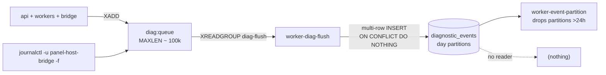

`apps/workers/diag-flush/src/index.ts` consumes under `GROUP = 'diag-flush'`, `CONSUMER = diag-flush-${pid}`, `COUNT` from `DIAG_FLUSH_BATCH_SIZE ?? 100`, `BLOCK 1000`. Batches become one multi-row `INSERT … ON CONFLICT (id, ts) DO NOTHING` (line 130) — idempotent on redelivery. Malformed entries are ACKed without insert after a warn (line 103), so poison messages cannot wedge the loop; loop-level failures sleep 1s and retry indefinitely. It also runs a journald forwarder (`journald-bridge.ts:23`) spawning `journalctl -u panel-host-bridge -o json -f`, which is the *only* route by which Go-bridge logs enter the diag pipeline — the bridge has no diag client. `apps/workers/event-partition/src/index.ts:22-51` maintains day partitions `diagnostic_events_<YYYYMMDD>` for offsets `[-1, 0, +1, +2]` and drops anything older than 24 hours, so diagnostic retention is one day.

Three defects in this pipeline are real and worth carrying forward. `diag-flush` has **no `XAUTOCLAIM`** despite `config-sync` (index.ts:251), `discord` (consume.ts:151) and `rcon` (commands.ts:147) all implementing reclaim — entries delivered to a consumer that then crashes stay pending forever. `diagnostic_events` is **write-only**: no route and no worker ever SELECTs from it, and the Drizzle model in `packages/db/src/schema/diagnostic-events.ts` is unused at runtime because the flusher bypasses Drizzle with `sql.unsafe`. Operators reach diag data only by direct SQL. And `DiagSeverity` is `info|warn|error|fatal` while the DB check constraint permits `debug` as well — the table accepts a level the producer type cannot express.

The kind vocabulary is large (~150 values, `<domain>.<event>`) and consistent: infrastructure (`pg.ping.fail`, `redis.reconnect.attempt`, `http.5xx`, `http.unhandled_rejection`, `worker.heartbeat_lost`, `bridge.rpc.error`, `bridge.rtt.outlier`, `ws.*`), lifecycle (`server.start.*`, `server.stop.*`, `server.install.*`, `container.unexpected_exit`), RCON (`rcon.connected`, `rcon.auth_failed`, `rcon.reconnect_attempt`), and a uniform `<worker>.{started,stopped,run_ok,run_failed}` convention.

### 11.5 Heartbeats and the watchdog

Workers write `worker:heartbeat:<name>` via `SET … EX ttl` every `HEARTBEAT_INTERVAL_MS = 5_000` with `HEARTBEAT_TTL_SECONDS = 30` (`packages/shared-config/src/heartbeat.ts`), publishing immediately before scheduling so the UI is not blind on the first tick. The watchdog is `apps/api/src/plugins/heartbeat-watch.ts`, ticking every 30s over a **hardcoded** `KNOWN_WORKERS` list, using `PTTL < 0` as the missing signal and emitting `worker.heartbeat_lost` / `worker.heartbeat_recovered` edge-triggered through a `reported` Set.

That list is `rcon, log-ingest, audit-archiver, event-partition, diag-flush, metrics-sampler` — **six of the nineteen** worker packages in `apps/workers`. `automation`, `backup`, `ban-sync`, `clan-guard`, `clan-priority-expirer`, `config-sync`, `discord`, `leaderboard-aggregator`, `presence-daily`, `role-expirer`, `scheduler`, `seed-reward` and `stats` are never watched. The plugin also hardcodes the key prefix as a template literal (line 34) instead of importing `HEARTBEAT_PREFIX`, which `health.ts:1` does import; and `HEARTBEAT_LOST_THRESHOLD_MS` equals the tick interval, so real detection latency is 30–60s regardless.

The bridge has a separate heartbeat (`apps/api/src/plugins/bridge-heartbeat.ts`), pinging every 5s and publishing live-bus `{ type: 'bridge.connection', data: { state, down_for_s } }` on transitions only. Unlike the Postgres and Redis probes it emits **no diag event** — an asymmetry in the degradation-signal surface.

### 11.6 The status reconciler and orphan sweep

`apps/api/src/plugins/status-reconciler.ts` is the most defensively written component in the repo; its docblock cites a production incident where a server hung in "Остановка". Constants (lines 31-36): `RECONCILE_INTERVAL_MS = 4_000`, `STUCK_AFTER_MS = 90_000`, `TICK_BUDGET_MS = 12_000`, `STALE_INSTALL_AFTER_MS = 30min`, `CRASH_LOOP_THRESHOLD = 3`, `CRASH_LOOP_WINDOW_MS = 5min`.

Each tick selects rows in `TRANSIENT_STATES = {starting, stopping, running, stopped, ready}` and inspects them via the bridge in parallel under a whole-tick budget:

```ts
// apps/api/src/plugins/status-reconciler.ts:388-395
await Promise.race([work, budget]);
tickState.lastBudgetExceeded = budgetExceeded;
if (budgetExceeded) {
  app.log.warn({ rows: rows.length, budgetMs: TICK_BUDGET_MS },
    'reconciler: tick budget exceeded — some servers will retry next tick');
}
```

`installing` and `failed` are excluded on purpose (comment at :38-42): a no-op container would otherwise flip a fresh install to `stopped` and mask a failure. `mapState` (:95) returns `{ status: null, known: false }` for unrecognised Docker states so the DB is left untouched rather than guessed. Per-server `bridgeFailures` counters escalate log level on a sparse schedule (`next === 5 || next === 30 || next % 60 === 0`) to avoid flooding, and the map is pruned each tick for rows no longer transient. An immediate tick fires on `onReady` so a restarted API converges stuck rows without waiting a full interval. `failStaleInstalls()` flips `installing` rows older than 30 minutes to `failed` — the watchdog for a mid-install API crash.

Crash detection compares Docker's `restart_count` against a `knownRestartCounts` baseline (`detectCrash`, :58 — the first observation returns `null` to avoid a false crash on boot). Crashes go into a Redis sorted set `crashes:<serverId>` scored by timestamp and trimmed to 24h; ≥3 within 5 minutes flips the row to `failed` with `source: 'crash_loop'`. A `stop:requested:<serverId>` fence (TTL 5min, set by `POST /stop`) distinguishes operator stops from crashes; if reading the fence throws, the code fails toward "unexpected" and says so.

`apps/api/src/plugins/orphan-sweep.ts` runs `cleanupOrphans` every `HOST_ORPHAN_SWEEP_INTERVAL_MS ?? 5min` and `docker system prune -af` via `fireAutoPrune` every `HOST_DOCKER_PRUNE_INTERVAL_MS ?? 24h`, both gated behind a `BOOT_DELAY_MS = 30_000` so the bridge socket is warm. Failures are caught and downgraded to `log.warn` (:42-44); the sweep emits no diag events at all.

### 11.7 The `servers.status` state machine

`servers.status` is a plain `text` column defaulting to `'pending'`, CHECK-constrained to eight values (`packages/db/src/schema/servers.ts:46-48`). Only six files ever write it, plus the creating INSERT.

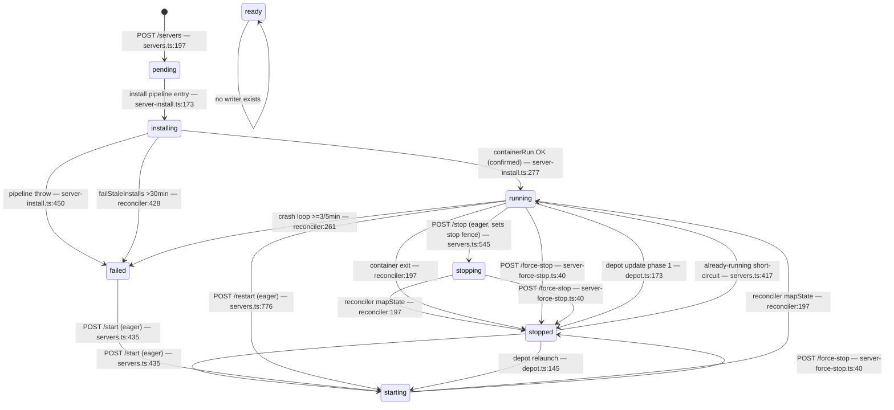

| From → To | Owner | Eager or confirmed | Observability side effects |
|---|---|---|---|
| — → `pending` | `routes/servers.ts:197` | n/a (in tx with settings + credentials) | audit `server.create` |
| `pending` → `installing` | `routes/server-install.ts:173` | eager | audit `server.install.started`, install-progress stream |
| `installing` → `running` | `server-install.ts:277` | **confirmed** (after `containerRun`) | sets `containerId`, diag |
| `installing` → `failed` | `server-install.ts:450` / `reconciler:428` | confirmed / watchdog | audit `server.install.failed`; liveBus `source:'reconciler'` |
| `*` → `running` | `servers.ts:417` (already-running) | confirmed | diag `server.start.done`, **no liveBus publish** |
| `*` → `starting` | `servers.ts:435` (start), `:776` (restart) | **eager**, by explicit comment | liveBus `source:'start'`/`'restart'`, diag, audit |
| `running` → `stopping` | `servers.ts:545` | **eager** | liveBus `source:'stop'`, audit, sets `stop:requested:<id>` |
| transient → mapped | `reconciler:197` / `:472` | **confirmed** | liveBus `source:'reconciler'`, `containerId = String(pid)`, exit diag |
| `running/starting/stopping` → `stopped` | `server-force-stop.ts:40` | confirmed (after `containerRm force`) | liveBus `source:'force_stop'`, audit |
| `running` ⇄ `stopped` | `routes/depot.ts:145,173` | mixed | **none** — the only status writes with zero observability |
| `running` → `failed` | `reconciler:261` | confirmed | liveBus `source:'crash_loop'`, `crashes:<id>` zset |

The eager writes are intentional: flipping to `starting` *before* the bridge call means an API crash mid-RPC leaves a transient row the reconciler will converge, rather than a lie about a container that never launched.

`ready` is dead. No writer ever sets it; it survives only in read predicates (`TRANSIENT_STATES` at reconciler:43, `PORT_CHANGEABLE_STATUSES` at `server-settings.ts:13`, `server-logs.ts:92`, `server-update.ts:29`, and the web settings page), all of which treat it as stopped-equivalent. It is in `TRANSIENT_STATES` but not `STUCK_CANDIDATE_STATES`.

Recovery ownership per stuck state: `starting`/`stopping` belong to the reconciler tick and surface in `stuck_servers` after 90s, with `POST /api/v1/servers/:id/reconcile` (`servers.ts:800`) as the manual nudge and `force-stop` as the escape hatch (the only route that accepts `stopping`). `installing` has only the 30-minute `failStaleInstalls` watchdog. `failed` has **no automatic recovery at all** — it is excluded from both `TRANSIENT_STATES` and `STUCK_CANDIDATE_STATES`, so it is invisible to the watchdog; an operator must `POST /start` or reinstall. `pending` has no watchdog whatsoever.

### 11.8 Error handling and degraded modes

The only `setErrorHandler` in the codebase is `apps/api/src/plugins/error-diag.ts:12`, and it is observability-only: it emits `http.5xx` for `status >= 500` with the stack truncated to 2000 chars, then delegates to `reply.send(err)` — Fastify's default serialization is preserved, no envelope normalization occurs. There is no `setNotFoundHandler` anywhere and no `ApiError`/`HttpError` hierarchy; the only custom `Error` subclasses are `MediaSizeLimitExceededError`, `MediaMagicByteMismatchError` (`lib/media-storage.ts:20,28`) and `PriorityPoolLimitError` (`routes/clans.ts:190`). A process-level `unhandledRejection` listener emits `http.unhandled_rejection` at severity `fatal`, guarded by a module-level boolean so repeated `buildServer()` calls in tests don't leak listeners. Both diag emits are `.catch(() => undefined)` — diagnostics never mask the original error.

There is **no circuit breaker anywhere**. The closest analogues are the reconciler's per-server failure counters, which only modulate log verbosity, and the bridge client's drop-socket-on-transport-error. Bridge retry is one attempt, no backoff, only for `code === 'transport'`, never for streaming calls and never for `timeout` (`packages/bridge-client/src/client.ts:306`); read-only methods opt in, mutating container-lifecycle methods do not — correct idempotency reasoning.

| Failure | Observed behaviour |
|---|---|
| **Bridge down** | `bridgeHeartbeat` warns and publishes `bridge.connection state:'down'` once — no diag event. `/ready` → **503**, pulling a working API out of rotation. Reconciler `containerInspect` throws per server; `bridgeFailures` climb; statuses **freeze at last known value**, never guessed. `metrics-sampler` stops producing host samples. Web `computeHostHealth` short-circuits to `{ level: 'critical', reasons: ['bridge disconnected'] }` (`apps/web/src/lib/host-health.ts:32-34`). `orphan-sweep` warns and skips. Journald forwarding of bridge logs stops with the unit. |
| **Redis down** | ioredis queues commands indefinitely (`maxRetriesPerRequest: null`, capped 2s backoff), so requests touching Redis **hang rather than fail fast**. `redis.ping.fail` / `redis.reconnect.attempt` are emitted, but `diag.emit` is itself an `XADD` to Redis — a circular dependency, so those events fall back to a pino warn and never persist. This is the one failure mode the diag pipeline structurally cannot observe. The `panel:logs` sink writes one stderr line then drops silently. `/ready` → 503. Heartbeats stop; on recovery every watched worker fires `worker.heartbeat_lost`. Sessions, rate limiting and the live bus all degrade. |
| **Postgres down** | `pg.ping.fail` every 30s — these *do* reach Redis and survive. `/ready` → 503. `diag-flush` throws, sleeps 1s, retries forever; entries stay unACKed and replay safely on recovery thanks to `ON CONFLICT DO NOTHING`. But `diag:queue` fills to `MAXLEN ~ 100_000` and then evicts the oldest — **silent diagnostic loss with no counter and no alert**. Reconciler ticks throw, `consecutive_tick_errors` climbs, `/api/v1/health/reconciler` reports `healthy: false`. |
| **Game server unreachable** | RCON supervisor enters exponential backoff (1s → 60s cap, `supervisor.ts:565`), deliberately reporting `'connecting'` rather than `'disconnected'` so the UI doesn't flap; emits `rcon.disconnected` / `rcon.reconnect_attempt` / `rcon.auth_failed`. A2S probes resolve `null` on timeout instead of throwing. `metrics-sampler` skips the server. Container-level death is caught separately by the reconciler within ~4s. |
| **Worker dies** | Its heartbeat key expires after 30s; it vanishes from `/api/v1/health/workers` (dead ≡ absent, not `down`). If it is one of the six in `KNOWN_WORKERS`, `worker.heartbeat_lost` fires 30–60s later; otherwise **nothing signals the loss**. Redis-stream consumers other than `diag-flush` reclaim its pending entries via `XAUTOCLAIM`; `diag-flush`'s pending entries are orphaned permanently. Compose `restart: unless-stopped` brings the container back. |
| **Parser misses a log line** | No signal. The log-ingest pipeline emits no counter for unmatched lines and `events_consumer_total` is never incremented, so a regex that stops matching a Squad build degrades aggregates silently. The only visible symptom is downstream: flat leaderboards, missing rounds. |

### 11.9 Notification channels that terminate in a database row

State this plainly, because four schemas imply otherwise: **the panel has no email transport and no web-push transport.** `email` and `webpush` are declared in `alert_rules.channels`, `seed_subscriptions.channel`, `AUTOMATION_NOTIFY_CHANNELS` (`packages/shared-types/src/automation.ts:42`) and in `apps/workers/log-ingest/src/alerts/sink.ts` — and nowhere else. The env-reading factory is explicit:

```ts
// apps/workers/log-ingest/src/alerts/sink.ts:134-140
const webpushConfig: WebPushConfig | null =
  vapidPublicKey && vapidPrivateKey
    ? { vapidPublicKey, vapidPrivateKey, subscriptions: [] }
    : null;

return { emailConfig, webpushConfig, sendEmail: null, sendWebPush: null };
```

`deliverAlert` can therefore only ever return `email_unconfigured` / `webpush_unconfigured`. Web push is dead twice over: `subscriptions` is hardcoded to `[]` and `deliverWebPush` early-returns on an empty list. No `nodemailer` or `web-push` dependency exists in any `package.json`; `grep "ALERT_"` across `.env.example` and both compose files returns zero matches; and the sole importers of `alerts/engine.ts` and `alerts/sink.ts` are its own two test files.

Six sites insert into `alert_events` (`packages/db/src/alt-ban.ts:92`, `packages/db/src/seed-notifications.ts:59`, `apps/workers/ban-sync/src/alerts.ts:48`, `apps/workers/role-expirer/src/reminders.ts:173`, `apps/api/src/lib/reporter-stats.ts:88`, `apps/workers/log-ingest/src/external-ban/store.ts:144`). The only consumer is a paginated read at `routes/alert-rules.ts:224`. There is no delivery worker, and `alert_events.delivered` — `notNull().default(false)` at `packages/db/src/schema/alert-rules.ts:39` — is never set to `true` by any production code path. `notifySeedSubscribers` matches `rule.channels` against `subscription.channel` and then does exactly two things: insert a row, publish a live-bus frame. Choosing `email` vs `webpush` in the settings UI changes which rows get written, never how a human is reached. Likewise all three real `notifyAdmin` implementations self-report failure — `apps/workers/automation/src/rules/deps.ts:153-159` logs a warn and returns `{ delivered: false, detail: { via: 'audit_log' } }`, yet the automation action is still recorded `status = 'executed'`.

| Channel | Reaches a human? | Terminus |
|---|---|---|
| `email` | **No** | `sendEmail: null` (sink.ts:139); module is test-only |
| `webpush` | **No** | `sendWebPush: null` + `subscriptions: []` (sink.ts:136) |
| `alert_events` row | **No** | read-only list at `alert-rules.ts:224` |
| Discord webhook | **Yes** | real HTTP POST, `apps/workers/discord/src/sender.ts` |
| In-game `AdminWarn` | **Yes** | RCON queue, `log-ingest/src/vip-expiry/warn.ts:68` |
| Live-bus toast | **Yes, if a session is open** | `redis.publish('live-bus', …)` → SSE/WS |

The alerting subsystem is also fully disjoint from the diag pipeline: no diag `kind` triggers an alert rule, so `worker.heartbeat_lost`, `pg.ping.fail` and `container.unexpected_exit` reach no notification channel of any kind. Any diagram that shows `channels: email | webpush` without annotating them as unimplemented invents a notification tier that does not exist.

---

## 12. End-to-end flows

Each trace below follows one real request from the first byte to the last durable side effect. Every hop names the file that owns it. Where two hops in different flows share a mechanism (the `onRequest` RBAC gate, the live-bus, `sendRconCommandViaWorker`), it is described once, in the flow where it first appears.

### 12.1 Steam login → session → RBAC → gated page render

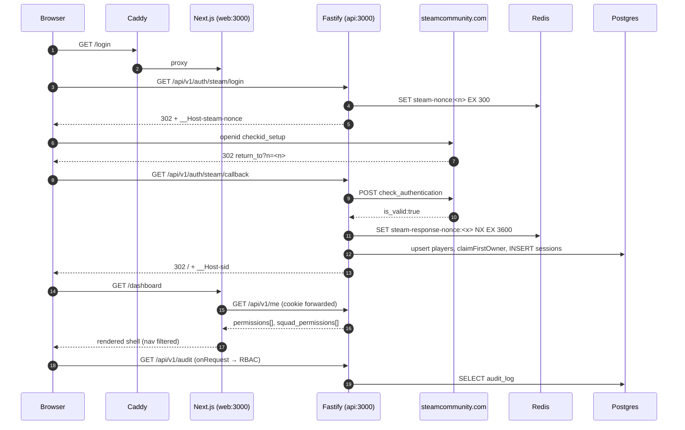

Caddy terminates TLS and splits by path: `@api path /api/* /health /ready /metrics` goes to `api:3000`, everything else to `web:3000` (`docker/Caddyfile:19-30`). Browser-issued API calls therefore never traverse Next.js; the `/api/:path*` rewrite in `apps/web/next.config.mjs:7` is only the dev/Next-direct fallback, and server-side `apiFetch` dials `http://api:3000` in-cluster (`apps/web/src/lib/api.ts:1,22`). The Next middleware deliberately does not authorize — it only checks that `__Host-sid` exists and redirects to `/login?next=…`, with an inline comment citing CVE-2025-29927 as the reason (`apps/web/src/middleware.ts:1-4,9-27`).

`GET /api/v1/auth/steam/login` mints a 16-byte nonce, stores `steam-nonce:<n>` in Redis with `EX 300`, sets a matching cookie, and 302s to Steam with `return_to = <PANEL_PUBLIC_URL>/api/v1/auth/steam/callback?n=<nonce>` (`apps/api/src/routes/auth-steam.ts:20-44`, `apps/api/src/lib/steam-openid.ts:9-21`). The callback runs five guards before any DB access — nonce match, nonce freshness, `return_to` prefix check, Steam-side `check_authentication`, and a replay guard `SET steam-response-nonce:<openid.response_nonce> 1 EX 3600 NX` whose non-`OK` reply means the signed assertion was already consumed (`auth-steam.ts:55-95`). Profile enrichment is explicitly non-fatal; the display name falls back to `Player <last-4>`.

Identity resolution is a select-then-insert against `players` keyed on `steam_id64` (`auth-steam.ts:108-133`) — not an `ON CONFLICT` upsert, so concurrent first logins race the `players_steam_id64_unique_idx`. `claimFirstOwner` serializes under `pg_advisory_xact_lock(hashtext('panel_first_owner'))` and is idempotent (`apps/api/src/lib/first-owner.ts:21-45`); it also writes a marker file through the Go bridge, swallowing errors because "DB is the source of truth."

| Store | Key | Contents |
|---|---|---|
| Cookie | `__Host-sid` | raw `s_<uuidv7>_<24B base64url>`; `httpOnly`, `secure`, `sameSite=lax`, `maxAge=SESSION_TTL_SECONDS` (86400, `apps/api/src/config.ts:13`) |
| Postgres `sessions` | `id = sha256(token)` | `player_id`, `expires_at`, `last_activity_at`, `ip`, `user_agent` (`packages/db/src/schema/sessions.ts:4-24`) |
| Redis | `session:<tokenId>` `EX 600` | read-through cache of the row (`apps/api/src/lib/sessions.ts:177-189`) |
| Redis | `session-touch:<id>` `EX 60 NX` | sliding-expiry throttle lock (`sessions.ts:163-174`) |

The raw token is never persisted. On the panel side, `(dashboard)/layout.tsx:16` calls `requireSession()` — `getSession()` wrapped in React `cache()`, forwarding the cookie to `/api/v1/me` and `redirect('/login')` on any throw (`apps/web/src/lib/dal.ts:20-37`). `TopNav` filters items by the returned permission list (`apps/web/src/components/TopNav.tsx:15-25`).

The actual gate is a **single global `onRequest` hook** in `apps/api/src/plugins/auth.ts` — there is no `preHandler` hook anywhere in `apps/api/src`. It resolves the session, loads the player, attaches `req.user.permissions` from `loadUserPermissions` (`apps/api/src/lib/rbac.ts:91-208`), touches the session, then enforces the route's declared config:

```ts
// apps/api/src/plugins/auth.ts:114-125
const required = req.routeOptions?.config?.permissions;
if (!required || required.length === 0) return;
if (!req.user) { reply.code(401).send({ error: 'unauthenticated' }); return; }
for (const perm of required)
  if (!req.user.permissions.permissions.has(perm)) {
    reply.code(403).send({ error: 'forbidden', required }); return;
  }
```

Two properties of this gate matter downstream. First, permissions are **deny-by-exception**: `derivePanelPermissions` grants every key in the 51-key `PERMISSION_KEYS` set to any role with `panel_access`, subtracting only four gated subsets (`rbac.ts:49,59-69`); explicit `role_permissions` rows can only add. Second, the permission cache is a **module-level `Map` with a 30 s TTL** (`rbac.ts:32`), not Redis — a multi-instance API serves stale permissions for up to 30 s after a role change, unlike sessions and nonces which are Redis-backed. A Bearer-token branch exists but only fires when no session cookie is present, intersecting token scopes with role permissions (`auth.ts:69-111`). Server-side revocation publishes a `session.revoked` live event that `ForcedLogout` turns into a redirect within ≤5 s (`apps/web/src/components/ForcedLogout.tsx:16-25`).

### 12.2 Create + install a Squad server

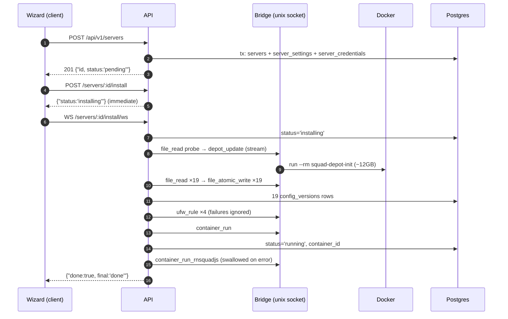

The wizard (`apps/web/src/app/(dashboard)/servers/new/page.tsx`) is a single `'use client'` four-state machine with **no server action and no route handler**; it makes three sequential calls (create, install, WS). `POST /api/v1/servers` (`apps/api/src/routes/servers.ts:147`, `permissions: ['server:install']`) validates a `.strict()` Zod schema that requires all four ports distinct, cross-checks them against every non-deleted server for a `409 port_conflict`, then writes three rows in one transaction. `rconHost` is deliberately left NULL so each consumer resolves it from its own `RCON_HOST_DEFAULT`. No filesystem, bridge, or container work happens here.

`POST /:id/install` (`apps/api/src/routes/server-install.ts:360`) returns synchronously and launches a **fire-and-forget async IIFE** — there is no queue and no worker; the install runs in the API's event loop. Only `status === 'installing'` yields `409 install_in_progress`, so retry-after-failure is simply "POST again."

| Step | Bridge RPC | Persisted |
|---|---|---|
| depot | `file_read` probe → `depot_update` (stream) | — |
| configs | `file_read` ×19 → `file_atomic_write` ×19 | 19 `config_versions` rows |
| ufw | `ufw_rule` ×4 (`add`) | diag only |
| container | `container_run` | `status='running'`, `container_id` |
| rnsquadjs | `file_atomic_write`, `container_run_rnsquadjs` | — |

There is no `mkdir` among the bridge's **30 RPC methods** (`packages/shared-config/src/bridge-methods.ts`): directories appear as a side effect of `fsx.AtomicWrite` calling `mkdirAllWithMode(dir, 0o755)` (`apps/bridge/internal/fsx/fsx.go:139`), which re-chmods each segment because the bridge unit runs `UMask=0077`. The depot probe reads `${depotRoot}/SquadGameServer.sh`; a non-empty read skips the ~12 GB `steamcmd +app_update 403240 validate` transient container entirely (`apps/bridge/internal/runner/docker.go:626`, `docker/depot-init.Dockerfile:35-39`). `seedConfigs` copies the 19 `ALLOWED_CONFIG_FILES` out of the depot, rewriting `Rcon.cfg` (`Port`, decrypted `Password`, `IP=0.0.0.0`) and `Server.cfg` (`ServerName`), and pairs each write with a `config_versions` row carrying `authorLabel: 'system'` — that is the baseline History/Blame diff against, so the first human `PUT` becomes v2. A missing depot default is non-fatal: an empty file is written. Each of the four `ufw_rule` calls is individually try/caught — **firewall failure never fails the install**.

`container_run` composes `--network host` plus three mounts, and this is exactly how the depot is shared: one named volume, read-only, in every server container.

```go
// apps/bridge/internal/runner/docker.go:55+
"run", "-d", "--pull", "never", "--name", name, "--restart", "unless-stopped",
"--network", "host",
"-v", spec.DepotVolume + ":/squad:ro",
"-v", spec.ConfigsHost + ":/squad/SquadGame/ServerConfig:rw",
"-v", spec.SavedHost + ":/squad/SquadGame/Saved:rw",
```

`status` flips to `'running'` **as soon as `docker run -d` returns** — "running" means "container created", not "Squad booted." Progress is an in-process `EventEmitter` plus a 500-line ring buffer (`apps/api/src/plugins/install-progress.ts`), so it is lost on API restart, does not fan out across replicas, and truncates on a depot download that easily exceeds 500 lines.

**Failure is not rollback.** The `finally` at `server-install.ts:445` sets `status='failed'`, writes an audit row and an error progress line — and stops. The container is not removed, the four ufw rules stay, the seeded directory and its 19 `config_versions` rows survive, and the hop-1 DB rows remain. The orphan sweep (`apps/api/src/plugins/orphan-sweep.ts`, 5 min) only removes artefacts whose UUID is *absent* from `servers`, so a failed install's debris is never collected; only an operator soft-delete cleans up (`apps/api/src/lib/server-delete.ts:137-190`).

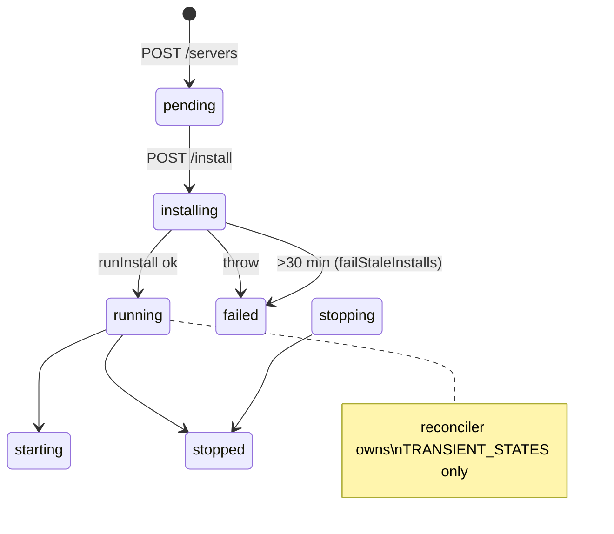

`apps/api/src/plugins/status-reconciler.ts` ticks every `RECONCILE_INTERVAL_MS = 4_000` and touches only `TRANSIENT_STATES = {starting, stopping, running, stopped, ready}` — `installing` and `failed` are excluded by an explicit comment, so a not-yet-created container cannot flip a fresh install to `stopped`. `failStaleInstalls()` (`:418`) flips `installing` rows older than `STALE_INSTALL_AFTER_MS = 30 min` to `failed`, the only recovery when the API process dies mid-install. `ready` is in the enum and in `TRANSIENT_STATES` but is never written by any code path.

### 12.3 An RCON admin action round trip

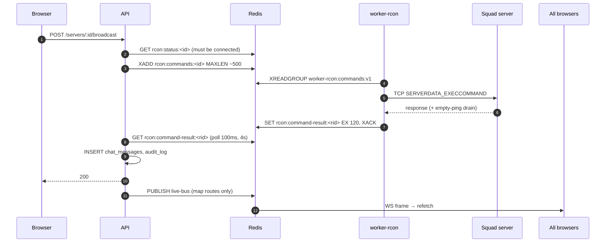

`sendRconCommandViaWorker` (`apps/api/src/lib/rcon-worker-command.ts:39`) is the single chokepoint. It first probes `rcon:status:<serverId>` for `state === 'connected'`, then `XADD`s a `.strict()` `rconCommandRequestSchema` message — `{request_id (uuidv7), command, args[], actor_player_id, enqueued_at}` where `command` must be one of eight allowlisted `RCON_OPERATOR_COMMANDS`. Arbitrary RCON strings cannot be enqueued. It is then a **synchronous request/reply**: the API busy-polls `GET rcon:command-result:<request_id>` every 100 ms for 4 000 ms and deletes the key on read, so exactly one API instance consumes it.

The worker's `RconCommandQueue` (`apps/workers/rcon/src/commands.ts:76`) starts only after TCP auth, loops `XREADGROUP … BLOCK 500`, and runs an `XAUTOCLAIM` reclaim every 30 s for entries idle >60 s — the crash-recovery path, made safe by a `resultExists(requestId)` short-circuit. `buildOperatorCommand` (`commands.ts:48`) is the injection gate: it re-parses with the same Zod schema, rejects CR/LF/NUL, caps lengths, and constrains ban length to `/^\d+[smhdwMy]?$/`. Transport is raw `node:net` Valve Source RCON with a serialized `execQueue` and the multi-packet "empty ping" drain (`apps/workers/rcon/src/client.ts:79-105`). The worker `XACK`s on **both** success and failure, so a failed command is never retried by the stream.

The two timeouts do not agree: the worker's per-command timeout is 10 000 ms against the API's 4 000 ms wait, so a slow game server reliably returns `reason:'timeout'` to HTTP while the worker later writes a result key nobody reads.

| Condition | Outcome | HTTP |
|---|---|---|
| No `rcon:status` key (5-min TTL) | `{attempted:false, reason:'worker_not_connected'}` | 502 |
| `XADD` throws | `reason:'worker_unavailable'` | 502 |
| Game server slow/dead | `{attempted:true, ok:false, reason:'timeout'}` after 4 s | 502 |
| Validation / RCON error | `reason:'worker_rejected'` + `detail` | 502 |

Ordering is **RCON first, DB second** (`apps/api/src/routes/server-messaging.ts:95-118`): a failed broadcast writes nothing at all, not even an attempt audit row, and nothing is transactional — RCON, `chat_messages`, and `audit_log` can diverge.

Fan-out is `app.liveBus.publish` (`apps/api/src/plugins/live-bus.ts:355-363`): a local `EventEmitter` emit plus `PUBLISH live-bus` with an `_origin: instanceId` that the subscriber uses to drop its own echo. Workers publish to the same channel without `_origin`, so worker events reach every API replica. `GET /api/v1/ws/live` (`apps/api/src/routes/live.ts:19`, `permissions: ['server:view']`) is a **WebSocket, not SSE**: it filters per connection (`combat.event` needs `combatView`, `session.revoked` matches `player_id`), replays 100-entry chat/combat ring buffers on connect, pings every 10 s and closes 4000 after 30 s without a pong. The browser side is a module-singleton reconnecting socket with ref-counted retain/release and `[1,2,4,8,16,30]s` backoff (`apps/web/src/lib/live-bus.ts`). There is **no query cache**: `useLiveSubscription` simply triggers a refetch of the relevant REST endpoint.

The sharp inconsistency: only `apps/api/src/routes/server-map.ts:185,239,283` follows the intended pattern of publishing right after the RCON call. Broadcast and the kick/warn/ban report actions publish **nothing**, so a kicked player lingers in every browser until the RCON worker's next 30 s roster poll writes `rcon:roster:*`. The `LiveEvent` union (23 event types) is hand-duplicated in `apps/api/src/plugins/live-bus.ts:5` and `apps/web/src/lib/live-bus.ts:1` and the two copies already disagree.

### 12.4 Squad log line → parsed event → DB rows → live UI → aggregates

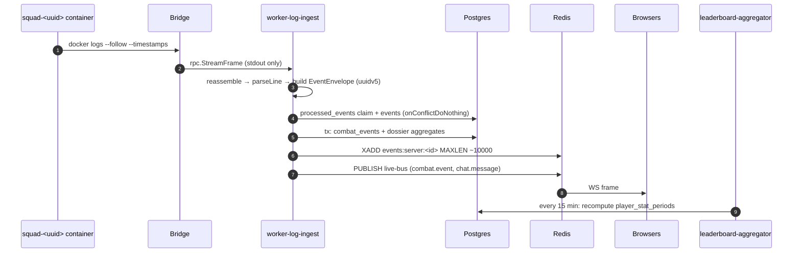

The panel ingests **container stdout, never the log file**: `DockerRunner.LogsFollow` shells `docker logs --follow --timestamps` (`apps/bridge/internal/runner/docker.go:588`) and `Dispatcher.containerLogsFollow` frames chunks over the `SO_PEERCRED`-gated unix socket. `apps/workers/log-ingest/src/tail.ts:35` drops stderr frames and does its own newline reassembly across chunk boundaries; `TailManager` reconciles tails every 15 s from `servers.status IN ('running','starting')`, minus servers handed to the RNSquadJS cutover.

`LogIngestor.ingest` (`src/parser/ingest.ts:108`) is the single funnel: benign-noise drop → fatal detection → prefix parse → chat → vote → combat/vehicle → report → `handleMessage`. Two stateful correlations run in-process, both windowed by `joinCorrelationWindowMs` (2500 ms): the `AddClientConnection` IP / `Join succeeded` name / `LogRedpointEOS` triple collapses into one `player.connected`, and an `OnPossess`/`OnUnPossess` map attributes kills to vehicles. `build()` mints an `EventEnvelope` whose `event_id` is a **UUIDv5 over a stable stringification of `{server_id, type, ts, payload}`** — content-addressed, so the same line re-read after a restart yields the same id.

That id is the whole idempotency story, because there is **no checkpoint or offset store**: resume is `--tail 100` plus the `processed_events` claim and `onConflictDoNothing` on `(event_id, occurred_at)`. Any outage longer than the docker log buffer is simply lost; no backfill exists. Ordering is per-domain: three serial promise chains (`matchChain`, `voteChain`, `combatChain`) preserve log order within a server, while envelope persistence and stream publish are fire-and-forget `.catch()` calls, unordered relative to each other.

Two fan-out channels exist and are not the same mechanism. The Redis **stream** `events:server:{id}` (`src/publish.ts:11`, `SET NX` dedup 24 h then `XADD … MAXLEN ~10000`) feeds the automation, discord, config-sync and ban-sync workers; `CONSUMER_GROUP.stats` is declared but no consumer implements it. The Redis **pub/sub** channel `live-bus` carries ready-made UI frames straight from `combat/store.ts` and `chat/store.ts` to the WebSocket described in §12.3.

The derived path has four stages: (1) a **synchronous fold** inside the `combat_events` transaction upserts `player_weapon_stats`, `player_vehicle_stats`, `player_vehicle_kills` — deliberately outside the partitioned fact table so dropping a 24-month partition never erases dossier history (`packages/db/src/dossier/aggregate.ts:11-21,174`); (2) **match close** rebuilds `match_players` from `player_sessions` overlap math and folds kills/deaths from `events.payload` JSON; (3) **worker-leaderboard-aggregator** ticks every 15 min, `DELETE`ing and re-`INSERT`ing `player_stat_periods` with `bonus_points = k_online*online + k_boost*boost + k_seed*seed`, then `SCAN`-deleting `leaderboard:*` cache keys; (4) `GET /api/v1/players/:playerId/dossier` assembles the read model, gated on `combat:view` and Redis-cached 60 s with an `x-cache` header.

Three defects in this chain are load-bearing and verified. **`player_sessions` has no production writer** — `openPlayerSession`/`closePlayerSession` (`packages/db/src/presence/sessions.ts:27,53`) are referenced only by `packages/db/test/player-sessions.test.ts`; the sole live mutator is `splitOpenSessionsAtSeedingTransition`, which only edits rows that already exist. Since `computeMatchRoster` derives `match_players` purely from `player_sessions`, the roster/leaderboard chain is starved at its root. **`combat_events.match_id` is permanently NULL** (a `bigint` column against a `uuid` match id). And `docker logs --timestamps` prefixes every line with RFC3339, while `parseLine` anchors on `^\[` and nothing strips the prefix — if the stamp is present at runtime, every line falls into the silent "doesn't start with `[`" branch, which emits no diagnostic at all. A parse that reaches a known category but matches no handler is likewise invisible: no diag, no counter, and `STREAM_NAME.eventsDlq()` is defined but never written.

### 12.5 The ban lifecycle

**There is no `bans` table and no ban-file writer.** A ban is a row in `moderation_actions` with `action_type='ban'` (`packages/db/src/schema/moderation-actions.ts:24-61`), and enforcement is delegated entirely to Squad's RCON `AdminBan`, which writes `Bans.cfg` itself, on the game server, outside the panel's knowledge.

| Producer | Entry point | Enforcement | Ledger |
|---|---|---|---|
| Report card | `POST /reports/:id/actions` (`apps/api/src/routes/report-actions.ts:282`) | RCON `AdminBan` | `moderation_actions` ×(1 + alts) |
| External-ban promotion | `POST /players/:id/external-bans/:eid/local-ban` (`external-bans.ts:237+`) | RCON `AdminBan` | ×1 |
| Automated external match | `apps/workers/log-ingest/src/external-ban/store.ts:227` | RCON `AdminKick` — never a ban | `external_ban_kick` |

The generic player-card ban (MOD-2) is explicitly not built; `mod:ban_temp`, `mod:ban_perm` and `mod:unban` are flagged `unimplemented: true` in `packages/shared-config/src/permissions.ts:85-98`, and automation rules contain no ban or kick action at all. Ban is the only action permitted against an offline player (`report-actions.ts:338-344`). Before banning, `loadBanAltWarning` re-enters the API through `app.inject('/api/v1/players/:id/alt-candidates')` — an in-process HTTP hop chosen so ALT-1 stays the single source of truth — and `also_player_ids` must be a subset of the confirmed alt set or the request 400s.

Like the broadcast in §12.3 this path is RCON-first, DB-second and has no transaction and no outbox, so a crash between the RCON round trip and the insert leaves a ban applied in-game with **no ledger row**. The "has active ban" predicate is written three incompatible ways across `ban-alt-warning.ts:99-110`, `player-alt-candidates.ts:305-310`, and `alt-ban/store.ts:71`; the two `LIKE '%ban%'` variants also sweep in `external_ban_kick` and `banned_name_kick`.

#### The outbox path bans do not use

The `admins_cfg_sync_outbox` → `worker-config-sync` → bridge → in-game reload pipeline carries **only `Admins.cfg`** — roles, whitelist, VIP, clan priority. All 20 call sites of `publishAdminsCfgSyncForAllServers` are role/whitelist/VIP/clan/economy mutations; not one is a ban.

```mermaid
sequenceDiagram
    participant A as API (mutation tx)
    participant P as Postgres
    participant R as Redis
    participant CS as worker-config-sync
    participant BR as Bridge
    participant SQ as Squad
    A->>P: INSERT admins_cfg_sync_outbox (inside tx)
    A->>R: best-effort XADD, stamp relayed_at
    P->>CS: relayAdminsCfgSyncOutbox (FOR UPDATE SKIP LOCKED)
    CS->>BR: file_read Admins.cfg
    CS->>CS: hash //SQUAD-PANEL BEGIN…END segment
    CS->>BR: file_atomic_write (only on mismatch)
    CS->>SQ: RCON AdminReloadServerConfig
```

The outbox insert rides inside the mutation transaction (`apps/api/src/lib/admins-cfg-sync.ts:43-68`); the immediate `XADD` is a latency optimisation whose failure is non-fatal because `relayAdminsCfgSyncOutbox` (`packages/db/src/admins-cfg-outbox.ts:52`, `FOR UPDATE SKIP LOCKED`) covers the gap at-least-once. The worker splices only the `//SQUAD-PANEL BEGIN…END` managed segment and writes solely on hash mismatch (`apps/workers/config-sync/src/syncer.ts:173-226`), then forces `AdminReloadServerConfig` (`:278-281`) because Squad does not passively re-read the file. Passive `drift_check` sweeps deliberately **detect but never auto-correct** — drift is surfaced as a UI banner with a Force-sync button rather than silently overwriting manual edits.

`Bans.cfg` reaches a server only through the generic config editor (`PUT /api/v1/servers/:id/configs/Bans.cfg`, perm `config:edit`): it is in `ALLOWED_CONFIG_FILES` and `HOT_RELOAD_FILES`, so it is written by `file_atomic_write` and followed by a reload. **No code parses, generates, or reconciles its content.**

#### Expiry, unban, publication

Ban expiry has no worker. `role-expirer` and `expiry_notifications` are VIP/role expiry only. A temporary ban expires inside Squad, which owns the `Bans.cfg` unix timestamp, and *virtually* at read time in the published banlist. The `moderation_actions` row is never touched. **Unban is not implemented**: no code anywhere writes `reverted_at`/`reverted_by` — every occurrence across `apps/` and `packages/` is a `SELECT … reverted_at IS NULL` read, and `banlist-publish.ts:99` says so outright. Consequently `moderation.unban` is a dead event type: declared in the shared events union, mapped in `apps/workers/discord/src/mapping.ts:19`, given a Discord template and a UI label, with no producer. Un-banning in practice means hand-editing `Bans.cfg`, which leaves the panel ledger and the published banlist permanently divergent with no reconciliation path.

Publication is `GET /api/v1/public/banlist` (`apps/api/src/routes/public-banlist.ts:91`), gated on scope `banlist:read` **and** the `banlist_publication_settings` singleton (disabled → 404), rate-limited 30/min:

```ts
// apps/api/src/lib/banlist-publish.ts:122-135
const candidates = playerRows.map(toEntry)
  .filter((e) => e.expiresAtMs === null || e.expiresAtMs > nowMs)
  .filter((e) => scope !== 'permanent_only' || e.expiresAtMs === null);
const permanent = candidates.find((e) => e.expiresAtMs === null);
const chosen = permanent ?? candidates.reduce((a, e) => (e.expiresAtMs ?? 0) > (a.expiresAtMs ?? 0) ? e : a);
```

Expiry is derived from `ban_length`, never stored, with `M`/`y` approximated as 30/365 days. `formatSquadBansCfg` emits `Banned:<SteamID64>:<unix> // <reason>` and **silently skips EOS-only entries**, which appear only in `format=json`. The `ETag` is a sha256 over the body with `If-None-Match` → 304, while `last-modified` is `max(issuedAt)` and therefore never advances when a ban merely expires or is reverted.

### 12.6 The second, file-oriented log path: retention sweep

Disjoint from §12.4 in every respect — same underlying game output, no shared code. `worker-log-ingest` owns the schedule: `LOG_RETENTION_SWEEP_INTERVAL_MS = 60 * 60 * 1000`, fired once immediately at boot and then hourly, guarded by an `inFlight` re-entrancy flag (`apps/workers/log-ingest/src/retention.ts:5,61-80`). Each run emits a `log.retention.sweep` diag — the only observability surface.

The retention window is a **bridge-side Go constant**, not env and not DB: `squadLogRetentionDays = 10`, `squadLogRetentionErrorLimit = 20` (`apps/bridge/internal/handlers/handlers.go:581-584`). The RPC takes no duration and no path — `squadLogRetentionSweepParams` has exactly one field, `archive_server_ids`, decoded with `DisallowUnknownFields()`, so a caller-supplied `path` is rejected as `invalid_args`. That is the security property: destructive path handling is bridge-owned, while the sibling read RPC `squad_log_list` does accept a caller path. The worker supplies only the server ids whose `server_settings.archive_logs_to_backup` is true and which are not soft-deleted; the bridge revalidates each with `validate.ServerUUID` and rejects the whole request before touching any file.

The sweep walks `savedRoot/<uuid>/SquadGame/Saved/Logs` and acts only on rotated files (`name != "SquadGame.log" && HasPrefix("SquadGame") && HasSuffix(".log")`) — the live log is never touched. Ordering is archive-then-delete with a hard rule: a failed copy records an error and `continue`s, so a file is never deleted unarchived. Archives land in `<backupDumpRoot>/log-archive/<serverID>/<name>` via `CreateTemp` + `Sync` + `Rename`, inside the `backup_dump` volume — so they ride the existing restic snapshot with no extra invocation. Nothing ever re-parses archived files. Two risks: no lock, so two `worker-log-ingest` replicas would both sweep; and the 20-error cap silently truncates a mass failure.

### 12.7 restic backup and restore

A snapshot contains **logical dumps, not raw volumes**. The `backup` service (`docker-compose.yml:510-536`, behind `profiles: ['backup']`) backs up only the staging volume `backup_dump:/data`:

```yaml
BACKUP_CRON: '0 3 * * *'
RESTIC_FORGET_ARGS: '--keep-daily 7 --keep-weekly 4 --keep-monthly 6 --prune'
RESTIC_BACKUP_SOURCES: /data
PRE_COMMANDS: |
  mkdir -p /data/postgres /data/redis
  PGPASSWORD=$${POSTGRES_PASSWORD} pg_dump -h postgres -U admin -d admin -Fc -f /data/postgres/admin.dump
  redis-cli -h redis --rdb /data/redis/dump.rdb
```

So a snapshot is `admin.dump` + `dump.rdb` + the LOG-3 log archive. The `postgres_data`/`redis_data` binds are never in the repository — deliberate: logical dumps restore into a fresh stack, a snapshot of live WAL/AOF files cannot. Explicitly **not** backed up: media uploads under `MEDIA_STORAGE_DIR`, the `squad-depot` volume, `/var/lib/squad-panel` configs and `Saved/`, and `caddy_data`.

All three routes in `apps/api/src/routes/host-backup.ts` require `host:manage`, and restore carries a typed-confirm token enforced for real on both sides — the body must include `confirm` equal to the snapshot id (`host-backup.ts:76-84`), and the UI disables submit until `typed.trim() === shortId` (`apps/web/src/components/RestoreSnapshotButton.tsx:37,155`). The API has no docker socket, so all three delegate to the bridge, where two guards matter: `composeDir()` fails **closed** with `ErrForbidden` if `PANEL_COMPOSE_DIR` is unset or relative, and `validate.ResticSnapshotID` (`^[a-f0-9]{8}([a-f0-9]{56})?$` or `latest`) is the injection gate before the id reaches a shell. `BackupRestore` does not reimplement restore in Go — it shells `bash <dir>/scripts/restore.sh --apply --snapshot <id>`.

Restore is a dry run by default; `--apply` is destructive. Postgres restores via `pg_restore --clean --if-exists`. Redis needs a conversion, because the live service runs `--appendonly yes` and would boot from the AOF, silently ignoring a dropped-in RDB:

```sh
# scripts/restore.sh:148-155
redis-server --dir /data --dbfilename dump.rdb --appendonly no --save "" &
until redis-cli ping 2>/dev/null | grep -q PONG; do sleep 0.3; done
redis-cli config set appendonly yes >/dev/null
until [ "$(... aof_rewrite_in_progress ...)" = "0" ]; do sleep 0.3; done
```

Two acceptance harnesses exist: `scripts/test-backup-restore.sh` runs on the CI `docker` job with Postgres/Redis/log-archive canaries, while `scripts/test-fullstack-down-v.sh` performs the real `docker compose --profile backup down -v` and is deliberately excluded from CI — it exits 2 unless `RUN_FULLSTACK_DOWN_V=1`, because the full stack twice plus a restic restore is too large for the standard hosted runner's 2 vCPU / 8 GB / 14 GB disk. The most consequential fact: `compose.tk104.yml` contains zero occurrences of `backup` or `restic`, and the bridge's `composeBackupArgs` hard-codes `-f <dir>/docker-compose.yml` — **the entire backup subsystem is dev/self-hosted-compose only; the tk104 production stack is unbacked.**

---

## 13. Shared packages and dependency rules

Five workspace packages under `packages/` carry every cross-process contract in the monorepo. All are `private`, `type: module`, and use the **`development` conditional export** pattern (`packages/shared-types/package.json:7-25`) so `tsx` and vitest resolve `src/*.ts` directly while built consumers resolve `dist/*.js`. There are no TypeScript `paths` aliases and no project references anywhere — resolution is 100% pnpm symlinks plus `exports` conditions.

| Package | Runtime deps | Internal deps | Role |
|---|---|---|---|
| `@squad/shared-types` | `zod` | none | Zod schemas + pure logic (envelope, API models, cron, automation) |
| `@squad/shared-config` | **none at all** | none | Constants, registries, wire codecs, pure helpers |
| `@squad/diag` | `uuid` (`ioredis`/`pino` are type-only devDeps) | none | Diagnostic event model → `diag:queue` |
| `@squad/db` | `drizzle-orm`, `postgres`, `uuid` | `@squad/shared-config` (**declared, never imported**) | Schema + query layer |
| `@squad/bridge-client` | `zod`, `uuid` | `@squad/shared-config` | TS half of the Go bridge RPC |

### 13.1 `@squad/shared-types` — the EventEnvelope contract

The barrel re-exports 10 of the 11 modules; `server-settings.ts` is *not* in it and reaches consumers only through a re-export block at `api.ts:189-201`. Subpath exports exist for `./events` and `./api` only.

The live-bus envelope is the single most important contract in the repo (`packages/shared-types/src/events.ts:53-71`):

```ts
export const eventEnvelope = z
  .object({
    event_id: z.string().uuid(),
    version: z.number().int().positive(),
    type: z.enum(EVENT_TYPES),
    server_id: z.string().uuid().nullable(),
    ts: z.string().datetime(),
    actor: z.object({ kind: actorKind, id: z.string().nullable() }).nullable(),
    correlation_id: z.string().uuid().nullable(),
    payload: z.unknown(),
  })
  .strict();
```

`payload` is deliberately `z.unknown()`. Binding a type to its payload is a **second-stage lookup** through `PAYLOAD_SCHEMAS` (`events.ts:249-272`), and `validatePayload` (`events.ts:274-287`) **returns `{ok: true}` for any type with no registered schema**. Only **22 of the 37 `EVENT_TYPES`** have a payload schema; `player.name_changed`, `bridge.connected`/`disconnected`, `performance.degraded`, `server.install.*`, `bansync.completed`/`failed`, and `server.restarted`/`updated`/`installed` are unvalidated pass-throughs. (These 37 Redis-stream types are a different set from the 23 WebSocket live-bus event types — do not conflate them.)

**Envelope versioning is convention only.** No `EVENT_ENVELOPE_VERSION` constant exists; every producer hardcodes the literal `version: 1` (`apps/workers/rcon/src/supervisor.ts:342,380,793`, `apps/workers/log-ingest/src/parser/ingest.ts:368`, `apps/api/src/routes/report-actions.ts:140`, `apps/workers/scheduler/src/deps.ts:320`), and no consumer branches on it — `apps/workers/discord/src/consume.ts:44` and `apps/workers/automation/src/dispatch.ts:40` just `safeParse` and drop failures. A v2 rollout has no compatibility mechanism.

#### How types actually cross the client/server boundary

Three mechanisms, only one sound.

**(a) Shared Zod, both sides — the good path.** `shared-types` is the only package both `apps/web` and `apps/api` import. `apps/web/src/app/(dashboard)/servers/[id]/schedule/page.tsx:3` imports `isValidCron5`/`minCron5IntervalMinutes`; the API's seed-schedule route imports the same symbols, so the client's cron preview cannot diverge from server validation. `cron5.ts` (API + scheduler + web) and `automation-engine.ts` (worker + API dry-run) are the genuinely three-way-shared modules.

**(b) Request inputs — real; responses — a bare cast.** API routes bind shared schemas straight into Fastify via `ZodTypeProvider` (`apps/api/src/routes/servers.ts:154` → `schema: { body: serverCreateInput }`, also `server-settings.ts:39,257`, `layers.ts:48`, `media.ts:222`). The web side does not reciprocate: `apps/web` has **zero `from 'zod'` imports**, `zod` is not even a dependency, and its only `@squad/shared-types` uses are the two cron helpers. `apiFetch` ends in `return (await res.json()) as T` (`apps/web/src/lib/api.ts:16`) with `T` a locally declared interface — ~600 of them under `apps/web/src`. No route file declares a Zod `response:` schema, so the generated OpenAPI document describes requests and almost no responses.

**(c) The WebSocket `LiveEvent` union is duplicated and already drifted** — declared independently at `apps/api/src/plugins/live-bus.ts:5` and `apps/web/src/lib/live-bus.ts:1`. `'externalban.matched'` exists only server-side; `'match.started'`/`'match.ended'` exist only in the web union with no publisher anywhere in `apps/api/src` (they are Redis-stream `EVENT_TYPES` mistakenly mirrored into the socket union — those branches are dead). No test asserts parity, and neither union lives in a shared package.

**Property-based tests are absent from this package.** `@fast-check/vitest` is a root devDep, but `grep -rln fast-check packages/shared-types` returns nothing; its 10 test files are example-based. `test/events.test.ts:36-59` covers accept/reject, unknown type, `version: 0`, and `.strict()` excess-property rejection. The repo's **only** shared-package property test is `packages/shared-config/test/property/registry.test.ts` (29 lines): every `PERMISSION_KEYS` member passes `isPermissionKey`, arbitrary unregistered strings are rejected, and every `fc.subarray` of the registry is a valid role permission set.

### 13.2 `@squad/shared-config` — registries with zero runtime dependencies

19 modules plus a barrel; five have browser-safe subpath exports (`./admins-config`, `./banned-names`, `./role-colors`, `./permissions`, `./squad-permissions`).

**Permission catalogues.** `src/permissions.ts:29-174` declares **51 keys** across 16 `PERMISSION_CATEGORIES`, typed `as const satisfies readonly PermissionDef[]` so `PermissionKey` is a literal union. **11 are `dangerous: true`** and **17 are `unimplemented: true`** — a third of the catalogue is declared-but-inert. `src/squad-permissions.ts:8-56` holds the separate **21-key** in-game Squad permission set (4 dangerous), consumed by both `apps/api/src/lib/rbac.ts:3-9` and the web group editor. There is deliberately **no role catalogue constant**: roles are DB rows (`packages/db/src/schema/roles.ts`, `role-permissions.ts`, `role-squad-permissions.ts`), and shared-config supplies only the vocabulary — `ROLE_COLORS` (16 Tailwind names plus a `#rrggbb` escape hatch, `roleColorToHex` defaulting `#737373`) and `admins-config.ts`'s `RoleEntry`/`AdminEntry`/`ClanPriorityEntry` + `buildManagedSegmentBody`. That last module is deliberately free of Node built-ins so `apps/web/.../settings/groups/page.tsx:3` renders a byte-identical preview of what worker-config-sync writes between the `//SQUAD-PANEL BEGIN`/`END` markers.

**The bridge method registry — the Go↔TS pin.** `src/bridge-methods.ts` exports `BRIDGE_METHODS` (**30**), `BRIDGE_STREAMING_METHODS` (6: `container_logs_follow`, `depot_update`, `docker_prune`, `backup_run`, `backup_restore`, `file_read_stream`), `BRIDGE_SOCKET_DEFAULT`, `BRIDGE_MAX_FRAME_BYTES` (16 MiB), `SQUAD_APP_ID`, the `PANEL_*_ROOT` paths, and `SERVER_CONTAINER_REGEX`. It also owns the config-file taxonomy:

```ts
export const ALLOWED_CONFIG_FILES = [ /* 19 entries: Admins.cfg … VoteConfig.cfg */ ] as const;
export const HOT_RELOAD_FILES: readonly AllowedConfigFile[] =
  ['Admins.cfg', 'Bans.cfg', 'RemoteAdminListHosts.cfg', 'RemoteBanListHosts.cfg'];
export const ROTATION_FILES: readonly AllowedConfigFile[] = [ /* 9 layer/vote files */ ];

export function configFileClass(name: AllowedConfigFile): 'hot_reload' | 'rotation' | 'requires_restart' {
  if (HOT_RELOAD_FILES.includes(name)) return 'hot_reload';
  if (ROTATION_FILES.includes(name)) return 'rotation';
  return 'requires_restart';
}
```

`configFileClass` is what decides whether a config save needs a container restart — a product-visible rule living in a zero-dependency leaf, which is exactly right.

**Wire codecs.** `src/log-stream.ts` defines `PANEL_LOGS_STREAM`/`MAXLEN` and a single-letter field codec (`encodeLogEntry`/`decodeLogEntry`: `s`=source code, `l`=level, `m`=message, optional `i`=serverId, `c`=JSON ctx) over 8 `LOG_SOURCES` and 4 levels. `src/metrics-pack.ts` defines `HOST_METRICS_STREAM`/`HOST_METRICS_MAXLEN` (5760) with `packHostMetrics`/`unpackHostMetrics`, an 8-element ×100 fixed-point array. `src/heartbeat.ts` supplies `HEARTBEAT_INTERVAL_MS = 5_000`, `HEARTBEAT_TTL_SECONDS = 30`, `heartbeatKey()` and `startHeartbeat()`, used by all 19 workers and read back by `apps/api/src/plugins/health.ts` — though `apps/api/src/plugins/bridge-heartbeat.ts:14` re-declares its own local `HEARTBEAT_INTERVAL_MS` rather than importing the shared one.

**Two live deviations.** `isLogSource` (`src/log-stream-sink.ts:35-45`) omits `'config-sync'`, which *is* in `LOG_SOURCES` (`src/log-stream.ts:9`) — a config-sync pino line is silently relabelled to the sink's `defaultSource`. And `src/map-vote-selection.test.ts` sits in `src/` while every other test lives in `test/`. shared-config is also the only package with mutation testing configured (`stryker.config.json`).

### 13.3 `@squad/diag` and `@squad/bridge-client`

`@squad/diag` is the smallest package (57 + 15 lines) and has the cleanest boundary in the repo — it inverts its heavy dependencies into structural types:

```ts
// packages/diag/src/index.ts:1
import type Redis from 'ioredis';
import type { Logger } from 'pino';
export interface DiagDeps {
  redis: Pick<Redis, 'xadd'>;
  log: Pick<Logger, 'warn' | 'debug'>;
}
```

`createDiag({redis, log}).emit()` mints a uuidv7 + ISO ts and `XADD diag:queue MAXLEN ~ 100000 *`; a Redis failure degrades to `log.warn` rather than throwing (`src/index.ts:49-54`). 17 producers call it; `@squad/worker-diag-flush` is the sole consumer. Two inconsistencies: `DIAG_STREAM_KEY`/`DIAG_STREAM_MAXLEN` are defined twice with identical values (`packages/diag/src/types.ts:14-15` and `packages/shared-config/src/diag.ts:12,20`) with nothing testing that they stay equal; and the DB check constraint accepts `severity IN ('debug','info','warn','error','fatal')` while `DiagSeverity` has **no `'debug'`**.

`@squad/bridge-client` (858 lines across 4 files) is a length-prefixed framing codec (`frame.ts`) plus an `EventEmitter`-based unix-socket client (`client.ts`) that reconnects, tracks `PendingCall`s by uuidv7 request id, times them out, and routes `BridgeStreamFrame`s to per-call callbacks. `types.ts` (323 lines) hand-declares the params/result type for every one of the 30 methods. Its only internal dep is `BRIDGE_SOCKET_DEFAULT` from shared-config.

### 13.4 The real internal dependency graph

Edges below are verified by grepping actual `import` statements, not just `package.json` declarations. Workspace globs are `apps/*`, `apps/workers/*`, `packages/*`, `docker/rnsquadjs/plugins/*`.

```mermaid
graph BT
  subgraph L0["L0 — zero-dep leaves"]
    SC["@squad/shared-config<br/>(no runtime deps)"]
    ST["@squad/shared-types<br/>(zod only)"]
    DIAG["@squad/diag<br/>(uuid; ioredis+pino type-only)"]
  end
  subgraph L1["L1 — infrastructure"]
    DB["@squad/db<br/>drizzle-orm + postgres"]
    BC["@squad/bridge-client"]
  end
  subgraph L2["L2 — apps"]
    API["apps/api"]
    WEB["apps/web<br/>(subpaths only)"]
    W["apps/workers/* (19 pkgs)"]
    GO["apps/bridge (Go — outside npm graph)"]
    PB["docker/rnsquadjs/plugins/panelBridge<br/>(zero @squad imports)"]
  end

  BC --> SC
  API --> DB & SC & ST & BC & DIAG
  WEB --> SC
  WEB --> ST
  W --> DB & SC & ST & BC & DIAG
  DB -.->|"declared in package.json,<br/>NEVER imported"| SC
  GO -.->|"re-implements BRIDGE_METHODS<br/>as a Go switch"| SC
```

**No cycles exist.** The graph is a strict three-level DAG, with these verified negatives: `packages/db/src/**` contains zero `@squad/*` imports (the shared-config dependency in `packages/db/package.json` is dead weight — the only textual hits are doc comments such as `packages/db/src/schema/player-kit-time.ts:21`); `shared-types` and `diag` import no `@squad/*` at all; no package imports an app (every `@squad/worker-*` mention inside `packages/**` is a JSDoc cross-reference); and no app imports another app.

Per-worker edges, from `grep -rhoE "@squad/(db|shared-types|shared-config|diag|bridge-client)" apps/workers/*/src`:

| Worker | db | shared-types | shared-config | diag | bridge-client |
|---|---|---|---|---|---|
| automation, discord | ✓ | ✓ | ✓ | | |
| ban-sync, clan-guard, rcon | ✓ | ✓ | ✓ | ✓ | |
| config-sync | ✓ | ✓ | ✓ | | ✓ |
| log-ingest, scheduler | ✓ | ✓ | ✓ | ✓ | ✓ |
| clan-priority-expirer, leaderboard-aggregator, presence-daily, role-expirer, seed-reward, stats | ✓ | | ✓ | ✓ | |
| metrics-sampler | | | ✓ | ✓ | ✓ |
| audit-archiver, diag-flush, event-partition | | | ✓ | ✓ | |
| backup | | | ✓ | | |

`automation`, `discord` and `config-sync` are the only stream-consuming workers that skip `@squad/diag` — an inconsistency against the other 16.

### 13.5 Layering rules — and what enforces them

| Implied rule | Enforced by |
|---|---|
| `packages/*` never import apps | **Nothing.** No lint rule, no test. It happens to hold. |
| `apps/web` never touches the DB | **Package boundary only** — `@squad/db` is absent from `apps/web/package.json`, and pnpm's isolated `node_modules` makes it unresolvable. No lint rule. |
| Web uses only the browser-safe subset of shared-config | The `exports` subpath map. Verified: the sole bare `'@squad/shared-config'` string in `apps/web` is a `vi.mock(...)` in `apps/web/test/pages-graph.test.ts:40`; all 15 real imports are subpaths. **Nothing enforces this** — one bare barrel import would pull `log-stream-sink.ts`/`discord-redaction.ts` and their `node:stream` import into the client bundle. |
| Build ordering | `turbo.json` `"typecheck": { "dependsOn": ["^build"] }` — topological, not directional-restrictive. |
| Lint-level boundaries | **Not present.** `biome.json` has no `noRestrictedImports`; there is no ESLint config anywhere; no dependency-cruiser config. |

The layering is therefore upheld entirely by what each `package.json` declares. Every internal dep is a `dependencies` entry (`workspace:*`); **no package uses a `@squad/*` devDependency**. Note also that `apps/web/tsconfig.json` does **not** extend `tsconfig.base.json` — it re-declares its own options and silently opts out of `noUncheckedIndexedAccess`, `noUnusedLocals`, `verbatimModuleSyntax`, and `composite`. Every other package extends the base.

### 13.6 Suspicious edges

1. **Runtime deps declared as `devDependencies` in `apps/api`.** `drizzle-orm` is imported in 116 files under `apps/api/src` and `undici` at `apps/api/src/lib/rcon.ts:2`, yet both sit in `devDependencies`. `docker/api.Dockerfile:38` runs `pnpm install --frozen-lockfile --prod`, which prunes exactly those symlinks.
2. **`apps/workers/_test-shared` is a `package.json`-less workspace member** matched by the `apps/workers/*` glob and imported by relative path across package boundaries (`apps/workers/log-ingest/test/contract.test.ts:3` → `'../../_test-shared/contract.js'`, same in `role-expirer`, `seed-reward`, `clan-priority-expirer`). A real cross-package edge invisible to pnpm and to Turbo's affected-package graph.
3. **`docker/rnsquadjs/plugins/panelBridge` is a workspace member with zero `@squad/*` imports** that hand-copies the envelope with `type: string` (unconstrained) and `server_id: string` (non-nullable) at `src/eventMap.ts:3` — a third, weaker copy of the contract.
4. **Two unrelated exported types both named `RconClient`/`RconClientOptions`**: `apps/api/src/lib/rcon.ts:4` (HTTP-over-unix-socket via `undici`) and `apps/workers/rcon/src/client.ts:12` (raw Valve RCON TCP over `node:net`). Different transports, same names, neither shared.

### 13.7 The Go↔TS drift surface

The bridge is the only place in the system where a contract crosses a language boundary, and it is pinned **by hand**. `BRIDGE_METHODS` (30 entries, `packages/shared-config/src/bridge-methods.ts:1-31`) faces a Go dispatch `switch` with exactly 30 `case` arms (`apps/bridge/internal/handlers/handlers.go:128-188`). A set diff of both lists is currently empty — they are in sync today.

What mitigates drift is thin but real: `packages/shared-config/test/bridge-methods.test.ts:24+` asserts `BRIDGE_METHODS` `toEqual` a literal 30-element array, so any TS-side change to the registry fails a test and forces a deliberate edit. What does **not** exist is any link to the Go file — no codegen, no shared IDL, no CI step that parses `handlers.go`. A method added on the Go side alone is invisible to TypeScript; a method renamed on the TS side alone produces a runtime `unknown method` error from the daemon, not a build failure. The same hand-pin applies to `BRIDGE_STREAMING_METHODS` (which frames the client's stream-callback routing) and `BRIDGE_MAX_FRAME_BYTES` (16 MiB, which both sides must agree on or a large `file_read` truncates). The `packages/shared-config` registry is the right home for these constants and it is the reason drift has not happened yet — but it constrains only one of the two languages that must obey it.

---

## 14. Testing, build and delivery

### 14.1 Test levels and where they live

There is no shared Vitest workspace file. Every package owns a standalone `vitest.config.ts`, and `turbo.json` fans out four separate task names (`test`, `test:unit`, `test:integration`, `test:e2e`) across the workspace globs in `pnpm-workspace.yaml` (`apps/*`, `apps/workers/*`, `packages/*`, `docker/rnsquadjs/plugins/*`). The practical consequence is that per-package config drift is invisible — nothing reconciles thresholds, pools, or exclusions across the 28-odd testable packages.

| Level | Location | Runner / config |
|---|---|---|
| Unit | `packages/*/test/`, `apps/workers/*/test/`, `apps/api/test/*.test.ts`, `apps/web/src/**/*.test.tsx` | per-package `vitest.config.ts` |
| Integration (real Postgres + real Fastify) | `apps/api/test/integration/` — 82 files | `apps/api/vitest.config.ts` |
| Property-based | `apps/api/test/property/audit-chain.test.ts`, `apps/web/test/property/slug.test.ts`, `packages/shared-config/test/property/registry.test.ts` | `@fast-check/vitest` |
| E2E — API against the live stack | `apps/api/test/e2e/*.e2e.test.ts` — 11 files | `apps/api/vitest.e2e.config.ts` (serial, 900 s timeout) |
| E2E — browser | `apps/web/e2e/*.spec.ts` — 26 files | `apps/web/playwright.config.ts` |
| Go | `apps/bridge/internal/**/*_test.go`, `cmd/panel-host-bridge/main_test.go` | `go test -race -count=1 ./...` |
| Mutation | `packages/shared-config` only | `stryker.config.json` + `vitest.stryker.config.ts` |

Both e2e tiers are excluded from the default run (`apps/api/vitest.config.ts:10` excludes `test/e2e/**`; `apps/web/vitest.config.ts:14` excludes `e2e/**`), and — the important part — **neither tier runs in CI at all**. The 37 e2e specs are manual-only.

### 14.2 The API integration harness

`apps/api/test/integration/harness.ts` (680 lines) is the centre of gravity for API testing. It does not import `apps/api/src/server.ts`; it hand-builds an equivalent Fastify instance, importing roughly 97 route modules and 10 plugins directly (lines 16–125), decorating the shared services, then registering plugins in a fixed order (443–476) and routes after them (478–574) — 110 `app.register` calls in total.

```ts
app.decorate('db', db);
app.decorate('redis', redis);
app.decorate('bridge', bridge);
app.decorate('makeBridgeClient', () => bridge);
await app.register(cookie, { secret: TEST_SESSION_SECRET });
await app.register(websocket);
await app.register(multipart, { limits: { fileSize: MEDIA_MAX_UPLOAD_BYTES, files: 1 } });
```
— `apps/api/test/integration/harness.ts:438-445`

`statusReconcilerPlugin` is registered only under `withStatusReconciler: true`; otherwise a no-op stub exposing `stats()`/`reconcileOnce()`/`tickNow()` is decorated so `POST /reconcile` still resolves (455–476). A "legacy Viewer role" fixture is force-applied on every build via `test/helpers/viewer-fixture.ts` (line 581), because migration 0015 deliberately dropped that role.

The exported helpers are `makeFakeBridge()`, `buildIntegrationApp()`, `loginAsOwner()` — which mints a **real** session through `src/lib/sessions.ts#createSession` and returns a `__Host-sid=` cookie (632–644) rather than forging one — and `assertAuditRow()`, which polls for up to 1.2 s because the audit `onResponse` hook completes after `inject()` has already resolved (651–680). `harness.test.ts` self-tests the harness, including that `cleanup()` really drops the database.

**The parallel registration list is a genuine architectural liability, and it has already drifted.** `AGENTS.md` instructs contributors to register every new route in both `apps/api/src/server.ts` and the harness. Verified at the pinned commit: `auth-steam` and `server-rnsquadjs` each appear once in `server.ts` and **zero** times in `harness.ts`. Those routes 404 under `buildIntegrationApp` and are covered only by their own `vi.mock`-heavy unit tests (`apps/api/test/auth-steam.test.ts`, `apps/api/test/server-rnsquadjs.test.ts`) — meaning the Steam login callback, the single most security-relevant entry point in the system, has no integration coverage at all.

### 14.3 Database isolation: template cloning

`apps/api/test/integration/isolated-db.ts` implements database-per-suite cloning. There is no transaction-rollback wrapper and no `TRUNCATE` sweep anywhere in the API tests.

```mermaid
graph TD
  A["global-setup.ts<br/>drop stale sqtest_%/sqtmpl_%/sqworker_%<br/>build ONE migrated template"] -->|"vitest provide('squadTemplateDb')"| B["worker-setup.ts (7 lines)<br/>per fork"]
  B --> C["clone sqworker_&lt;pid&gt;_&lt;hex&gt;<br/>+ Redis logical DB 8..15"]
  C --> D["buildIntegrationApp()<br/>clones sqtest_&lt;hex&gt; per harness"]
  C -.->|"reusePublicSchema: true"| E["shared public schema<br/>at hostDbUrl(); drop() = no-op"]
```

```ts
const workerId = Number(process.env.VITEST_WORKER_ID ?? '1');
redisUrl.pathname = `/${8 + (workerId % 8)}`;
…
const name = `sqworker_${process.pid}_${randomBytes(4).toString('hex')}`;
await cloneTemplate(name, template);
process.env.DATABASE_URL = url;
process.env.TEST_DATABASE_URL = url;
```
— `apps/api/test/integration/isolated-db.ts:223-243`

`cloneTemplate` retries 40× on Postgres error `55006` ("template busy") with backoff; the rationale comment at lines 132–137 is that `CREATE DATABASE … TEMPLATE` costs ~80 ms versus ~2.5 s replaying every migration. Migrations are read straight from `packages/db/drizzle/*.sql`, split on `--> statement-breakpoint`, with `\bpublic\.` stripped — a vestige of an older schema-per-test design. `isolated-db.ts` deliberately imports no routes or plugins so `worker-setup.ts` cannot pre-populate the module registry ahead of a test file's `vi.mock()` calls.

**`reusePublicSchema`** (`harness.ts:386,405`) is the escape hatch: it points the harness at the shared `public` schema and makes `drop()` a no-op. It exists for hand-authored wave-5 tables whose `public`-qualified DDL cannot replay into an isolated schema. Twelve suites use it: `layers`, `matches`, `votes`, `teamkills`, `vip-tiers`, `vehicle-catalog`, `events`, `combat-events`, `player-matches`, `player-presence`, `player-coplay`, and `integration/rotation-calendar`.

The two environment variables exist because two consumers read different names: workers and `@squad/db migrate` read `DATABASE_URL`; the harness reads `TEST_DATABASE_URL`. Set only one and tests silently hit the shared `admin` database. `scripts/new-test-db.sh` (73 lines) encodes the three footguns — the real password from `.env`, host `127.0.0.1` rather than the docker-internal `postgres`, and both variables — is idempotent per slug, sends all progress to stderr, and emits **only** two `export` lines on stdout so it is `eval`-safe.

### 14.4 The isolation guard and the steamId64 rule

Because `reusePublicSchema` suites and worker-cloned suites can both reach a shared database under parallel `test:cov`, `apps/api/test/test-isolation.regression.test.ts` is a grep-based lint expressed as a test. It shells out and fails if any test mutates shared identity tables without a test-range filter:

```ts
`grep -rn "delete(players)\\|update(players).*roleId\\|update(panelMeta)\\|delete(roles)" apps/api/test/ \
 | grep -v -e "steamId64.*TEST_PLAYER" -e "steamId64.*testSteamId" -e "steamId64, sid" \
           -e "e2e/" -e "auth-steam\\.test\\.ts" -e "security/sql-injection" … || true`
```
— `apps/api/test/test-isolation.regression.test.ts:11-27`

The sanctioned pattern lives in `apps/api/test/helpers/snapshot-restore.ts`: `TEST_STEAM_BASE = 76561197999000000n`, `testSteamId(suffix)`, `isTestSteamId()`, plus `snapshotLiveOwnerState`/`maskLiveOwners`/`restoreLiveOwners` for the first-owner latch and `resetSetupState()` (documented as isolated-schema only, never `public`). The header comment names the original incident: `first-owner.test.ts` stripped the Owner role from real users. Two caveats: the allowlist is broad (`e2e/`, `auth-steam.test.ts`, and three `security/` files are exempt by path), and a single-file `vitest run` never executes the guard — which is why `AGENTS.md` tells you to run it explicitly before pushing.

### 14.5 What is faked versus exercised for real

| Dependency | Treatment |
|---|---|
| Postgres | **Real**, always — cloned database per worker |
| Redis | **Real** `ioredis` at `redis://127.0.0.1:6379/8..15`; `vi.mock('ioredis')` used 17× in worker units, only 2× in API tests |
| Go bridge | **Faked everywhere in API tests.** `FakeBridge` (`harness.ts:138-262`) declares all 30 `BridgeClient` methods; `makeFakeBridge()` backs the file RPCs with an in-memory `Map<string, Buffer>` and throws `Object.assign(new Error(…), { code: 'ENOENT' })` on misses. Real bridge only in `apps/api/test/e2e/bridge-rpc.e2e.test.ts` over `/run/panel-host-bridge/bridge.sock`, and in the Go suite |
| RCON | **Real wire protocol** — `apps/workers/rcon/test/client.test.ts` starts a `node:net` server and speaks genuine `SERVERDATA_AUTH` / `SERVERDATA_EXECCOMMAND` frames |
| Steam / Discord / HTTP | Dependency-injected fakes, not network mocks. The Discord worker takes a `fetchImpl` parameter stubbed with `vi.fn()`. No `nock`, no MSW anywhere |
| Next.js | Module-mocked: `next/navigation`, `next/headers`, `next/dynamic`, `next/link`, `server-only`, `recharts`, `src/lib/dal` |

There is no factory library — no faker, no fishery. Fixtures are `buildIntegrationApp({ seedOwner })`, `ensureViewerFixture`, `testSteamId(n)`, and `apps/web/e2e/helpers.ts`, which seeds through `docker exec … psql` and `redis-cli` and hand-mints session tokens. That last point matters: the session-token format is reimplemented outside the API's auth code in at least two places (`apps/web/e2e/helpers.ts:26,34` and the orphaned `scripts/mint-owner-session.mjs`, which uses uuidv7 where helpers.ts uses v4 and omits the Redis mirror entirely).

`apps/workers/_test-shared/contract.ts` is the one cross-worker abstraction: `workerContract({ name, entryPath, expectedHeartbeatKey, … })` spawns the **built** worker binary as a child process and asserts the heartbeat key appears in Redis with `ttl <= 30` within 30 s, and that `SIGTERM` yields `exit(0)`. It derives Redis from `TEST_REDIS_URL ?? REDIS_URL` with `TEST_REDIS_DB=14` — hardcoding `127.0.0.1:6379` flaked on the self-hosted runner, which maps Redis to a dynamic port (issue #203).

### 14.6 Go tests for the bridge

14 `_test.go` files, **167** `func Test*`, weighted toward the security boundary: `internal/handlers` (56), `internal/runner/docker` (35), `internal/metrics/host` (15), `internal/validate/*` (22). Style is stdlib table-driven `t.Errorf` — no testify, no gomock, no `httptest`. Tests assert path-allowlist rejection directly: `validateDeletableDir` accepts only `/var/lib/squad-panel/{configs,saved}/<uuid>` and rejects `/etc/passwd`, `..` traversal, and nested paths (`apps/bridge/internal/handlers/handlers_test.go:25-60`). Critically, `apps/bridge/package.json`'s `test` script self-skips on non-Linux (`[ "$(go env GOOS)" = linux ] && go test … || echo "skipping"`), as do its `build` and `typecheck` scripts when `go` is off PATH. Three self-skipping gates — `turbo run build` is green on macOS without ever compiling the bridge. Only the containerized CI `go` job closes them.

### 14.7 Coverage configuration

All packages use `provider: 'v8'`, `reporter: ['text','lcov','json-summary']`, `include: ['src/**/*.ts']`. Thresholds are plainly ratcheted-to-current rather than aspirational:

| Package | lines | functions | branches | statements |
|---|---|---|---|---|
| `shared-config`, `shared-types`, `bridge-client` | 100 | 100 | 100 | 100 |
| `@squad/api` | 70 | 70 | 60 | 70 |
| `@squad/db` | 72 | 12 | 45 | 72 |
| `worker-log-ingest` | 31 | 68 | 74 | 31 |
| `worker-rcon` | 12 | 68 | 77 | 12 |
| `@squad/web` | **1** | 17 | 83 | **1** |

`pnpm test:cov` enumerates exactly **10** packages by `--filter`: api, web, db, shared-config, shared-types, bridge-client, and workers `rcon`, `log-ingest`, `metrics-sampler`, `role-expirer`. Parallelism: the API uses `pool: 'forks'` with `maxForks = Number(process.env.VITEST_MAX_FORKS) || 4` and `sequence.concurrent: false`; `packages/db` and `worker-log-ingest` disable `fileParallelism` entirely.

### 14.8 Thin coverage — the honest read

- **`apps/web`'s gate is effectively disabled by configuration.** `lines: 1, statements: 1` means 205 test files buy you nothing enforceable. Coverage clusters in `src/components` and `players/[id]`; most `(dashboard)` route groups have 0–2 files.
- **15 of the 19 workers never run under coverage.** `clan-priority-expirer`, `seed-reward`, `presence-daily`, `leaderboard-aggregator` have two files each — typically `contract.test.ts` + `index-import.test.ts`, i.e. "it boots and heartbeats", not behaviour. `packages/diag`, `leaderboard-aggregator`, and `presence-daily` have no `vitest.config.ts` at all, so no thresholds apply to them.
- **Three property-based tests exist repo-wide**, and the API one runs `numRuns: 10` against fast-check's default of 100.
- **Mutation testing covers one package** with `thresholds.break: 0` — it cannot fail a build.
- **No e2e in CI, no load testing, no contract-schema (OpenAPI diff) testing, no accessibility testing.** The Playwright spec names (`wave5-batch1`, `waveA`…`waveD`) track delivery waves rather than features, which is a reliable signal that they were written as acceptance artifacts and not maintained as a regression net.

### 14.9 The build system

`turbo.json` is 50 lines and carries three consequential decisions.

| task | `dependsOn` | outputs | cache |
|---|---|---|---|
| `build` | `^build` | `dist/**`, `.next/**`, `!.next/cache/**` | yes |
| `typecheck` | `^build` | `[]` | yes |
| `test` / `test:unit` / `test:integration` | `build`, `^build` | `coverage/**` | yes |
| `test:e2e` | `build`, `^build` | `playwright-report/**`, `test-results/**` | yes |
| `dev` | — | — | `cache:false`, `persistent:true` |

First, `typecheck` depends on `^build` because **there are no TypeScript project `references` anywhere** — a grep over every `tsconfig*.json` returns nothing. Cross-package types resolve through emitted `dist/*.d.ts`, so turbo enforces the topological order `tsc -b` would otherwise handle. `tsconfig.base.json` sets `composite: true` (the prerequisite for references) but nothing declares them: dead configuration relative to `tsc -b`, live only for `.tsbuildinfo`.

Second, `test` depends on the package's *own* `build`, so every `turbo run test` is preceded by a full `tsc -p` of that package. This is why `AGENTS.md` steers agents to `pnpm --filter @squad/api exec vitest run <file>` instead.

Third, `DATABASE_URL` and `TEST_DATABASE_URL` sit in `globalEnv`. Provisioning a fresh isolated DB changes the global hash and invalidates every cached task — cache hits can never mask a stale DB, but per-agent DB slugs mean near-zero cache reuse across parallel agents.

`tsconfig.base.json` is aggressive: `strict`, `noUncheckedIndexedAccess`, `noUnusedLocals`, `noUnusedParameters`, `allowUnreachableCode: false`, `isolatedModules`, `verbatimModuleSyntax`, target/lib `ES2023`, `moduleResolution: "Bundler"`. `exactOptionalPropertyTypes` is the one flag deliberately off. `apps/web/tsconfig.json` does **not** extend the base — it redeclares everything and is the only package with a path alias (`@/*` → `./src/*`); everywhere else, cross-package imports go through workspace package names.

Biome 2.2.0 handles lint and format together (2-space, `lineWidth: 100`, single quotes, `trailingCommas: "all"` for JS and `"none"` for JSON). `noExplicitAny`, `noUnusedImports`, `noUnusedVariables`, `useConst`, `useImportType` are errors; `noNonNullAssertion` is a **warn** and does not block; `noConsole` and `complexity/noForEach` are off. Note the declared turbo `lint` task is nearly vestigial — only `apps/bridge` defines a `lint` script; TypeScript linting runs as a repo-wide `pnpm exec biome check .` outside turbo entirely.

### 14.10 CI on ephemeral hosted runners

`.github/workflows/ci.yml` (204 lines) triggers on trusted pushes to `[master, dev]` plus explicit dispatch. It deliberately has no pull-request trigger: feature branches run the local pre-push gate and only accepted integration SHAs consume the organization allowance. Concurrency group `ci-${{ github.ref }}` uses `cancel-in-progress: true`, so a newer SHA replaces an obsolete run. All four jobs use a fresh `ubuntu-24.04` VM (2 vCPU / 8 GB / 14 GB for this private repository); production deployment remains in a separate self-hosted workflow.

```mermaid
graph LR
  BG["branch-guard (10m)<br/>ancestry audit +<br/>test-git-guard.sh<br/>test-verify-done.sh"]
  N["node (30m)<br/>pg16 + redis7 services"]
  G["go (15m)<br/>setup-go 1.25.11<br/>vet + race + vuln"]
  D["docker (30m)<br/>5 image builds +<br/>test-backup-restore.sh"]
  N --> D
  G --> D
```

**`branch-guard`** asserts `git merge-base --is-ancestor $GITHUB_SHA origin/dev` on a push to `master`. It also runs the git/verification harness tests, workflow pin/security tests, runner strategy guard, and the other CI policy suites.

**`node`** starts `postgres:16-alpine` and `redis:7-alpine` as service containers on **dynamic host ports**; a "Resolve service ports" step writes both `DATABASE_URL` and `TEST_DATABASE_URL` (plus `REDIS_URL` and `TEST_REDIS_URL` at `/15`) into `$GITHUB_ENV`. CPU parallelism is pinned via `VITEST_MAX_FORKS=2` and `PNPM_WORKSPACE_CONCURRENCY=2`. Step order: install → issue-runner tests → typecheck → production build → migrations → operations scripts → panel bridge → shared-config mutation tests → Biome → coverage completeness → full coverage → artifact → gitleaks.

**`go`** uses SHA-pinned `actions/setup-go` for 1.25.11 directly on the disposable VM. Bridge tests that touch absolute paths remain isolated because no machine survives the job. Steps: `go vet`, `go test -race -count=1`, `govulncheck`, then a static `CGO_ENABLED=0` build.

**`docker`** is the only `needs`-gated job. After green Node and Go jobs it builds API, two worker variants, rnsquadjs and web images, then runs `scripts/test-backup-restore.sh` (the INFRA-8 round trip). There is no persistent-runner cleanup: GitHub destroys the VM and all Docker state at job end.

### 14.11 Production delivery: deploy-tk104

`.github/workflows/deploy-tk104.yml` fires on push to `master` with `paths-ignore: ['**.md','ai_docs/**','docs/**']`, concurrency `deploy-tk104` with `cancel-in-progress: false`. It writes `secrets.TK104_SSH_KEY`, `rsync -az --delete` (excluding `.git`, `node_modules`, `.next`, `data`, `dist`, `.env*`) to the production host, SSHes in to run `scripts/deploy-tk104.sh` (which brings up `compose.tk104.yml` with `--env-file .env.tk104`, waits for the api health status, and probes Caddy via `curl --resolve`), then polls `https://tk104.duckdns.org/health` up to 10 × 6 s.

**It is not `needs`-gated on `ci`.** It is a separate workflow starting in parallel with the master CI run, so a red master CI does not stop the production deploy. The only safety net is the external health probe — and the fact that `master` is supposed to receive only dev SHAs that already passed CI. That invariant is the deploy gate, which is exactly why the enforcement harness below is load-bearing rather than decorative.

### 14.12 The pre-push checklist

`lefthook.yml` pre-commit runs in parallel: `git-guard check-commit`, staged-file Biome, `gofmt -l -s . && go vet ./...` for bridge Go files, and `gitleaks protect --staged … || true` (non-blocking by design). Pre-push is serial: `branch-guard` at priority 1, then `checklist` at priority 2.

`scripts/pre-push-checklist.sh` runs seven steps through a `run_step` wrapper that accumulates passed/failed/skipped and exits non-zero on any failure: (1) `turbo run typecheck`; (2) repo-wide `biome check .`; (3) `turbo run build` (skippable with `SKIP_BUILD=1`); (4) gitleaks, only if installed; (5) operation and verification script contracts after database provisioning; (6) package tests; and (7) shared-config mutation tests. The database-backed steps auto-provision a database first:

```bash
if [ -z "${DATABASE_URL:-}" ] && [ -f .env ] && docker ps >/dev/null 2>&1; then
  eval "$(bash scripts/new-test-db.sh prepush 2>/dev/null)" || true
fi
```

then `pnpm test:cov` under `FULL=1`, else `turbo run test --filter='...[origin/dev]'`. With neither a DB nor Docker it **fails** rather than skipping. Note the deliberate asymmetry: `branch-guard` is wired as a lefthook *script* with `use_stdin: true` while `checklist` is a *command*, so the checklist auto-skips on no-diff pushes — precisely the dev→master promotion — while the branch guard still runs.

`scripts/verify-done.sh` has two modes. Default requires a clean tree on `dev`, `HEAD == origin/dev`, a `git-guard.sh doctor` run with no `WARN`, and a `gh run list --branch dev --workflow ci` entry whose `headSha` equals the current dev tip and concluded `success`. `--feature [branch]` — the parallel-wave handoff mode — requires a work branch (explicitly rejecting `master|main|dev|HEAD`), a clean tree, `HEAD == origin/<branch>`, and a successful `git merge-base origin/dev HEAD`, with **no CI check**, since the branch is unmerged.

### 14.13 Four-layer branch-model enforcement

`scripts/git-guard.sh` (527 lines) is the single source of truth; four thin adapters call it, which is the point — the rules cannot drift between IDE, hook, and server.

| Layer | Entry point | Mode |
|---|---|---|
| Claude Code | `.claude/settings.json` → `PreToolUse` matcher `Bash` → `scripts/git-guard-hook.sh` | `check-command` |
| Codex | `.codex/hooks.json` (same hook, resolved via `git rev-parse --show-toplevel`) + `.codex/rules/git-policy.rules` execpolicy | `check-command` / prefix rules |
| lefthook pre-commit | `lefthook.yml` `branch-guard` | `check-commit` |
| lefthook pre-push | `.lefthook/pre-push/branch-guard` (a script, `use_stdin: true`) | `check-push` |
| GitHub | `.github/rulesets/*.json` via `scripts/apply-rulesets.sh` | authoritative backstop |

```bash
check_commit() {
  case "$(current_branch)" in
  main)   deny "committing on 'main' — this branch must not exist; delete it and work off dev" ;;
  master) deny "direct commit on master — master only receives promotions from dev" ;;
  dev)    in_merge || deny "direct commit on dev — dev only receives merges from work branches …" ;;
  esac; exit 0; }
```

The rules are identical at every layer: no branch named `main` (create/checkout/track/push/merge/rename), no direct commits on `master`, none on `dev` unless `MERGE_HEAD` exists, `master` only accepts SHAs where `sha_reaches_dev()` holds, work branches never created from `master`, no force-push or deletion of `master`/`dev`, no `push --all/--branches/--mirror`.

`check_command` is honest about its limits: it splits on `&&`/`||`/`;`/`|`, strips env-var prefixes, tracks `cd`/`pushd` and `git -C <dir>`, and **skips commands targeting other repositories** by comparing `--git-common-dir` — so a scratch clone under `/tmp` is unguarded. Exit 2 with stderr means deny. `doctor` never blocks; it warns on a `core.hooksPath` shadowing lefthook, an existing local or remote `main`, `origin/master` not being an ancestor of `origin/dev`, and a missing `jq`.

The rulesets (`enforcement: "active"`, `bypass_actors: []`) are `block-main` (deny creation and update on `refs/heads/main`), `protect-dev` (deny deletion and non-fast-forward), and `protect-master` (adds `required_status_checks` for `branch-guard`, `node`, `go`, `docker`). **They are currently dormant** — GitHub requires Pro/Team or a public repo for rulesets on this private repo — which is exactly why the `branch-guard` CI job duplicates the ancestry audit in code. Three of the four layers are client-side and bypassable with `--no-verify`; the only server-side check that actually holds today is that CI job.

A fifth, purely aspirational layer exists: `.sentrux/rules.toml` (144 lines) declares the three-level import layering (L0 `shared-types`/`shared-config`/`diag`; L1 `db`/`bridge-client`; L2 `api`/`web`/`workers`), 18 `forbidden` arrows including app↔app, `packages → apps`, and `apps/web/src → node:child_process|dockerode`. Its header claims "Enforced via `sentrux check_rules` — violations block merges", but `sentrux` appears in zero workflows, hooks, scripts, or package.json entries. `.gitignore:48` even ignores `.sentrux/`; the file survives only because it was force-added. This is documented architecture with no mechanical enforcement whatsoever.

### 14.14 Agent orchestration as an in-repo subsystem

`scripts/solve-issues-parallel.ts` (570 lines) is a wave runner, not a git tool. It fans the issue backlog out to the Claude Managed Agents API (`client.beta.agents` / `.environments` / `.sessions`), one cloud sandbox per GitHub issue. Issues are selected by explicit number or `--label`/`--limit`, resolved through the `gh` CLI. `branchNameFor` (`:210`) produces `feature/issue-<n>-<slug>`; `slugify` (`:196`) truncates on a word boundary at 40 chars and returns `''` for titles with no ASCII words, so a Cyrillic title degrades to a bare `feature/issue-178` — asserted in `scripts/solve-issues-parallel.test.ts:112`. Each session mounts the repo as a `github_repository` resource checked out on `dev`, with the GitHub token passed as `authorization_token`, never in prompt text.

`AGENT_SYSTEM_PROMPT` (`:317`) declares `AGENTS.md` authoritative, and `buildTaskPrompt` (`:220`) restates the branch model, the test policy, the local gate, `bash scripts/verify-done.sh --feature`, and the handoff-comment requirement verbatim — the AGENTS.md contract is compiled into the prompt, so the docs are load-bearing runtime input, not commentary. `solveIssue` (`:364`) never throws, mapping session outcomes to `solved`/`failed`/`timed-out`; `runPool` (`:248`) is a hand-rolled lane pool that preserves input order; the process exits 1 unless every session is `solved`.

Crucially, **the runner cannot push or merge**. It never invokes `git`; its only subprocess is `gh` with read-only subcommands. All pushing happens inside the sandbox, by the agent, on its own branch — the same four-layer guard applies there. And it is itself tested: `pnpm run solve:issues:test` runs `tsx --test scripts/solve-issues-parallel.test.ts` inside the CI `node` job.

Two neighbouring automation scripts are worth knowing about because they are *not* wired to anything. `scripts/rnsquadjs-shadow-diff.mjs` (114 lines) `XRANGE`s `events:server:<id>` against `events:server:<id>:shadow` and calls `compareStreams` from the plugin's built `dist/shadowDiff.js`, implementing the "≥ 99% event-set parity" cutover criterion — but no workflow or package.json entry references it, and the only automated check on the same data is `apps/api/test/e2e/install-lifecycle.e2e.test.ts:163` asserting `xlen(:shadow) > 0`. `compareStreams` is unit-tested; the wrapper's gate thresholds are not. `scripts/mint-owner-session.mjs` (29 lines) is fully orphaned — zero call sites — and diverges from `apps/web/e2e/helpers.ts` in three ways (raw `pg` vs `docker exec psql`, no Redis session mirror, uuidv7 vs v4). `scripts/verify-audit-chain.ts` is the counterexample done right: it re-uses `apps/api/src/lib/audit-chain.ts#verifyAuditChain`, so the CLI and the `/api/v1/audit/verify-chain` route agree by construction rather than by convention.

---

## 15. Extension guide, decisions and known tensions

### 15.A Extension guide

Every extension point in this repo is a **parallel registry**. There is no autoloading, no code generation, and no schema-first contract anywhere in the stack: adding a thing means editing three to six known files by hand, and the guard tests cover only some of the pairs. The eight recipes below are extracted from real modules; follow the ordering, because the pitfalls are almost all "you edited N−1 of the N lists".

| Seam | Files to touch | Mechanically enforced? |
|---|---|---|
| API route | 4–5 | Partially (audit-coverage covers 17 modules) |
| Worker | 6–8 | No |
| DB table + migration | 5 | Yes (`schema-exports.test.ts`) |
| Settings group | 8–10 | No |
| Web list page | 5 | Yes for i18n keys only |
| Bridge RPC method | 3 | TS side only — never against Go |
| Live event type | 3–4 | No |
| Permission key | 3–4 | No |

#### A.1 A new API route

Canonical shapes: `apps/api/src/routes/banned-names.ts` (CRUD + manual audit) and `apps/api/src/routes/settings-clan-guard.ts` (singleton settings). File order is invariant: zod schemas → row serializers → guard helpers → `FastifyPluginAsync` → default export.

1. `apps/api/src/routes/<resource>.ts`, default-exporting a `FastifyPluginAsync`.
2. `apps/api/src/server.ts` — import + `await app.register(...)` (99 route plugins among 123 total `app.register` calls).
3. `apps/api/test/integration/harness.ts` — import + register into the **parallel list**.
4. `apps/api/test/integration/<resource>.test.ts`.
5. New tables → §A.3; new permission keys → §A.8.

Authorization has two mechanisms and you must pick deliberately. Declarative — `config: { permissions: ['server:force_stop'] }` (`apps/api/src/routes/server-force-stop.ts:17`) — is enforced centrally by the single global **`onRequest`** hook at `apps/api/src/plugins/auth.ts:21`; it cannot be forgotten and it appears in the OpenAPI document. Imperative — a handler-local `panelGuard`/`manageGuard` reading `req.user.permissions.*` — is required whenever the gate is a *role boolean* (`canManageClans`, `combatView`) rather than a `PermissionKey`. Note that `docs/development/conventions.md:77` prescribes `app.requirePermission(req, …)`; **that helper does not exist anywhere in the repo**. The doc is stale.

Auditing likewise has two mutually exclusive mechanisms. Declarative `config.audit = { action, resource }` is persisted by the `onResponse` hook (`apps/api/src/plugins/audit.ts:5-32`), but it can only derive `targetId` from `params.id|serverId|playerId` and never records before/after snapshots. Any route needing snapshots calls `writeAuditEntry` itself and **must** also declare `config: { audit: false }`, or two rows land.

Response conventions are fixed: snake_case JSON, `401 {error:'unauthenticated'}`, `403 {error:'forbidden', required|required_squad_permission}`, and the list envelope `{ items, total, page, page_size, can_mutate }` — `can_mutate` is what the web page uses to hide buttons.

**Pitfalls.** (a) Forgetting the harness ⇒ every integration test 404s. The drift is already real: `server.ts` registers 99 route plugins, `harness.ts` registers 97; `serverRnsquadjsRoutes` and `steamRoutes` are missing, so the Steam login flow has no integration coverage at all. (b) A *third* list exists — `apps/api/test/audit-coverage.test.ts` registers only 17 modules, so the "every mutating route declares `config.audit`" guard silently ignores anything new. (c) Tests mutating `players`/`roles`/`panel_meta` must scope by a reserved-range `steamId64` (`testSteamId(n)`), never by bare uuid, or `apps/api/test/test-isolation.regression.test.ts` fails the run.

#### A.2 A new worker

Canonical: `apps/workers/clan-guard/` — `src/index.ts` (process wiring), `src/deps.ts` (injectable DB/Redis handles), `src/tick.ts` (the pure-ish unit-test target). `index.ts:30-70` is boilerplate to copy verbatim:

```ts
const sql = postgres(requiredEnv('DATABASE_URL'));
const db = drizzle(sql, { schema });
const redis = new Redis(requiredEnv('REDIS_URL'), { maxRetriesPerRequest: null, retryStrategy });
const diag = createDiag({ redis, log });
const stopHeartbeat = startHeartbeat({ redis, name: 'clan-guard', statusFn });
await diag.emit({ kind: 'clan_guard.started' });
await tick();
const interval = setInterval(tick, TICK_INTERVAL_MS);
// SIGTERM: clearInterval → diag '.stopped' → stopHeartbeat() → sql.end() → redis.quit()
```

Checklist: `apps/workers/<name>/{package.json (name @squad/worker-<name>), tsconfig.json, vitest.config.ts, src/{index,tick,deps}.ts, test/}` → a `worker-<name>` service in `docker-compose.yml` with `build args: { WORKER: <name> }` (`docker/worker.Dockerfile:21` builds `@squad/worker-$WORKER`) → the same in `compose.tk104.yml` → the heartbeat name in `apps/api/src/plugins/heartbeat-watch.ts:4-11`.

**Pitfalls.** `KNOWN_WORKERS` lists only six names (`rcon`, `log-ingest`, `audit-archiver`, `event-partition`, `diag-flush`, `metrics-sampler`) while `apps/workers/` holds 19 packages — 13 workers publish heartbeats nobody watches, so their death is invisible on the dashboard. Also, workers must never import from another `apps/*` package (`docs/development/conventions.md:26`), so shared constants such as the live-bus channel name are **re-declared** per worker rather than shared.

#### A.3 A new DB table + migration

```ts
// packages/db/src/schema/clan-guard-settings.ts — the singleton-settings shape
export const clanGuardSettings = pgTable('clan_guard_settings', {
  id: smallint('id').primaryKey().default(1),
  enabled: boolean('enabled').notNull().default(true),
  gracePeriodSeconds: integer('grace_period_seconds').notNull().default(300),
  updatedByPlayerId: uuid('updated_by_player_id').references(() => players.id, { onDelete: 'set null' }),
  updatedAt: timestamp('updated_at', { withTimezone: true, mode: 'date' }).defaultNow().notNull(),
}, (table) => ({ singleton: check('clan_guard_settings_singleton', sql`${table.id} = 1`) }));
export type ClanGuardSettingsRow = typeof clanGuardSettings.$inferSelect;
export type NewClanGuardSettings = typeof clanGuardSettings.$inferInsert;
```

Invariants: one table group per file (83 `pgTable` declarations across 70 modules); constraints and indexes in the second `pgTable` argument; always export the `<Name>Row`/`New<Name>` aliases; re-export from `packages/db/src/schema/index.ts`.

Migrations are **hand-written SQL**, not generated. Add `packages/db/drizzle/NNNN_slug.sql` with an opening ticket comment (`-- ECON-6 (#166): …`), idempotent statements (`ADD COLUMN IF NOT EXISTS`, `DROP CONSTRAINT IF EXISTS` before `ADD CONSTRAINT`) separated by `--> statement-breakpoint`, then append an entry to `packages/db/drizzle/meta/_journal.json` — 79 entries, latest `0093_vip_tier_price`. `drizzle.config.ts` points `schema` at `./dist/schema/index.js`, so `pnpm --filter @squad/db build` must run before any `generate`; and `meta/` contains only `0008_snapshot.json`, confirming generation was abandoned after migration 0008. DDL Drizzle cannot express (native partitioning, BRIN, partial indexes) lives in `packages/db/sql/*.sql` (10 files) and is **mirrored** into a numbered migration.

Checklist: schema file → `schema/index.ts` export → `drizzle/NNNN_*.sql` → `meta/_journal.json` → `packages/db/test/<name>.schema.test.ts` (+ add the module to `schema-exports.test.ts` for parity checking).

#### A.4 A new settings group

Five singletons exist (`banlist-publication`, `clan-guard`, `coplay`, `economy`, `geoip`) and the seam is fully stereotyped: singleton table (§A.3) → `apps/api/src/routes/settings-<name>.ts` with `GET` (panel-access) + `PATCH` (a specific role boolean), using `insert(...).onConflictDoUpdate({ target: table.id, set: updates })` and a hand-written `writeAuditEntry` with `config: { audit: false }` → register in `server.ts` **and** `harness.ts` → `apps/web/src/app/(dashboard)/settings/<name>/{page.tsx, helpers.ts, helpers.test.ts, page.test.tsx}` → nav entry at `apps/web/src/lib/nav.ts:147` → `nav.*` keys in **both** dictionaries. The page fetches `/api/v1/settings/<name>` and `/api/v1/me` in one `Promise.all` and gates the save button on the role boolean returned by `/me`.

#### A.5 A new web list page

There is **no data-fetching library** — no TanStack Query, no SWR, no Zustand. `apps/web/package.json` has seven runtime deps. The canonical page (`app/(dashboard)/players/page.tsx`) is `'use client'` with local `useState` for rows/total/filters/page, a `useCallback` `load()` doing `fetch('/api/v1/…', { credentials:'include', cache:'no-store' })`, a `POLL_MS` interval, a `<LiveIndicator>`, and `useLiveSubscription('<event>', handler)` for push updates. Sort/query logic is extracted to a colocated pure `helpers.ts` (`nextSortState`, `buildPlayersListQuery`) — that is the unit-test seam. Server-rendered data instead goes through `apps/web/src/lib/dal.ts` (`import 'server-only'`, `getSession` memoised via React `cache`) over `apiFetch` (`apps/web/src/lib/api.ts:17`).

Checklist: `app/(dashboard)/<slug>/page.tsx` + `helpers.ts` + `helpers.test.ts` + `page.test.tsx` → a `NAV_GROUPS` entry in `lib/nav.ts` carrying `permission` and `labelKey` → `nav.<key>` in `i18n/dictionaries/ru.ts` **and** `en.ts`. `ru.ts` is the source of truth (`type TranslationKey = keyof typeof ru`), `en.ts` is `Record<TranslationKey, string>` so an omission is a compile error, and `i18n.test.ts:37-50` additionally asserts identical key sets and no empty strings. Note the deviation: the dictionaries cover navigation, login, connection banners and API error codes only — feature copy is hardcoded Russian by convention (`conventions.md:68`).

#### A.6 A new bridge RPC method

Three registries must agree; only one is guarded.

| Layer | File | Guard |
|---|---|---|
| Name allowlist (30 methods) | `packages/shared-config/src/bridge-methods.ts:1-32`, plus `BRIDGE_STREAMING_METHODS:36-43` | `test/bridge-methods.test.ts:24` — against a hardcoded literal copy |
| Go handler | `apps/bridge/internal/handlers/handlers.go:128-190` — a `case "<method>":` plus the handler body | none |
| TS client | `packages/bridge-client/src/client.ts` — arrow property calling `this.call<Result>('<method>', params, { timeoutMs, retryOnTransport })`; result interface in `types.ts` | none |

Go handler shape (`handlers.go:526-537`): a private `<method>Params` struct with `json` tags → `json.Unmarshal(req.Params)` → `rpc.NewErrorResponse(req.ID, rpc.CodeInvalidArgs, …)` → `validateReadablePath` → `CodeForbidden` → work → `rpc.NewSuccessResponse`. Error codes are fixed in `apps/bridge/internal/rpc/types.go:39-45`.

**Pitfall.** The TS test compares `BRIDGE_METHODS` to a *second hardcoded TypeScript copy of itself* — it is a change-detector, and it never reads the Go source. A Go-only case or a TS-only entry ships green; unknown methods degrade to `invalid_args` at runtime (`handlers.go:190`).

#### A.7 A new live event type

Two unrelated systems share the word "event".

```mermaid
graph LR
  P["route / worker"] -->|app.liveBus.publish| LB["live-bus plugin<br/>23 union members"]
  LB -->|Redis pub/sub 'live-bus'<br/>+ _origin echo tag| LB2[other API replicas]
  LB --> WS["GET /api/v1/ws/live<br/>per-event authz filter"]
  WS --> UI[useLiveSubscription]
  UI -.->|hand-mirrored union| WEB["apps/web/src/lib/live-bus.ts"]
```

*Live bus* (WebSocket push): the discriminated union `LiveEvent` at `apps/api/src/plugins/live-bus.ts:5` (23 types). Producers call `app.liveBus.publish({ type, ts, data })`; `live-bus.ts:287-365` fans out over the Redis channel `live-bus` with an `_origin` tag so the publishing instance skips its own echo. `apps/api/src/routes/live.ts` relays to sockets and applies **per-event authorization filters** (`combat.event` requires `combatView`; `session.revoked` and seeding alerts are addressed to a single `player_id`; `role_expiring` requires `canAssignRoles` — `live.ts:66-87`). Adding a type means editing the API union, the relay filter if it is permission-scoped, **and** the hand-mirrored union in `apps/web/src/lib/live-bus.ts:1` — which has already drifted (`server.status.source` allows ten values in the API and three in the web copy).

*Persisted events* are a different pipeline: `packages/shared-types/src/events.ts` holds the `EVENT_TYPES` const array, the strict `eventEnvelope` Zod schema, and a per-type payload schema; producers publish to Redis Streams with dedup (`apps/workers/log-ingest/src/publish.ts:12-24`) and rows land in the partitioned `events` table. Adding one: `EVENT_TYPES` + payload schema + producer + the filter list in `apps/api/src/routes/events.ts`.

#### A.8 A new permission key

`packages/shared-config/src/permissions.ts` declares `PERMISSIONS` as `as const satisfies readonly PermissionDef[]` (51 panel keys); `PermissionKey`, `PERMISSION_KEYS` and `isPermissionKey` derive from it, and `GET /api/v1/permissions` returns the array verbatim so the role editor is data-driven.

Three overlapping vocabularies coexist: `PermissionKey` (checked via `config.permissions`), role **booleans** on the `roles` table loaded by raw SQL in `apps/api/src/lib/rbac.ts:99-136`, and `SquadPermissionKey` (21 in-game Admins.cfg permissions, `packages/shared-config/src/squad-permissions.ts`) checked as `req.user.permissions.squadPermissions.has('ban')`.

The decisive subtlety is that `derivePanelPermissions` is a **deny-list**:

```ts
// apps/api/src/lib/rbac.ts:51-68
if (isOwner) return new Set(ALL_PANEL_PERMS);
if (!panelAccess) return new Set();
for (const key of ALL_PANEL_PERMS) {
  if (PANEL_PERMS_GATED_BY_ASSIGN.has(key) && !canAssignRoles) continue;
  if (PANEL_PERMS_GATED_BY_EDIT.has(key) && !canEditRoles) continue;
  if (PANEL_PERMS_GATED_BY_INTEGRATIONS.has(key) && !canManageIntegrations) continue;
  if (PANEL_PERMS_GATED_BY_VIEW_IPS.has(key) && !canViewIps) continue;
  out.add(key);
}
```

So a **new key is granted to every panel-access user by default** unless you also add it to one of the four gating sets. Checklist: `PERMISSIONS` entry → a gating set in `rbac.ts` if it must not be universal → `config.permissions` on the routes → `permission:` on the `NAV_GROUPS` item (typed as plain `string`, so there is no compile-time link) → seed/role-template updates. Results are cached 30 s in-process (`rbac.ts:32-33`); call `invalidatePermissionCache` after any role mutation.

### 15.B Decision records

Eleven decision documents exist: nine dated records in `docs/architecture/decisions.md` and two ADRs in `ai_docs/adr/`. The two templates differ — the `ai_docs` ADRs carry Status / Options / Measurements / **Reversal conditions** / Follow-up, while the `decisions.md` entries use Context / Decision / Rationale / Consequences / Alternatives considered and carry **no explicit reversal condition**. That split is itself undocumented.

| Date | Record | Context → Decision → Consequence |
|---|---|---|
| 2025-11-15 | One Docker container per Squad server | Native systemd units were unmanageable → one container per server, driven by the bridge → the container runtime becomes the lifecycle substrate; `apps/bridge/internal/runner/docker.go` is now the single execution path. |
| 2026-04-25 | Panel RBAC: single role per user, registry objects, drop multi-tenancy | Multi-tenant role scoping was unused → one global role per player, no `server_id` on roles → the whole RBAC surface collapses to `players.role_id`; `0009_panel_rbac.sql`. |
| 2026-04-25 | Steam-only login, `steam_id64` PK, dual-anchor first-owner | A local `users` table doubled the auth attack surface → Steam OpenID only, `players.steam_id64` as the identity anchor, `users` dropped → `STEAM_API_KEY` becomes optional (persona degrades to `Player <last 4>`); Discord OAuth explicitly deferred, `0008_steam_only_auth.sql`. |
| 2026-04-25 | API tokens for integrations (Bearer, scopes ⊆ user permissions) | Integrations needed non-interactive auth → bearer tokens whose scopes are a subset of the issuing user's permissions → tokens can never escalate; `me-tokens.ts` is the reason the 51-key catalogue is still load-bearing. |
| 2026-04-25 | Observability via two capped Redis Streams + pino multistream | Only live state was visible → `panel:logs` (`MAXLEN ~100000`) and `host:metrics` (`MAXLEN ~5760` = 24 h) with single-letter field encoding → history is bounded and cheap, but exists only in Redis; losing Redis loses the log history. |
| 2026-04-26 | Server lifecycle: soft-delete + mandatory backup + panel-wide live-bus | Delete was `containerRm` + `db.delete` with orphaned host dirs → `servers.deleted_at`, mandatory `.cfg` backup into `config_versions` before any destructive phase, restore = re-install + overlay, and a new live-bus plugin → deletion aborts if zero files could be backed up; slugs get a partial unique index; polling is replaced by `useSyncExternalStore`. |
| 2026-05-01 | Roles unified with Squad permissions; Admins.cfg synthesized from DB | Two permission systems drifted → one `roles` table drives both panel access and the generated Admins.cfg managed segment → "the 47-key panel permission catalogue is now mostly informational"; every existing route guard stayed valid. |
| 2026-06-12 | RNSquadJS sidecar replaces the in-house log parser; worker-rcon retained | Maintaining a Squad log parser is unbounded work → vendor RNSquadJS as a per-server sidecar with an in-repo `panelBridge` plugin, keep `worker-rcon` for A2S/tickrate → two pipelines run in parallel behind a per-server cutover set; ≥99 % shadow parity over 24 h is the documented gate. |
| 2026-07-25 | WL-2: no per-server whitelist group template | Roles are already global and the outbox already fans out per active server → record the duplicate, ship no schema/route/UI → the invariant is pinned by an integration test instead of code. |
| ADR 2026-07-09 | Map rotation managed, not native | Squad-native rotation + panel rotation would be two sources of truth → panel owns rotation; `LayerRotation.cfg` demoted to a write target, "next" always resolved via RCON `ShowNextMap` → voting is reframed as panel-driven `AdminSetNextLayer`. No reversal section. |
| ADR 2026-07-25 | Admins.cfg **push**, not `RemoteAdminListHosts.cfg` pull | Squad can pull an admin list over HTTP → keep push → drift detection, per-server audit and forced `AdminReloadServerConfig` are retained; accepted cost: "servers the bridge cannot reach cannot be admin-synced at all". **Reversal requires all three**: Squad proven to fail safe on a dead URL including cold start and to emit an ingestible fetch-failure line; a fast-enough pull cadence or forced re-fetch; and a fleet with off-host servers. |

#### Records that have gone stale

`decisions.md:63` records the derivation as "every `panel_access` role gets the full set minus `role:*` and `user:manage_roles`". The code now denies **four** groups — `integration:manage` and `player:view_ips` were added to the deny-set afterwards and the record was never updated. This is documented-but-drifted, the worst of the three states: a reader trusting the ADR will believe two gates exist where four do. Compounding it, `PermissionContext` (`rbac.ts:12-29`) carries nine further booleans (`canManageIssues`, `canManageBanSources`, `canManageClans`, `canManageEconomy`, `canManageMedia`, `canHandleReports`, `combatView`, …) that are not wired into `derivePanelPermissions` at all, and five of them additionally `&& panelAccess` while four do not — an inconsistency with no stated reason and no ADR.

#### Structural decisions that are real but unrecorded

Verified absent from all eleven records, from `docs/development/conventions.md`, and from `docs/superpowers/specs/`:

| Unrecorded decision | Evidence | Trade-off | Revisit when |
|---|---|---|---|
| **No service layer** — write-side business logic lives in route handlers | `apps/api/src/services` does not exist; `apps/api/src/routes/clans.ts:1572` holds the clan priority-slot invariant, its `FOR UPDATE` serialization and its pool accounting inline | Fewer indirections and a single place to read a request end to end, against invariants that only one caller can enforce | A second caller (worker, second route) needs the same invariant. `clan-priority-expirer` and `clan-guard` already touch `clanMembers.hasPriority` with no shared enforcement point |
| **Outbox over direct write** for Admins.cfg fan-out | `apps/api/src/lib/admins-cfg-sync.ts`, table `admins_cfg_sync_outbox`; one row per active server inserted in the mutating transaction, relayed by `worker-config-sync` | Durability and per-server audit, against latency and a second moving part | Never, on current evidence — this is the strongest pattern in the codebase and should be the template for other host-side fan-outs |
| **In-process permission cache**, 30 s TTL | `rbac.ts:32-33`; `invalidatePermissionCache` is a local function call with no cross-process channel | One DB round trip per user per 30 s, against revocation that is only replica-local | The moment a second API replica exists |
| **Single-host assumption** | `apps/api/src/plugins/bridge.ts:9` dials `socketPath: BRIDGE_SOCKET`; there is no network transport to the bridge at all | A minimal root-capable attack surface (`SO_PEERCRED` + primary-GID check, `apps/bridge/internal/auth/peer.go`), against a hard product ceiling of one host | Only reversal condition 3 of the push-vs-pull ADR prices this — "the fleet grows to off-host servers the bridge cannot `file_atomic_write`" |
| **No Drizzle `relations()`, no DI container, no query library, hand-written migrations past 0008** | zero `relations(` calls under `packages/db/src/schema/`; plugin decorators are the only injection mechanism | Explicitness over machinery | Not urgent; each is internally consistent |

Treat the eleven records as decided trade-offs with a stated cost — reversing one means re-arguing its "Alternatives considered" list. Treat everything in the table above as **drift until proven otherwise**: nobody has written down a cost for them.

### 15.C Known tensions

#### C.1 God-modules — but size is not uniformly the problem

| File | Lines | Verdict |
|---|---|---|
| `apps/api/src/routes/clans.ts` | 1772 | **Genuine missing boundary** — 18 handlers across four sub-domains (clans CRUD, match feed, membership, squad-permission/priority accounting) |
| `apps/bridge/internal/handlers/handlers.go` | 1624 | **Genuine** — one `Dispatcher.Handle` switch (`:128`) with 30 cases plus all 30 handler bodies |
| `apps/web/src/app/(dashboard)/dashboard/page.tsx` | 1341 | **Not** a god-module — 28 small, well-named components in one file; a file-organization choice |
| `apps/api/src/routes/servers.ts` / `server-configs.ts` | 973 / 945 | Borderline; cohesive per-resource |

#### C.2 Business logic in 99 flat route handlers

Consequence: the "max priority slots" rule is reachable only through `PUT /api/v1/clans/:id/members/:playerId/priority`. Any worker or future route that writes `clanMembers.hasPriority` bypasses both the row lock and the limit, silently. **Existing mitigation, worth crediting:** a genuine *calculation* domain layer does exist in `packages/db/src` (`leaderboard/aggregate.ts`, `dossier/aggregate.ts`, `economy/accrual.ts`, `coplay/aggregate.ts`, `presence/primetime.ts`) and is really reused across routes. Read-side analytics are factored out; it is the **write-side invariants** that have no home.

The same shape appears in authorization: 128 declarative `config.permissions` guards across 39 files, but 37 route files each define a private `panelGuard`, and 36 of the 37 bodies are byte-identical. The 37th (`apps/api/src/routes/server-seed-notifications.ts:25`) returns `boolean` instead of `{ error } | null`, so the caller's `if (denied) return denied` idiom cannot be uniform. **I checked for an actual hole and did not find one** — only `auth-steam.ts`, `public-clans.ts` and `public-stats.ts` are unguarded, all intentionally public, and `integrations-vip.ts` uses HMAC webhook verification. The risk is maintainability and future regression, not a present vulnerability.

#### C.3 Parallel registration lists have already drifted

`server.ts` 99 route plugins vs `harness.ts` 97; missing are `serverRnsquadjsRoutes` and — surprisingly — `steamRoutes`, the login flow. No test asserts list equality. `audit-coverage.test.ts` maintains a *third* list of 17. Mitigation: none mechanical; `AGENTS.md` names the hazard in prose.

#### C.4 Single-replica assumptions

```mermaid
graph TD
  subgraph "Scales horizontally"
    A["Redis Streams consumer groups<br/>automation/dispatch.ts:171<br/>rcon/commands.ts:101<br/>discord/consume.ts:57"]
    B["live-bus Redis pub/sub<br/>live-bus.ts:304-360, _origin echo tag"]
  end
  subgraph "Does NOT"
    C["ChatRingBuffer/CombatRingBuffer 100<br/>live.ts:11 — per process"]
    D["RBAC Map cache 30s<br/>rbac.ts:32 — per process"]
    E["scheduler setInterval<br/>index.ts:133 — no leader election"]
    F["rcon supervisor socket maps<br/>supervisor.ts:55-56"]
  end
```

Two API replicas make WebSocket chat replay gappy and replica-dependent; a permission revoked on replica A stays live on replica B for up to 30 s; two scheduler replicas double-fire restarts, layer changes and broadcasts (the one exception is seed calls, which take a Redis `NX` cooldown at `scheduler/src/deps.ts:289-296`); two RCON supervisors double-poll every server. **Mitigation:** no compose file sets `replicas`, so the deployment currently matches the assumption — the constraint is latent, not broken. The event plane scales; the timer plane and the WS-replay plane do not.

#### C.5 The single-host ceiling

`apps/api/src/plugins/bridge.ts:9` passes `socketPath` and nothing else; there is no network transport to the bridge. The API therefore **cannot** be scheduled on a different host from the game servers. This is the hardest constraint in the system and it caps the whole product at one host. It is a deliberate security posture, and it is also the one architectural limit that has never been argued as such.

#### C.6 Go↔TS drift surface

The 30-method contract is typed twice by hand with no generator. I diffed the two lists: **currently in perfect sync, 30/30, no drift today.** Payload shapes are the weaker half — Go's `HostMetrics` (`apps/bridge/internal/metrics/host.go:38-50`) is mirrored by a hand-written TS interface (`packages/bridge-client/src/types.ts:62-74`), and the client performs **no runtime validation**: `call<Result>` resolves an unchecked cast (`client.ts:362`, `resolve: (v) => resolve(v as Result)`). A Go-side JSON rename surfaces as `undefined` deep in a React chart, not as an error at the boundary. The project uses Zod rigorously for HTTP input; the bridge boundary is the one place that discipline stops. The same pattern repeats web-side: `apiFetch<T>` ends in `return (await res.json()) as T`, and `apps/web/src/app/**` declares 267 local interfaces mirroring API responses despite Swagger being published at `server.ts:165`.

#### C.7 Two parallel ingestion pipelines

`worker-log-ingest` tails `docker logs` and publishes to `events:server:{id}`; alongside it one RNSquadJS sidecar per server reads `SquadGame.log` from disk and publishes to the same stream (or a `:shadow` suffix). Mode is `PANEL_BRIDGE_MODE`, default shadow; production membership lives in the Redis set `rnsquadjs:cutover-servers`, written only by `POST /api/v1/servers/:id/rnsquadjs`. **Empty set = fully legacy, which is the current default.** The parity checker `shadowDiff.compareStreams` exists and is tested, but has **no production caller** — no route, worker or script runs it; it is an operator-invoked library only. `docs/architecture/README.md:51` ("We do not vendor or fork RNSquadJS") contradicts `docker/rnsquadjs.Dockerfile`, which clones upstream at a pinned SHA and applies `upstream.patch`.

#### C.8 Unrotated partitions — a dated failure

`worker-event-partition` rotates exactly two tables: `events` (24-month retention) and `diagnostic_events` (24-hour). Four other tables are range-partitioned and rotated by **nobody**:

| Table | Partition key | Created by | Rotator |
|---|---|---|---|
| `chat_messages` | `sent_at` | migration DO-block, months −1..+3 | none |
| `player_sessions` | `connected_at` | migration DO-block, months −1..+3 | none |
| `bonus_transactions` | `created_at` | migration DO-block, months −1..+3 | none |
| `combat_events` | `occurred_at` | migration + `combat_events_default` DEFAULT partition | none |

Each `packages/db/sql/*.sql` file carries a comment instructing the operator to install `pg_partman` in production — but `docker-compose.yml:435` pins `postgres:16-alpine`, which does not ship it, and no compose file, Dockerfile or script installs it. **Consequence:** once the pre-created +3-month window elapses, inserts into `chat_messages`, `player_sessions` and `bonus_transactions` fail outright with "no partition of relation found". `combat_events` survives because of its DEFAULT partition, silently degrading to an unpartitioned heap.

#### C.9 The confirmed log-parser `--timestamps` defect

`apps/bridge/internal/runner/docker.go:597` runs `docker logs --follow --timestamps`, so every line arrives as `2026-04-23T11:30:20.485123456Z [2026.04.23-11.30.20:485][ 0]LogGameMode: …`. `containerLogsFollow` re-emits the chunk verbatim; `apps/workers/log-ingest/src/tail.ts:38-47` does newline framing only. A repo-wide grep for timestamp stripping across `log-ingest/src`, `routes/server-logs.ts` and `lib/log-export.ts` returns nothing.

```ts
// apps/workers/log-ingest/src/parser/ingest.ts:120-130
const parsed = parseLine(line);                       // PREFIX is anchored ^\[  (patterns.ts:21)
if (!parsed) {
  if (!fatal && this.onParseError && line.startsWith('['))   // same anchor assumption
    this.onParseError({ lineSample: line.slice(0, 200), regex: 'PREFIX', … });
  return [];
}
```

A prefixed line fails `PREFIX` **and** fails `startsWith('[')` — zero events *and* zero diagnostics. The one guard that would have surfaced the bug is defeated by the identical anchor assumption. Only the unanchored `SQUAD_ASSERTION_FAILED` still matches, so crash detection partially survives while normal ingest dies. No test fixture uses the real wire format: every fixture in `apps/workers/log-ingest/test/` is a bare game line. The sidecar path is immune (it reads the file), but the sidecar is opt-in and off by default, so **the default path ingests nothing**. Fix: drop `--timestamps` at `docker.go:597` or strip the leading RFC3339Nano token in `tail.ts`, and widen the diag gate so an unparseable line is always observable.

#### C.10 Where the codebase is clean — stated explicitly

Cross-app duplication is largely absent: `normalizePlayerName` lives once in `packages/shared-config/src/player-name.ts` and is imported by 4 API routes, 7 log-ingest stores and `apps/workers/rcon/src/persist.ts`. The schema is properly decomposed (83 tables across 70 focused modules, no monolith). The plugin layer is coherent — 17 single-concern Fastify plugins. Worker decomposition is sound — 19 single-purpose packages, each an independent compose service, of which only `apps/workers/backup` is a stub. Pagination discipline is good: 71 of 92 GET-bearing route files use `limit`/`cursor`, `clans.ts:453-529` implements proper base64url keyset cursors with a `limit + 1` has-more probe, and there are **zero** unbounded `findMany` calls in `apps/api/src/routes`. The one outlier is `GET /api/v1/geo-anomalies` (`player-geo-anomalies.ts:141-166`), which loops candidates serially: with `FEED_CANDIDATE_CAP = 500` and `IP_HISTORY_CAP = 500` a single request can issue 501 sequential round-trips over 250,000 rows. Capped, not unbounded — but strictly serial and it holds a connection throughout.

### 15.D Product-visible algorithms operators must reason about

| Algorithm | Decisive code | Tunables and where they live | Determinism |
|---|---|---|---|
| Next-layer selection | `packages/shared-config/src/map-vote-selection.ts:65` | `map_vote_selection`, `map_vote_layer_cooldown` (3), `map_vote_map_cooldown` (2) on `server_settings`; per-candidate `weight` 1..100 (CHECK-enforced); **seed is the latest `match.id`**, not a setting | Pure; replayable from `map_vote_picks.rng_seed` + `candidate_snapshot` |
| Alt-account scoring | `apps/api/src/lib/alt-score.ts:80` | `alt_detection_settings`: shared IP 50, shared name 25, young account 15, SteamID proximity 10, **co-play overlap −30**; medium ≥50, high ≥75; SteamID delta 10 000; co-play threshold 36 000 s | Pure; signals contribute **once** regardless of magnitude |
| Seeding reward accrual | `packages/db/src/economy/accrual.ts:292` | `economy_settings` id=1: `k_online` 1, `k_boost` 2, `k_seed` 3, `seed_threshold` 40, `economy_enabled` false | Idempotent by **net delta**, not recompute-from-zero |
| Reporter stats | `apps/api/src/lib/reporter-stats.ts:42` | `TRUSTED_MIN_CONFIRMED` 5, `TRUSTED_MIN_ACCURACY` 0.6, `SPAM_REJECTED_THRESHOLD` 5, `SPAM_WINDOW_DAYS` 14 — **all hardcoded, no settings row** | Pure but for `new Date()` on the null→set edge; flag is sticky |

Cooldowns in layer selection are **positional, not temporal**: seed rounds are filtered out first, then the newest N non-seed matches form the exclusion sets. Exclusion reasons follow a fixed precedence `disabled > deprecated > layer_cooldown > map_cooldown`. The draw is a linear cursor walk over an FNV-1a + mulberry32 seed, so **pool order (the caller's SQL order) is load-bearing**. When the whole pool is excluded the result is `pick: null, reason: 'all_excluded'` and the scheduler writes a `server.map_vote.no_candidates` audit entry — there is deliberately **no** relax-and-retry path. Reported `probability` is the nominal weight share, not conditioned on the seed.

Alt scoring is a sum of triggered signal weights minus one anti-signal. `coplayOverlap` is stored positive and *subtracted*: a pair that reliably plays simultaneously looks like friends, not an alt. The result is intentionally unclamped and may go negative. A candidate whose shared IPs are all on the ignore list scores zero for that signal but still renders in the response for context.

Accrual has two properties operators trip over. Seed attribution is two-tier per server — servers that have ever emitted a seeding event use window intersection, servers with none fall back to the legacy concurrency sweep — and step 2 **zeroes and rewrites `player_daily_presence.seed_seconds` even when the economy is disabled** (`accrual.ts:400-408` returns *after* that write), because the seeding leaderboard depends on it. Ledger idempotency is delete-then-insert keyed on `(reference_type='daily_presence', reference_id='YYYY-MM-DD')` with a net-delta balance update: a re-run that changes 7 bonus into 8 moves the balance by +1, never by 8. `queue`-mode sessions earn nothing (`COALESCE(mode,'online') <> 'queue'`, `:318`).

Reporter verdicts are two **independent** booleans: a reporter can be trusted and spam-flagged at once. "Confirmed" means resolved *and* carrying a non-reverted `moderation_actions` row, and there is a load-bearing SQL comment at `reporter-stats.ts:122-126` — the correlated column must stay the literal string `player_reports.id`, because Drizzle renders `${playerReports.id}` as bare `"id"`, which binds to `moderation_actions.id` and makes the `EXISTS` always false. The spam alert fires only on the observed null→set edge, and only if an enabled `type='custom'` automation rule with `config.eventKind = 'reports.spam_flagged'` exists — with no such rule, no alert is ever raised.

Three of these read their thresholds from a settings singleton; reporter stats has none at all, so changing a trust threshold requires a code change and a deploy. `detectGeoAnomalies` goes the other way and defines its defaults in **three** places — `packages/db/src/geoip/anomalies.ts:1-2`, the `geoip_settings` schema defaults, and a third literal `?? 24 / ?? 3` at `player-geo-anomalies.ts:102-103`.

---

## Appendix A — Documentation debt

`docs/README.md` states the policy plainly: *"When code and docs disagree, the code wins — but the doc must be updated to match in the same change."* The contradictions below were found by checking each countable claim in the existing docs against the tree at `28258d7`. They are listed so they can be fixed, not to disparage the docs — `data-flow.md` in particular remains the best document in the repo.

### Counts that have drifted

| Doc claim | Reality | Verify with |
|---|---|---|
| `README.md:51` — workers are "7 active + 5 stubs" | **19** worker packages; **17** run as compose services | `ls -d apps/workers/*/ \| grep -v _test-shared \| wc -l` |
| `README.md:71-85` — 13 compose services | **27** | `grep -cE '^  [a-z0-9-]+:' docker-compose.yml` (minus 2 anchor lines) |
| `README.md:58`, `system-overview.md:9`, `components/bridge/api.md:47` — "25 RPC methods" | **30** | `packages/shared-config/src/bridge-methods.ts` |
| `components/bridge/api.md` documents 21 methods | 9 undocumented: `backup_snapshots`, `backup_run`, `backup_restore`, `container_run_rnsquadjs`, `docker_prune`, `file_read_stream`, `list_panel_dirs`, `list_squad_containers`, `squad_log_list` | — |
| `components/api/README.md:23` — 13 route files | **99** | `ls apps/api/src/routes/*.ts \| wc -l` |
| `components/api/README.md:24` — plugins `rate-limit.ts`, `swagger.ts` | Neither file exists; both are registered inline in `server.ts` | `ls apps/api/src/plugins/` |
| `data-flow.md:15` — ~11 Postgres tables | **83** across 70 schema modules | `grep -rho 'pgTable(' packages/db/src/schema/ \| wc -l` |
| `decisions.md:96`, `data-flow.md:154` — 6 live-bus event types | **23** | `apps/api/src/plugins/live-bus.ts` |
| `rbac.md:16-33` category table | Omits `banlist:read`, `host:manage`, `integration:manage`; registry total is **51** | `packages/shared-config/src/permissions.ts` |
| `operations/monitoring.md` — 5 workers | 17 compose worker services | `grep -cE '^  worker-' docker-compose.yml` |
| `operations/environment-variables.md` — 23 vars | `.env.example` defines 32 | — |

### Claims that are wrong, not merely stale

- **`system-overview.md:15` calls `{automation, backup, config-sync, discord, scheduler, stats}` stubs.** Five of the six are implemented and running in compose. `config-sync` alone is 1 173 LOC across 7 modules and is the subject of its own ADR — and `decisions.md:46` already contradicts this by describing it as "rewritten from a P2 stub". Only `apps/workers/backup` is a genuine stub (`log.info('worker-backup idle — deferred to later phase')`).
- **`architecture/README.md:51` — "RNSquadJS is not a dependency… We do not vendor or fork RNSquadJS."** Contradicted by `decisions.md:299-317` (the 2026-06-12 decision adopting per-server RNSquadJS sidecars), the `rnsquadjs-image` compose service, the `container_run_rnsquadjs` bridge RPC, and `docker/rnsquadjs/`. The constraint needs rewriting, not deleting — the in-house parser is still the path for non-cutover servers.
- **`decisions.md:140` — "`loadUserPermissions` caches in Redis at `rbac:perms:{steam_id64}` with TTL 30 s."** It is an in-process `Map` keyed by player UUID (`apps/api/src/lib/rbac.ts:32-33`). The same section's own Rationale says "Single process cache", contradicting its Decision. This matters: the cache does not invalidate across API replicas.
- **`security.md:19` — bridge socket is mounted into "api, worker-rcon, worker-log-ingest".** `worker-rcon` does **not** mount it (it is `network_mode: host` and speaks RCON on loopback). The five that do are `api`, `worker-log-ingest`, `worker-config-sync`, `worker-metrics-sampler`, `worker-scheduler` (`docker-compose.yml:88,136,164,323,374`).
- **`rbac.md:67` describes the permission gate as a `preHandler`.** It is an `onRequest` hook (`apps/api/src/plugins/auth.ts:21`); there is no `preHandler` anywhere in `apps/api/src`.
- **`decisions.md:137` and `README.md:98` advertise roles Owner / SeniorAdmin / Admin / Moderator / Viewer.** `0015_reseed_roles_squad.sql:68` deletes `Senior Admin` and `Viewer`; `0016_drop_legacy_viewer.sql` drops Viewer again. The seeded set is **Owner, Admin, Moderator, QueuePriority, Cameraman, Intern**.
- **`operations/monitoring.md` — "Alerting via the Discord worker is planned as a P2 feature."** `worker-discord` ships; `alert_rules`/`alert_events` exist; `routes/alert-rules.ts` exists; `alert.triggered` is a live-bus event.

### Verified correct — do not "fix" these

19 `ALLOWED_CONFIG_FILES` / 4 `HOT_RELOAD_FILES`; 16 permission categories; 16 role colours; 25 active API tokens per user; 4 CI jobs (`branch-guard`, `node`, `go`, `docker`); Node ≥ 22 / pnpm ≥ 9 / Go 1.25.11.

### Undocumented surface

No `docs/components/` tree exists for `ban-sync`, `clan-guard`, `clan-priority-expirer`, `leaderboard-aggregator` or `presence-daily` — all five are compose services. `docs/components/workers/role-expirer/` has 6 of the standard 8 files. `docs/components/workers/worker-diag-flush/` is the only worker doc directory carrying the `worker-` prefix.

---

## Appendix B — What is on `dev` but not in this map

This map is pinned to `28258d7` (`origin/master`). At the time of writing `origin/dev` (`11a7cab`) was 137 commits ahead: **402 files changed, +44 143 / −1 899**. The core architecture is unchanged — the additions follow the existing patterns — but the following surface does not appear anywhere above.

| Area | Added on `dev` |
|---|---|
| API routes (15 new) | `appeals.ts`, `public-appeals.ts`, `auth-discord.ts`, `balancer.ts`, `integrations-balancer.ts`, `integrations-discord-role-mappings.ts`, `media-links.ts`, `media-publications.ts`, `media-upload-tokens.ts`, `public-media.ts`, `moderation-bulk.ts`, `player-steam-refresh.ts`, `seasons.ts`, `statistics.ts`, `vip-subscriptions.ts` |
| Workers (2 new) | `media-publisher`, `steam-refresh` |
| Packages (1 new) | `packages/steam-api` |
| Schema (14 new modules) | `ban-appeals`, `balancer-{decisions,proposals,settings}`, `discord-role-mappings`, `player-discord-links`, `issue-links`, `media-{links,publications,publish-settings,upload-tokens}`, `seasons`, `server-daily-stats`, `vip-subscriptions` |
| Migrations | 12 new |
| Web pages (9 new) | `/appeals`, `/balancer`, `/statistics`, `/settings/seasons`, `/settings/integrations/media`, `/me`, plus public `/appeal`, `/appeal/[token]`, `/upload/[token]` |

Three of these are genuinely new architectural surface rather than more of the same: a **ban-appeal flow with public token-authenticated pages** (a second unauthenticated entry point), **Discord OAuth as a second identity provider** alongside Steam OpenID, and a **media publication pipeline** with upload tokens and its own publisher worker. Re-run the map against `dev` before treating chapters 4, 6, 8 and 10 as complete.

---

*Generated 2026-07-28 against commit `28258d7`. Regenerate when the architecture changes — especially after `dev` merges that add routes, workers, bridge RPC methods, or tables.*
